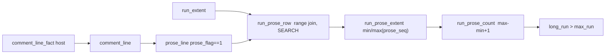

# REPORT - comment rail counts prose, not delimiter/decoration lines

## The change, one sentence

The dl6 comment-budget rail now measures a run by its PROSE lines (text that,
token-stripped, contains `[A-Za-z]`), so `/*`, `*/`, `// ----` and a `#!`
shebang are glue: contiguous but unmeasured, while a code or blank line still
breaks the run.

## Where it is now

On branch `lab/comment-prose-count`, one commit ahead of base 4e7a32d6. All
three golden gates hold (gate, fail-first, parity) plus conformance, text-door
and plunit. The staged-file receipts flip as specified: the 1-prose block is
now clean, the 3-narrative and 2-narrative runs still exit 2 and 0.

Next action: human review of the commit, then land.

## Changes (file:line)

| file | what changed |
|---|---|
| `v6/tsv2/scripts/comment_node.py` | added `comment_lines` verb (one row per physical comment line: `prose_flag`, `prose_seq`), `prose_flag` (shebang line 1 forced non-prose; `[A-Za-z]` letter test), `physical_line_text`, `outer_comment_spans` refactor, standardizes the three-verb `main` |
| `v6/tsv2/scripts/comment-budget-feed.sh` | added `comment_lines_body` and the `comment-lines` verb arm, content-addressed against the staged blob like `nodes` |
| `v6/tsv2/goldens/comment_rail_golden/0_comment_rail_golden.dl6` | new host `comment_line_fact`; rels `comment_line`, `prose_line`, `run_prose_row`, `run_prose_extent`, `run_prose_count`; `long_run` now thresholds the prose measure; header prose-measure notes + rx lowering |
| `v6/tsv2/goldens/comment_rail_golden/5_gen_schedules.py` | 12 fixture files (3 new: 1-prose block kept as `src/block.ts`, `src/block3.ts`, `src/shebang2.ts`, `src/shebang3.ts`, `src/divider.ts`), a `LINES` table, `comment_line_fact` fed on the same tick as `comment_fact` |
| `v6/tsv2/goldens/comment_rail_golden/1_schedule.json`, `5_schedule.scale.json` | regenerated by `5_gen_schedules.py` |
| `v6/tsv2/goldens/comment_rail_golden/2_expected.tick.jsonl`, `3_expected.final.jsonl` | regenerated from the oracle (byte-identical) |
| `v6/tsv2/goldens/comment_rail_golden/7_assert.py` | semantics for the prose ruling (block clean, divider glue, shebang counts), 11-file demand, prose-row cardinality, `run_prose_row` SEARCH pin |
| `v6/tsv2/goldens/comment_rail_golden/8_parity.sh` | cases 8 (divider) and 9 (shebang), both bash-counts / rail-cleans |
| `v6/tsv2/goldens/comment_rail_golden/9_failfirst.sh` | added the block leg: 1-prose block must exit 0 |
| `v6/tsv2/goldens/comment_rail_golden/README.md` | prose ruling section, pipeline, fixture, linearity, fail-first, parity tables |

## `comment_fact` spelling decision

Chose a SECOND host rel `comment_line_fact(path, digest) -> (line, prose_flag,
prose_seq)` beside `comment_fact`, not a widened `comment_fact`.

Reason: one-rel-one-rule-kind. `comment_fact` feeds `comment_node` with the
span shape `(line, end_line, kind)`; the per-line shape has a different arity
and semantics. Mixing both into one host rel would overload it and break the
kind law. A separate host rel keeps each rel one shape.

## `src/block.ts` verdict before/after

The fixture content is `/*` + one prose line + `*/` (one block node over lines
20-22).

| | old measure (physical lines) | new measure (prose) |
|---|---|---|
| count | 3 | 1 |
| verdict | VIOLATION 20-22 | clean |

## RED receipts (recorded at lane base, before the change)

The staged `v6/tsv2/try_rail.ts` block `/*` + `one prose line` + `*/` + code:

```text
COMMENT BUDGET VIOLATION (max 2 consecutive comment lines in new code):
v6/tsv2/try_rail.ts:1-3 (3 comment lines)
Repo law: comments state only constraints the code cannot show.
Fix: delete the narrative, keep at most 2 lines, or carry '@comment-ok: <reason>' if a scanner-backed waiver truly applies.
exit 2
```

After the change the same staged block exits 0 (1 prose line). Three
`// narrative` lines still exit 2; two still exit 0.

## Validation outputs (verbatim)

```text
COMMENT_RAIL_ASSERTIONS HOLD
COMMENT_RAIL_GOLDEN_HOLDS ticks=5 final=1 wall_ms=1488
COMMENT_RAIL_FAIL_FIRST HOLDS red=2 green=0 block=0
COMMENT_RAIL_PARITY HOLDS cases=9
CONFORMANCE_EXIT=0
TEXT_DOOR compiled=206 byte_identical=206 failures=0
PLUNIT_EXIT=0
```

Key counts (fixture vs 20x scale): `added_line` 41/820; `comment_node` 34/34;
`comment_line` 40/40; `prose_line` 33/33; `run_end_candidate` 13/13;
`violation_run` 6/6. `violation_total` = 6 (was 4), because `src/block.ts`
dropped out and `src/shebang3.ts`, `src/divider.ts` came in.

## Deviations

- The settled rule spelling put the range join inside the `min/max` aggregate.
  The compiler refuses that (`aggregate_group_not_delta_local`: each positive
  body atom must seed a complete group scope, and `prose_line` cannot bind
  `start_line`/`end_line`). `max` IS available in the surface; the blocking
  constraint is aggregate shape. Fix: materialize the range join as the plain
  rel `run_prose_row` (one row per in-run prose line, SEARCH-pinned, same
  inequality-join shape as `touched_run`), then `min(prose_seq)`/`max(prose_seq)`
  aggregate over the single atom. Semantics identical to the brief's intent;
  spelling differs.
- None else.



## Lane A: extract query

Base: `ee6a39eff05e77bb201cfb4aeb658f43e46beb18`

Plain query on `v6/sprefa-extract/tests/fixtures/rust/sample.rs`:

```text
$ extract query --lang rust --query '(function_item name: (identifier) @name) @item' tests/fixtures/rust/sample.rs
{"end_line":17,"item":"pub fn trim(value: String) -> String {\n    value\n}","line":15,"name":"trim"}
```

`[ ]` alternation on the same real sample:

```text
$ extract query --lang rust --query '[(function_item name: (identifier) @name) @item (struct_item name: (type_identifier) @name) @item]' tests/fixtures/rust/sample.rs
{"end_line":6,"item":"pub struct Engine {\n    name: String,\n}","line":4,"name":"Engine"}
{"end_line":17,"item":"pub fn trim(value: String) -> String {\n    value\n}","line":15,"name":"trim"}
```

`#match?` on `v6/sprefa-extract/tests/fixtures/ts/sample.ts`:

```text
$ extract query --lang ts --query '((function_declaration name: (identifier) @name) @item (#match? @name "^s"))' tests/fixtures/ts/sample.ts
{"end_line":12,"item":"function shift(p: Point, d: Dir): Vec2 {\n  function clamp(n: number): number {\n    return n;\n  }\n  return new Vec2(clamp(p.x), clamp(p.y));\n}","line":7,"name":"shift"}
```

Gates:

```text
cargo build --offline --release --features cli --bin extract: PASS
cargo test --offline --features cli --test 9_query_cli: PASS (3 tests)
cargo test --offline: FAIL in tests/0_prolog.rs because the listed corpus file
compile/6_profile.pl is absent; query tests were not implicated.
```
