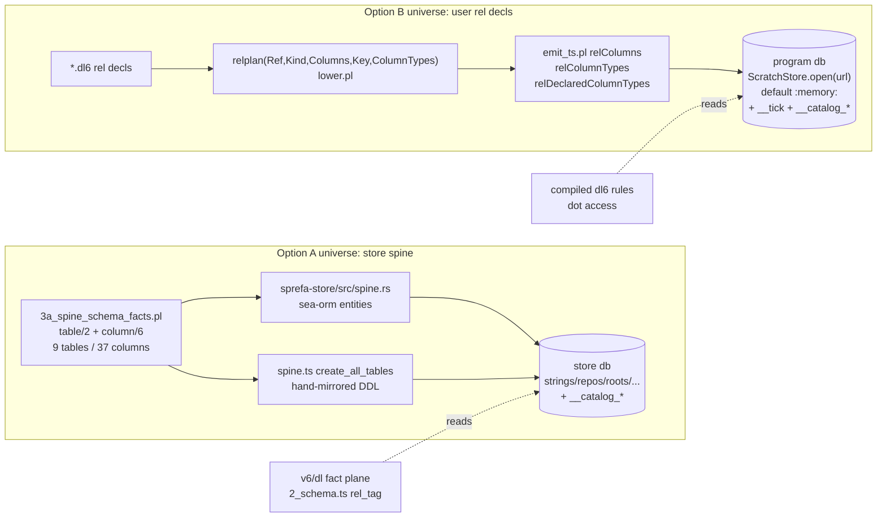

# Step g catalog universe: A (store spine) vs B (user rel decls)

Verdict doc. Zero source edits made. Every pin below re-read on 2026-08-05 in
`/Users/chrishafley/projects/sprefa`.

## TOC

- 1. The two universes, drawn
- 2. Files touched
- 3. LOC / beauty / perf table
- 4. Perf detail (rows materialized, read-time cost)
- 5. Coherence from a second caller's view
- 6. What I could not verify
- 7. Recommendation

## 1. The two universes, drawn

The two databases never meet. `v6/tsv2/runtime/scratchStore.ts:1-11` states it
in the file header: "The v6/dl fact-plane schema is unrelated to a compiled
tsv2 program's own tables." `grep -rn ATTACH` over the tree returns only
comment text in `sprefa-store/js/src/engine/lib.ts:83`,
`sprefa-store/js/src/engine/types.ts:114`, `sprefa-store/src/tasks.rs:149`,
`sprefa-store/src/lib.rs:618`; no cross-db attach exists.

## 2. Files touched

### Option A

| file | edit | new/edit |
|---|---|---|
| `v6/prolog/compile/3a_spine_schema_facts.pl` | `catalog_rel/4` + `catalog_instance/3` derived views, deterministic id order | edit (step-a file) |
| `v6/prolog/compile/5_emit_catalog_rows.pl` | whole-file seed emitter, `2_emit_cli_inventory.pl:18-21` pattern | new |
| `v6/sprefa-store/src/spine.rs` | 2 sea-orm entity mods + 2 lines in the defs vec `:408-417` | edit |
| `v6/sprefa-store/js/src/engine/spine.ts` | 2 row interfaces in zone `:62-101`, 2 DDL strings in the hand-mirrored `create_all_tables` `:114-124`, `table_names()` `:103-105` goes 9 -> 11 | edit |
| seed-apply path (rust + js parity) | nobody INSERTs the 46 rows today; both halves need one | new, 2 languages |
| `v6/tsv2/tests/spineSchema.test.ts` | asserted-equal + swipl forall check | edit (step-b file) |

Schema copies that must stay in step: 3 (rust entity, TS DDL string, TS row
interface). The TS `create_all_tables` comment at `spine.ts:108-112` says the
DDL is hand-written to mirror the rust `Schema::create_table_from_entity`, so
A adds a table to a place with a known 2-copy hand-sync obligation.

### Option B

| file | edit | new/edit |
|---|---|---|
| `v6/prolog/lower.pl` | `catalog_table_ddl/1` beside `tick_table_ddl/1` `:622-628`; rows built in the same fold that already runs `rel_ddl/5` `:732-779` and `:3438` | edit |
| `v6/prolog/emit_ts.pl` | zero if the rows ride the existing `ddl` array (`ddl_lines/2` `:648`, wired `:2222`); ~10 lines if a separate const is wanted | edit or none |
| `v6/tsv2/tests/catalogRows.test.ts` | compile a fixture, assert catalog rows equal the `relColumns` map | new |
| `v6/prolog/conformance/fixtures/` | one fixture: `child_of` query + `module_name_collision` refusal | new |
| `v6/tsv2/gen_emitted/*.ts` | 208 checked-in emitted programs regenerate if the DDL is unconditional; 0 if it is gated on catalog use, the way `__tick` is (only 8 of 208 carry `__tick`) | mechanical |

Schema copies that must stay in step: 0. `relplan/5` already carries
`Ref, Kind, Columns, Key, ColumnTypes` and is already projected three ways in
`emit_ts.pl:656-703`.

## 3. LOC / beauty / perf table

| axis | A: store spine | B: user rel decls |
|---|---|---|
| hand LOC | ~280 | ~140 |
| LOC breakdown | prolog 95, rust 55, ts 25, seed-apply 50, gate 55 | prolog 60, ts test 45, fixture 25, emitter 10 |
| plan's stated estimate | ~90 (covers the prolog half and part of the gate only; the rust entity mods, the TS DDL mirror, and the seed-apply path are not in it) | not estimated in PLAN.md |
| languages touched | 3 (prolog, rust, ts) | 2 (prolog, ts test only) |
| new hand-synced schema copies | 2 more entries in an already 2-copy hand mirror | 0 |
| gate design | asserted-equal generated seed vs the 9 rel + 37 column transcription, plus swipl forall over `column/6` -> exactly one `kind=column` row; throw `codegen_refused`, halt 1 | per-fixture compile-and-compare: catalog rows == `relColumns` / `relColumnTypes` maps in the same emitted file, plus a collision-refusal fixture; same shape all 208 `gen_emitted` goldens already use |
| gate strength | stronger in kind (byte-equal against a checked-in file) | broader in reach (every fixture that compiles exercises it), weaker per-instance |
| rows materialized | 46, fixed forever | rels + columns per program; measured in-tree: `crawl_org.dl6` 5 rels, `ghcacher.dl6` 7, `conformance.dl6` 23, `self-map.dl6` 102, so roughly 15-400 rows |
| write cost | one seed per store db | one INSERT batch per program boot, inside the array `ScratchStore.boot` already joins and runs (`scratchStore.ts:24-26`) |
| read cost | PK seek + 2-row self-join; nil | identical shape; nil |
| read reachability | **no compiled program can issue the read**: rows land in the store db, programs query `ScratchStore.open(url)`, no ATTACH in the tree | rows sit in the db the program is already querying; PLAN section 7's `child_of` snippet compiles and runs as written |
| beauty | facts stay the one hand-edited source, which is the nicest property in the plan; but the rows answer a question nobody in the decisions doc asked | producer already exists and is already projected 3 ways; `__catalog_*` is spelled exactly like `__tick`; `kind` word already on `relplan` |
| blast radius | 3 packages, cargo + node both rebuild | 1 package; 208 golden regen unless gated like `__tick` |

## 4. Perf detail

| | A | B |
|---|---|---|
| rows at boot | 9 `kind=rel` + 37 `kind=column` = 46 | 1 rel row + 1 column row per declared column |
| largest in-tree case | 46 | `self-map.dl6`: 102 rels, ~300-400 rows |
| growth | never (spine is static) | linear in program size, bounded by the program text |
| statement count added | 2 CREATE + 1 seed batch | 2 CREATE + 1 seed batch |
| query at catalog-read time | `__catalog_rel` self-join on `parent_id = rel_id`, both int PKs, SEARCH-not-SCAN by construction | same |
| 10-second law risk | none | none; 400 INSERTs is one batch inside DDL that already runs per boot |

Neither option has a perf argument against it. Perf does not decide this.

## 5. Coherence from a second caller's view

| question the decisions doc asks | A answers | B answers |
|---|---|---|
| what does `a.b.c` resolve to (`__catalog_rel` parent walk) | no; the spine has no nesting, every one of the 9 is a root child | yes; nesting under rel/0 is exactly a user decl shape |
| M5 SQL mangling `a__b__c__<digest>` | not applicable; spine table names are fixed literals in `spine.rs` and `spine.ts` | applicable; `lower.pl` already mints rel table names |
| "existing flat rels = root children, zero migration" | the sentence is about program rels, not store tables | direct fit |
| M3c shadowing, dotted heads, member access | none of these exist for spine tables | all are user-decl behaviors |
| F3 "meta-querying catalog rels" | queryable only from the v6/dl fact plane, which did not ask | queryable from the rules in the same file that declared them |
| decision 1 "user rules read it" | user rules cannot reach the store db | satisfied |

Name-collision hazard specific to A: a catalog row spelled `files` would be
the store's `files` TABLE, while `files` / `files_at` in
`v6/dl/fixtures/files-hosts.dl6` are program host rels. One word, two
universes, no column in `__catalog_rel(rel_id, parent_id, local_name, kind)`
that tells a second caller which one they are holding.

What A genuinely earns, stated fairly:

- It is a real end-to-end exercise of the step-a fact base, and it forces the
  `catalog_rel/4` derived-view code into existence where the facts are.
- The store db already carries a rel-identity table: `rel_tag(tag, name_id)`
  at `v6/dl/src/2_schema.ts:77`. A schema self-description in that db has a
  plausible reader in the fact plane.
- Its gate is the stronger kind (byte-equal against a checked-in file), and it
  reuses the `bopCommandInventory.test.ts:52-59` pattern exactly.

What B costs, stated fairly:

- No single checked-in seed file, so no one asserted-equal artifact. The gate
  becomes per-fixture, which is weaker per instance.
- Touching `lower.pl`'s DDL fold is the higher-traffic file of the two.
- 208 emitted goldens churn unless the DDL is gated on catalog use.

## 6. What I could not verify

- Whether dot access will resolve at COMPILE time or at query time. Today
  `v6/prolog/0_dot_expand.pl:1-46` erases every `dot_get` during expansion,
  before checks or either lowering door, and resolution is receiver-bound-first
  against body variables. Nothing in the current dot surface reads a table. If
  the path half of dot access lands the same way, then the materialized catalog
  serves decision 1's "user rules read it" and F3 meta-query only, and it is
  not what resolution consults in either option. The brief's framing "what
  dot-access resolves against" may therefore not distinguish A from B at all;
  what distinguishes them is which db the meta-query rows are reachable from.
- Whether Chris wants the fact plane (v6/dl) or compiled programs (tsv2) as the
  catalog's first reader. That single call decides this question outright and I
  did not find it written down in either doc.
- The seed-apply path for A. I found no existing code that INSERTs seed rows
  into the store spine at boot, so the ~50 LOC is an estimate for a path that
  does not exist yet, not a measurement.

## 7. Recommendation

Take B for step g and demote A to a fixture inside step b. The decisions doc in
`plans/2026-08-03-module-catalog-ruling.md` is about user declarations from its
first line to its last: kind is `rel|column`, nesting is a parent edge under a
rel/0, the dotted path is derived, shadowing picks the nearest name, dotted
heads contribute to a rel a block declares, and M5 mangles `a__b__c__<digest>`.
None of those sentences has a meaning when the rows are `strings`, `repos`,
`roots`, `repo_revs`, `files`, `revs_files`, `file_bytes`, `node`, `edge`. B is
also the cheaper build by roughly half the LOC and by two whole schema copies,
its producer already exists as `relplan/5` and is already projected three ways
in `emit_ts.pl:656-703`, and its table naming and boot seeding copy `__tick` at
`lower.pl:622-628` line for line. The decisive fact is reachability: A's rows
land in the store db while every compiled program opens its own connection via
`ScratchStore.open(url)` with no ATTACH anywhere in the tree, so decision 1's
"user rules read it" is unsatisfiable under A without inventing a cross-db bind
that no one has asked for. I would keep A's best property by making the spine
facts prove the emitter in step b's asserted-equal gate without promoting them
to store tables, and I would hold the whole call open pending the one thing I
could not find written down: whether the fact plane or compiled programs is the
catalog's intended first reader, because if the answer is the fact plane then A
is right and my reading of the decisions doc is the wrong lens.
