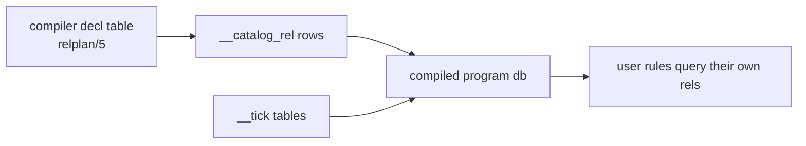
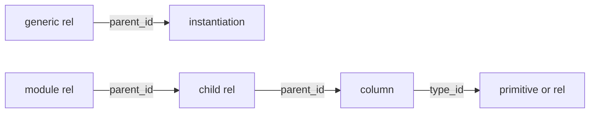

# Catalog g1: the program's own rel declarations as queryable rows

## What it answers

| # | section | answers |
|---|---|---|
| 1 | The decision | why catalog rows exist and where they land |
| 2 | The shape | what each of the six columns means per row kind |
| 3 | The DDL bill | the measured cost across the emitted modules |
| 4 | What comes later | the row-adding steps, and the one future statement |
| 5 | Prior art | what TypeScript 7 and Go do for the same job |
| 6 | Out of g1 | what is deliberately deferred |

## 1. The decision

| fact | receipt |
|---|---|
| catalog rows describe USER-PROGRAM rel declarations | decision record `ruling(catalog_universe, ...)`, `conformance/rulings.pl:613` |
| rows come from the compiler decl table | `relplan/5` (`emit_ts.pl:656-703`) |
| rows are materialized into the COMPILED PROGRAM database | the same door `__tick` tables use, `lower.pl:622-628` |
| the store spine is rejected | the fact plane and a compiled program are separate SQLite databases with no ATTACH anywhere (`scratchStore.ts:1-11`), so spine rows are unreachable by the user rules the catalog exists to serve |
| scaffold already landed | `e3997cec` = `catalog_ddl_contract/2` + two `[]`-returning stubs + the wired call site in `lower_program/2` (`lower.pl:3503`, `lower.pl:632`) |

Rows and `__tick` tables share an entry door, so the catalog is readable by the
same user rules it describes.

## 2. The shape

One table: `__catalog_rel(rel_id, parent_id, ordinal, local_name, kind, type_id)`.

| column | rel row | column row |
|---|---|---|
| `rel_id` | row identity, position-assigned for byte-stable recompiles: primitives 1..5, then rels in sorted `AllRefs` order, then that rel's columns in declaration order | same, a child id |
| `parent_id` | `0` until module nesting lands | the owning rel's `rel_id` |
| `ordinal` | `0` | the 1-based argument position on the owning rel |
| `local_name` | the rel's name | the column's name |
| `kind` | `primitive` or `rel` | `column` |
| `type_id` | `0` until column types land | another `rel_id`: the primitive or rel the column's type points at |

`kind` lives in `{primitive, rel, column}`. A column is a CHILD row of its rel,
so it carries a type and an annotation exactly as a rel can.

## 3. The DDL bill

Per catalog-using program, three statements:

| statement | purpose |
|---|---|
| `CREATE TABLE __catalog_rel` | the table |
| `CREATE INDEX ... ON __catalog_rel(parent_id, local_name)` | what a name-resolution walk over children reads |
| one `INSERT OR IGNORE` with every row in a single VALUES list | N+1 law; idempotent because the door replays DDL on every swap |

Measured across the 212 emitted modules (min / median / max):

| metric | min / median / max |
|---|---|
| catalog rows per module, incl the five primitives | 7 / 12 / 225 |
| seed added to the module's `ddl` array | 8.4% / 14.6% / 29.4% |
| the module's existing `ddl` array size, bytes | 714 / 2578 / 80198 |

Gated on `program_uses_catalog/2`, mirroring `program_uses_tick/2`
(`analyze.pl:180`). The bodies return `[]` today, so all 212 tracked emitted
modules stay byte-identical until g1 lands.

## 4. What comes later

Three later steps add ROWS, not statements:

| step | mechanism |
|---|---|
| module nesting | a module rel's children set `parent_id` to the module's rel |
| generic instantiation | a concrete instantiation's `parent_id` points at the generic rel |
| column types | a column's `type_id` points at the primitive or rel that typed it |

One future statement, for decorators:
`__catalog_annotation(target_id, name, value)`.

## 5. Prior art

| source | shape | receipt |
|---|---|---|
| TypeScript 7 checker | every type is ONE struct with an id, a kind mask and a variant pointer | `microsoft/typescript-go`, `internal/checker/types.go:673` |
| Go `go/types` | primitives seeded as ordinary objects in the `Universe` scope | `go/types`, `universe.go:78`, `defPredeclaredTypes` |

Note on TypeScript: `boolean` is a union of two literal types, not an intrinsic,
in both the JS checker and the Go port.

## 6. Out of g1

| deferred | note |
|---|---|
| dot access over rel names | resolves against these rows, but the surface is a later wave |
| module nesting | a row-adding step listed in section 4 |
| host-fed rows | hosts may feed rows where a producer outside the compiler is the natural source |
| oracle parity for catalog reads | `catalog_g2_oracle_parity`; a DDL-time seed emits no delta at any tick, so g1 alone cannot diverge from the oracle |
| generic instantiation | a row-adding step listed in section 4 |
