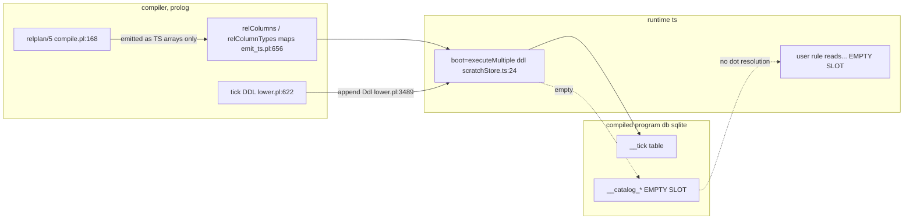

# PLAN: catalog, next part

Decision to build on (compressed, full text at the cite): user rel declarations
become catalog rows, produced from `relplan/5`, materialized into the COMPILED
PROGRAM db through the same door as `__tick`, queried by user rules. The
store-spine home is rejected.

## TOC

1. Receipts ledger (anchors used)
2. Q1 How it works today, by direction
3. Q2 Explain it back
4. Q3 Next buildable increment
5. Disagree / reconcile: typeirplan section 7
6. Where the spec was wrong

## 1. Receipts ledger

| receipt | what it shows |
|---|---|
| `v6/prolog/conformance/rulings.pl:613` | the catalog decision, full text |
| `v6/prolog/compile.pl:168-174` | `relplan/5` produced: `relplan(Ref, Kind, Columns, KeyOrNone, ColumnTypes)` |
| `v6/prolog/emit_ts.pl:660-663` | `rel_columns_entry_line/2` reads `relplan/5` -> `relColumns` map |
| `v6/prolog/emit_ts.pl:670-674` | `rel_column_types_entry_line/2` reads `relplan/5` -> `relColumnTypes` map |
| `v6/prolog/emit_ts.pl:2223-2225` | those two maps emitted as program sections |
| `v6/prolog/lower.pl:3485-3490` | `tick_table_ddl/1` appended into the program `Ddl` list (the door) |
| `v6/prolog/lower.pl:622-628` | `tick_table_ddl/1` + `tick_column_sql/1`: one-row counter table with idempotent INSERT |
| `v6/tsv2/runtime/scratchStore.ts:24-27` | `boot` = `executeMultiple(ddl)` against the program db |
| `v6/prolog/0_ast_expand.pl:226-227` | `__host_demand_`/`__host_response_` synthesized rel names (builtin precedent) |
| `v6/prolog/compile/scripts/compile_dl6.sh:22-23` | `compile_dl6/2` -> emitted `.ts`, the compiler entry |
| `v6/tsv2/scripts/golden-flex.sh:65-66` | compile gate: fixture -> `gen_emitted/<module>.ts`, fail on refusal |
| `v6/prolog/ARCH.pl:823` | v5 self-describes via builtin `rel_catalog` (read-direction precedent) |
| `grep -n "__catalog" v6/` | 0 hits: no catalog tables/rels exist today |
| `grep -nE '^\s*rel\s+[A-Za-z_]+\.' v6/prolog/compile/dl_view/` | 0 hits: no dot-over-rel spells in any `.dl6` |
| `grep -rni "attach" v6/tsv2/ v6/sprefa-store/` | no SQLite ATTACH; only `RelStore.attach` (store model) + a TEMP-prefix comment |
| `wc -l v6/prolog/LANG.md` = 103; keywords `enum struct rel bind` at `LANG.md:23-24` | the language surface |
| top-level forms in `v6/prolog/compile/dl_view/*.dl6` | only `rel` and `sh` (checked across 285 files) |
| `plans/` tree listing | `2026-08-03-module-catalog-ruling.md` NOT in this worktree; read from `/Users/chrishafley/projects/sprefa/plans/` |

## 2. Q1 How it works today, by direction

One producer exists and is rich enough to seed the catalog. Both materialization
directions are empty slots.

| data | producer (exists) | write into program db (moves today?) | read by user rule (exists?) |
|---|---|---|---|
| rel structure | `relplan/5` `compile.pl:168-174` (Ref, Kind, Columns, Key, ColumnTypes) | no: only emitted as TS maps `emit_ts.pl:2223-2225`; no SQL table | no |
| `__tick` | compiler-known builtin `lower.pl:622-628` | yes: appended to `Ddl` `lower.pl:3489`, booted `scratchStore.ts:24-27` | not directly by user rules (read via `tick_column_sql` `lower.pl:620`) |
| column/arity metadata | `rel_columns_lines` / `rel_column_types_lines` `emit_ts.pl:656-674` | no: TS `relColumns`/`relColumnTypes` objects, not SQL | no (consumed by the TS runtime, not by rule SQL) |
| synthesized rels | `__host_demand_*` minted `0_ast_expand.pl:226-227` | yes as ordinary program rels | yes (they are ordinary rels user rules reference) |

The one link that moves data today is `tick_table_ddl` -> `Ddl` -> `boot`
(`lower.pl:3489`, `scratchStore.ts:24`). Everything a catalog writer needs
(relplan columns, kinds, keys) already exists but is emitted only to TS-side
metadata objects, never to a SQL table, and nothing reads a rel declaration
back through a rule body.

## 3. Q2 Explain it back

One pass. `relplan/5` is a complete inventory of a program's relations: for each
rel, its reference (`name/arity`), kind (`log|set`), column names, key
positions, and column types (`compile.pl:168-174`). Today the compiler transcribes
that inventory twice into emitted TypeScript metadata objects (`relColumns`,
`relColumnTypes`, `emit_ts.pl:656-674`), assembled among the generated program's
sections (`emit_ts.pl:2223-2225`). Those objects describe the program to the TS
runtime; they are not SQL tables and are not visible to the program's own rules.

Separately, every compiled program carries a small set of compiler-known SQL
tables. The kernel example is `__tick`, a one-row counter: its `CREATE TABLE`
plus an idempotent seed INSERT are appended to the program's DDL list by
`tick_table_ddl/1` at `lower.pl:622-628`, pushed through the same append at
`lower.pl:3485-3490`, and executed at boot by `executeMultiple` over the whole
DDL array (`scratchStore.ts:24-27`). That is the door a catalog table must use:
add a `__catalog_*` CREATE + seed statements to that same DDL list and it lands
in the program's own SQLite database.

User rules read whatever is in that database. Each synthesized rel is declared
with compiler-minted columns and becomes an ordinary relation user rules can
name in a body. The precedent is `__host_demand_<name>`/`__host_response_<name>`
(`0_ast_expand.pl:226-227`); `__tick` is the same class of compiler-known name
(`lower.pl:620`). So the read mechanism is built and proven; the catalog simply
needs its table seeded and its name known to the compiler.

The empty slot: `__catalog_rel` exists nowhere (`grep __catalog` v6/ = 0), no
dot-over-rel spelling exists in any `.dl6` (`grep` = 0), and v6 has no import
mechanism (only `rel` and `sh` top-level forms across 285 files). v5 already
self-describes with builtin `op_catalog`/`fn_catalog`/`rel_catalog`
(`ARCH.pl:823`); v6's catalog is the same idea on the compiled-program database.

## 4. Q3 Next buildable increment

Materialize `__catalog_rel` for a FLAT program and read it from a user rule.

Why this one: it is the smallest unit that proves both directions the decision
names (write relplan -> program db, read it back from a rule body), it reuses
the already decided door (the `__tick` DDL append) and the already rich producer
(`relplan/5`), and it unblocks the later dot-access surface. It touches no
parser work and no generics.

### Shape

`__catalog_rel(rel_id, parent_id, local_name, kind)` with `kind` in
`{rel, column}`. Flat-program rule: every rel is a root child (`parent_id`
NULL); every column is a `kind=column` row whose `parent_id` = its rel's id.
Int ids assigned deterministically in `relplan/5` source order (the "source
order significant" precedent, `v6/prolog/labs/openapi_codegen/0_facts.pl:48-50`
cite is the sibling lane's; source-order stability must be asserted, see Proof).

### Touches

| area | file | change |
|---|---|---|
| DDL door | `v6/prolog/lower.pl:3485-3490` | append `catalog_table_ddl` (CREATE + idempotent seed INSERT, mirroring `tick_table_ddl/1` at `:622-628`) to `Ddl` |
| row producer | beside `v6/prolog/emit_ts.pl:660-663` | `relplan/5` -> `__catalog_rel(rel_id, parent_id, local_name, kind)` rows, deterministic ids |
| builtin decl | `relplan/5` / analyze (precedent `0_ast_expand.pl:226-227`, `lower.pl:620`) | mint `__catalog_rel/4` as a compiler-known rel with fixed columns `(int, int, text, text)` so user rules and `analyze.pl` accept it |
| read seam | none new | user rules name `__catalog_rel(...)` like any rel; level rules compile to SQL self-joins against the same db |

### Proof

1. Compile a flat fixture via `compile_dl6/2` (`compile_dl6.sh:22-23`); assert the
   emitted DDL array contains the `__catalog_rel` CREATE (pattern `golden-flex.sh:65-66`).
2. Assert seed rows equal the hand-computed transcription of `relplan/5`:
   one `kind=rel` row per rel, one `kind=column` row per column, parent edges
   correct, ids stable across recompiles.
3. A derived-view rule over `__catalog_rel`, e.g. enumerate rels with arity,
   run through the emitted program, assert output equals the known set (the
   `child_of` self-join pattern from the sibling design, `.dl6` + shared
   expected output).
4. Add one ARCH `task/3` row (`unbuilt` -> `done`), shape per `v6/prolog/ARCH.pl:651`
   style, citing `ARCH.pl:823` as the v5 read-direction proof.

### Deliberately leaves out

| item | reason |
|---|---|
| dot access over rels | parser surface + terminator disambiguation, module-catalog next-step 3; separate lane |
| module / block nesting | v1 nests under `rel/0` only (`rulings.pl:608`; module-catalog rule 7); a flat program's roots are all parented to NULL |
| `__catalog_instance` + generic monomorphization | needs step-f generics; no instances in flat programs |
| host-fed catalog rows | the host seam exists but no producer outside the compiler is built yet |
| store-spine materialization | rejected by the decision; see section 5 |
| scip derived-url / renames | post-g, purely additive |

## 5. Disagree / reconcile: typeirplan section 7

`~/projects/sprefa-lanes/typeirplan/PLAN.md` section 7 (step g) defines
`__catalog_rel(rel_id, parent_id, local_name, kind)` and
`__catalog_instance(instance_id, rel_id, args_digest)` and materializes them into
the RUST STORE: "join the defs vec at `v6/sprefa-store/src/spine.rs:408-417` and
`table_names()` at `v6/sprefa-store/js/src/engine/spine.ts:103`".

Disagree on the materialization TARGET. That is the store-spine home, which the
decision rejects outright: spine catalog rows are unreachable by the user rules
the catalog exists to serve, because the v6/dl fact plane and a compiled program
are separate databases with no ATTACH anywhere (`rulings.pl:613`; verified by
grep, section 1). A catalog of a compiled program's rels must live in that
program's own database, via the DDL door (`lower.pl:3489`, `scratchStore.ts:24`).
The corollary is a dl6 emitter backstopped by `relplan/5`, not an edit to the
store's `spine.rs` defs vec.

Agree on the ROW SHAPES. `__catalog_rel(rel_id, parent_id, local_name, kind)` is
exactly the containment-edge model the decision wants (`rulings.pl:613` dot
resolution; module-catalog decision doc `:16-19`); this plan reuses those column names.
`__catalog_instance` is deferred here (flat programs instantiate nothing).

Forward hook, agreed: the `ARCH.pl:823` note plus module-catalog next-step 2
("generalize that emitter's facts into `__catalog_rel` rows") point at the same
increment as section 4.

## 6. Where the spec was wrong

- `plans/2026-08-03-module-catalog-ruling.md` is not present at this worktree
  root (`ls plans/` has no such file) and is not in this worktree's git history
  (`git log --all` for that path = 0 hits). Read from the main checkout
  `/Users/chrishafley/projects/sprefa/plans/2026-08-03-module-catalog-ruling.md`.
  Content matches the spec's description (145 lines).
- `scratchStore.ts:1-11` as the "separate databases receipt": the comment that
  states the fact-plane schema is unrelated sits at `scratchStore.ts:4-10`, and
  the "no ATTACH anywhere" claim is NOT written in that file; it is verified by
  grep over `v6/tsv2` and `v6/sprefa-store` (only `RelStore.attach`, which is
  the store model, plus a comment that TEMP tables cannot be schema-qualified).
