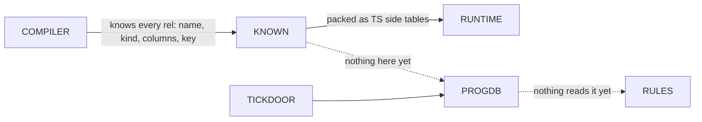
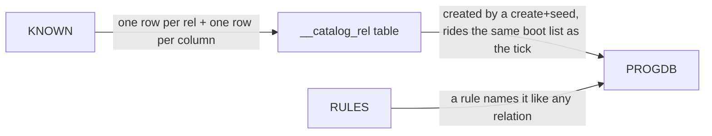

# Catalog, next part

For Chris. Short version: the compiler already knows every relation a program
declares. That knowledge already gets packed twice into side tables that only
describe the program to the runtime. What does not happen is putting it INTO
the program's own database so the program's rules can read it back. That is the
catalog. The decision says: write it into the program database through the same
door the tick counter uses, and let rules query it.

## TOC

1. The one picture
2. What already exists
3. The empty slot
4. The next step
5. What we skip on purpose

## 1. The one picture

Two arrows are dead right now. The decision's job is to turn them on.

## 2. What already exists

| thing | state |
|---|---|
| full inventory of a program's relations | exists, lives in one place, carries name, log/set kind, column names, key, column types |
| tick counter table | exists, a compiler-built table named with a double underscore, written into the program database at boot |
| the door | exists: the same list of create-table statements the tick uses is what boots the program database |
| reading a compiled-in table from a rule | exists as a pattern: the compiler mints double-underscore names for host things and rules reference them like any relation |

The tick counter is the template. It is a compiler-known table, its create plus
seed insert ride the boot list, and the program database executes that list once
at start.

## 3. The empty slot

The catalog table does not exist anywhere. No relation spells a dotted name in
any test program yet, and there is no import mechanism; the only top-level forms
any program uses are a relation keyword and a host keyword. A database for facts
and a compiled program are separate files with no cross-link, so the catalog has
to live in the compiled program's own database or the program's rules can never
reach it. That choice is already made and the whole step turns on it.

## 4. The next step

Ship one catalog table, flat first, and read it from a rule.

The rows: each relation is a row, each column is a row owned by its relation.
For a flat program every relation hangs off the root, and the dotted stuff comes
later. The compiler plays both sides: it mints the table into the program
database, and it teaches itself the table's column shape so a rule body can name
it without any user declaration.

Proof of the step, all mechanical:

- compile a small flat program, check the created tables include the catalog one and the seeded rows match the inventory exactly
- compile twice, check the row ids do not shuffle
- write one read rule over the catalog, run it, check the output matches a hand count

## 5. What we skip on purpose

| skipped | why |
|---|---|
| dot access over relations | the parser surface it needs is its own slice, comes after the storage works |
| module blocks and nesting | flat only for now, nesting is a later additive lifting |
| generic instances | nothing instantiates generics in a flat program yet |
| host-fed catalog rows | the seam is there but no outside producer is built |
| writing it into the fact database instead | already rejected: it is a different database, rules there could not see it |
