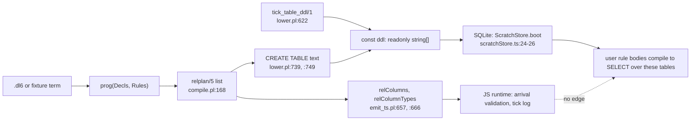

# PLAN: the catalog, next part

## TOC

| § | question | one-line answer |
|---|---|---|
| [1](#1-where-the-spec-was-wrong) | spec drift | one anchor is untracked, so this worktree cannot hold it; every other anchor is exact |
| [2](#2-the-names) | Q2 vocabulary | six names carry the whole file set |
| [3](#3-the-pipeline-one-pass) | Q2 mechanism | decl table forks into JS constants and SQL text, and only one fork reaches a rule |
| [4](#4-directions-today) | Q1 | the READ direction is already wired and reads an empty table; the WRITE direction has no producer |
| [5](#5-verdict-on-the-existing-step-g-design) | typeirplan §7 | superseded on producer and on destination; two shapes survive |
| [6](#6-next-increment-g1-the-decl-and-the-producer) | Q3 | declare two catalog rels, seed their rows into the DDL array, in one file |
| [7](#7-proof) | Q3 gate | direct SQL assertions on a booted program, no oracle, no corpus churn |
| [8](#8-deliberately-out) | Q3 scope | dot access, nesting, keys, host feed, oracle parity |

---

## 1. Where the spec was wrong

| spec claim | reality | receipt |
|---|---|---|
| `plans/2026-08-03-module-catalog-ruling.md`, 145 lines | 145 lines confirmed, and the file is UNTRACKED in the main checkout, so branch `lab/catopus` at `d54db68a` cannot carry it | `git status --porcelain plans/2026-08-03-module-catalog-ruling.md` -> `?? plans/2026-08-03-module-catalog-ruling.md`; `wc -l` -> `145` |
| all other anchors | exact | `rulings.pl:613` is the `ruling(catalog_universe, ...)` head; `emit_ts.pl:660` `rel_columns_entry_line/2`, `:670` `rel_column_types_entry_line/2`; `lower.pl:620` `tick_column_sql/1`, `:622-628` `tick_table_ddl/1`; `scratchStore.ts:1-11` |
| dl6 has no import mechanism | confirmed | over 285 `v6/prolog/compile/dl_view/*.dl6`: 676 lines matching `^(rel\|sh) `, and zero files matching `^import`, `^use`, `^mod`, `^module`, `^struct`, `^enum`, `^trait`, `^include` |

The decision at `rulings.pl:613` matches the code. Nothing found contradicts it.

---

## 2. The names

| name | what it is | receipt |
|---|---|---|
| `relplan/5` | the compiler decl table row: `relplan(Name/Arity, log\|set, Columns, key(Positions)\|none, ColumnTypes)` | `compile.pl:168-174`, header at `compile.pl:78-83` |
| `plan/7` | everything `lower.pl` and `emit_ts.pl` need, computed once | `compile.pl:184-185` |
| the DDL array | `readonly string[]` on the emitted module, run once into the program's SQLite connection | `emit_ts.pl:648`, `gen_emitted/float_avg_is_grouped.ts:136` |
| `__tick` | a one-row counter table created and seeded by that array | `lower.pl:622-628` |
| `__ref_<type>` | a struct type's dictionary table plus TEMP view, synthesized by the compiler and read by rewritten rule bodies | `lower.pl:768-777`, `lower.pl:986-993` |
| catalog rel | the empty slot: a rel whose ROWS describe user rel declarations | `grep -rn '__catalog' v6/` returns only `rulings.pl:614` |

---

## 3. The pipeline, one pass

A `.dl6` file or a `.pl` fixture term becomes `prog(Decls, Rules)`. `compile.pl:157` unions rule refs, declared refs and seeded refs into one sorted `AllRefs`, and `compile.pl:168` turns each into one `relplan/5`. That list is the compiler decl table. It forks.



One caption: the JS fork describes rels to the runtime, the SQL fork creates the tables rules join against, and no arrow crosses from the JS fork back to a rule.

The unpruned door matters. Boot statements are filtered by the subscription cone (`3_subscribe.ts:76-80`, `SubscribeCone.boot` keeping only `storedNames(subscribedRels, arrivalTargets)`), so rows shipped through `boot` vanish when nothing queries the rel. `ScratchStore.boot` runs the whole DDL array with no filter (`scratchStore.ts:24-26`). Serving re-runs that array on every swap and swallows `already exists` (`serve/3_engine.ts:225, :232`), which is why `__tick` seeds itself with `INSERT ... SELECT 0 WHERE NOT EXISTS` (`lower.pl:627`).

---

## 4. Directions today

| # | direction | producer | consumer | state | receipt |
|---|---|---|---|---|---|
| D1 | decl table -> program JS constants | `relplan/5` | `relColumns`, `relColumnTypes`, `relDeclaredColumnTypes` | LIVE | `emit_ts.pl:657-694`; `gen_emitted/float_avg_is_grouped.ts:157-171` |
| D2 | decl table -> program SQL ROWS | none | none | EMPTY | `grep -rn '__catalog' v6/` hits only `rulings.pl:614` |
| D3 | compiler -> program db, table text | `rel_ddl/6` + `tick_table_ddl/1` | `ScratchStore.boot` | LIVE | `lower.pl:3438, :3484-3490`; `scratchStore.ts:24-26` |
| D4 | user rule -> catalog table read | rule body | lowered SELECT | WIRED, table empty | swipl run in §4.1 |
| D5 | dot over a REL NAME -> catalog row | none | none | EMPTY | `0_dot_expand.pl:29` "There is no module half in scope"; refusal `unresolvable_member` thrown at `:169` and `:176` |
| D6 | host -> catalog rows | none | none | EMPTY | no rel exists for a host plan to fill (D2) |

### 4.1 The read direction already compiles

Command, run against this worktree, no files written:

```
cd v6/prolog && swipl -q -g "
use_module(compile), use_module(lower),
Rule = '<-'(x(N), '__catalog_rel'(A,B,N,C)),
program_plan(fixture(demo, prog([], [Rule]), [], [], [])-['N'=N,'A'=A,'B'=B,'C'=C], Plan),
Plan = plan(_,_,RelPlans,ArrivalTargets,_,_,_), ..." -g halt
```

Output, trimmed to the four lines that matter:

```
RELPLANS [relplan('__catalog_rel'/4,set,[a,b,n,c],none,[text,text,text,text]),relplan(x/1,set,[n],none,[text])]
ARRIVALTARGETS ['__catalog_rel'/4]
DDL CREATE TABLE "__catalog_rel" ("a" TEXT NOT NULL, "b" TEXT NOT NULL, "n" TEXT NOT NULL, "c" TEXT NOT NULL, PRIMARY KEY ("a", "b", "n", "c")) WITHOUT ROWID
LEVEL levelstmt(x/1,'DELETE FROM "x"',['INSERT OR IGNORE INTO "x" ("n") SELECT b0."n" FROM "__catalog_rel" b0'], ...)
```

The text door accepts the name too: `parse_dl/4` on `x(N) <- __catalog_rel(_A, _B, N, _C).` returns `prog([],[<-(x(_),'__catalog_rel'(_,_,_,_))])`, because `ident_start` is a letter or an underscore (`parse_dl.pl:406, :414`).

Four defects visible in that output, and they are the whole shape of the gap:

| defect | cause | receipt |
|---|---|---|
| columns named `a, b, n, c` | with no decl, names come from the CALLER's variable spellings | `analyze.pl:264-266` `column_name_at/4` over `Bindings` |
| every column TEXT | no declared type to read | `analyze.pl:268-278` falls through to inferred types |
| `__catalog_rel/4` is an arrival target | undeclared and non-derived refs land there, so the serve door would accept writes | `compile.pl:157-159`; `0_program_check.pl:49` "everything undeclared is a Set" |
| zero rows, forever | D2 | §4 D2 |

Adding four `col_type/3` decls fixes the first two, verified by the same in-memory route:

```
RELPLAN relplan('__catalog_rel'/4,set,[rel_id,parent_id,local_name,kind],none,[int,int,text,text])
DDL CREATE TABLE "__catalog_rel" ("rel_id" INTEGER NOT NULL, "parent_id" INTEGER NOT NULL, "local_name" TEXT NOT NULL, "kind" TEXT NOT NULL, PRIMARY KEY ("rel_id", "parent_id", "local_name", "kind")) WITHOUT ROWID
```

The full-row PRIMARY KEY is what makes a seed `INSERT OR IGNORE` idempotent under the serve swap replay.

---

## 5. Verdict on the existing step-g design

`~/projects/sprefa-lanes/typeirplan/PLAN.md` §7 is superseded on both axes by `rulings.pl:613`, and its receipts confirm the supersession rather than contradict it.

| §7 says | decision says | receipt that the decision wins |
|---|---|---|
| rows derived from `3a_spine_schema_facts.pl` `table/2` + `column/6` | rows come from `relplan/5` | the spine's tables are `strings, repos, roots, repo_revs, files, revs_files, file_bytes, node, edge` (`v6/sprefa-store/src/spine.rs:408-417`, `js/src/engine/spine.ts:103`); none of them is a user rel decl |
| tables join the store spine | tables live in the compiled program db | `scratchStore.ts:1-11`, and `grep -rn ATTACH v6/ --include=*.ts --include=*.pl` finds only two comment lines saying a TEMP table CANNOT be qualified to an attached schema (`lib.ts:83`, `types.ts:114`) |
| one rel, `kind: rel\|column` | column ORDER is part of the decl | `relplan/5`'s `Columns` is an ordered list emitted as an ordered array (`emit_ts.pl:660-663`) and built by `numlist(1, Arity, Positions)` (`analyze.pl:264-266`); a parent edge alone cannot say which argument a column is |

Two things from §7 survive: the int-id-plus-parent-edge shape, and the refuse-before-writing gate discipline.

The two-rel split has a shipping precedent in this repo, in the v5 engine's own plane: `rel_catalog(name, group, cols, doc)` plus `rel_col(rel, pos, col, type, variants)` (`src/rels/catalog.rs:17-42`), where `pos` carries exactly the ordinal §7 drops. Different plane, same problem, already solved once.

---

## 6. Next increment: g1, the decl and the producer

**The increment.** Declare the two catalog rels into every program that names one, and seed their rows from `relplan/5` through the DDL array.

```
__catalog_rel(rel_id: int, parent_id: int, local_name: text, kind: text)
__catalog_rel_column(rel_id: int, position: int, column_name: text, column_type: text)
```

| field | source | receipt |
|---|---|---|
| `rel_id` | index in the sorted `AllRefs` order | `compile.pl:157` `sort(AllRefs0, AllRefs)` |
| `parent_id` | `0` for every rel in v1, flat rels as root children | `plans/2026-08-03-module-catalog-ruling.md:130-131` M5 "existing flat rels = root children, zero migration" |
| `local_name` | `Name` of `relplan/5`'s `Ref` | `emit_ts.pl:661` `ref_name/2` |
| `kind` | `log` or `set`, `relplan/5` field 2 | `lower.pl:739` and `:749` |
| `position` | 1-based index into `Columns` | `analyze.pl:264-266` |
| `column_type` | `boundary_column_type/2` of the matching `ColumnTypes` entry | `emit_ts.pl:670-676, :718-734` |

**Why this one.** Every other candidate depends on it. D4 already compiles a read against a table nobody fills, so filling it is the single edit that turns an existing dead path live. Dot access (D5) has nothing to resolve against until rows exist, which the earlier plan also parks (`typeirplan/PLAN.md:283-284`).

**What it touches.**

| file | edit | why there |
|---|---|---|
| `v6/prolog/compile.pl` | before `program_plan/2`'s `findall` at `:168`, inject the `col_type/3` decls for the two catalog refs when a rule names one, and subtract them from `ArrivalTargets` at `:159` | fixes three of the four defects in §4.1 with no new DDL code, because the ordinary `rel_ddl/6` path then builds the tables |
| `v6/prolog/lower.pl` | beside `tick_table_ddl/1` at `:622`, add `catalog_row_ddl/2` emitting `INSERT OR IGNORE` per catalog row, gated by a `program_uses_catalog/2` mirroring `program_uses_tick/2` at `:3484` | the decision's named door, and the gate keeps every existing fixture byte-identical |
| `v6/tsv2/tests/catalogRows.test.ts` | new, the `tickCounter.test.ts` shape | §7 |

**Why the DDL array and not `boot`.** Boot statements are pruned by the subscription cone (`3_subscribe.ts:76-80`), so a catalog rel nothing queries would lose its rows. The DDL array is unpruned (`scratchStore.ts:24-26`).

**Why gate on use.** `program_uses_tick/2` is the precedent (`lower.pl:3484-3485`), and 207 emitted modules are tracked in git (`git ls-files v6/tsv2/gen_emitted | wc -l` -> `207`). Gating keeps the increment's diff at zero for all of them.

**Self-description terminates.** The two catalog refs are themselves in `AllRefs`, so they get their own rows. Adding two decls adds two rel rows and six column rows and no further refs, so the pass is one step, not a fixpoint. The v5 catalog does the same and says so (`src/rels/catalog.rs:28`, "this table").

---

## 7. Proof

| leg | assertion | precedent |
|---|---|---|
| shape | boot a compiled catalog-using program into `:memory:`, then `SELECT * FROM "__catalog_rel"` and `"__catalog_rel_column"` and compare against the program's own `relColumns` constant | `tickCounter.test.ts:58-79` boots the emitted DDL and asserts by direct SQL |
| idempotence | replay every DDL statement, swallowing `already exists`, then assert `count(*)` unchanged | `tickCounter.test.ts:65-79`, the exact `__tick` failure mode |
| zero churn | run the corpus sweep and assert the emitted-module diff is empty | `v6/tsv2/scripts/sweep.sh` stages 1-3 |
| sabotage | drop the `INSERT OR IGNORE` to a plain `INSERT` and expect RED on the idempotence leg | the `SABOTAGE RECEIPTS` block convention at `tickCounter.test.ts:19-25` |

**The parity constraint that sets the increment's edge.** The corpus gate compiles each fixture, replays the SAME schedule through the reference oracle `conformance/ticklog.pl`, and diffs tick logs (`sweep.sh:5-16`). Tick log lines carry DELTAS only (`tickLoop.ts:65`). A catalog table seeded once at DDL time emits no delta at any tick, so g1 cannot diverge. The first fixture whose rule DERIVES from a catalog row emits deltas the oracle never produces, so teaching the oracle the same rows is a separate step and belongs to g2.

---

## 8. Deliberately out

| left out | why | receipt |
|---|---|---|
| dot access over rel names | needs rows to resolve against, and the dot phase has no name half at all | `0_dot_expand.pl:29` |
| nesting, `parent_id` other than `0` | v1 nests under rel/0 only | `plans/2026-08-03-module-catalog-ruling.md:48-51` |
| `key(Positions)` as a catalog column | one more column on the column rel, once something reads it | `relplan/5` field 4, `compile.pl:172` |
| modes as catalog rows | modes are not in `relplan/5` at all | `LANG.md:60-63` |
| host-fed catalog rows | the decision permits it, and no consumer names a shape yet | `rulings.pl:614` final sentence |
| oracle parity for catalog reads | g2, see §7 | `sweep.sh:5-16` |
| `__catalog_instance` and generic args | needs monomorphization, which type-IR step f owns | `typeirplan/PLAN.md:285-286` |
