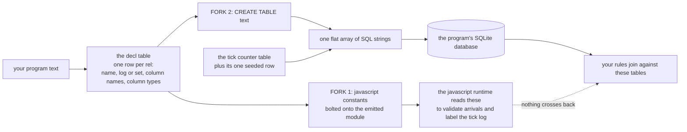
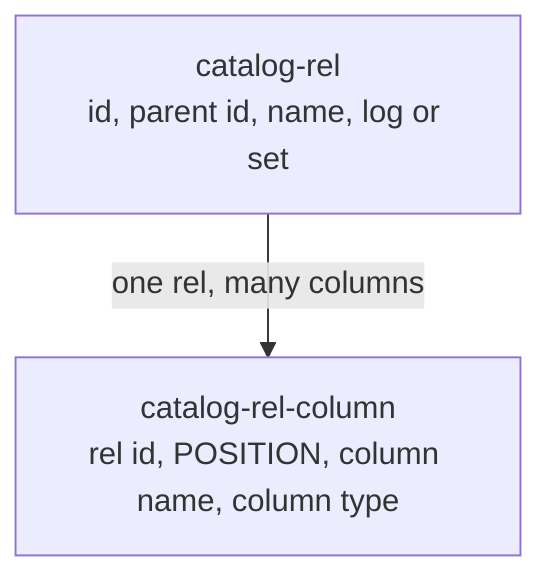

# CATALOG. PLAIN WORDS.

## WHAT A CATALOG IS

Every program declares rels. The catalog is those declarations turned back into rows,
sitting in the same database the program's own rels sit in, so a rule can query them.
Rels describing rels.

## THE COMPILER TODAY. TWO FORKS.

Fork 1 tells javascript what the rels look like. Fork 2 makes the actual tables.
A rule can only see fork 2. The decl table's real contents live in fork 1, where no
rule can reach them.

## THE FOUR DIRECTIONS, SCORED

| direction | state |
|---|---|
| decl table into javascript constants | WORKS |
| decl table into SQL rows | NOTHING THERE |
| compiler into the database, as table text | WORKS |
| a rule reading a catalog table | ALREADY WIRED, table is empty |
| a dot on a rel NAME finding its catalog row | NOTHING THERE |
| a host feeding catalog rows | NOTHING THERE |

## THE SURPRISE

Write a rule today that reads a rel called catalog-rel. It compiles. Right now. The
compiler makes the table, makes the delta plumbing, and lowers the rule to a real
SELECT against it. Then it returns nothing, because nothing ever inserts a row.

The read half is built. The write half was never started. The gap is one producer.

Three smaller things wrong with that free table, all from the same cause, which is
that the catalog rels are undeclared:

- its columns get named after whatever letters YOUR rule used for its variables
- every column comes out as text, since nothing declared a type
- the HTTP door treats it as writable, because undeclared rels are assumed to be inputs

## THE NEXT BUILD

Two rels. One saying a rel exists, one saying a column exists inside it.

Position is the whole argument for splitting them. A column is not just a child of a
rel, it is the FIRST argument or the THIRD, and a parent link alone throws that away.
The older engine in this same repo already learned this and keeps the position.

The parent-id column starts at zero for everything, meaning every rel hangs off the
root. Nesting comes later and only adds rows.

## WHERE THE ROWS GO IN

Beside the tick counter's seeded row, in the flat array of SQL strings. That array is
the one door that runs whole. The other candidate door, the boot list, gets filtered
down to whatever the current subscription actually wants, so rows nobody has queried
yet would silently disappear.

Insert-or-ignore, because serving replays that array on every swap.

## THE GATE, AND WHY IT STOPS WHERE IT STOPS

The corpus check runs every fixture twice, once through the compiled program and once
through the reference interpreter, and diffs what changed each tick.

A catalog table filled once at startup changes nothing on any tick. It cannot break
that diff. So this build is safe by construction.

The moment a rule DERIVES something from a catalog row, that derived thing changes on
a tick, and the reference interpreter has never heard of catalog rows. That is the
next build after this one, and keeping it separate is the point.

The build also turns itself off for any program that never mentions the catalog, the
same way the tick counter table already does. Two hundred and seven checked-in
compiled programs stay byte-identical.

## PROOF

- boot a compiled program, read the two catalog tables by hand, compare to what the
  compiler said the rels were
- replay the whole startup script and confirm no row doubled
- sweep the corpus and confirm nothing moved
- break the insert on purpose and watch the doubling test go red

## NOT IN THIS BUILD

Dots on rel names. Nesting. Keys as catalog columns. Modes. Host-fed rows. Teaching
the reference interpreter. Generic instances.
