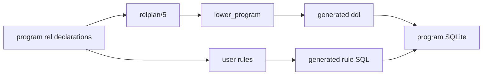
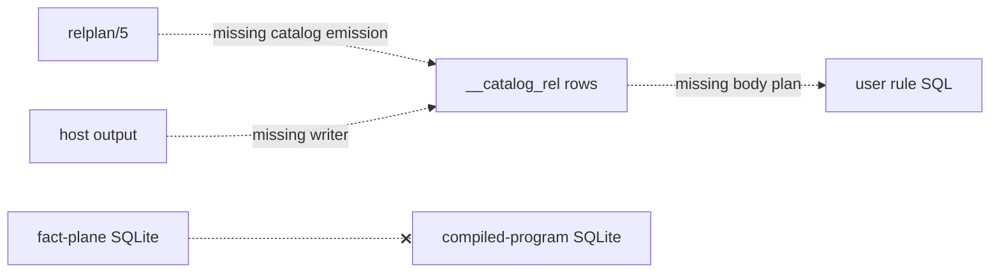

# Program catalog increment

## TOC

- [1. Current data paths](#1-current-data-paths)
- [2. Current slots](#2-current-slots)
- [3. Next increment](#3-next-increment)
- [4. Proof](#4-proof)
- [Where the spec was wrong](#where-the-spec-was-wrong)

## 1. Current data paths

| Direction | Writer | Data | Reader | Receipt |
|---|---|---|---|---|
| source text → compiler plan | `program_plan/2` | `relplan(Ref, Kind, Columns, Key, ColumnTypes)` | `lower_program/2`, `emit_ts` | `compile.pl:168`, `lower.pl:3431`, `emit_ts.pl:660` |
| compiler plan → program DDL | `lower_program/2` | relation, delta, refCount, aggregate, pre, and optional tick SQL | generated TypeScript `ddl` array | `lower.pl:3438-3490`, `emit_ts.pl:648-652`, `emit_ts.pl:2222` |
| generated DDL → compiled-program SQLite database | `ScratchStore.boot` | joined SQL text | SQLite connection opened for the program | `scratchStore.ts:19-26` |
| compiled-program tables → user rule SQL | `level_statement_groups/3` | rule body reads over `BodyRelPlans` | generated incremental level statements | `lower.pl:3461-3471` |
| rel declaration metadata → emitted TypeScript maps | `rel_columns_lines/2`, `rel_column_types_lines/2` | names and boundary types from `relplan/5` | arrival and snapshot code | `emit_ts.pl:656-674`, `emit_ts.pl:2223-2224` |



The compiler already carries declaration shape to DDL and generated runtime metadata. Receipt: `relplan/5`, `lower_program/2`, `ddl_lines/2`.

## 2. Current slots

| Needed direction | Existing endpoint | Current state | Receipt |
|---|---|---|---|
| compiler `relplan/5` → catalog rows in program SQLite | `lower_program/2` DDL accumulation | Empty: its final append contains no catalog group | `lower.pl:3489-3490` |
| catalog rows in program SQLite → user rule body | `BodyRelPlans` | Empty: it contains dictionary plans plus program `RelPlans`; no catalog plan enters it | `lower.pl:3461-3462` |
| relation dot syntax → catalog query | parser and lowering | Empty: catalog names have no compiler occurrence; relation values are separate dictionary joins | command: `rg -n "__catalog_rel|__catalog_instance" v6 --glob '!compile/out/**'` returned no matches; `lower.pl:996-1267` |
| host → catalog rows | host declaration/runtime path | Empty: hosts expose DDL and arrivals, with no catalog row writer | `1_hosts.ts:68`, `types.ts:550` |
| cross-database catalog visibility | fact-plane SQLite → program SQLite | Unavailable: the scratch-store comment identifies unrelated schemas and the connection primitive has no attach operation | `scratchStore.ts:1-11` |



The two required directions have no implementation path today. Receipt: `lower_program/2`, `BodyRelPlans`.

## 3. Next increment

| Item | Build now | Type signature | Lifetime and uniqueness | Reads and writes | Receipt |
|---|---|---|---|---|---|
| catalog source | derive one row per declared user relation from `Decls` and its `relplan/5` | `catalog_rel_ddl(+Decls, +RelPlans, -SqlStatements)` | compile-time list; primary key `(rel_name, arity)` | reads `Decls` and `RelPlans`; writes SQL statements | `compile.pl:160-176`, `lower.pl:3431-3444` |
| catalog table | add `__catalog_rel(rel_name, arity, rel_kind)` to program DDL | `catalog_rel_table_ddl(-SqlStatements)` | program-database table; rebuilt only by program DDL lifecycle | writes `CREATE TABLE` plus idempotent seed inserts | `tick_table_ddl/1`, `lower.pl:622-628` |
| compiler door | append catalog SQL with existing DDL groups | `catalog_ddl(+RelPlans, -SqlStatements)` | one emission per compile; stable source order from `RelPlans` | `lower_program/2` reads plans, `ddl_lines/2` emits strings | `lower.pl:3489-3490`, `emit_ts.pl:648-652` |
| user-rule door | add the catalog relation plan to body compilation, without an arrival target or delta table | `catalog_relplan(-RelPlan)` | readable during every rule evaluation; no arrival lifecycle | `BodyRelPlans` reads its table | `lower.pl:3443-3445`, `lower.pl:3461-3471` |

```prolog
% catalog_rel_ddl(Decls, RelPlans, SqlStatements)
% 1. Select declared user relations from Decls and find each RelPlans entry.
% 2. Create __catalog_rel with the declared primary key.
% 3. Insert one idempotent row per selected declaration.
% 4. Return the statements for lower_program/2's DDL list.
```

The increment creates one readable declaration catalog table and feeds its plan only to rule-body SQL. Receipt: `relplan/5`, `arrival_target_relplan/2`.

| Deliberately outside this increment | Boundary receipt |
|---|---|
| dot parser and resolver | `catalog_universe`; `lower.pl:996-1267` |
| column metadata and catalog instances | typeirplan `PLAN.md:193-194`; `catalog_universe` |
| host-fed rows | `catalog_universe`; `1_hosts.ts:68` |
| imports | command: `rg -n "^import\\b" v6/prolog/compile/dl_view --glob '*.dl6' \| wc -l` returned `0` |

## 4. Proof

| Gate | Observation | Receipt |
|---|---|---|
| compiler unit test | compile a program with two declared relations; inspect DDL for table plus two seeds | `compile/test/plunit_tests.pl:225-314` |
| runtime test | boot emitted DDL, select `__catalog_rel`, assert both rows | `scratchStore.ts:24-26`, `tsv2/tests/tickCounter.test.ts:59-66` |
| user-rule test | compile a rule whose body reads `__catalog_rel`; boot and observe its derived output | `lower.pl:3461-3471`, `tsv2/tests/7_value-plane.test.ts:24-78` |
| scope test | assert no catalog relation appears in arrival targets or delta DDL | `lower.pl:3443-3445`, `lower.pl:3491` |
| regression | run the Prolog compiler tests and the TypeScript test containing the runtime case | `compile/test/plunit_tests.pl`, `v6/justfile:105-106` |

## Where the spec was wrong

| Spec statement | Receipt | Continuation |
|---|---|---|
| the earlier catalog document exists in this worktree | command: `find . -type f | rg '2026-08-03-module-catalog'` returned no path | The sibling `typeirplan/PLAN.md:187-286` contains its step-g design and was read. |
| step-g places `__catalog_rel` and `__catalog_instance` in the store | `typeirplan/PLAN.md:210-211` | The program-database decision record `catalog_universe` and `scratchStore.ts:1-11` require the compiler increment above to place catalog rows in generated program DDL. |
