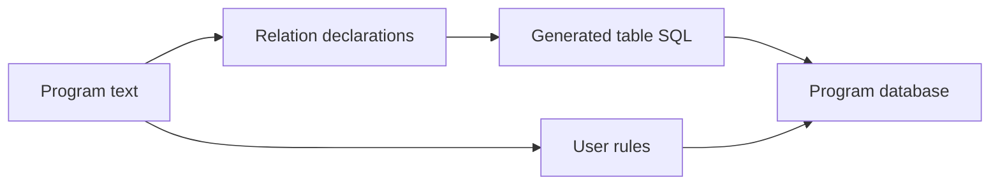
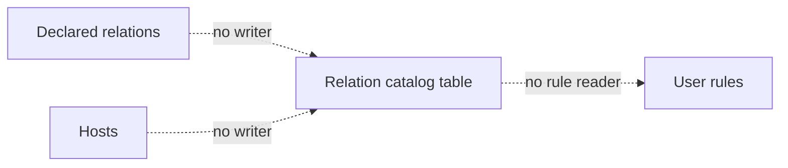
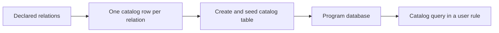

# Relation catalog

## Contents

- What runs today
- What is missing
- The next increment
- How to test it

## What runs today

Each declared relation already becomes a program table. User rules read program tables.

## What is missing

There is no catalog table, no compiler seed for its rows, and no way for user rules to read one.

## The next increment

Create a relation catalog table in each compiled program database. The compiler fills it with one row for every declared relation: name, arity, and relation kind. Make that table available only as a rule-body read source.

| Included | Later work |
|---|---|
| relation name | dot syntax |
| relation arity | column catalog rows |
| relation kind | parameter instances |
| compiler seed rows | host-written catalog rows |

## How to test it

1. Compile a program with two relation declarations.
2. Boot its program database.
3. Query the catalog table and expect two rows.
4. Compile a user rule that reads the catalog table and derives an output row.
5. Confirm the catalog table cannot receive ordinary arrivals.
