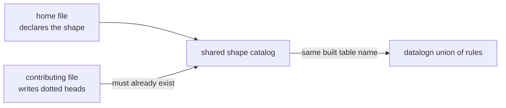
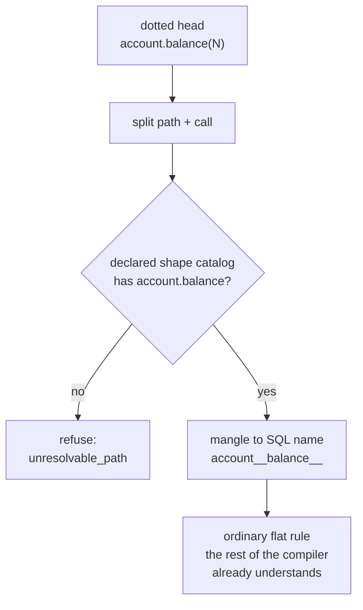
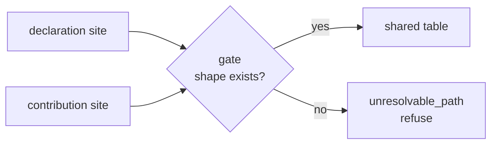

# Branch A: dotted heads contribute, they do not create

The idea in one breath: a file writes a dotted rule head (`account.balance(N) <- ...`)
to add rules to a module another file declares. It can never invent a module. You write
the shape first, then other files fill it in, and the language checks that the shape
already exists.

## What a dotted head does today

Two doors, two different failures, neither tells you why.

- Typing it in a `.dl6` file: a generic "parse error at line 3". It reads the dots as
  record access, trips over the `( ... )`, and quits. No name for what went wrong.
- Passing it as a fixture term: it compiles cheerfully and mints a table literally named
  "." with a function call stuffed into a column. The generated program does not even
  run. No refusal at all.

Neither path treats a dotted head as a path. Record access inside a body
(`row.field`) is a different, working feature that stays untouched.

## What the design adds

One new compiler phase, sitting between the existing sugar phases. It:

1. reads the dotted head, splits it into a path and a call (`account.balance` + one arg),
2. looks up that path in the shape catalog the home file already wrote,
3. if the path is not there, refuses with a named error (`unresolvable_path`),
4. if it is there, rewrites the head to the module's built SQL table name.

From that point the rule is just a normal rule. Union of two files contributing to the
same rel is how datalog unions always worked.

## Why the same table name from two files

The built name is a pure function of the path and the arity. Both files run the same
recipe and get the same string, so neither needs to read the other to agree. The digest
at the end is where the arity lives, so `balance/1` and `balance/2` cannot land on one
table.

## The gate that makes branch A branch A

The contribution does no creating. The name must exist in the shape catalog first,
which is exactly how a module becomes a real interface with one obvious home file.

## Storage: one table, no new machinery

The catalog stays as it is: one row per rel, one row per column, parent id pointing at
the owner. A module is just a rel with children, not a new kind. The contribution adds
zero rows. The catalog ids are still assigned by position on each compile, which is
unchanged.

## The cost, said plainly

- A contributing file can never stand alone. Remove the home file and every dotted head
  in the contributors breaks with `unresolvable_path` until the shape is declared
  again. That is the feature's point, and it is also the pain: refactors that touch a
  module's shape must be coordinated across files in the same compile.
- Reading the shape is a lookup across a whole unit of files, so a single file is no
  longer the whole picture the compiler sees.
- One edge: two names in one parent that mangle to the same string, or a name that must
  be both a module and a plain rel, are refused with their own named errors.

## Proof in one line each

- First failing test: a dotted head with no declaration anywhere must refuse, not build
  a table named ".".
- Sabotage: delete the declaration, the same test flips to the refusal, proving the
  gate, not the mangling, is what the test checks.
- Guard: the existing catalog tests fail if the contribution leaks any catalog rows or
  shifts the positional ids.
