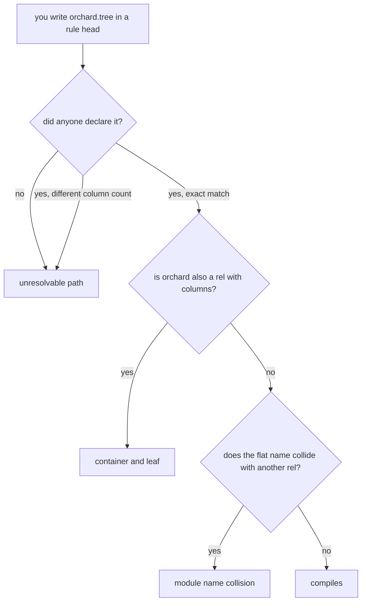

# Branch A in plain words

## What a dotted name is

A rel name with a dot in it. `orchard.tree` means the rel `tree` living inside
the module `orchard`.

## The one decision, in one picture

```
    file 1                          file 2
    ┌──────────────────────┐        ┌──────────────────────────────┐
    │ rel orchard.tree(id) │        │ orchard.tree(Id) <- src(Id). │
    └──────────┬───────────┘        └──────────────┬───────────────┘
               │                                   │
          DECLARES the shape                  ADDS rules to it
               │                                   │
               └───────────────┬───────────────────┘
                               ▼
                    both allowed, one order only
```

Declaring comes first. A file that writes rules into `orchard.tree` when nobody
declared `orchard.tree` gets a named error, and the error is `unresolvable path`.
A module becomes a real interface with a place you can point at.

## What happens to the name

```
  you write        orchard.tree(TreeId)
       │
       │  parser keeps the dots as one name
       ▼
  one atom         'orchard.tree'
       │
       │  a new step checks the name against the declared list,
       │  then flattens it and glues on a short fingerprint
       ▼
  real name        orchard__tree__f9fc8ea9
       │
       ▼
  the table        CREATE TABLE "orchard__tree__f9fc8ea9" (...)
```

The fingerprint is computed from the full path plus how many columns the rel has.
Two rels can never share a table by accident, which is a real bug the flat world
still has.

## The tree the engine keeps

```
                     root
                      │
          ┌───────────┴──────────┐
       orchard                picker          <- modules, no table, name only
          │                      │
     ┌────┴─────┐                │
    tree      picked           chose          <- rels, each one real table
     │
  ┌──┴───┐
 id   species                                 <- columns
```

Every box is one row in one table the engine keeps about itself. A box points at
its parent. The full dotted name is walked from that chain, never stored, so
renaming a module is one row.

## The three errors you can hit



## What this costs you

You cannot scribble a rule into a module that does not exist yet. You write the
declaration first. Two lines instead of one, and in exchange the module has a
spelled shape and a column count that a wrong rule cannot quietly widen.

## What is true today, before any of this

Every dotted spelling except reading a field off a row is a parse error, at the
dot. There is no error name, just a position. If you sneak a dotted name past the
parser, the compiler builds a program file that will not even load, and says
nothing about it. That silent case is the reason the check has to exist somewhere.
