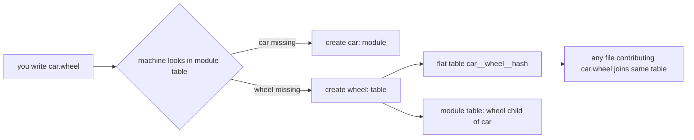
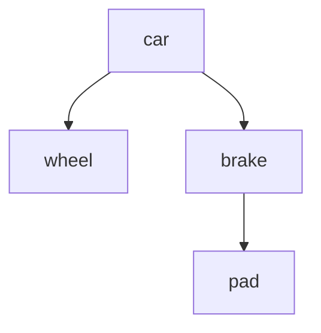

# dotted heads, create-on-write (branch B)

For someone who has never seen this repo. One idea, then the picture.

## The idea in one line

You can write a rule whose name is a dotted path, like `car.wheel(x) <- ...`, and the machine builds the `wheel` table for you the first time. No one has to declare it first. Your file can grow any module it wants.

## Why this exists

dl lets you group rules under a module name. The grouping is just a table of names with parent links. Today a dotted name is refused. This change lets it work, and lets many files feed one dotted table, which then behaves like ordinary datalog: union.

## The one rule that makes it safe

Two files both writing `car.wheel` must write the SAME table, or union breaks. So the table name is computed from the path spelling alone, never from the file's content. Same path, same table, every time, from anyone.

## What the machine does when it sees a dotted head

```text
you write:        car.wheel(x) <- parts(x).

machine checks:   does "car" exist as a module?   no  -> create it
                  does "wheel" exist under car?   no  -> create it

then it lowers    car.wheel   ->   one flat table named   car__wheel__<hash of "car.wheel">
                  and records wheel as a child of car in the module table
```



## Modular, from the start



Each box is a table or a module. `pad` sits under `brake` under `car`. A rule in any file can create any box. It creates the missing boxes above it too.

## What does "grow" cost you

A missed spelling. If you mean `car.weel(x)` and nothing else spells it right, the machine quietly builds an empty module named `car.weel` instead of complaining. That is the price of no-upfront-declaration. The plan names it and asks for the checks that catch it (section 4 below).

## The checks that keep it honest

```text
path always resolves   a body can READ a dotted path only if some head CREATES it elsewhere
                       reading a path nobody writes = error, not silent empty

one shape per leaf     first file sets the width (column count) of car.wheel
                       a later file claiming a different width = error

one name per parent    two children both named "wheel" under "car" = error
                       a name that is both a module and plain data = error
```

## What already exists and gets reused

The machine already has a module table and an ordinary table-builder. This change does not add a new storage engine. It teaches the dotted head to CALL those two existing parts and to fill in the parent links the module table was built to hold but does not write yet.

## How you would know it worked

One test compiles `car.wheel(x)` with no prior `wheel` anywhere and checks the result equals the same rule written INSIDE module `car` by hand. If the two produce the same rows, union works. A second check pins the module table's exact contents and ids, so a future change that scrambles them is caught the moment it lands.
