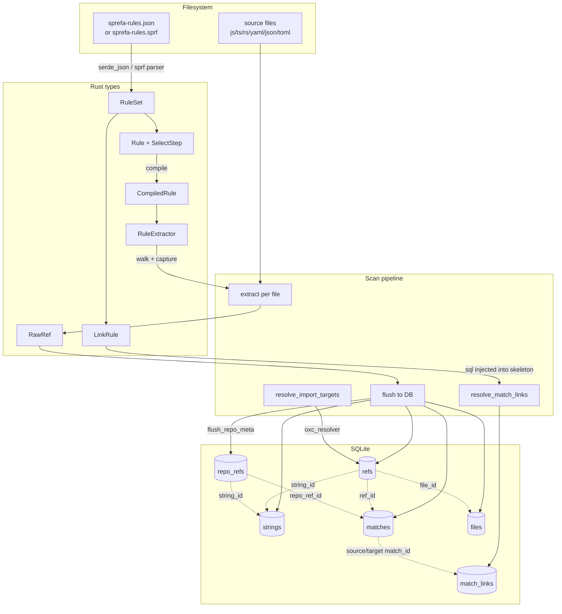

`<human-no-llm-kthnx>`
Hi, the main thesis of this is to ask the question of how far can source strings constants, their import/export identifiers, their filename paths, and their git repo names, take a semantic grep engine that just spits things into prolog aka recursive sqlite queries.

I want to basically allow extremely bespoke pattern chaining of any and all open source tools for parsing. 

Can't believe I'm gonna say this but just imagine html(really xml please), all ast's are representable as a dom tree.

So with that concept, and the filesystem as a tree, we now have a very large shit load of trees.

So this is an attempt at creating a very higher and lower scoped tree query/matching engine that attemps to unify all of that tree into 1 interface.

TLDR; Programmable ripgrep and fzf and ast-grep go BURRRRRR. But also what if ai could trace its steps into a system that allows describing every grep and filesystem find etc. were all encoded into a language that embeds that flow. In order to encode arbitrary filesystem+source AST into prolog for graph and tree algorithms, I wanted to build this.

This system does a whacky refactoring that was the OG idea, that turned into journey studying ast-grep and sqlite and wanting to be able to encode cross filesystem relationships with whatever pattern matching tech I can find open source then make. `ast-grep` hauls ass. json/yaml/toml/xml are all trees already, so thats nice. 

So now you can imagine every tree node as an html element or a div with a classname. Okay now make that work like prolog.
`</human-no-llm-kthnx>`

# sprefa - (s)u(p)er(refa)ctor

Rename a symbol, every reference updates. Its 2026. Across files, across repos, across languages. No LLM, no datacenter -- a pre-built index and a graph traversal after ripping regex on filesystems and ASTs. You can tag whatever you want in this tree and then do prolog on it.

Okay now for how I'm gonna do that is basically ast-grep but if the filesystem were also an ast and I could also query it, aka regex.

sprefa is a daemon that watches project folders, maintains a SQLite index of every interesting string in every source file (imports, exports, config keys, YAML values, dependency names), and performs instant deterministic rename propagation when you change something. The index makes renames O(lookup) instead of O(parse-everything).

## How it works

```
scan files -> extract refs -> index in SQLite -> watch -> detect change -> plan rewrites -> apply
```

Every interesting string in a codebase is a **ref**: a file contains a string at a byte offset. Semantic interpretation lives on **matches**: each ref can have multiple matches from different extraction rules, each with a kind string and rule name. The string is deduplicated and normalized for fuzzy matching. Refs link files to strings. Resolved imports link refs to target files. **Link rules** connect matches across files and repos (import_name to export_name, dep_name to package_name, image tag to git tag).

```
repos 1->M files 1->M refs M<-1 strings
  |                           |
  +--1->M repo_refs ----+     |
                        |     |
                    matches (kind TEXT, rule_name TEXT)
                        |         exactly one of: ref_id | repo_ref_id
                    match_labels (key-value metadata)

ref.target_file_id -> files         (resolved cross-file link)
refs.parent_key_string_id -> strings (intra-file sibling pairing)
repo_refs(string_id, repo_id, kind) -- repo-level metadata (repo_name, git_tag, branch_name)
match_links (source_match_id, target_match_id, link_kind)  -- cross-file/cross-repo semantic links
```

When something changes, the watcher classifies the event (file move, declaration rename, delete), queries the index for every ref affected, computes new values using language-specific path rewriters, and applies the edits to disk.

## Quick start

```bash
sprefa init                          # create sprefa.toml + SQLite DB
sprefa add /path/to/repo             # register a repo
sprefa daemon                       # scan + watch + serve, all in one
```

One command does everything: scans all repos to build the index, starts filesystem watchers for auto-rewrite, and runs the HTTP server for queries. Move or rename files freely.

## What the watcher handles

| Event | Detection | JS/TS rewrite | Rust rewrite |
|-------|-----------|---------------|--------------|
| **File move** | Rename events (macOS `Modify(Name)`) or delete+create pairs correlated by content hash within 100ms window | Rewrite all `import`/`require`/`export...from` paths targeting the moved file. Preserves extension convention and index-file stripping. | Rewrite all `use` statements referencing the old module path. Preserves `crate::`, `self::`, `super::` prefix style. |
| **Declaration rename** | Re-extract the changed file, diff declarations by span proximity (within 64 bytes = same declaration, different name) | Rewrite all `import { OldName }` to `import { NewName }` in files importing from the source. | Rewrite all `use crate::mod::OldName` to `use crate::mod::NewName`. |
| **File delete** | Delete with no matching create | Log warning with count of now-broken references. | Same. |
| **New file** | Create with no matching delete | Indexed on next scan. | Same. |

### How file-to-module mapping works (Rust)

sprefa converts file paths to module paths using directory structure:

```
src/lib.rs         -> crate
src/main.rs        -> crate
src/utils.rs       -> crate::utils
src/foo/mod.rs     -> crate::foo
src/foo/bar.rs     -> crate::foo::bar
```

When `src/utils.rs` moves to `src/helpers/utils.rs`, every `use crate::utils::Foo` becomes `use crate::helpers::utils::Foo`. If the importing file used `super::utils::Foo` and the new path is still expressible as `super::`, the prefix is preserved. All prefix styles (`crate::`, `self::`, `super::`, including chained `super::super::`) are resolved to absolute module paths at query time, so they are all caught by file moves and declaration renames.

## Why this doesn't already exist

Plenty of tools do code intelligence for a single language (rust-analyzer, tsserver, gopls). They all stop at one of three walls:

1. **Single-language.** Your TS frontend imports a string that matches a Go service name in a K8s manifest that references a Helm value from a TOML config. No single-language tool sees the full chain.

2. **Build-system coupling.** SCIP indexers and rust-analyzer require a successful build. If the project doesn't compile, or you're looking at 500 repos and can't build all of them, you get nothing.

3. **Precision religion.** IDE tooling won't ship anything less than 100% semantic precision. But most renames are unambiguous string matches within a known module graph. You don't need full type inference to propagate `UserService` through `import { UserService } from './user-service'`.

sprefa operates at the **string + module graph** level. Normalized strings in SQLite with byte spans, module-aware resolution for languages that have it, honest confidence scoring instead of pretending to be a compiler. Fast enough to run as a daemon on a laptop.

## CLI

```
sprefa init                          # create sprefa.toml + DB
sprefa add <path> [--name <name>]    # register a repo
sprefa daemon [--repo <name>]        # scan + watch + serve, all in one
       [--no-scan]                   # skip initial scan (index already populated)
                                     # + ghcache subscriber if [ghcache] configured
sprefa scan [--repo <name>] [--once] # index repos only
sprefa watch [--repo <name>]         # watch and auto-rewrite only
sprefa serve                         # HTTP server only (127.0.0.1:9400)
sprefa query <term> [--once]         # trigram substring search
sprefa sql "<SELECT ...>"            # read-only SQL against the index DB
sprefa reset                         # drop + recreate the index DB
sprefa status                        # show indexed repos
sprefa --readme                      # print this document
sprefa --json <command>              # structured JSON logs (all commands)
```

### Modes of operation

**`sprefa daemon`** is the recommended way to run sprefa. It runs the full pipeline in sequence:

1. Initial scan of all registered repos (builds the index)
2. Start filesystem watchers on all repos (auto-rewrite on changes)
3. Start ghcache subscriber if `[ghcache]` is configured (auto-scan checkouts)
4. Start the HTTP server (queries, status, trigger re-scans)

Use `--no-scan` to skip step 1 if the index is already populated. Use `--repo` to limit to a single repo.

The individual pieces are also available as separate commands for flexibility:

**`sprefa scan`** -- one-shot indexing. Builds/updates the index and exits. Re-run after large branch switches or merges.

**`sprefa watch`** -- filesystem watching only, no HTTP server, no initial scan. Requires a prior `sprefa scan` to populate the index.

**`sprefa serve`** -- HTTP server only, no watching, no scanning. When `[daemon].url` is set in config, CLI commands (`scan`, `query`) delegate to the daemon over HTTP.

### Direct SQL access

```bash
sprefa sql "SELECT COUNT(*) FROM refs"
sprefa sql "SELECT s.value, m.kind, m.rule_name
            FROM strings s
            JOIN refs r ON r.string_id = s.id
            JOIN matches m ON m.ref_id = r.id
            LIMIT 20"
```

Opens the index DB (resolved from config) and runs the query. Only SELECT, WITH, EXPLAIN, and PRAGMA are allowed -- DML is blocked. Output is tab-separated with a header row. The database is the query language; this command just removes the need to find the file path.

### Structured logging

All commands support `--json` for structured JSON log output. Each line is a JSON object with timestamp, level, target, span context, and structured fields including `phase`, `repo`, `change_count`, `edit_count`, etc.

```bash
sprefa daemon --json                 # JSON logs for process managers
sprefa daemon --json 2>&1 | jq .     # pretty-print
RUST_LOG=sprefa=debug sprefa daemon  # verbose human-readable
RUST_LOG=sprefa=trace sprefa daemon  # everything
```

Phases logged: `initial_scan`, `initial_scan_complete`, `watcher_started`, `server_starting`, `changes_detected`, `change_detail`, `plan_complete`, `edit_detail`, `rewrite_applied`, `rewrite_failed`, `lock_acquire`, `lock_acquired`, `lock_timeout`.

## Config (`sprefa.toml`)

```toml
[db]
path = "~/.sprefa/index.db"

[daemon]
bind = "127.0.0.1:9400"
# url = "http://localhost:9400"     # if set, CLI delegates to daemon

[scan]
# workers = 4

[scan.normalize]
strip_suffixes = ["-service", "-api", "-v2", "-client", "-server"]

# Auto-discover repos from a checkout root managed by an external tool.
# sprefa does NOT clone or fetch -- it only reads what's on disk.
[[sources]]
root = "~/checkouts"
layout = "{org}/{branch}/{repo}"    # -> ~/checkouts/acme/main/frontend/
# default_org = "myco"
# default_branch = "main"

# Explicit repo entries (in addition to discovered sources)
[[repos]]
name = "my-frontend"
path = "/home/me/repos/my-frontend"
branches = ["main"]

[[repos]]
name = "my-backend"
path = "/home/me/repos/my-backend"
branches = ["main", "release/v3"]

# per-branch overrides
[[repos.branch_overrides]]
branch = "release/v3"
[repos.branch_overrides.filter]
mode = "include"
include = ["src/**", "config/**"]

# global file filtering
[filter]
mode = "exclude"
exclude = [
  "node_modules/**", "vendor/**", "dist/**", "target/**",
  ".git/**", "*.min.js", "*.lock", "*.map",
]
```

Config loading: `$SPREFA_CONFIG` > `./sprefa.toml` > `~/.config/sprefa/sprefa.toml`.

Filter resolution: global -> per-repo -> per-branch. Most specific wins.

## ghcache integration

sprefa can subscribe to [ghcache](../ghcacher) checkout events to auto-scan repos that ghcache manages on disk. When a checkout appears or updates, sprefa rescans it without manual `sprefa add` or `sprefa scan`.

### Setup

1. Build sprefa with the ghcache feature:

```bash
cargo build -p sprefa --features ghcache
```

2. Add `[ghcache]` to `sprefa.toml` pointing at ghcache's SQLite database:

```toml
[ghcache]
db = "~/.ghcache/ghcache.db"
poll_ms = 500                    # poll interval, default 500ms
```

3. Optionally filter which repos/branches get scanned via `[[sources]]`:

```toml
[[sources]]
root = "~/checkouts"
layout = "{org}/{branch}/{repo}"
branch_patterns = ["main", "release/*"]   # omit to accept all branches
```

### How it works

When `sprefa daemon` starts with `[ghcache]` configured:

1. **Startup scan** -- reads all existing checkouts from ghcache's DB, scans each one that matches `[[sources]]` patterns
2. **Event subscription** -- polls ghcache's `change_log` table every `poll_ms` for new checkout/update/delete events
3. **Incremental rescan** -- on each event, rescans only the affected repo+branch. Pauses the filesystem watcher for that repo during scan to avoid duplicate processing.

Each checkout is scanned as two branches: the committed state and the working-tree state. This means the index sees both what's merged and what's locally modified.

### Without ghcache

Without the feature flag or `[ghcache]` config section, sprefa works entirely standalone. Register repos manually with `sprefa add` and scan with `sprefa daemon` or `sprefa scan`.

## Architecture

### Extraction pipeline (scan)

```
git ls-files
  -> parallel rayon walk (content hash, skip set check)
  -> per-file extraction (JS extractor, Rust extractor, rule extractor)
  -> bulk flush to SQLite (dedup strings, chunk inserts)
  -> resolve import targets (oxc_resolver with tsconfig support, bare specifier fallback)
  -> resolve match links (execute link rules from sprefa-rules.json)
```

### Watch pipeline (watch)

```
notify OS events (Create, Remove, Modify(Name) for renames on macOS)
  -> debounce 100ms batches
  -> classify: correlate delete+create by content hash -> Move
               Modify(Name(From/To/Both)) -> split into Removed+Created for move detection
               re-extract modified files, diff by span proximity -> DeclChange
  -> plan_rewrites: query index for affected refs, compute new values
  -> apply: splice edits into source files (descending offset order)
```

### Extractors

| Extractor | Languages | What it extracts |
|-----------|-----------|------------------|
| **JsExtractor** (oxc) | .js, .jsx, .ts, .tsx, .mjs, .cjs, .mts, .cts | ImportPath, ImportName, ImportAlias, ExportName, ExportLocalBinding, require() calls |
| **RsExtractor** (syn) | .rs | RsUse (full paths, flattened from use-trees), RsDeclare (fn, struct, enum, trait, impl items, type, const, static), RsMod, DepName (extern crate) |
| **RuleExtractor** (JSON/YAML rules) | Any structured format | Configurable: JSON keys/values, YAML keys/values, TOML keys/values, dependency names/versions. Rules define tree-walking patterns with captures. Patterns support glob or regex (`re:` prefix). |

### Path rewriters

| Rewriter | When triggered | What it does |
|----------|---------------|--------------|
| **JsPathRewriter** | .js/.ts file is the source of an ImportPath ref | Computes new relative path from importing file to moved target. Matches original extension convention (keep/strip). Strips `/index` for directory imports. Ensures `./` prefix. |
| **RsPathRewriter** | .rs file move or RsDeclare rename | Converts file paths to module paths (`src/foo/bar.rs` -> `crate::foo::bar`). Replaces old module path prefix with new in use statements. Preserves `crate::`/`self::`/`super::` prefix style. |

### Import resolution

Import targets are resolved using oxc_resolver (v11), which handles:
- Relative paths with extension probing (.ts, .tsx, .js, .jsx, etc.)
- tsconfig.json paths, baseUrl, and extends chains
- node_modules resolution
- Bare specifiers fall back to the repo_packages table

## Rule engine

Declarative JSON rules for "how do strings in structured files point to things in other repos." The entire indexed space is a DOM:

```
root
+-- repo[name="org/frontend"][branch="main"]
|   +-- file[path="package.json"][ext="json"]
|   |   \-- (json tree nodes)
|   +-- file[path="values.yaml"][ext="yaml"]
|   |   \-- (yaml tree nodes)
```

Each rule is a CSS-style selector against this DOM with three dimensions:

1. **Git context** -- repo/branch/tag globs (`"repo": "*/helm-charts"`, `"branch": "main|release/*"`)
2. **File path** -- glob on repo-relative path (`"file": "values*.yaml"`)
3. **Structural position** -- step chain that walks the parsed tree depth-first

Structural steps: `key`, `key_match`, `any` (descend arbitrary depth), `depth_min`/`depth_max`/`depth_eq`, `parent_key`, `array_item`, `leaf`, `object` (capture sibling values).

All pattern fields accept **glob** (default) or **regex** (`re:` prefix). Glob uses pipe-delimited alternatives (`"main|release/*"`). Regex uses standard Perl syntax (`"re:^v\d+\.\d+"`) with named capture groups via `(?P<name>...)`. Both syntaxes work uniformly across all pattern fields: file, folder, repo, branch, tag, key_match, parent_key.

Steps can **capture** values by name as they match. A `value` regex can split/filter captures (e.g. `"express@4.18.2"` into `name` + `version`). The `create_matches` array turns captures into match rows with explicit parent linkage for grouped output (dep name + version as linked refs).

```json
{
  "name": "npm-deps",
  "select": [
    { "step": "file", "pattern": "**/package.json" },
    { "step": "key_match", "pattern": "dependencies|devDependencies", "capture": "dep_type" },
    { "step": "key_match", "pattern": "*", "capture": "name" },
    { "step": "leaf", "capture": "version" }
  ],
  "create_matches": [
    { "capture": "name", "kind": "dep_name" },
    { "capture": "version", "kind": "dep_version", "parent": "name" }
  ]
}
```

Rules replace hard-coded Rust for each new file format or naming convention. When the way services reference each other changes, you edit a JSON rule, not source code. JSON Schema is generated from the Rust types for IDE intellisense.

## .sprf DSL

The same rule engine has a compact DSL alternative to JSON. CSS-style selector chains with `>`, function-call notation for slot types, and a JSON destructuring mini-lang for tree matching.

```
sprefa-rules.sprf        # looked up first, before .json/.yaml
```

### Grammar

```
statement  = rule | link
rule       = slot ( ">" slot )* ";"
slot       = tagged | match | bare_glob
tagged     = tag "(" body ")"              # paren-counted, allows nested parens
match      = "match(" "$" CAP "," kind ")"
bare_glob  = (not > ; #)+                  # 3 consecutive = repo > branch > fs

tag        = fs | json | ast | re | repo | branch
           | ast "[" lang "]"              # language override: ast[typescript](...)

link       = "link(" src ">" tgt ("," pred)* ")" ( ">" "$" kind )? ";"
```

### Selector chain

Each rule is a `>` separated chain of slots. Bare globs infer context position, tagged slots dispatch by type:

```sprf
# tagged slots (recommended)
fs(**/Cargo.toml) > json({ package: { name: $NAME } })
  > match($NAME, package_name);

# bare 3-slot context: repo > branch > fs
my-org/* > main > **/Cargo.toml > json({ package: { name: $NAME } })
  > match($NAME, package_name);

# ast-grep with language override
fs(**/*.config) > ast[typescript](import $NAME from '$PATH');

# regex on file content
fs(helm/**/*.yaml) > re(image:\s+(?P<REPO>[^:]+):(?P<TAG>.+));
```

### JSON destructuring

The `json(...)` body is a pattern that walks parsed JSON/YAML/TOML trees. Partial matching -- unlisted keys are ignored.

| Syntax | Meaning |
|--------|---------|
| `{ key: pat }` | Match key, descend into pattern |
| `{ $KEY: $VAL }` | Iterate all keys, capture each pair |
| `{ dep_*: $VAL }` | Glob on key name |
| `{ re:^pattern: $V }` | Regex on key name |
| `{ **: pat }` | Recursive descent (any depth) |
| `[...pat]` | Array: iterate elements |
| `$NAME` | Capture leaf value (SCREAMING required) |
| `$_` | Wildcard: match any value shape, don't bind |

Ancestor captures carry forward through arrays: `{ name: $N, items: [...{v: $X}] }` yields one result per element, each containing both `$N` and `$X`.

### match() slots

`match($CAPTURE, kind)` maps a captured variable to a match kind. Multiple match slots per rule are allowed:

```sprf
fs(**/package.json) > json({ dependencies: { $NAME: $VERSION } })
  > match($NAME, dep_name)
  > match($VERSION, dep_version);
```

### link() declarations

Top-level declarations connecting match kinds across files/repos:

```sprf
link(dep_name > package_name, norm_eq) > $dep_to_package;
link(image_repo > package_name, norm_eq) > $image_source;
link(import_name > export_name, target_file_eq, string_eq) > $import_binding;
```

The `>` between source and target kinds is inside parens, so unambiguous. Available predicates: `norm_eq`, `norm2_eq`, `string_eq`, `target_file_eq`, `same_repo`, `stem_eq_src`, `stem_eq_tgt`, `ext_eq_src`, `ext_eq_tgt`, `dir_eq_src`, `dir_eq_tgt`. If `> $kind` is omitted, kind auto-generates as `src__tgt`.

### Full example (this repo's rules)

```sprf
# Cargo
fs(**/Cargo.toml) > json({ package: { name: $NAME } })
  > match($NAME, package_name);

fs(**/Cargo.toml) > json({ re:^(dev-)?dependencies: { $NAME: $_ } })
  > match($NAME, dep_name);

fs(**/Cargo.toml) > json({ workspace: { members: [...$MEMBER] } })
  > match($MEMBER, workspace_member);

# Node
fs(**/package.json) > json({ name: $NAME })
  > match($NAME, package_name);

fs(**/package.json) > json({ re:^(dev|peer)?[Dd]ependencies: { $NAME: $VERSION } })
  > match($NAME, dep_name)
  > match($VERSION, dep_version);

# Helm
fs(**/values.yaml) > json({ **: { image: { repository: $REPO, tag: $TAG } } })
  > match($REPO, image_repo)
  > match($TAG, image_tag);

# ast-grep
fs(**/*.ts) > ast(process.env.$NAME)
  > match($NAME, env_var_ref);

# Links
link(dep_name > package_name, norm_eq) > $dep_to_package;
link(image_repo > package_name, norm_eq) > $image_source;
link(env_var_ref > env_var_name, norm_eq) > $env_var_binding;
```

## Link rules

`match_links` edges between matches, defined in `sprefa-rules.json`. Each rule = a `kind` + either a structured predicate DSL or a raw SQL WHERE fragment injected into a fixed skeleton.

Matches can be file-backed (from extraction) or repo_ref-backed (repo name, git tags, branches). The link skeleton uses LEFT JOINs on the target side so predicates can match either kind.

```
extraction rules produce file-backed matches
flush_repo_meta produces repo_ref-backed matches (repo_name, git_tag, branch_name)
link rules connect them across files/repos
```

### Predicate DSL (preferred)

```json
{
  "link_rules": [
    {
      "kind": "dep_to_package",
      "predicate": {
        "op": "and",
        "all": [
          { "op": "kind_eq", "side": "src", "value": "dep_name" },
          { "op": "kind_eq", "side": "tgt", "value": "package_name" },
          { "op": "norm_eq" }
        ]
      }
    },
    {
      "kind": "image_tag_to_git_tag",
      "predicate": {
        "op": "and",
        "all": [
          { "op": "kind_eq", "side": "src", "value": "helm_image_tag" },
          { "op": "kind_eq", "side": "tgt", "value": "git_tag" },
          { "op": "norm_eq" }
        ]
      }
    }
  ]
}
```

Available predicates: `kind_eq`, `norm_eq`, `norm2_eq`, `target_file_eq`, `string_eq`, `same_repo`, `stem_eq`, `ext_eq`, `dir_eq`, `and`.

- `stem_eq { side }` -- file stem on {side} matches string norm on other side. Use for `mod foo;` -> `foo.rs` linking.
- `ext_eq { side }` -- file extension on {side} matches string norm on other side.
- `dir_eq { side }` -- file directory on {side} matches string norm on other side. Use for workspace member -> directory linking.

### Raw SQL escape hatch

For predicates the DSL cannot express:

```json
{
  "kind": "import_binding",
  "sql": "src_m.kind = 'import_name' AND tgt_m.kind = 'export_name' AND src_r.target_file_id = tgt_r.file_id AND tgt_r.string_id = src_r.string_id"
}
```

### Skeleton

`sql` is injected as `AND (<sql>)`. Source side uses INNER JOINs (always file-backed). Target side uses LEFT JOINs to support both file-backed and repo_ref-backed matches:

```sql
INSERT OR IGNORE INTO match_links (source_match_id, target_match_id, link_kind)
SELECT src_m.id, tgt_m.id, '<kind>'
FROM matches src_m
JOIN refs    src_r  ON src_m.ref_id     = src_r.id
JOIN strings src_s  ON src_r.string_id  = src_s.id
JOIN files   src_f  ON src_r.file_id    = src_f.id
JOIN repos   src_rp ON src_f.repo_id    = src_rp.id

JOIN matches        tgt_m  ON tgt_m.id != src_m.id
LEFT JOIN refs      tgt_r  ON tgt_m.ref_id      = tgt_r.id
LEFT JOIN repo_refs tgt_rr ON tgt_m.repo_ref_id  = tgt_rr.id
JOIN strings        tgt_s  ON COALESCE(tgt_r.string_id, tgt_rr.string_id) = tgt_s.id
LEFT JOIN files     tgt_f  ON tgt_r.file_id      = tgt_f.id

WHERE src_rp.name = :repo_name
  AND NOT EXISTS (
      SELECT 1 FROM match_links ml
      WHERE ml.source_match_id = src_m.id AND ml.link_kind = '<kind>'
  )
  AND (<sql>)
```

### Columns available in `sql`

Source side (always file-backed):
- **src_m** (matches) -> id, ref_id, rule_name, kind
- **src_r** (refs) -> id, string_id, file_id, span_start, span_end, target_file_id, parent_key_string_id, node_path
- **src_s** (strings) -> id, value, norm, norm2
- **src_f** (files) -> id, repo_id, path, stem, ext, dir
- **src_rp** (repos) -> id, name, root_path

Target side (file-backed or repo_ref-backed, LEFT JOINed):
- **tgt_m** (matches) -> id, ref_id, repo_ref_id, rule_name, kind
- **tgt_r** (refs) -> nullable; id, string_id, file_id, ...
- **tgt_rr** (repo_refs) -> nullable; id, string_id, repo_id, kind
- **tgt_s** (strings) -> id, value, norm, norm2
- **tgt_f** (files) -> nullable for repo_ref targets; id, repo_id, path, stem, ext, dir

Raw SQL, no sanitization. Local toolchain tradeoff. Idempotent via NOT EXISTS + INSERT OR IGNORE. Runs after extraction + import resolution on every scan.

### How rules flow through the system



## Formal model

```
PRIMITIVES

  Σ         alphabet of source bytes
  F  ⊂  Σ*  files (byte strings)
  R         refs  =  (v:Str, s:ℕ, e:ℕ, k:Kind, rule:Str, path?:Bool)
  M         matches  =  R × Kind           -- semantic label on a ref
  L         links  =  M × M × Kind         -- directed edge in match graph

NORMALIZATION  (ℕorm : Str → Str)

  norm(s)   =  lowercase(s↾[a-z0-9])
  norm₂(s)  =  norm(s \ Suffixes)          Suffixes = {-service,-api,-v2,…}

EXTRACTORS

  Each extractor  eᵢ  is a partial function:

      eᵢ : (F × Path × Ctx) ⇀ 𝒫(R)      dom(eᵢ) = { f | ext(f) ∈ Exts(eᵢ) }

  Three implementations:

      e_js   : oxc_parser   →  { import_path, import_name, export_name, … }
      e_rs   : syn          →  { rs_use, rs_declare, rs_mod, … }
      e_rule : rules engine →  structural walk ∪ ast-grep

  Dispatch runs all matching extractors and unions their output:

      E(f,ctx)  =  ⋃ { eᵢ(f,ctx) | f ∈ dom(eᵢ) }

RULE ENGINE  (e_rule internals)

  A compiled rule  ρ = (git:Φ, file:Φ, ctx_caps, selector:Sel, emit:Act)

  Selector is one of two modes (mutually exclusive):

      Sel_struct  =  steps : Vec<Step>
      Sel_ast     =  { pattern:Str, lang?:Lang, captures:Var↦Name }

  Walk function (structural):

      walk : Value × Steps → List[MatchResult]        MatchResult = Name ↦ CapturedValue

  AST match function:

      ast_match(src, path, sel) =
        let lang  = sel.lang ?: infer_lang(path)
        let tree  = parse(src, lang)
        [ { name → (node.text, node.range.start, node.range.end)
            | ($var → name) ∈ sel.captures,  node = env[$var] }
          | env ∈ find_all(tree, sel.pattern) ]

  Unified extract for rule ρ:

      results_ρ(f) =  if ρ.selector ∈ Sel_ast
                      then  ast_match(f, path(f), ρ.sel)
                      else  walk(parse_data(f), ρ.steps)

LINK PREDICATE ALGEBRA

  P : M × M → Bool

  Generators:

      kind_eq(σ,v)(mₛ,mₜ)   =  m_σ.kind = v               σ ∈ {src,tgt}
      norm_eq(mₛ,mₜ)        =  norm(mₛ.v) = norm(mₜ.v)
      norm₂_eq(mₛ,mₜ)       =  norm₂(mₛ.v) = norm₂(mₜ.v)
      target_file_eq(mₛ,mₜ) =  mₛ.ref.target_file_id = mₜ.ref.file_id
      string_eq(mₛ,mₜ)      =  mₛ.ref.string_id = mₜ.ref.string_id
      same_repo(mₛ,mₜ)      =  mₛ.file.repo_id = mₜ.file.repo_id
      stem_eq(σ)(mₛ,mₜ)     =  lower(m_σ.file.stem) = m_other.str.norm
      ext_eq(σ)(mₛ,mₜ)      =  lower(m_σ.file.ext)  = m_other.str.norm
      dir_eq(σ)(mₛ,mₜ)      =  lower(m_σ.file.dir)  = m_other.str.norm
      and(P₁…Pₙ)            =  P₁ ∧ … ∧ Pₙ

  Compilation is a homomorphism into SQL boolean algebra:

      compile : P → SQL_fragment

      compile(kind_eq(src,v))   ↦  "src_m.kind = 'v'"
      compile(norm_eq)          ↦  "src_s.norm = tgt_s.norm"
      compile(same_repo)        ↦  "src_f.repo_id = COALESCE(tgt_f.repo_id, tgt_rr.repo_id)"
      compile(stem_eq(tgt))     ↦  "LOWER(tgt_f.stem) = src_s.norm"
      compile(and(P₁…Pₙ))      ↦  "(compile(P₁) AND … AND compile(Pₙ))"

FULL PIPELINE  (composition)

  Index(repo) =  resolve_links ∘ resolve_imports ∘ flush ∘ E(─, ctx(repo)) ∘ list_files(repo)

  Index_Δ(repo, sha₀, sha₁) =  resolve_links ∘ resolve_imports ∘ flush
                                ∘ E(─, ctx) ∘ diff_files(repo, sha₀, sha₁)

  Idempotency:  flush ∘ flush = flush     (INSERT OR IGNORE + UNIQUE constraints)
```

## Schema

**Tables:**
- `repos` -- registered git repositories
- `files` -- indexed files with path, stem, ext, dir, content_hash
- `strings` -- deduplicated string values with norm/norm2
- `refs` -- string occurrences in files (string_id, file_id, byte span)
- `repo_refs` -- repo-level metadata strings (string_id, repo_id, kind). Kinds: `repo_name`, `git_tag`, `branch_name`, `repo_org`
- `matches` -- semantic labels on refs or repo_refs. Exactly one of (ref_id, repo_ref_id) is non-null
- `match_labels` -- key-value metadata on matches
- `match_links` -- directed edges between matches (source_match_id, target_match_id, link_kind)
- `branch_files` -- junction: which files belong to which branch
- `repo_branches` -- branch metadata (git_hash, is_working_tree)
- `git_tags` -- git tag metadata (tag_name, commit_hash, is_semver)
- `repo_packages` -- package manifest metadata (package_name, ecosystem, manifest_path)

**RefKind enum:**
```
StringLiteral, JsonKey, JsonValue, YamlKey, YamlValue, TomlKey, TomlValue,
ImportPath, ImportName, ImportAlias, ExportName, ExportLocalBinding,
DepName, DepVersion,
RsUse, RsDeclare, RsMod
```

**String normalization:**
- `norm`: strip non-alphanumeric, lowercase. `my-UI` -> `myui`
- `norm2`: configurable suffix stripping (`-service`, `-api`, `-v2`)

## Workspace

```
crates/
  cli/          clap CLI (init, add, scan, watch, serve, daemon, status, query)
  config/       config types, TOML loading, filtering, source discovery
  schema/       SQLite migrations, types, query functions
  extract/      Extractor trait + RawRef type
  index/        pure extraction: file enumeration, parallel rayon walk, xxh3 hashing
  cache/        DB writes: bulk flush, import target resolution (oxc_resolver),
                match link resolution, repo metadata interning (flush_repo_meta),
                scan context (skip set by content hash + scanner hash)
  rules/        declarative rule engine: types, tree walker, create_matches, JSON Schema
  sprf/         .sprf DSL parser: text -> AST -> RuleSet (same types as JSON path)
  js/           oxc-based JS/TS extractor (imports, exports, require, re-exports)
  rs/           syn-based Rust extractor (use trees, declarations, mod, extern crate)
  watch/        filesystem watcher + rewrite pipeline:
                  watcher.rs   - notify v8, debounce, move detection by content hash
                  diff.rs      - declaration diffing by span proximity
                  plan.rs      - rewrite planning (query index, compute edits)
                  rewrite.rs   - edit application (splice by descending offset)
                  js_path.rs   - JS/TS relative path rewriter
                  rs_path.rs   - Rust module path rewriter (crate/self/super)
                  queries.rs   - DB queries for affected refs
                  change.rs    - FsChange + DeclChange types
  scan/         coordinator: Scanner struct, spawn_blocking bridge, scan_repo
  server/       axum HTTP daemon (/status, /repos, /query, /scan)
```

## Parser strategy

| Priority | Parser | Languages |
|----------|--------|-----------|
| 1 | oxc_parser | JS, TS, JSX, TSX, MJS, CJS, MTS, CTS |
| 2 | syn | Rust |
| 3 | Declarative rules | JSON, YAML, TOML (any structured format) |
| 4 | SCIP consumption | Any language with a SCIP indexer (Go, Java, Python, etc.) |
| 5 | ast-grep (lib) | Everything else |

## Testing

295+ tests using `insta` snapshot assertions and sqlx in-memory SQLite. Coverage spans: config parsing, filter resolution, source discovery, rule deserialization + tree walking + ref emission, cross-format dep extraction (package-lock, pnpm-lock), bulk flush correctness (dedup, idempotency, chunk boundaries), scan context skip set loading and invalidation, import target resolution (relative, tsconfig paths, bare specifiers, directory indexes), match link resolution (generic link rule execution, cross-repo norm linking, idempotency, multiple rules in sequence), JS/TS extraction (all import/export variants including side-effect, type-only, dynamic exclusion, namespace re-export), Rust extraction (use trees with nested groups/self/glob/rename, declarations, async fn, pub(crate), impl-for-trait, spans), Rust module path conversion (workspace crates, mod.rs, multiple src/ dirs), JS path rewriting (extension conventions, index stripping, cross-tree monorepo, scoped packages), Rust module path rewriting (double super::, self:: fallback, mod.rs moves, super beyond crate root), declaration diffing (threshold boundaries, cross-kind isolation, swap detection), edit application (grow/shrink, multi-file, boundary edits, missing files).

## Roadmap

- [ ] Generic comment parser: line-comment extraction across languages (// # -- %% etc.) to capture annotations, TODOs, and cross-ref hints embedded in comments. Since comment syntax per language is just a line prefix, a small grammar table covers most languages without needing full AST parsing.
- [x] Populate git_tags during scan (git tag --list per repo)
- [ ] Production link rules for: helm image_repo/image_tag to repos+tags, dep_name to package_name by norm
- [x] Repo-level metadata as matchable entities: repo_refs table interns repo name, git tags, branches as linkable matches
- [x] File metadata predicates: StemEq, ExtEq, DirEq link predicates reference files.stem/ext/dir directly (zero extra rows)
- [x] Link rule predicate DSL: structured predicates compiled to SQL (kind_eq, norm_eq, same_repo, stem_eq, ext_eq, dir_eq, and)
- [ ] Second link-rule pass after all repos indexed (remove scan-order dependency for cross-repo links)
- [ ] Rust super::/self:: resolution in rs_uses_with_prefix queries
- [ ] Static type/property tree extraction for rename propagation through type hierarchies
- [ ] tree-sitter incremental parsing for watch-path re-extraction
- [ ] ast-grep lib integration for structural pattern matching (priority 5 parser)
- [ ] SCIP indexer consumption for languages without dedicated extractors
