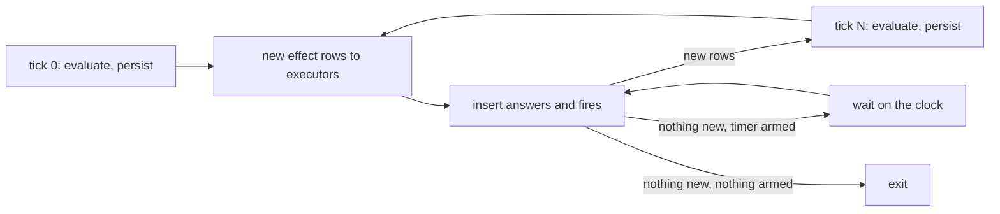

# dl8

DL7, compiled in Rust. The filesystem is the pipe: every `src/_<n>_name/`
folder is one operator, in order. Tests live in `tests/` only; oracle
fixtures in `oracle/`.

The language book is `book/` (`mdbook build book`); every `dl7` block in it is a fixture, checked by `cargo test --test _22_book`.

| folder | status |
|---|---|
| `_0_read` | `read_dl7/5` port over a character stream, 89 oracle fixtures |
| `_1_macrotime` | reify, `<+` expansion waves over `_6_eval`, materialize, 29 oracle cases |
| `_2_lower` | `0_lowerer.pl` and both graph stores, 19 committed of 62 checked lowerings |
| `_3_check` | `1_checker.pl` port, 19 committed of 75 checked calls, 25 diagnostic functors classified |
| `_4_comptime` | the two nested compiler fixpoints, `2_compiler.pl:700-1591`; `_7_sources.rs` is the live refreeze, `Replay` the oracle one; `_0_load` ports the filesystem, TSI and source-fact loaders, 51 committed of 57 cases |
| `_5_reify` | `0_logical_program_reifier.pl`, `0a_logical_program_grapher.pl`, `1_artifact_emitter.pl`; 57 committed of 88 checked calls |
| `_6_eval` | stratified semi-naive evaluator, goldens under `oracle/eval` |
| `_8_driver` | the call in order, `2_compiler.pl:75-700`; `lib.rs::compile` is the chain, 16 committed of 46 whole-pipeline cases |

`prelude/` and `macrotime/` are compiled into the binary with `include_str!`.
`crates/tree-sitter-dl7/` is the grammar; `build.rs` links its generated `src/parser.c`.
`tests/fixtures/` holds the `.dl7` corpus the oracle goldens were taken from.
`sqlite_ivm` is a symlink to the sibling checkout of `hafley66/sqlite_ivm`; `just ivm-ext` builds the extension there.
Earlier engines live under `v5/`, `v6/` and `v7/`.

```bash
cargo test                      # oracle parity through the real binary
cargo run -- compile tests/fixtures/2_partial.dl7
cargo run -- compile oracle/compile/sources/test/fixtures/modules/0_accounts.dl7 \
  oracle/compile/sources/test/fixtures/modules/1_consumer.dl7 \
  --project oracle/compile/sources/test/fixtures/modules
cargo run -- eval oracle/eval/0_transitive.json --trace
```

Regenerate every golden from `dl8` itself:

```bash
bash oracle/refreeze.sh
```

## The extract binary

`tests/_16_extract_tsi.rs` drives `sprefa-extract`, which lives in
`hafley-rs/crates/sprefa-extract`, over `fixtures/extract/corpus` and feeds the
resulting TSI JSONL to `dl8 compile --tsi`. The test looks for the binary in
this order:

| order | where | note |
|---|---|---|
| 1 | `$SPREFA_EXTRACT_BIN` | an absolute path; a miss is an error, never a fallthrough |
| 2 | `$CARGO_TARGET_DIR/debug/extract` | a lane sets this, and then neither target directory fills |
| 3 | `<sprefa root>/hafley-rs/target/debug/extract` | `hafley-rs` is a gitignored sibling link the lane setup makes; the crate was a workspace member until hafley-rs excluded it |
| 4 | `<sprefa root>/hafley-rs/crates/sprefa-extract/target/debug/extract` | where an excluded crate builds |
| 5 | `cargo build --features cli --bin extract --manifest-path <sprefa root>/hafley-rs/crates/sprefa-extract/Cargo.toml` | run once, capped at 60 s |

```bash
ln -s /Users/chrishafley/projects/hafley-rs hafley-rs   # from the sprefa root
cargo test --test _16_extract_tsi -- --nocapture         # prints the row counts
```

`--family tsi` is not a spelling: `tsi` is the envelope `--witness` wraps a run
in, and the relation rows the loader reads come from `--family type`. More than
one path in one run needs `--resolve`. The `scip_indexes_the_typescript_corpus`
case stands down with a printed reason when `scip-typescript` is not on PATH.

## dl8 run

`dl8 run <compile.json> --serve timer,fetch_json [--db <file>] [--max-ticks N]`
runs a program as a process. The loop lives in `src/_9_runtime/_2_reconcile.rs`,
the executors in `src/_9_runtime/_3_executors/`.


```mermaid
flowchart LR
  T0[tick 0: evaluate, persist] --> A[new effect rows to executors]
  A --> I[insert answers and fires]
  I -->|new rows| E[tick N: evaluate, persist]
  E --> A
  I -->|nothing new, timer armed| W[wait on the clock]
  W --> I
  I -->|nothing new, nothing armed| S[exit]
```

| served name | cadence | row it writes | declare |
|---|---|---|---|
| `timer` | Continuing | `(timer PeriodMs Tick)`, ticks from 1 per period; a late fire is skipped, never replayed | `(: timer (* (: period_ms int) (: tick int)))` |
| `fetch_json` | Once | `(fetch_json Url Body)`, Body the raw 2xx JSON text | `(: fetch_json (* (: url text) (: body text)))` |
| `fetch_json` | Once | `(fetch_json_error Url Status Message)` on non-2xx, a non-JSON body, or transport failure (Status 0); 10 s request timeout | `(: fetch_json_error (* (: url text) (: status int) (: message text)))`, required |

| rule | where it shows |
|---|---|
| each effect row reaches its executor once per process | `Reconciler.effects_seen` |
| on a reloaded db, a Once application with a matching data row is answered; an error row is not, so a restart retries it | `data_row_exists` |
| a timer reloaded from the db numbers past its stored ticks | `Timer::first_tick` |
| a served name with no executor exits 1 with `served_relation_no_executor` | `executors_for` |
| stdout is the closure plus `ticks` and, with `--db`, `insert_statements` | `run_cli` in `src/bin/dl8.rs` |

```bash
cargo run -- compile fixtures/reconcile/0_timer.dl7 > /tmp/timer.json
cargo run -- run /tmp/timer.json --serve timer --max-ticks 3
cargo test --test _17_reconcile      # real binary, real clock, local HTTP listener
```

## Executor roster

Every served name, its columns, and the companion error relation a program
must declare before `--serve` accepts the name. Git runs only inside `soopy`
(`hafley-rs/crates/soopy`, a path dependency); `extract` is the
`sprefa-extract` binary, found the way the extract section above lists.

| served name | columns | cadence | answers | error relation |
|---|---|---|---|---|
| `timer` | `period_ms int, tick int` | Continuing | one row per fire | none |
| `fetch_json` | `url text, body text` | Once | the 2xx JSON body | `fetch_json_error url text, status int, message text` |
| `soopy_refs` | `root text, name text, sha text` | Continuing | every ref plus `HEAD` at arming, then each moved or added ref; `RepositoryWatcher` wakes it, a failed watcher degrades to a 1 s re-read | `soopy_refs_error root text, message text` |
| `soopy_history` | `root text, sha text, parent text` | Once | one row per parent edge reachable from `sha`, or `HEAD` when `sha` is unbound; a root commit has no row | `soopy_history_error root text, message text` |
| `repo_at` | `root text, sha text, path text, blob text` | Once | one row per tracked file at the revision, `blob` the git blob sha | `repo_at_error root text, sha text, message text` |
| `extract` | `root text, family text, kind text, payload text` | Once | one `extract --family <family> --resolve` run over the root's tracked files, one row per JSONL record; `kind` is its `record` field, `payload` the whole line | `extract_error root text, family text, message text`; a run past 10 s is killed and answers `timeout` |

| rule | where it shows |
|---|---|
| a removed ref writes nothing; retraction is not built | `SoopyRefs::delta_rows` |
| `soopy_history` carries no commit time: soopy's commit reader is private and `GitBatch` reads blobs only | `soopy/src/_12_revision_graph.rs:310`, `soopy/src/_6_git_batch.rs:57` |
| `payload` stays one text term; structured projection is not built | `Extract::answer` |

```bash
cargo test --test _20_hosts -- --nocapture   # throwaway git repos, the extract corpus, the org program
```

## Logs

Every phase emits one `dl8::phase` event with its name, measured milliseconds,
row count and diagnostic count. Tracing goes to stderr; stdout stays the oracle.

```bash
RUST_LOG=dl8=debug dl8 compile f.dl7      # phase events, wave/round trace, io reads
HAFLEY_LOG_FORMAT=json dl8 compile f.dl7  # one JSON object per event
dl8 compile f.dl7 --trace                 # wave and round lines, RUST_LOG unset
```

`RUST_LOG` picks the filter when set; `--trace` raises the default to
`dl8=debug` when it is not. `HAFLEY_LOG_FORMAT=human|json` picks the encoding.

Design: `plans/v8/2026-09-12-v8-eval-api.md`. Buy-vs-build:
`plans/v8/2026-09-12-v8-buy-vs-build.md`.
