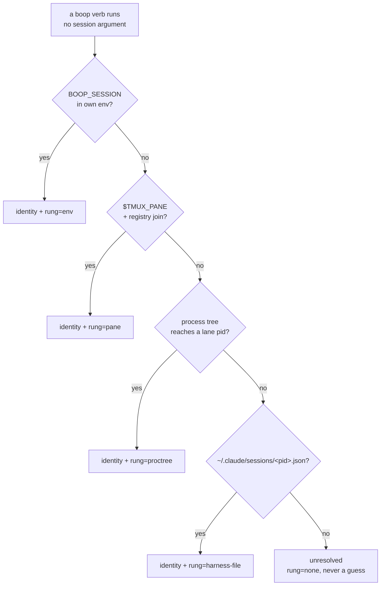

# Self-identifying boop, and the status resource

Design addendum to `plans/2026-08-09-boop-analytics-PLAN.md`. Two asks, both
landing in the step 3 CLI reshape. No code written yet.

## Table of contents

1. [Ask 1: any caller resolves to its own session](#1-ask-1-any-caller-resolves-to-its-own-session)
2. [The law this must not break](#2-the-law-this-must-not-break)
3. [The resolution ladder](#3-the-resolution-ladder)
4. [The spawn stamp](#4-the-spawn-stamp)
5. [Auto-edges](#5-auto-edges)
6. [boop whoami](#6-boop-whoami)
7. [Ask 2: the status resource](#7-ask-2-the-status-resource)
8. [The transition row](#8-the-transition-row)
9. [Open questions](#9-open-questions)

---

## 1. Ask 1: any caller resolves to its own session

A harness runs `boop beep hail other-lane --body ...` with no `--from`. boop must
know who is calling, so the edge `caller -> target` is minted with no ceremony
and `agent_edge` fills from ordinary usage instead of only transcript parsing.



---

## 2. The law this must not break

From `claude-research/skills/agent-bus/SKILL.md`, "Env inference bit twice, both
fixed 2026-08-07":

> The law under both: env inference answers "who am I", never "who is the child
> I am spawning".

Two failures that law came from, and the boop equivalent of each:

| bus failure | boop equivalent to avoid |
|---|---|
| `bus.ts:138` took `inferred?.sessionId` at dispatch, so the lane's registry route carried the COORDINATOR's session id | `beep lane create` must never write its own `BOOP_SESSION` into the child's route |
| `laneEnvStamp()` prefixed the child command with the caller's `INSTANT_SESSION_ID`, so every `bus` call from inside the lane spoke as the coordinator | the stamp boop writes into a child pane describes the CHILD |

Concretely: the stamp is computed from the spawn's own result (the tmux session
it just created, the lane name it was given), never copied from the spawner's
environment. The spawner's identity appears in exactly one place, `BOOP_PARENT`,
and it is labelled as the parent.

---

## 3. The resolution ladder

Each rung states its confidence. A miss falls through; nothing guesses.

| rung | source | confidence | fails when |
|---|---|---|---|
| 1 `env` | `BOOP_SESSION` in own environment | exact | the process was not spawned by boop |
| 2 `pane` | `$TMUX_PANE` joined to `agent_pane_tag` / registry route | exact for boop-spawned panes | pane started by hand |
| 3 `proctree` | walk parent pids (`proc.rs` `SysinfoSnapshot`) until one matches a registered lane's pane pid | inferred | the lane is not registered |
| 4 `harness-file` | `~/.claude/sessions/<pid>.json`, which carries pid and exact tmux pane | exact when present | file absent (2 present today) |
| 5 `none` | nothing matched | none | always reported as unresolved, never defaulted |

Rung 1 is the only one that is free. Rungs 2-4 each cost a query, so the ladder
short-circuits on the first hit and the rung is reported so a caller can see
whether it was told or inferred.

The bus incident says resolution must not short-circuit on a *self-reported*
value it never verified. Rung 1 is self-reported by construction, so the
identity row carries the rung, and `whoami --json` exposes it: a consumer that
needs certainty can demand `rung == "env"` or re-verify.

---

## 4. The spawn stamp

`beep lane create` prefixes the child's command with three variables, all
describing the child:

```
BOOP_SESSION=<the child's session id, from the spawn result>
BOOP_LANE=<the lane name the caller asked for>
BOOP_PARENT=<the spawner's resolved session id, or empty>
```

`BOOP_PARENT` is the one value taken from the caller's own resolution, and it is
named `PARENT` so it can never be misread as the child's identity.

There is a hole worth stating: at spawn time the harness session id does not
exist yet for `claude` (the transcript file is created after launch), so
`BOOP_SESSION` at that moment is boop's own lane-scoped id, not the harness's
transcript id. Two ids for one thing is exactly the confusion the bus incident
came from. Proposal: `BOOP_SESSION` carries boop's lane id always, and the
transcript id is joined later through the registry route, so a single variable
never means two things.

---

## 5. Auto-edges

When a resolved caller acts on another session, boop writes the edge:

```
agent_edge(parent_session_id = caller, child_session_id = target,
           edge_kind_id = dict_edekind(verb))
```

`dict_edekind` already exists and already holds `spawned`. The new kinds are the
verbs that cross sessions: `hailed`, `queried`, `acked`, `killed`.

Two design points:

- The existing primary key is `(parent_session_id, child_session_id, edge_kind_id)`,
  so a repeated hail does not grow the table. If the count matters, the edge
  table needs a `first_ts` / `last_ts` / `n` triple rather than a row per event;
  that is a schema change, not a free win, and it should be decided before the
  first auto-edge lands.
- An unresolved caller writes **no** edge. A `rung=none` edge attributed to a
  placeholder would poison the subtree rollup that step 4 depends on.

---

## 6. boop whoami

One call teaches a harness the mechanism:

```
$ boop whoami
session  lane/boop-coord
lane     boop-coord
parent   d66af3e3-e9b7-42e1-b35a-a03f08923b93
rung     env
pane     %14
harness  claude

$ boop whoami --json
{"session":"lane/boop-coord","lane":"boop-coord","parent":"d66af...",
 "rung":"env","pane":"%14","harness":"claude","confidence":"exact"}
```

REST twin: `GET /whoami`. It is a read of the caller's own identity, so it sits
under neither `beep` nor `db` cleanly; a root verb matches what it is. That is
the same placement question as `boop serve`, and both should be answered
together.

---

## 7. Ask 2: the status resource

One resource, two views, one verb:

| clap | method + path |
|---|---|
| `boop db status [--window 10m]` | `GET /status?window=10m` |

Rows, never a bespoke nested shape, so SQL and dl6 consumers join it like
everything else. The tree is expressed by `parent_session` on each row:

| column | source |
|---|---|
| `session` | `dict_session.value` |
| `lane` | registry route name |
| `harness` | `dict_harness.value` |
| `parent_session` | `agent_edge` where kind = `spawned` |
| `pid`, `tmux_pane` | `agent_live` |
| `state` | `live` / `dead`, from tmux reachability at query time |
| `rss_kb`, `cpu_pct`, `uptime_sec` | the `beep ps` measures (`proc.rs`) |
| `last_turn_ts` | `MAX(agent_turn.ts)` |
| `last_usage_ts`, `tokens_in_window` | `agent_usage` once step 2 lands |
| `first_seen_ts`, `last_seen_ts` | transition rows |
| `died_ts` | transition rows, NULL while live |

`?window=10m` (default) adds every session whose state changed inside the window,
including ones already dead, each with its transition timestamps. `?window=0`
is the now-only view.

---

## 8. The transition row

`agent_live` today is `(session_id PK, pid, tmux_pane_id, status_id)`: one row
per session, overwritten. It cannot answer "died within the window", because the
death overwrites the evidence. The minimal addition:

```sql
CREATE TABLE IF NOT EXISTS agent_live_span (
  session_id INTEGER NOT NULL,
  from_ts    INTEGER NOT NULL,
  to_ts      INTEGER,
  status_id  INTEGER NOT NULL,
  pid        INTEGER,
  tmux_pane_id INTEGER,
  PRIMARY KEY (session_id, from_ts)
) WITHOUT ROWID;
CREATE INDEX IF NOT EXISTS idx_live_span_open ON agent_live_span(to_ts) WHERE to_ts IS NULL;
```

Same interval shape as `agent_visible` in `TMUX-VISIBILITY.md`, deliberately:
one fold closes an open interval when the next observation disagrees, and both
tables are read with the same `from_ts <= T AND (to_ts IS NULL OR to_ts > T)`
predicate. `agent_live` stays as the current-state cache; `agent_live_span` is
the history, and it is written only on a state change, so an idle fleet writes
nothing.

This is the answer to "add the minimal transition row rather than polling
harder": the write happens when an observation differs from the cached row, and
the observation itself rides whatever tick already exists.

---

## 9. Open questions

1. **Two ids for one session.** boop's lane id and the harness's transcript id
   are different strings for the same thing at spawn time. Section 4 proposes
   `BOOP_SESSION` always carries the lane id. It needs the user's word, because
   the alternative (stamp late, once the transcript appears) means the child
   cannot self-identify during its first seconds.
2. **Edge counting.** `agent_edge`'s primary key collapses repeated verbs. If
   "how many times did A hail B" matters, the table needs `first_ts`/`last_ts`/`n`.
3. **Where root verbs live.** `whoami`, `serve` and `status` are all arguably
   root verbs beside `beep` and `db`. Deciding them one at a time will produce
   three inconsistent answers.
4. **Liveness at query time costs a tmux round trip.** `GET /status` calls
   `list-sessions` to tell live from dead. That is one query per request, and it
   is the same refusal case `prune` already has when tmux is unreachable: the
   status rows would have to report `state=unknown` rather than `dead`.
