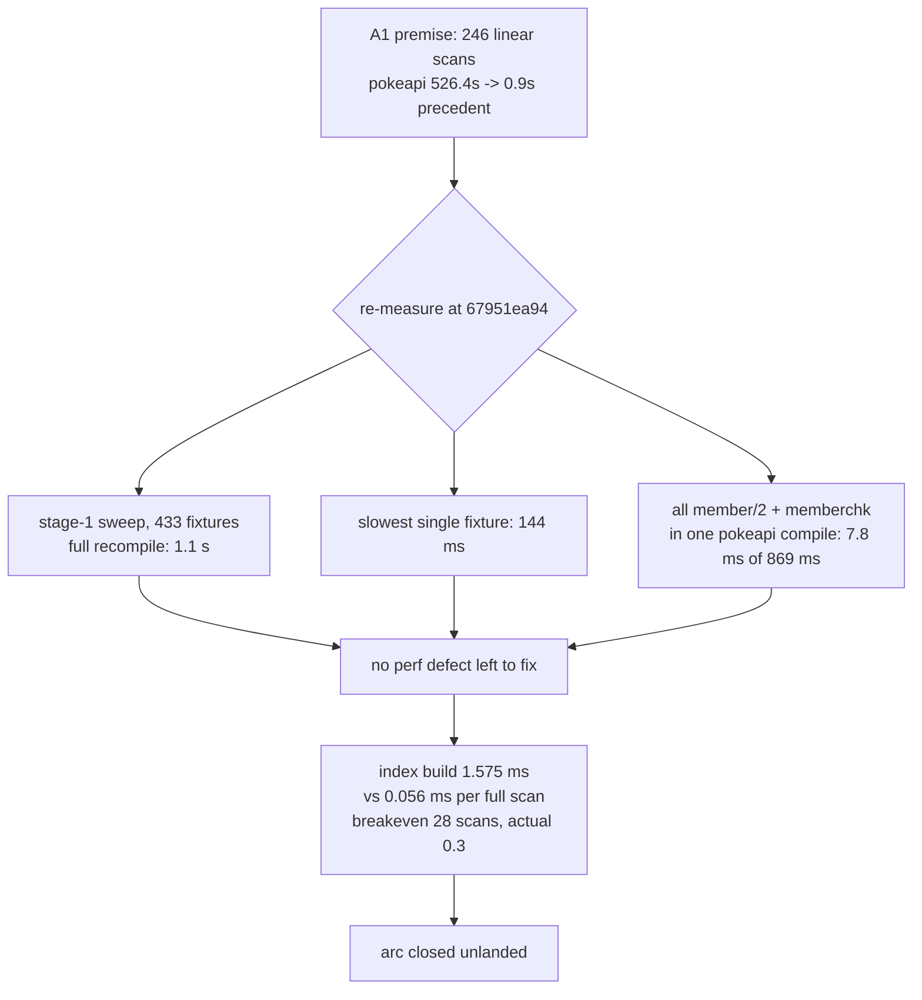

# A1 declaration index: measured, not landed

Branch `refactor/a1-declaration-index`, worktree base `67951ea94`.

## TOC

1. [Verdict](#verdict)
2. [Site count, re-measured](#site-count-re-measured)
3. [Stage-1 sweep timing, 3 + 3](#stage-1-sweep-timing-3--3)
4. [Gate table](#gate-table)
5. [Candidate comparison (C4)](#candidate-comparison-c4)
6. [The arithmetic that closes the arc](#the-arithmetic-that-closes-the-arc)
7. [Where the compiler's time actually goes](#where-the-compilers-time-actually-goes)
8. [What to dispatch instead](#what-to-dispatch-instead)
9. [Appendix: the prototype module](#appendix-the-prototype-module)
10. [Commits](#commits)

## Verdict

| question | answer |
| --- | --- |
| does an indexed declaration store beat `member/2` here | no. It loses by ~90x at the measured scan density |
| why | a declaration list is replaced after ~0.3 full scans. One index build costs 28 full scans |
| what was landed in the compiler | nothing. `v6/prolog/**` is byte-identical to `origin/main` |
| what A1 could win at its ceiling | 0.36% of one compile of the largest program in the repo |
| is the plan's D1 receipt still true | no. `4e2c21a82` and the 462 -> 434 corpus compaction already took it |
| where the time really is | `format/3` 28.2% self, `assertz/1` 13.1% self, one `member/2` site (`relplan_of/3`) holding 41% of all list-scan redos |



## Site count, re-measured

Pattern, per the plan: `member(_, Decls*)` and `memberchk(_, Decls*)` over `v6/prolog/**/*.pl`.

| scope | plan time | now (`67951ea94`) |
| --- | --- | --- |
| all `.pl` under `v6/prolog` | 246 | 408 |
| non-test source | not split | 272 |
| `compile/test/**` | not split | 136 |

Top files, non-test and test alike:

| count | file |
| --- | --- |
| 91 | `v6/prolog/compile/test/plunit_tests.pl` |
| 91 | `v6/prolog/0_generic_expand.pl` |
| 22 | `v6/prolog/compile/test/anonymous_type_syntax.test.pl` |
| 20 | `v6/prolog/0_dot_expand.pl` |
| 17 | `v6/prolog/0_program_check.pl` |
| 16 | `v6/prolog/compile/parse_dl_dcg.pl` |
| 16 | `v6/prolog/0_enum_expand.pl` |
| 12 | `v6/prolog/0_option_expand.pl` |
| 11 | `v6/prolog/compile.pl` |
| 9 | `v6/prolog/emit_ts.pl`, `v6/prolog/0_anonymous_expand.pl` |
| 8 | `v6/prolog/compile/4_emit_jsonschema.pl`, `v6/prolog/0_type_plane.pl` |
| 7 | `v6/prolog/lower.pl`, `v6/prolog/emit_rust.pl` |

The plan's per-file estimate for `0_generic_expand.pl` was 73; it is 91.

## Stage-1 sweep timing, 3 + 3

`cd v6/tsv2 && SWEEP_JOBS=8 bash scripts/sweep-stage1.sh 8`, with `out/sweep.digests`
deleted before every run so every run is a full recompile of the whole corpus.
No compiler source changed between the two sets; the two sets differ only in
machine load, which is the finding.

| set | run 1 | run 2 | run 3 | machine load average | corpus result |
| --- | --- | --- | --- | --- | --- |
| before | 2.0 s | 1.9 s | 2.5 s | 15.17 | `total=433 compiled=335 unsupported=98 crash=0`, `SWEEP_CACHE hit=0 recompiled=433` |
| after | 1.1 s | 1.1 s | 1.1 s | 6.26 | identical, all six runs |

Slowest single fixture across the corpus, from `SWEEP_TIMINGS`:

| ms | fixture |
| --- | --- |
| 144 | `resident_coroutine_runs_bundle_into_one_ask` |
| 123 | `concat_program_queue` |
| 117 | `clean_state_gate_and_exit_zero` |
| 112 | `json_array_spread_skips_non_matching_elements` |
| 104 | `nested_bounded_template_instance` |

The 10-second law has no violation to answer for in this leg.

Single-program compile wall, un-profiled, three runs, from `COMPILE-TRACE`:

| program | run 1 | run 2 | run 3 | inferences |
| --- | --- | --- | --- | --- |
| `pokeapi_shape.dl6` | 881 ms | 869 ms | 854 ms | 8,313,282 |
| `self-map.dl6` | 1799 ms | 1832 ms | 1853 ms | 9,824,293 |

## Gate table

| gate | before | after | note |
| --- | --- | --- | --- |
| conformance `go.pl` | 433 PASS, `FAILURES 1` | 433 PASS, `FAILURES 1` | the one red is `nested_zero_column_child_is_one_row_per_parent`, as briefed |
| `just plunit` | 921 tests, 8 failed | 921 tests, 8 failed | same set, listed below |
| stage-1 sweep | `recompiled=433`, 3 runs | `recompiled=433`, 3 runs | `SWEEP_FORCE` not needed; digest deletion forces the recompile |
| byte parity of `v6/prolog/compile/out` | clean | clean | `git status --porcelain` empty after all six full-recompile runs |

The 8 plunit failures, identical before and after:

| plunit line | test |
| --- | --- |
| 64/921 | `subscribe_cone:go..lex_cone_invariants` |
| 261/921 | `catalog_plane_rai..amily_corpus_counts` |
| 620/921 | `module_path_decls..ue_is_not_rewritten` |
| 629/921 | `rel_zero_arity:a_..till_has_no_storage` |
| 635/921 | `rel_template_and_..xplicit_declaration` |
| 844/921 | `json_merge_patch:..null_stand_in_guard` |
| 850/921 | `json_merge_patch:.._json_null_stand_in` |
| 851/921 | `json_merge_patch:.._json_null_stand_in` |

## Candidate comparison (C4)

Prototype built and equivalence-checked against `member/2` and `memberchk/2`
over a 16-declaration list covering every awkward shape: repeated identical
declarations, `Name/Arity` first arguments queried as `Name/_`, bare-atom first
arguments, a list first argument, a zero-key group, a group with a variable
first argument, an absent functor, and a fully unbound query. All 20 query
shapes matched on answer order, multiplicity, and bindings.

Benchmark list: 1428 declarations shaped like pokeapi's expanded program
(806 `col_type/3` over 134 rels, 212 `semantic_decl_module/3`,
212 `rel_module_decl/2`, 159 `option_column/3`, 33 `type_decl/2`, 8 `keyed/2`).
Workload: 134 keyed `findall` lookups, one per rel. Three runs each.

| candidate | build | 134 lookups (3 runs) | lookup inferences | verdict |
| --- | --- | --- | --- | --- |
| flat `member/2`, status quo | 0 | 8.748 / 8.664 / 8.717 ms | 193,635 | baseline |
| `library(assoc)` AVL | 1.065 ms | 0.243 / 0.239 / 0.237 ms | 3,489 | fastest read, chosen for the prototype |
| `library(rbtrees)` | 1.377 ms | 0.359 / 0.355 / 0.356 ms | 6,636 | slower to build and to read than assoc |
| `keysort/2` + grouped pairs + `memberchk/2` | 0.727 ms | 0.607 / 0.600 / 0.600 ms | 3,354 | cheapest build, 547 groups walked linearly |
| SWI `:- table` on a `decl/2` view | not benchmarked | not benchmarked | not benchmarked | disqualified before measurement |

Tabling is disqualified on two counts, both structural rather than about speed.
The declarations would have to be asserted into a global predicate, and
`scripts/sweep-stage1.sh` runs many programs through one `swipl` process per
worker, so one program's declarations would be visible to the next. Tabled
answer order is also not list order, and emitted bytes depend on declaration
order, so the byte-identity gate would decide against it.

Build cost on the real lists rather than the synthetic one, 100 iterations:

| program | declarations | one `decl_index/2` build |
| --- | --- | --- |
| `pokeapi_shape.dl6` | 1246 | 1.575 ms |
| `self-map.dl6` | 403 | 0.514 ms |

## The arithmetic that closes the arc

One `member/2` list step measured at 44.9 ns (8.748 ms over 193,635 inferences,
un-profiled).

| quantity | value |
| --- | --- |
| one full scan of pokeapi's 1246-declaration list | 0.056 ms |
| one `decl_index/2` build over the same list | 1.575 ms |
| **breakeven** | **28 full scans of one list value** |

Measured scan density in the arc's own largest file. `0_generic_expand.pl`'s
`expand_generic_program_with_bindings/3` threads 15 distinct declaration list
values through its pipeline, and `1_expansion.pl:91` runs that pipeline a
second time for the enum context, so one compile produces 30 list values from
that file alone. The profiler attributes 11,906 `member/2` redos to
`generic_expand` predicates on a pokeapi compile.

| quantity | value |
| --- | --- |
| declaration list values per compile, `0_generic_expand.pl` alone | 30 |
| `member/2` redos attributed to `generic_expand` | 11,906 |
| redos per list value | 397 |
| **full scans per list value** | **0.32** |
| distance from breakeven | 87x short |

Every stage in that pipeline builds a new list, so an index cannot be hoisted
above the stage that owns it. `0_dot_expand.pl` is worse in the same direction:
`apply_nested_capture/3` rewrites the whole declaration list once per nested
rel through `maplist(rename_capture_ref(...))`, so an index there would be
rebuilt per capture.

Whole-compile ceiling, the number A1 is competing for:

| quantity | pokeapi compile |
| --- | --- |
| `member/2` calls + redos | 28,616 + 145,590 = 174,206 steps |
| at 44.9 ns per step | 7.8 ms |
| compile wall | 869 ms |
| all list scanning, every list | 0.9% |
| declaration-list share of those redos | ~40% |
| **A1's ceiling** | **0.36% of one compile** |

## Where the compiler's time actually goes

`profile/1` over one `compile_dl6` of `pokeapi_shape.dl6`, self time. Port
instrumentation inflates the absolute figures; the ranking is the point.

| self | predicate | calls |
| --- | --- | --- |
| 28.2% | `format/3` | 73,002 |
| 13.1% | `assertz/1` | 1,141 |
| 5.1% | `$skip_list/3` | 9,550 |
| 4.6% | `lists:member_/3` | 28,616 + 146,403 redos |
| 3.5% | `$memberchk/3` | 41,000 |
| 3.3% | `analyze:column_type_at_decl/9` | 806 |

`format/3` at 73,002 calls is the compiler's largest single cost and is in no
arc in the refactor plan. On `self-map.dl6` it is 17.5% self over 58,686 calls.

The largest single list-scan site in the compiler is not a declaration scan:

| site | calls | redos | share of all `member/2` redos |
| --- | --- | --- | --- |
| `0_rel_record.pl:107` `relplan_of/3` | 665 | 60,342 | 41% |

`relplan_of(RelPlans, Ref, Rel) :- member(Rel, RelPlans), relplan_parts(...), !.`
is a keyed lookup by `Ref` over `plan/9`'s rel list, 665 times against one list
value that is built once per compile. That is 665 lookups against a breakeven
of 28, the one place in the compiler where the index shape pays. It cannot be
done as `relplan_of/3` stands, because every caller passes the raw list and
would rebuild the index per call; the index has to live in the plan record,
which is arc A2's slot.

## What to dispatch instead

| # | card | receipt it answers | owner arc today |
| --- | --- | --- | --- |
| 1 | close A1 unlanded, or re-scope it to `relplan_of/3` after A2 lands | 41% of list-scan redos in one predicate, 665 lookups on one stable list | A1, blocked on A2 |
| 2 | `format/3`, 73,002 calls per compile, 28.2% self | the compiler's largest cost, unowned by any arc | none |
| 3 | `assertz/1`, 1,141 calls, 13.1% self | second largest, unowned | none |
| 4 | mark D1 stale in `plans/2026-08-19-prolog-compiler-critique.md:467` | its `526.4 s -> 0.9 s` receipt predates `4e2c21a82` and the 462 -> 434 compaction | A1 |

A1's dependents should be re-read against this. A5 ("thread the type table")
lists A1 as its blocker only because the index would make threading trivial;
the plan already says the signature change alone still helps, so A5 is
unblocked as written.

## Appendix: the prototype module

Written, equivalence-checked, and deliberately not landed: no consumer in the
compiler pays for its build. Kept here so a future arc that finds a list
scanned more than 28 times can lift it without rewriting it.

```prolog
% ═══ the declaration index : one keyed view of a program's Decls list
%
% @comment-ok: decl_index/2's answer-order contract, the module's single
%   documentation site
%
%   decl_index(+Decls, -Index)
%   index_decls(+Index, -Decls)
%   decl(+Index, ?Decl)       nondet
%   decl_chk(+Index, ?Decl)   semidet
%
% decl/2 answers in the same order and multiplicity as member/2 over the list
% the index was built from, and decl_chk/2 answers as memberchk/2 does.
% Emitted bytes depend on declaration order, so answer order is a correctness
% property here and not a nicety. Two properties give it: keysort/2 is stable
% so a bucket keeps the list's relative order, and a bucket holds EVERY
% declaration the query that reaches it can unify with. The second is why a
% functor group whose members do not all yield a first-argument key carries no
% keyed buckets at all: a keyed lookup into a partly keyed group could miss a
% unifiable member.
:- module(decl_index,
          [ decl_index/2,
            index_decls/2,
            decl/2,
            decl_chk/2
          ]).

:- use_module(library(assoc)).
:- use_module(library(lists)).
:- use_module(library(pairs)).

decl_index(Decls, decl_index(Decls, Assoc)) :-
    unkeyable_groups(Decls, Unkeyable),
    findall(Key-Decl, bucket_entry(Unkeyable, Decls, Key, Decl), Entries),
    keysort(Entries, Sorted),
    group_pairs_by_key(Sorted, Groups),
    list_to_assoc(Groups, Assoc).

index_decls(decl_index(Decls, _), Decls).

decl(Index, Decl) :-
    var(Decl),
    !,
    index_decls(Index, Decls),
    member(Decl, Decls).
decl(decl_index(_, Assoc), Decl) :-
    bucket(Assoc, Decl, Bucket),
    member(Decl, Bucket).

decl_chk(Index, Decl) :-
    decl(Index, Decl),
    !.

% ── build ────────────────────────────────────────────────────────────────────

unkeyable_groups(Decls, Unkeyable) :-
    findall(Name/Arity,
            ( member(Decl, Decls),
              functor(Decl, Name, Arity),
              \+ first_argument_key(Decl, _) ),
            Groups),
    sort(Groups, Unkeyable).

bucket_entry(Unkeyable, Decls, Key, Decl) :-
    member(Decl, Decls),
    functor(Decl, Name, Arity),
    (   Key = group(Name, Arity)
    ;   \+ memberchk(Name/Arity, Unkeyable),
        first_argument_key(Decl, ArgumentKey),
        Key = keyed(Name, Arity, ArgumentKey)
    ).

% A declaration's first argument is either a Name/Arity reference or a bare
% name, and `Name/_` is the commonest partial spelling at the call sites.
first_argument_key(Decl, Key) :-
    compound(Decl),
    arg(1, Decl, First),
    nonvar(First),
    (   First = Name/_,
        atomic(Name)
    ->  Key = Name
    ;   atomic(First)
    ->  Key = First
    ).

% ── lookup ───────────────────────────────────────────────────────────────────

bucket(Assoc, Decl, Bucket) :-
    functor(Decl, Name, Arity),
    (   first_argument_key(Decl, Key),
        get_assoc(group(Name, Arity), Assoc, _)
    ->  (   get_assoc(keyed(Name, Arity, Key), Assoc, Keyed)
        ->  Bucket = Keyed
        ;   unkeyed_group(Assoc, Name, Arity, Bucket)
        )
    ;   get_assoc(group(Name, Arity), Assoc, Group)
    ->  Bucket = Group
    ;   Bucket = []
    ).

% Reached when the query carries a key the group has no bucket for: either the
% group is unkeyable and must be scanned whole, or nothing declares that name.
unkeyed_group(Assoc, Name, Arity, Bucket) :-
    (   get_assoc(keyed(Name, Arity, _), Assoc, _)
    ->  Bucket = []
    ;   get_assoc(group(Name, Arity), Assoc, Group)
    ->  Bucket = Group
    ;   Bucket = []
    ).
```

## Commits

| sha | message |
| --- | --- |
| see `git log origin/main..refactor/a1-declaration-index` | this report only; `v6/**` untouched |
