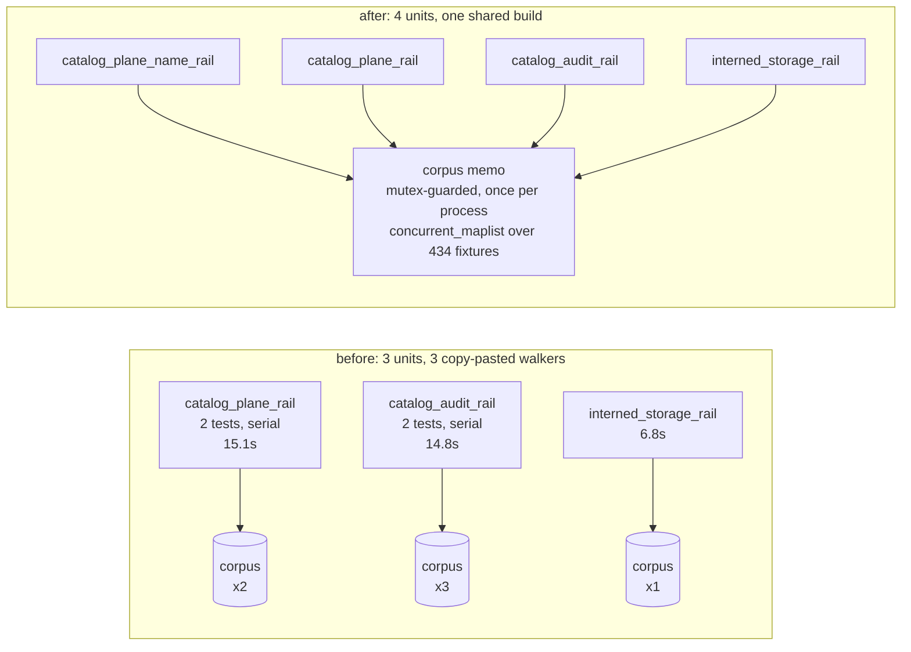

# catalog-rail-split

`just plunit` wall went from 12.6-16.4s to 5.1-5.9s. One file changed,
`v6/prolog/compile/test/plunit_tests.pl`. No compiler-internal change, no test
deleted, no assertion touched.

## TOC

1. [Why the unit was 12.6s](#1-why-the-unit-was-126s)
2. [The split shape](#2-the-split-shape)
3. [Faithfulness: what the memo had to preserve](#3-faithfulness-what-the-memo-had-to-preserve)
4. [Timing, 3 before and 3 after](#4-timing-3-before-and-3-after)
5. [Failing-set diff](#5-failing-set-diff)
6. [Fences honoured](#6-fences-honoured)

## 1. Why the unit was 12.6s

Not one expensive setup re-run and not many small compiles. Two tests, each an
independent full walk of the 65-file conformance corpus, each paying
`program_plan` + `lower_program` per fixture, and plunit runs tests inside a
unit serially.

Measured on the corpus (`swipl` probe, worktree at e5fcdf55a):

| phase | fixtures in | solutions out | wall |
|---|---|---|---|
| read 65 fixture files | 65 files | 434 fixtures | 11 ms |
| `program_plan/3` | 434 | 1310 plans | 2.64 s |
| `lower_program/2` | 1310 | 1246 lowerings | 3.75 s |
| `catalog_all_rows/10` leg | 1310 | 1266 row sets | 4.31 s |

`program_plan/3` is nondeterministic: 351 of the 434 fixtures yield more than
one plan, so a corpus walk is 1310 plans, not 434.

Three other units walk the same corpus the same way, with copy-pasted walkers:

| unit | test | walks | wall (before) |
|---|---|---|---|
| catalog_plane_rail | plane_rows_name_every_emitted_plane_table | 1 | 7.16 s |
| catalog_plane_rail | level_plane_family_corpus_counts | 1 | 7.95 s |
| catalog_audit_rail | no_audit_row_names_a_plane_or_table | 1 | 4.81 s |
| catalog_audit_rail | the_audit_reads_the_corpus_it_scans | 2 | 9.99 s |
| interned_storage_rail | no_character_literal_lands_in_an_integer_column | 1 | 6.79 s |

Six corpus compiles per battery, 36 s of the 44 s of CPU the whole battery
burned. Under `jobs(12)` they ran as six concurrent compiles of one corpus.

## 2. The split shape



Two moves, both in `plunit_tests.pl`:

**a. One corpus memo at file level** (new section between `catalog_g1` and the
plane rail, `plunit_tests.pl:1622`). A `dynamic corpus_memo_fixtures/1` filled
exactly once per process behind `with_mutex/2`, double-checked inside the
mutex, built with `concurrent_maplist/3` over the 434 fixture terms. Three
projections read it, and they are file level rather than unit level so every
rail sees the one build:

| predicate | replaces | in unit |
|---|---|---|
| `corpus_plan_lowered/3` | unit-local walker | catalog_plane_name_rail, catalog_plane_rail |
| `corpus_lowered/2` | unit-local walker | interned_storage_rail |
| `corpus_audit_rows/1` | `catalog_audit_corpus_rows/1`'s walker | catalog_audit_rail |

Deleted as dead: `corpus_path/1`, `rail_fixture_terms/2`,
`catalog_audit_corpus_path/1`, `audit_fixture_terms/2`,
`catalog_audit_all_rows/2` (moved to file level as
`corpus_memo_audit_rows/2`), `fixture_file_path/1`, `fixture_terms/2`.

Thread safety per failure-modes 59: units run on worker threads, so a plain
`dynamic` would be one clause store shared by every worker. The mutex plus the
inside-the-mutex re-check is the rail. The parallel build's own worker threads
are fine because `parse_dl_dcg.pl`'s scratch facts are `thread_local` and the
compiler's globals are `nb_setval`/`b_setval`, which are per-thread in SWI. No
`gensym` or shared counter exists in `compile/*.pl`, verified by grep, and the
parallel build was checked variant-equal to the serial one.

**b. catalog_plane_rail split in two.** plunit schedules one UNIT per worker, so
two independent 7s corpus reads in one unit was a serial 15s block:

| unit | test |
|---|---|
| `catalog_plane_name_rail` (new) | `plane_rows_name_every_emitted_plane_table` + `ddl_created_plane/2`, `created_name/2`, `plane_name/1`, `catalog_plane_local_names/2`, `plane_kind/1` |
| `catalog_plane_rail` (kept) | `level_plane_family_corpus_counts` + `corpus_plane_kind_counts/1`, `count_1/3` |

The known-red test keeps its unit, so its canonical `unit:name` in the FAIL
receipt is byte-identical. Unit count 80 -> 81; declared test count 936
unchanged.

## 3. Faithfulness: what the memo had to preserve

Two properties, both of which a naive memo breaks:

1. **`program_plan/3` is nondeterministic.** The memo keeps the whole solution
   SEQUENCE, in corpus order, never `once/1`. A `once/1` would have silently
   dropped 876 of the 1310 plans the rails walk today.
2. **Each rail wrapped `program_plan` AND its own second leg in ONE `catch/3`,**
   so a throw out of the second leg cut that fixture's remaining plans.
   `corpus_memo_leg/3` reproduces that cut per leg. It is why the lowering leg
   yields 1246 rows while the audit leg reads 1266 off the same plan list. A
   memo with one shared cut read 1246 on both legs, which is the shape I
   measured and rejected before landing this one.

Verification, both directions:

- Solution-sequence equality: the memo's `plan_lowered` and `audit_rows`
  sequences compared `=@=` against the original walkers' sequences, in one
  process. Both MATCH.
- Same four readings taken in the pre-change main tree and the post-change
  worktree:

| reading | main tree (e5fcdf55a) | worktree |
|---|---|---|
| `corpus_plane_kind_counts/1` | `[scope-192, refcount-1608, refcount_staging-1608, expand-56, dred-84, avg_accumulator-8]` | identical |
| audit row sets | 1266 | 1266 |
| `corpus_plan_lowered/3` solutions | 1246 | 1246 |
| `corpus_lowered/2` solutions | 1246 | 1246 |

## 4. Timing, 3 before and 3 after

`cd v6 && just plunit`, default `PLUNIT_JOBS` (12) on this machine.

| run | before wall | before real | after wall | after real |
|---|---|---|---|---|
| 1 | 15.15 s | 16.38 s | 5.24 s | 5.64 s |
| 2 | 12.60 s | 12.93 s | 5.60 s | 5.93 s |
| 3 | 12.64 s | 12.95 s | 5.06 s | 5.37 s |

CPU: `user` 43.95 s -> 29.89 s.

Slowest units, run 1 of each:

| unit | before | after |
|---|---|---|
| catalog_plane_rail | 15.10 s | 4.75 s |
| catalog_plane_name_rail | n/a | 4.98 s |
| catalog_audit_rail | 14.79 s | 2.37 s |
| interned_storage_rail | 6.81 s | 4.45 s |
| rel_template_and_is_clause | 4.42 s | 4.83 s |
| type_relation_ir | 2.42 s | 3.48 s |

The four corpus rails now all read ~2.4-5.0 s because they race for the memo
mutex and the losers block on the winner's build; the build itself is the whole
of that time and it happens once. The battery's new floor is
`rel_template_and_is_clause` at 4.8 s, which is a different unit and out of this
lane's scope.

`PLUNIT_JOBS=1` was also run: 936 declared, 982 results, 974 passed, the same 8
failed, wall 18.91 s.

## 5. Failing-set diff

Empty. Union of the FAIL lines across the three before runs, diffed against the
union across the three after runs:

```
FAIL catalog_plane_rail:level_plane_family_corpus_counts
FAIL json_merge_patch:json_patch_lowers_with_the_null_stand_in_guard
FAIL json_merge_patch:merge_patch_stops_on_a_nested_json_null_stand_in
FAIL json_merge_patch:merge_patch_stops_on_the_json_null_stand_in
FAIL module_path_decls:a_zero_column_childs_name_used_as_a_value_is_not_rewritten
FAIL rel_template_and_is_clause:a_relation_arrow_prints_the_equivalent_explicit_declaration
FAIL rel_zero_arity:a_root_rel_zero_still_has_no_storage
FAIL subscribe_cone:golden_flex_cone_invariants
```

8 names, identical in all six runs and in the `PLUNIT_JOBS=1` run.
`declared=936 results=982 passed=974 failed=8 timeout=0` in every run, before
and after.

The two former `catalog_plane_rail` tests, one by one:

| test | before | after |
|---|---|---|
| `plane_rows_name_every_emitted_plane_table` | passed (7.158 s) | passed (4.977 s), unit renamed to `catalog_plane_name_rail` |
| `level_plane_family_corpus_counts` | failed (7.946 s) | failed (4.754 s), same unit, same reason |

## 6. Fences honoured

- `run_plunit.pl` untouched.
- No compiler-internal file touched; the only changed file is
  `v6/prolog/compile/test/plunit_tests.pl`.
- None of the 8 known-red test clauses was edited. `level_plane_family_corpus_counts`
  keeps its body, its unit and its expected-counts list verbatim; only its
  helper's data source moved, and the helper returns the identical list
  (section 3).
- One contact point with fix/test-estate-green worth naming: if that lane
  re-points `corpus_plane_kind_counts/1` while fixing the counts test, this
  change edits the same neighbourhood. The test clause itself is untouched, so
  a textual conflict is confined to the helper.
