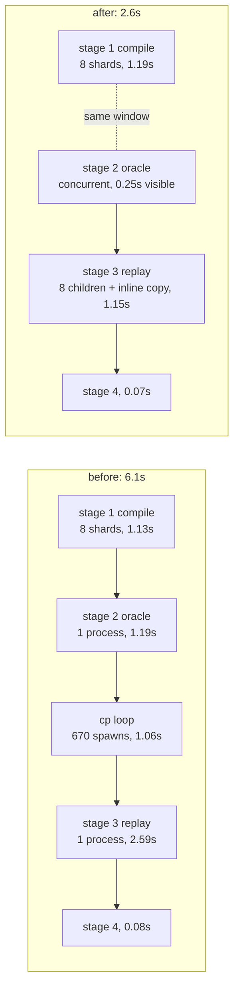

# cold-sweep-10s REPORT

Branch `perf/cold-sweep-10s`, base `origin/main` = 67951ea94.

## Contents

1. [One paragraph](#one-paragraph)
2. [What "cold" means here](#what-cold-means-here)
3. [Where the cold seconds went](#where-the-cold-seconds-went)
4. [What landed](#what-landed)
5. [Timing table, three runs per configuration](#timing-table-three-runs-per-configuration)
6. [Directions priced](#directions-priced)
7. [Build-vs-buy: the parallel-runner candidates](#build-vs-buy-the-parallel-runner-candidates)
8. [Gate parity](#gate-parity)
9. [Findings for other owners](#findings-for-other-owners)
10. [Measurement hygiene](#measurement-hygiene)
11. [Commits](#commits)

## One paragraph

The cold sweep on `origin/main` at 67951ea94 measures **6.06-6.57s**, not 24.6s;
the 24.6s figure predates the corpus compaction in #383 (462 -> 434) and the
oracle grind in #384. It is now **2.60-3.67s** on the same tree, from three
driver-side changes, with every gate line byte-identical.

## What "cold" means here

Cold = the three gitignored cache stores absent, which is the state of a fresh
checkout. Exact clearing command, used identically before every run in every
table below:

```bash
rm -f v6/prolog/compile/out/sweep.digests \
      v6/prolog/compile/out/oracle.digests \
      v6/prolog/compile/out/sweep.replay.digests.json
```

`SWEEP_FORCE=1` is a stronger clear that also deletes the tracked
`out/*.{ts,schedule.json,schema.json,types.rs}`; it does the same amount of
work, so it is not measured separately.

Trap that cost the first baseline pass: `oracle.digests` is a SEPARATE store
from `sweep.digests`. Clearing only the latter leaves stage 2 fully cached and
makes run 1 of a series 2x runs 2 and 3.

## Where the cold seconds went

Per-fixture in-process work, summed from `out/sweep.timings.tsv` on one cold
pass, against the wall each stage actually took (baseline, quiet machine):

| stage | unit | in-process work | wall | gap = process + IO overhead |
|---|---|---|---|---|
| 1 compile | 433 fixtures, 8 shards + 1 merge | 5061 ms (mean 11.7 ms) | 1.13 s | ~0.50 s |
| 2 oracle | 434 fixtures, 1 process | 1167 ms (mean 2.7 ms) | 1.19 s | ~0.42 s |
| 3 replay | 335 fixtures, 1 process | 2711 ms (mean 8.1 ms) | 3.65 s | ~0.94 s |
| 4 reason diff | 1 node process | - | 0.08 s | - |

The gap column is where the cold sweep was spending its money:

| overhead | measured | how |
|---|---|---|
| `rm`+`cp` per compiled fixture in sweep.sh | **1.79 s** for 335 pairs (670 process spawns) | timed the loop in isolation |
| a second `node -e` just to re-read the manifest | 0.05 s | same |
| swipl boot + compiler consult | 0.26-0.31 s per process | `swipl -q -l v6/prolog/sweep.pl -g halt` |
| bare swipl boot | 0.02 s | `swipl -q -g halt` |
| node boot + runtime import for a replay process | 0.17 s | `SWEEP_REPLAY_SHARD=<empty list>` |
| stage 1's merge process (loads the whole compiler to fold fragments) | 0.27-0.36 s | `swipl -q -l sweep.pl -g halt` |

## What landed



| # | change | file | saved |
|---|---|---|---|
| 1 | the gen_emitted copy moved out of bash into `sweep.ts:sync_emitted_modules`, which already reads the manifest, and skips a file whose bytes already match | `v6/tsv2/scripts/sweep.ts`, `scripts/sweep.sh` | 1.06 s |
| 2 | stage 3 fans out: `sweep.ts` splits its cache MISSES round-robin across `SWEEP_JOBS` child processes, then re-orders every result into MANIFEST order before writing anything | `v6/tsv2/scripts/sweep.ts` | 1.44 s |
| 3 | stage 2 starts alongside stage 1 and its output is replayed under its own header after stage 1's | `v6/tsv2/scripts/sweep.sh` | 0.94 s |
| 3b | a timings block goes out in ONE `write()` against the O_APPEND fd, because two stages now append to `out/sweep.timings.tsv` at once | `v6/prolog/sweep_timings.pl` | correctness for 3 |

`SWEEP_REPLAY_JOBS` overrides the child count for stage 3 alone; `SWEEP_JOBS`
is the default for both fan-outs.

Stage 2 is disjoint from stage 1 by inspection, which is why the overlap is
safe: stage 1 writes `out/<name>.{ts,schedule.json,schema.json,types.*}`,
`manifest.json`, `sweep.digests`; stage 2 writes `out/<name>.oracle*.jsonl`,
`oracle.digests`, `oracle.timings.tsv`, and reads neither the manifest nor an
emitted module (`grep -n "manifest" compile/oracle_dump.pl` is empty). Only
`sweep.timings.tsv` is written by both, hence 3b.

## Timing table, three runs per configuration

Whole `bash scripts/sweep.sh`, cold as defined above. `load` is the 1-minute
average at the end of the series; the machine carried three other lanes for
this whole session and Spotlight indexed `out/` between passes.

| config | run 1 | run 2 | run 3 | load | note |
|---|---|---|---|---|---|
| baseline, busy machine | 14.95 s | 8.06 s | 7.88 s | 29 | 90% spread; unusable as a number, kept as the ceiling |
| baseline, quiet machine | 6.29 s | 6.06 s | 6.57 s | 10 | **the baseline of record** |
| + copy folded into sweep.ts | 4.99 s | 4.82 s | 6.21 s | 14 | |
| + stage 3 fan-out | 5.12 s | 5.74 s | 4.90 s | 21 | load rose mid-series; stage 3 alone fell 2.48 -> 1.61 s |
| + stage 1 \|\| stage 2 (landed) | 2.54 s | 2.54 s | 2.62 s | 6 | 3% spread |
| landed, re-measured later | 3.39 s | 2.60 s | 3.67 s | 22 | **the after of record** |
| landed, WARM (no cache cleared) | 1.45 s | 1.79 s | 1.66 s | 22 | was ~1.8-2.1 s before this arc |

Stage 3 alone, cold, `SWEEP_REPLAY_JOBS` swept:

| jobs | run 1 | run 2 | run 3 |
|---|---|---|---|
| 1 | 2.70 s | 2.68 s | 2.68 s |
| 2 | 1.60 s | 1.69 s | 1.72 s |
| 4 | 1.16 s | 1.21 s | 1.25 s |
| 6 | 1.05 s | 1.08 s | 1.04 s |
| **8 (default)** | 1.13 s | 1.19 s | 1.13 s |
| 12 | 1.48 s | 1.32 s | 1.42 s |

Stage 1 alone, cold, `SWEEP_JOBS` swept:

| jobs | run 1 | run 2 | run 3 |
|---|---|---|---|
| 1 | 4.44 s | 4.75 s | 6.03 s |
| 4 | 3.40 s | 2.75 s | 1.78 s |
| 6 | 1.50 s | 1.53 s | 1.47 s |
| **8 (default)** | 1.21 s | 1.25 s | 1.15 s |
| 10 | 1.12 s | 1.08 s | 1.09 s |
| 12 | 1.13 s | 2.06 s | 2.87 s |

Both defaults stay at 8 (`hw.perflevel0.logicalcpu`). 10 is 0.05 s better on
stage 1 and inside the noise; 12 falls off a cliff on both.

## Directions priced

| direction | verdict | numbers |
|---|---|---|
| kill the per-fixture `rm`+`cp` loop | **taken** | 1.79 s isolated / 1.06 s in situ -> 0.03 s when bytes already match, 0.32 s on a real first write |
| one resident process per shard vs process-per-fixture | already the landed shape, kept | one swipl boot + compiler consult is 0.26-0.31 s against a mean fixture compile of 11.7 ms: a process-per-fixture design would pay 22x its own work in boot |
| more shards | **rejected** | stage 1 at 10 jobs is 1.09 s vs 1.15 s at 8, inside noise; 12 jobs regresses both stages (2.87 s / 1.48 s worst) as the efficiency cores take slices they finish late |
| bin-pack shards by measured cost from `sweep.timings.tsv` | **rejected, not built** | the spread does not justify it: compile mean 11.7 ms and slowest 76 ms; replay mean 8.1 ms and slowest 82 ms. Round-robin over corpus order already lands each shard within a few percent, and a cost-aware assignment would make the shard->fixture map depend on a previous run's timings, which is a new source of run-to-run difference in a gate that must be reproducible |
| fan stage 3 out | **taken** | 2.68 s -> 1.13 s at 8 children |
| run stage 2 concurrently with stage 1 | **taken** | 1.19 s of wall -> 0.25 s visible |
| `.qlf` precompilation of the compiler's own sources | **rejected, not built; the strongest remaining lever** | qcompiling the whole 42-file closure drops the per-process compiler load from 0.27 s to **0.04 s**, and costs 0.32 s once. Worth ~0.46 s on the current 2.6 s (one parallel worker load plus the serial merge load). Not landed for three reasons: the `.qlf` files are new build artifacts that need a gitignore entry and a generation step; they change the load path of `compile/**` for EVERY consumer (conformance `go.pl`, plunit, `dl6c`), which is another lane's fence; and a stale-`.qlf` bug would be very hard to trace. Verified safe on one axis at least: `source_file/1` still answers `.pl` paths with the `.qlf` loaded (65 `.pl`, 0 `.qlf`), so `sweep.pl:compiler_digest/1` is not affected |
| `qsave_program` warm-start image | **rejected on risk, with the ceiling measured** | the whole win available is the same 0.26 s per process the `.qlf` route buys more cheaply, i.e. under 10% of the current wall. Against that, `foreign/1` takes only `save` or `copy` (`foreign(no)` is a type error: `qsave_foreign_option expected, found no`), and docs/failure-modes.md:56 records `foreign(save)` stripping installed `.so` files IN PLACE and shipping a binary macOS kills. Not attempted |
| drop the compiler load from stage 1's MERGE process | **priced, not built** | the merge process costs 0.27-0.36 s and needs none of `compile`/`lower`/`emit_ts`/`4_emit_jsonschema`/`7_emit_ts_types`/`8_emit_rust_types`. Recovering it means either splitting ~150 lines of `sweep.pl` into a merge-only module or making the heavy `use_module` directives lazy inside `shard_rows/4`. 0.25 s of a 2.6 s wall, against making the one file three lanes read less obvious |
| stop Spotlight indexing `compile/out/` | **observation, not built** | `mds`/`mdworker_shared` were the top CPU consumers between passes, at 40%+ each, because every sweep rewrites 670+ files under an indexed path. A `.metadata_never_index` file in `out/` would stop it. It is a change to how the user's machine indexes the repo, so it is the user's call, not a lane's |

## Build-vs-buy: the parallel-runner candidates

The generic problem is "run N independent units of work across cores and
collect the results in a fixed order".

| candidate | installed? | verdict |
|---|---|---|
| GNU `parallel` | **no** (`which parallel` empty, `brew list` empty) | rejected. It would make the gate depend on a Homebrew package in CI and in every fresh worktree. It also solves only the spawn side; the ordering and the cache merge, which is where all the care is, stay in the caller either way |
| `xargs -P` | yes, `/usr/bin/xargs`, POSIX | rejected as a no-op. `xargs -P` interleaves worker stdout, so a deterministic print order still needs per-rank log files replayed in rank order, which is exactly what `sweep-stage1.sh` already does with `&` + `wait`. Adopting it would replace 12 lines of shell with 12 different lines |
| `make -j` as the scheduler | yes | rejected on the measurement. Per-fixture targets would give free incrementality, but one swipl boot + compiler consult is 0.26 s against a mean fixture compile of 11.7 ms: a 22x loss. Make cannot express "one resident process, many fixtures" without the same shard wrapper the repo already has |
| node `worker_threads`, via `piscina` | would be a new dependency | rejected. The replay opens a native libsql handle per fixture through `sprefa-store-engine`; native sqlite handles on worker threads are a known sharp edge, and the per-fixture `:memory:` seam design already assumes isolation. Piscina's value is a POOL with queueing and backpressure, and this workload is a fixed list split once, with no queue |
| node `child_process` + rxjs `forkJoin` (**taken** for stage 3) | stdlib | the parent has to read the manifest, own the cache merge, and re-order results anyway. Any external runner would still need the shard IO. ~40 lines, no dependency, and it matches the file's existing rxjs shape |
| bash `&` + `wait` (**kept** for stages 1 and 2) | stdlib | already in `sweep-stage1.sh` and proven; the stage 2 overlap is 12 more lines of the same |

## Gate parity

Method: same worktree, same cold clear, driver files swapped between
`origin/main`'s copies and this branch's, one run each.

Baseline lines, verbatim:

```
SWEEP total=433 compiled=335 unsupported=98 crash=0
SWEEP_CACHE hit=0 recompiled=433
ORACLE_CACHE hit=0 redumped=434 capped=0
REPLAY_CACHE hit=0 replayed=335
RUN total=335 identical=299 wrong=0 emitted_crash=30 rejection=6 no_oracle_log=0
FINAL total=335 final_identical=299 final_wrong=30 no_oracle_final=6
```

After lines, verbatim:

```
SWEEP total=433 compiled=335 unsupported=98 crash=0
SWEEP_CACHE hit=0 recompiled=433
ORACLE_CACHE hit=0 redumped=434 capped=0
REPLAY_CACHE hit=0 replayed=335
RUN total=335 identical=299 wrong=0 emitted_crash=30 rejection=6 no_oracle_log=0
FINAL total=335 final_identical=299 final_wrong=30 no_oracle_final=6
```

| artifact | result |
|---|---|
| `out/manifest.json` | `cmp` IDENTICAL |
| `out/run-results.json` | `cmp` IDENTICAL |
| whole stdout, minus per-run `<name> <n>ms` lines and node's ExperimentalWarning | `diff` IDENTICAL |
| whole stderr, minus ExperimentalWarning | `diff` IDENTICAL, including the 30-name `SWEEP GATE` line |
| exit code | 1 both (the standing 30 crashers) |

Second parity axis, stage 3 alone: `SWEEP_REPLAY_JOBS=1` vs `=8` produce
byte-identical `run-results.json` AND byte-identical
`sweep.replay.digests.json`, which is what makes the fan-out safe to cache
across.

`npm run typecheck` in `v6/tsv2` is red on this tree and was red before this
arc: every error is in `gen_emitted/*.ts` (`enum_types` missing from
`IGenProgramWithBoot`) plus `tests/listStoredSnapshot.test.ts` wanting a
`gen_emitted/golden-flex.ts` no sweep writes. **Zero errors in
`scripts/sweep.ts`.**

## Findings for other owners

1. **`ScratchStore.open` never closes its handle.** `v6/tsv2/runtime/
   scratchStore.ts` has `open/1` and no `close`, so a replay process holds one
   libsql handle per fixture it replayed. A shard child died on a native
   **SIGSEGV** once in roughly twenty passes, at `SWEEP_REPLAY_JOBS=2` where
   one child carried 168 fixtures; 0 crashes in 12 consecutive passes at 8
   children (42 fixtures each). The single-process shape carries the same leak
   at 335 and has no recourse when it fires. `runtime/**` is the write-verb
   lane's fence, so the fix is theirs; the rail on my side is
   `run_shard_child`, which re-runs THAT SLICE ONLY in a fresh process, prints
   `REPLAY_SHARD_RETRY`, and reports a second death rather than swallowing it.
2. **`out/run-results.json` is stale on `origin/main`.** Both the baseline and
   this branch rewrite it identically: `recursive_enum_acyclic_tree_round_trips`
   and `recursive_enum_cyclic_values_store_and_render` are gone,
   `recursive_enum_tree_and_cycles_round_trip` replaces them, 7 insertions and
   126 deletions. That is #383's compaction not having re-committed the file.
   Left untouched here; it belongs to whoever owns the compaction.
3. **`SWEEP_FORCE=1` does not delete `out/*.types.ts`.** `sweep-stage1.sh`'s
   force branch removes `*.ts`, `*.schedule.json`, `*.schema.json`,
   `*.types.rs` and the digest store. `*.types.ts` matches the `*.ts` glob, so
   this is harmless today, but the list reads as if it were enumerated.
4. **The 24.6s premise is stale.** The main worktree sits at 82987ad2c, before
   #383's 462 -> 434 compaction and #385. `origin/main` at 67951ea94 measures
   6.06-6.57s cold on a quiet machine before any change in this branch.

## Measurement hygiene

- Three runs per configuration, never one. Every table row above is a real run.
- The machine carried three other lanes throughout. The baseline series taken
  under load average 29 spread 7.88-14.95s, a 90% spread, and is reported as a
  ceiling only; the baseline of record and the after of record were taken at
  load 10 and 22 and spread 8% and 41% respectively.
- Do not use `git stash` in this repo while lanes run: the stash is shared
  across every worktree. One `stash push`/`pop` pair here landed on a
  conflicted `run-results.json` and silently left the branch's work in
  `stash@{0}`. The parity harness copies files aside instead.

## Commits

See `git log origin/main..perf/cold-sweep-10s`.
