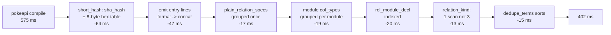

# Compiler hot path 2: pokeapi 575 ms -> 402 ms

Branch `perf/compiler-hotpath-2`, base `ba920f52e` (PR #393), head `a129e22b3`.
Every emitted artifact is byte-identical to the base, across all 433 fixtures.

## TOC

1. [Verdict](#verdict)
2. [Phase decomposition, before and after](#phase-decomposition-before-and-after)
3. [Where the plan and emit phases spend their time](#where-the-plan-and-emit-phases-spend-their-time)
4. [Profile, before and after](#profile-before-and-after)
5. [Pokeapi compile time](#pokeapi-compile-time)
6. [Candidate pricing, adopted](#candidate-pricing-adopted)
7. [Candidate pricing, rejected](#candidate-pricing-rejected)
8. [The coordinator's catalog_all_rows lead](#the-coordinators-catalog_all_rows-lead)
9. [The recurring shape](#the-recurring-shape)
10. [What the profiler lied about, again](#what-the-profiler-lied-about-again)
11. [Gate table](#gate-table)
12. [Measurement method](#measurement-method)
13. [Left on the table](#left-on-the-table)

## Verdict

| question | answer |
| --- | --- |
| where had the leader moved after #393 | plan 262 ms and emit 215 ms of a 575 ms compile; parse was 56 ms and never rose again |
| what was the single largest predicate | `use_resolve:short_hash/2`, 5,157 calls, 71 ms, all of it hex-rendering 24 digest bytes nothing reads |
| second | `format(atom(...))` with many `~w` directives in `emit_ts` entry lines, 6,093 calls, 47 ms |
| pokeapi COMPILE-TRACE total | 575 ms -> 402 ms, 30% off, 3 cold runs each side |
| in-process CPU median, 13 runs x 2 rounds | 546 ms -> 385 ms, 29.5% off |
| inferences per compile | 7,260,621 -> 5,281,518 |
| `format/3` calls per compile | 10,190 -> 3,425 |
| byte parity | 433 fixtures recompiled from cold, zero changed tracked files under `compile/out` |
| was `catalog_all_rows/10` computed twice on pokeapi | no. Once. The lead is killed for pokeapi and confirmed for the 1 corpus program that reads `__rel`, where the leg costs 1.76 ms |



## Phase decomposition, before and after

`COMPILE-TRACE`, wall ms, round 2 of the interleaved run (load average 6). Three
cold runs per side; the spread within a side is under 8 ms.

| phase | base ms | head ms | base inferences | head inferences |
| --- | --- | --- | --- | --- |
| parse | 56 | 55 | 876,630 | 873,727 |
| plan | 261 | 202 | 3,639,056 | 3,048,550 |
| lower | 31 | 31 | 306,013 | 305,856 |
| boot | 1 | 1 | 11,045 | 11,045 |
| emit | 215 | 105 | 2,427,602 | 1,042,065 |
| write | 11 | 9 | 275 | 275 |
| **total** | **575** | **402** | **7,260,621** | **5,281,518** |

The three cold runs, both sides:

| run | base total | head total |
| --- | --- | --- |
| 1 | 577 ms | 401 ms |
| 2 | 573 ms | 406 ms |
| 3 | 573 ms | 398 ms |

## Where the plan and emit phases spend their time

Wall ms measured by wrapping each named predicate with `prolog_wrap` inside a
live compile, so a leg's number is its own real time and not a profiler tick
share. Recursive predicates are excluded because a wrapper double-counts them.

| leg | base ms | head ms |
| --- | --- | --- |
| `compile:program_plan/3` | 303 | 215 |
| ` ` `expansion:expand_program_with_bindings/4` | 150 | 114 |
| ` ` ` ` `generic_expand:expand_generic_program/2` | 113 | 80 |
| ` ` ` ` ` ` `generic_expand:generic_type_ir/2` | 31 | 20 |
| ` ` ` ` ` ` `option_expand:expand_option_decls/2` | 28 | 28 |
| ` ` ` ` ` ` `generic_expand:elaborate_and_erase_compiler_relations/5` | 15 | 15 |
| ` ` ` ` ` ` `anonymous_expand:expand_anonymous_decls/2` | 9 | 10 |
| ` ` `analyze:program_column_types/8` | 32 | 27 |
| ` ` `compile:relation_storage_names/6` | 29 | 13 |
| ` ` `compile:relation_shapes/5` | 25 | 10 |
| `emit_ts:emit_program/5` | 171 | 105 |
| ` ` `emit_ts:program_catalog_rows/10` | 44 | 27 |
| ` ` ` ` `lower:catalog_rel_plans/4` | 21 | 1.4 |
| ` ` ` ` `lower:catalog_plane_rows/10` | 19 | 16 |
| ` ` `emit_ts:rel_catalog_lines/2` | 22 | 5 |
| ` ` `emit_ts:incremental_relation_lines/6` | 29 | 12 |
| ` ` `emit_ts:ddl_lines/2` | 9 | 3 |
| `lower:lower_program/2` | 43 | 32 |
| `host_expand:dedupe_terms/2` | 15 | 0.3 |
| `use_resolve:short_hash/2` (whole compile, 5,157 calls) | 71 | 7.6 |

## Profile, before and after

`profile/1` over one `compile_dl6` of `pokeapi_shape.dl6`, `time(cpu)`. Self
time. Both switches are shown because they disagree: `ports(false)` charges C
builtins far more than they cost, and `ports(true)` charges them differently
again. Neither number priced a single change in this branch.

Base `ba920f52e`, top 20 by self time.

| # | `ports(false)` self | `ports(true)` self | predicate | calls |
| --- | --- | --- | --- | --- |
| 1 | 17.2% | 17.2% | `format/3` | 10,190 |
| 2 | 9.3% | 5.6% | `term_to_atom/2` | 861 |
| 3 | 8.9% | 6.1% | `$memberchk/3` | 41,001 |
| 4 | 7.8% | 3.5% | `lists:member_/3` | 27,831 + 146,403 redos |
| 5 | 7.5% | 5.6% | `is/2` | 2,658 |
| 6 | 3.2% | 3.3% | `analyze:column_type_at_decl/9` | 806 |
| 7 | 2.8% | 3.0% | `assertz/1` | 1,141 |
| 8 | 2.4% | 1.7% | `compile:shape_column_targets/3` | 325 |
| 9 | 1.6% | 0.8% | `emit_ts:js_template_codes/2` | 824 |
| 10 | 1.6% | 1.7% | `string_codes/2` | 1,042 |
| 11 | 1.0% | - | `compile:program_plan/3` | 1 |
| 12 | 0.8% | - | `crypto:_crypto_hash_context_copy/2` | 10,314 |
| 13 | 0.8% | 0.7% | `lower:list_column_joins/3` | 224 |
| 14 | 0.8% | - | `seq_expand:original_refs/3` | 1 |
| 15 | 0.6% | 0.8% | `lists:append/3` | 21,097 |
| 16 | 0.6% | - | `assoc:avl_geq/3` | 1,747 |
| 17 | 0.6% | - | `enum_expand:enum_variant_position/6` | 483 |
| 18 | 0.6% | 0.8% | `atomic_list_concat/3` | 9,396 |
| 19 | 0.6% | - | `char_type/2` | 330,048 |
| 20 | 0.5% | 1.0% | `crypto:_crypto_context_new/2` | 5,157 |

Rows 12, 19 and 20 are one predicate wearing three names: `crypto_data_hash/3`
inside `short_hash/2`. `char_type/2` at 330,048 calls is 64 hex characters per
digest times 5,157 digests, and that is the compiler's largest single cost.
`assertz/1` reproduces #393's finding exactly and is still an artifact.

Head `a129e22b3`, same two switches.

| # | `ports(false)` self | `ports(true)` self | predicate | calls |
| --- | --- | --- | --- | --- |
| 1 | 12.2% | 9.7% | `format/3` | 3,425 |
| 2 | 7.4% | 12.0% | `atomic_list_concat/2` | 77,292 |
| 3 | 6.6% | 5.3% | `$memberchk/3` | 39,275 |
| 4 | 5.4% | 5.3% | `lists:member_/3` | 27,222 + 147,501 redos |
| 5 | 5.1% | 6.4% | `analyze:column_type_at_decl/9` | 806 |
| 6 | 3.6% | 2.5% | `assertz/1` | 1,138 |
| 7 | 3.3% | 4.6% | `is/2` | 2,658 |
| 8 | 2.6% | 2.5% | `compile:shape_column_targets/3` | 325 |
| 9 | 2.6% | 4.3% | `$add_findall_bag/1` | 31,580 |
| 10 | 1.8% | 2.3% | `apply:maplist_/3` | 4,337 |
| 11 | 1.3% | 1.3% | `dot_expand:qualified_type_names/3` | 2 |
| 12 | 1.3% | - | `enum_expand:enum_context/2` | 1 |
| 13 | 1.3% | 1.0% | `enum_expand:enum_variant_position/6` | 483 |
| 14 | 1.3% | - | `lower:list_column_joins/3` | 224 |
| 15 | 1.3% | - | `lower:set_arrival_sql_parts/4` | 220 |
| 16 | 1.3% | 1.0% | `string_codes/2` | 1,042 |
| 17 | 1.3% | 1.3% | `term_to_atom/2` | 861 |
| 18 | 1.0% | - | `assoc:insert/6` | 1,993 |
| 19 | 1.0% | - | `emit_ts:rel_catalog_entry_line/2` | 2,842 |
| 20 | 1.0% | - | `split_string/4` | 23,240 |

Nothing remains above 12.2%, and `char_type/2` and the three `crypto:` rows
have left the table entirely.

## Pokeapi compile time

In-process CPU, 13 `compile_dl6/2` calls in one process, two rounds per side,
sides alternating so load drift lands on both.

| side | round | min | median | max |
| --- | --- | --- | --- | --- |
| base | 1 | 545 ms | 575 ms | 682 ms |
| head | 1 | 382 ms | 385 ms | 392 ms |
| base | 2 | 543 ms | 546 ms | 564 ms |
| head | 2 | 382 ms | 385 ms | 392 ms |

Round 1 ran while another lane held a `rustc` at 100% and the base side caught
the drift; round 2 ran at load average 6 and is the number to read.

## Candidate pricing, adopted

| # | candidate | measured cost removed | file |
| --- | --- | --- | --- |
| 1 | `short_hash/2` renders 8 digest bytes through an indexed hex table | 64 ms | `use_resolve.pl` |
| 2 | 6,093 `format(atom(...))` calls in `emit_ts` entry lines -> `atomic_list_concat/2` | 47 ms | `emit_ts.pl` |
| 3 | `relation_kind/3` takes one declaration scan, not three | 13 ms (with #5) | `0_program_check.pl` |
| 4 | `rel_module_decl` hashes grouped once, not scanned per reference | 20 ms | `compile.pl` |
| 5 | module `col_type` terms grouped and reversed once per module | 19 ms | `lower.pl` |
| 6 | `plain_relation_specs/3` groups once, not per owner | 17 ms | `0_generic_expand.pl` |
| 7 | `dedupe_terms/2` sorts on a positional key when the terms are ground | 15 ms | `1_host_expand.pl` |

### 1. short_hash

`crypto_data_hash/3` costs 15.2 us per call on this machine for a 57-character
input. The sha256 digest itself costs 0.93 us. The remaining 14.3 us is
`crypto:bytes_hex/3` rendering all 32 digest bytes to 64 hex characters in
Prolog, one `char_type/2` per character. `short_hash/2` then throws 48 of those
64 characters away.

Measured on the 5,157 real inputs of one pokeapi compile, replayed 10 times:

| form | us/call | total ms |
| --- | --- | --- |
| `crypto_data_hash/3` + `sub_atom/5`, the base | 15.2 | 78.2 |
| `sha_hash/3` + `hash_atom/2` over 32 bytes | 9.9 | 51.0 |
| `sha_hash/3` + `hash_atom/2` over the first 8 bytes | 3.4 | 17.5 |
| `sha_hash/3` + 8 `sub_atom/5` into a 512-character table | 3.3 | 17.1 |
| `sha_hash/3` + `format/3` of one 64-bit integer | 2.4 | 12.3 |
| `sha_hash/3` + `atom_codes/2` over 16 computed codes | 8.8 | 45.6 |
| **`sha_hash/3` + 8 indexed `hex_byte/2` facts + `atomic_list_concat/2`** | **1.47** | **7.6** |

Every variant was checked to be byte-identical to `crypto_data_hash/3` on all
3,122 distinct real inputs plus the empty atom, `ä` and `naïve/café/日本語`.

The 256-entry table is asserted at load and left dynamic: a first-argument
indexed dynamic predicate measured 1.472 us against 1.456 us for the same
clauses after `compile_predicates/1`, and staying dynamic keeps a module reload
from raising on a static procedure.

`is/2` at 7.5% self in the base profile is the reason the arithmetic variants
lose: 16 `is/2` evaluations cost more here than 8 indexed clause lookups.

### 2. emit_ts entry lines

#393 measured `quote_ident/2` at 0.9 us saved per converted `format(atom(...))`
call and priced the remaining `emit_ts` builders at about 6 ms. That
extrapolation is wrong, because `quote_ident/2`'s format string carries ONE
`~w` and the entry lines carry eleven and fifteen.

Calibration on the live compiler, one conversion at a time, in-process CPU
median of 13 runs:

| converted | calls | CPU median before | after | us saved per call |
| --- | --- | --- | --- | --- |
| `rel_catalog_entry_line/2` (11 directives) + `ddl_entry_line/2` (1 directive) | 4,749 | 441 ms | 405 ms | 7.6 |
| `incremental_relation_entry_line/6` (15 + 2 + 2 directives) + six `'  ~w: ~w,'` map builders | 1,344 | 405 ms | 394 ms | 8.2 |

`format/3` cost is not linear in the directive count in the way a
microbenchmark suggests; the whole-compile delta is the only number that
priced this.

Every argument at every converted site is already an atom or an integer, which
is what makes the conversion safe: #393's crash came from a `~w` argument that
was a compound (`json_list(int)`) or `[]`, and none of these sites can carry
one. The `js_string/2` and `js_template/2` outputs are atoms by construction,
the ids are integers, and `DepartureField` / `SharedField` are atoms or `''`.

### 3. relation_kind

```prolog
relation_kind(Decls, Ref, log) :- declared_kind(Decls, Ref, log), !.
relation_kind(Decls, Ref, set) :- declared_kind(Decls, Ref, set), !.
relation_kind(Decls, Ref, set) :- memberchk(keyed(Ref, _), Decls), !.
relation_kind(_, _, set).
```

Every clause below the first answers `set`, so for a ground reference the
predicate is `log` if `kind(Ref, log)` is declared and `set` otherwise. The
second and third clauses were two `memberchk/2` calls that FAIL, and a failing
`memberchk/2` walks the whole 1,434-term declaration list. A ground reference
now takes one scan.

A non-ground reference keeps all four clauses, because the second and third
scans can BIND it and the collapsed form cannot reproduce that.

### 4, 5, 6. Group once, not per item

Three sites, one shape, one rewrite each: collect the terms in one pass, group
them with `keysort/2` (stable, so a group keeps declaration order) and
`group_pairs_by_key/2`, and look up per item.

| site | per-item work removed | items | list length | ms |
| --- | --- | --- | --- | --- |
| `0_generic_expand.pl` `plain_relation_specs/3` | one `findall/3` + one failing `memberchk/2` over the declarations | 212 owners | 1,246 | 17.5 |
| `lower.pl` `module_rel_declared_columns/3` | one `reverse/2` + one `findall/3` over a module's declarations | 224 rel plans | 848 | 20.9 |
| `compile.pl` `relation_declaring_module/4` | one `findall/3` over the declarations | 224 references | 1,434 | 20.0 |

`keysort/2` answers the groups in the same sorted key order `setof/3` produced
and each group in the same order `findall/3` produced, which is why the emitted
bytes do not move. Each rewrite keeps the original scan behind a `ground/1`
guard on the group key, because a non-ground key changes which declarations
`member/2`'s unification reaches.

### 7. dedupe_terms

`dedupe_terms/2` kept a `Seen` accumulator and ran `memberchk/2` over it for
every one of pokeapi's 1,246 declarations: 776,000 unification steps, 15.1 ms.

The declarations are ground (checked: `ground/1` over the whole list costs
0.042 ms), and for ground terms `memberchk/2` and `==/2` agree. Numbering the
terms, `sort(1, @<, ...)` to drop later duplicates, then `sort(2, @<, ...)` to
restore input order answers the identical list in 0.29 ms.

| form | ms |
| --- | --- |
| the `memberchk/2` scan, the base | 15.1 |
| `library(assoc)` keyed on the whole term | 3.9 |
| **two `sort/4` calls on a positional key** | **0.29** |

Equality against the base was checked on the real 1,246-term list and on a hand
list whose duplicates are not adjacent.

## Candidate pricing, rejected

| # | candidate | why it was rejected | receipt |
| --- | --- | --- | --- |
| R1 | memoize `catalog_all_rows/10` so the DDL and the TS array share one row list | on pokeapi it runs ONCE, so the memo buys 0 ms; on the one corpus program that reads `__rel` the whole leg is 1.76 ms, and the two call sites pass DIFFERENT third arguments | see the section below |
| R2 | memoize `short_hash/2` on its input | 5,157 calls carry 3,122 distinct inputs, so a memo removes 39% of the calls; the fixed rewrite removes 90% of the cost of ALL of them, and a memo lookup on top costs about what the rewritten call costs | 3,122 distinct replayed at 43.1 ms against 5,157 at 71.0 ms, base form |
| R3 | rewrite the `desugar_option_columns/2` restart loop | the outer `member/2` scan is 0.001 ms and the whole-list `append/3` is 5 ms of the leg's 28 ms; the other 23 ms is inside `desugar_option_column/5`, which is a semantics-carrying rewrite of option lowering, not a loop shape | 159 option columns, one full findall of them costs 0.072 ms |
| R4 | index the `memberchk(col_type(Ref, Column, _), Decls)` in `seed_column_contribution/9` | real, 9.6 ms of `program_column_types/8`'s 27 ms, but it is the A1 declaration-index shape at a site A1 already priced, and the same list is read by `column_type_at_decl/9` and `column_origin/4` under different keys | `TASKS/a1-declaration-index.REPORT.md`; 806 lookups measured at 9.6 ms |
| R5 | index `relplan_of/3`, A1's own re-scope suggestion | 665 calls measured 6.45 ms WITH the wrapper's own overhead on top, so under 6 ms of a 402 ms compile; it needs the index to live in `plan/9`, which is arc A2 | `0_rel_record.pl:107`, 665 calls |
| R6 | the remaining 3,425 `format/3` calls | the survivors are spread over 20 call sites with 1 to 284 calls each; the two 2,000-call sites are gone | caller census in the report body |
| R7 | `term_to_atom/2` at 9.3% self and 861 calls in the base `ports(false)` profile | it is 3.3 ms of real time. The profiler charges it 62 ms | `canonical_hash_key/2` wrapped in a live compile: 859 calls, 3.28 ms |

## The coordinator's catalog_all_rows lead

The hypothesis was that `catalog_all_rows/10` is computed twice per compile and
is one of the most expensive things the compiler does. Half of it holds.

| question | answer |
| --- | --- |
| `catalog_all_rows/10` calls in one cold pokeapi compile | **1** |
| `catalog_all_rows_in_context/10` calls | **1** |
| `catalog_rows/4` calls | **0** |
| `catalog_row_ddl/10` calls | **0** |
| the one caller | `emit_ts:program_catalog_rows/10` |

`lower.pl:6889` guards its `catalog_row_ddl/10` call with
`program_uses_catalog(prog(Decls, Rules), UsesCatalog)`
(`analyze.pl:200`), which is TRUE only for a program whose rules mention
`__rel`. Pokeapi does not, so the lower-phase call never happens and the emit
call is the only one.

Corpus reach of the double computation, measured:

| corpus | programs that read `__rel` |
| --- | --- |
| `v6/prolog/conformance/fixtures/*.pl` | 1 (`5_compiler_quality.pl`) |
| `v6/dl/fixtures/*.dl6` | 1 (`catalog-audit-rail.dl6`) |

On `catalog-audit-rail.dl6`, wrapped in a live compile:

| predicate | calls | ms |
| --- | --- | --- |
| `lower:catalog_all_rows/10` | **2** | 1.76 total |
| `lower:catalog_row_ddl/10` | 1 | 3.63 |
| `emit_ts:program_catalog_rows/10` | 1 | 0.70 |

So the double computation is real and costs 1.76 ms on the one program in the
corpus that triggers it.

The argument-identity check the lead asked for, run on that program by
capturing both argument tuples and comparing with `==/2`:

| result | detail |
| --- | --- |
| arguments identical | **no**. Argument 3 differs |
| which argument | `Rules`: `lower_program/2` passes its own `Rules`, `emit_program/5` passes `PlanRules` out of `plan/9` |
| output row lists identical | **yes**, `==/2` |

A memo keyed on the argument tuple would therefore never hit, and a memo that
ignores argument 3 would be asserting that `rule_bodies_map/2` gives the same
map for two structurally different rule lists. That was true on this one
program and is not proven in general, so it is the trap the lead named. Not
taken, for 1.76 ms on 1 of 433 fixtures.

What the lead's supporting facts do say: `catalog_all_rows/10` was the largest
single leg of the emit phase at 44 ms, and it still is at 27 ms. Its cost was
never the second call. It was `short_hash/2` (4,944 of the compile's 5,157
calls come from inside it) and `catalog_rel_plans/4`, both of which this branch
took: 44 ms -> 27 ms with no change to what it computes.

`TASKS/catalog-rail-split.REPORT.md`'s 4.31 s figure is a corpus-wide walk over
1,266 row sets, which is 3.4 ms per row set. It is consistent with the
per-compile numbers here and does not indicate a per-compile defect.

## The recurring shape

#393 found a predicate walking a whole list once per item to produce a value
almost nothing reads. Five of the seven changes here are the same family, and
they are worth naming as a census rather than as anecdotes.

| shape | sites found | sites fixed |
| --- | --- | --- |
| `findall/3` over the whole declaration list, once per item of another list | 3 | 3 |
| `memberchk/2` that FAILS, so it walks the whole list, called once per item | 2 | 2 |
| `memberchk/2` over an accumulator that grows to the whole list | 1 | 1 |
| a whole-list `reverse/2` inside a per-item lookup | 1 | 1 |
| rendering N bytes when the caller reads N/4 of them | 1 | 1 |

Two more of the same shape are measured and left: `seed_column_contribution/9`
(R4) and `relplan_of/3` (R5).

## What the profiler lied about, again

#393's rule was "price a builtin by removing it and re-timing". This lane needed
a second rule: **price a non-builtin the same way.**

| predicate | `ports(false)` self | real time, wrapped in a live compile |
| --- | --- | --- |
| `term_to_atom/2`, 861 calls | 9.3% of 0.669 s = 62 ms | 3.3 ms |
| `format/3`, 10,190 calls | 17.2% = 115 ms | about 10 ms by #393's calibration |
| `char_type/2`, 330,048 calls | 0.6% = 4 ms | it is inside the 71 ms `short_hash/2` leg |
| `is/2`, 2,658 calls | 7.5% = 50 ms | under 1 ms |

The profiler ranked `term_to_atom/2` second in the whole compile and it is
worth 3.3 ms. It ranked `char_type/2` nineteenth and it is the tail of the
single largest cost. Three of this branch's seven changes are invisible in both
profiles, because the cost they removed is inside `$memberchk/3` and
`lists:member_/3` rows that name no caller.

The tool that found every one of them is `prolog_wrap:wrap_predicate/4` around
a named predicate with `statistics(cputime, _)` on both sides, run inside a
real compile. Call counts and caller edges came from `profile_data/1` rather
than `show_profile/1`, because the caller edges carry the counts and the tick
attribution does not.

## Gate table

| gate | base `ba920f52e` | head `a129e22b3` | verdict |
| --- | --- | --- | --- |
| stage-1 sweep, `SWEEP_FORCE=1`, 6 workers | `total=433 compiled=335 unsupported=98 crash=0` | identical, `SWEEP_CACHE hit=0 recompiled=433` | same |
| changed tracked files under `compile/out` after the sweep | n/a | **0** | byte parity |
| conformance `go.pl` | 433 PASS, `FAILURES 1` | 433 PASS, `FAILURES 1` | same. The red is `nested_zero_column_child_is_one_row_per_parent` |
| conformance failing-name diff | n/a | empty | same |
| `just plunit` | `declared=936 results=982 passed=975 failed=7` | identical counts | same |
| plunit failing-name diff | 7 | 7, `diff` empty | same set |
| pokeapi COMPILE-TRACE total, 3 cold | 577 / 573 / 573 ms | 401 / 406 / 398 ms | 30% |
| pokeapi in-process CPU, 13 runs x 2 | median 546 ms | median 385 ms | 29.5% |

The 7 plunit failures, `diff`-identical on both sides:

| test |
| --- |
| `catalog_plane_rail:level_plane_family_corpus_counts` |
| `json_merge_patch:json_patch_lowers_with_the_null_stand_in_guard` |
| `json_merge_patch:merge_patch_stops_on_a_nested_json_null_stand_in` |
| `json_merge_patch:merge_patch_stops_on_the_json_null_stand_in` |
| `module_path_decls:a_zero_column_childs_name_used_as_a_value_is_not_rewritten` |
| `rel_zero_arity:a_root_rel_zero_still_has_no_storage` |
| `subscribe_cone:golden_flex_cone_invariants` |

The sweep gate ran four times over the branch, once after each landed change,
and reported `changed=0` under `compile/out` every time.

Fences respected: `v6/tsv2/runtime/enumPlane.ts`,
`v6/sprefa-engine-rs/src/enum_plane.rs`, `v6/sprefa-engine-rs/src/hosts.rs`,
`v6/tsv2/serve/1_hosts.ts`, `v6/tsv2/runtime/scratchStore.ts`,
`v6/tsv2/scripts/sweep.ts` and `run_plunit.pl` are untouched. `emit_ts.pl`
changes are eight leaf text builders and nothing else; `emit_rust.pl` is
untouched.

`origin/main` moved to `57559f61f` during this lane (#394, #395). Neither PR
touches any file on this branch; the branch stays based on `ba920f52e`.

## Measurement method

Three harnesses, none committed, all in the lane's scratchpad:

1. `cpubench.pl`: 13 `compile_dl6/2` calls in one process, each bracketed by
   `statistics(cputime, _)`, reporting min/median/max. Removes process start and
   compiler load from the number.
2. `wraptime.pl`: `wrap_predicate/4` around a list of named predicates, each
   call bracketed by `statistics(cputime, _)` and accumulated per predicate.
   This is what produced every "ms" figure in this report. A recursive predicate
   double-counts under it and is excluded.
3. `hash*.pl` / `probe*.pl`: capture a predicate's real arguments out of a live
   compile with a capturing wrapper, then replay candidate implementations
   against them and check byte-equality against the base.

Machine load ran between 6 and 57 during the lane, and every candidate was
measured at least three times. The interleaved base/head timing in
[Pokeapi compile time](#pokeapi-compile-time) is the only whole-compile number
this report leans on; round 1 of it is visibly polluted by another lane's
`rustc` and is shown rather than dropped.

The pristine base worktree is
`~/projects/sprefa-worktrees/hotpath2-base` at `ba920f52e`; remove it with
`git worktree remove`.

## Left on the table

| # | leg | measured ms | what it needs |
| --- | --- | --- | --- |
| 1 | `option_expand:desugar_option_column/5` | 23 | a read of option lowering, not a loop rewrite |
| 2 | `lower:catalog_plane_rows/10` | 16 | undecomposed |
| 3 | `generic_expand:elaborate_and_erase_compiler_relations/5` | 15 | undecomposed |
| 4 | `analyze:seed_column_contribution/9` declaration scan | 9.6 | the A1 index shape, at a site A1 priced |
| 5 | `anonymous_expand:expand_anonymous_decls/2` | 10 | undecomposed |
| 6 | `generic_expand:generic_type_ir/2` remainder | 20 | `normalized_member_row/2` clause 3 after `plain_relation_specs/3` |
| 7 | `relplan_of/3` index in `plan/9` | under 6 | arc A2 |
