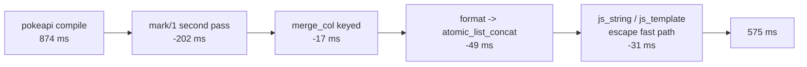

# Compiler hot path: pokeapi 874ms -> 575ms

Branch `perf/compiler-hotpath`, base `e5fcdf55a`, commit `f18f5b606`.
Every emitted artifact is byte-identical to the base.

## TOC

1. [Verdict](#verdict)
2. [Where the time went](#where-the-time-went)
3. [Profile, before and after](#profile-before-and-after)
4. [Per-phase timing](#per-phase-timing)
5. [Pokeapi compile time, 3 + 3](#pokeapi-compile-time-3--3)
6. [Candidate pricing, adopted](#candidate-pricing-adopted)
7. [Candidate pricing, rejected](#candidate-pricing-rejected)
8. [What the profiler lied about](#what-the-profiler-lied-about)
9. [Gate table](#gate-table)
10. [Fence overlap](#fence-overlap)
11. [Measurement method](#measurement-method)

## Verdict

| question | answer |
| --- | --- |
| was `format/3` 28.2% self, 73,002 calls | reproduced: 28.5% self, 73,010 calls at `e5fcdf55a` |
| was `assertz/1` 13.1% self | reproduced as a profiler artifact. The 1,141 asserts cost 1.75ms of real time |
| what was the real largest cost | `mark/1` in the DCG parser: `length/2` over the whole remaining input, 7,341 times per parse, 202ms |
| pokeapi compile wall | 874ms -> 575ms, 34% off, three runs each side |
| inferences per compile | 8,315,870 -> 7,260,621 |
| `format/3` calls per compile | 73,010 -> 10,190 |
| byte parity | 433 fixtures recompiled from cold, zero changed tracked files under `compile/out` |



## Where the time went

`profile/1` names `format/3` and `assertz/1` because both are C builtins that
the profiler charges per call. Phase timings from `COMPILE-TRACE` disagreed
with the ranking and pointed at parse: 258ms for 1,187,147 inferences is
217ns per inference against the plan phase's 73ns, so the parse phase was
spending its time somewhere inferences do not count.

| parse-phase profile at base | self | calls |
| --- | --- | --- |
| `assertz/1` | 45.5% | 443 |
| `$skip_list/3` | 31.6% | 8,035 |
| `lists:member_/3` | 6.2% | 4,089 + 8,812 redos |

`$skip_list/3` is `length/2`'s C walk. 8,029 of its 8,035 calls come from
`length/2`, and 7,341 of those come from one predicate:

```prolog
mark(S) :-
    length(S, R),
    nb_current(parse_furthest_remaining, F),
    R < F, !,
    nb_setval(parse_furthest_remaining, R).
```

`S` is the remaining code list of a 20,933-code file, so one parse walked
roughly 73 million list cells to keep a number that only `parse_failure/1`
ever reads. `parse_dl_dcg.pl:147` at the base; the same shape was fixed once
before in the deleted hand-threaded parser (`ARCH.pl:910`, `compile_trace`).

## Profile, before and after

`profile/1` over one `compile_dl6` of `pokeapi_shape.dl6`, `time(cpu)`,
`ports(true)`. Self time. The absolute figures are inflated by port
instrumentation; the ranking and the call counts are the reading.

| self, base | predicate | calls, base | self, head | calls, head |
| --- | --- | --- | --- | --- |
| 28.5% | `format/3` | 73,010 | 14.2% | 10,190 |
| 13.6% | `assertz/1` | 1,141 | 2.2% | 1,141 |
| 5.3% | `$memberchk/3` | 41,001 | 13.1% | 41,001 |
| 4.1% | `$skip_list/3` | 9,550 | 0.0% | 2,209 |
| 3.5% | `lists:member_/3` | 28,616 + 146,403 redos | 2.0% | 27,831 + 146,403 redos |
| 3.0% | `$add_findall_bag/1` | 32,332 | 1.0% | 32,332 |
| 2.8% | `analyze:column_type_at_decl/9` | 806 | 3.6% | 806 |
| 2.1% | `term_to_atom/2` | 861 | 7.5% | 861 |

Total profiled time 0.972s -> 0.595s. `$memberchk/3` and `term_to_atom/2` rise
as a share of a smaller total with no change in call count.

Where the 62,820 removed `format/3` calls were, by caller:

| calls at base | caller | disposition |
| --- | --- | --- |
| 20,217 | `emit_ts:js_string/2` | escape fast path, no format left |
| 15,574 | `lower:quote_ident/2` | `atomic_list_concat/2` with a format fallback |
| 4,457 | `lower:interned_id_sql/2` | `atomic_list_concat/2` |
| 4,092 | `lower:rel_h_id/4` | `atomic_list_concat/2` |
| 2,980 | `emit_ts:js_template/2` | escape fast path, no format left |
| 2,072 | `lower:text_view_column_expr/4` | `atomic_list_concat/2` |
| 1,620 | `lower:column_def/4` | `atomic_list_concat/2`, all 11 clauses |
| 1,596 | `lower:incremental_json_select_exprs/3` | `atomic_list_concat/2` |
| 1,573 | `emit_ts:quoted_string_array_text/2` | `atomic_list_concat/2` |
| 1,120 | `lower:delta_ddl/3` | `atomic_list_concat/2` |
| 2,842 | `emit_ts:rel_catalog_entry_line/2` | left alone, fenced |
| 1,907 | `emit_ts:ddl_entry_line/2` | left alone, fenced |

## Per-phase timing

`COMPILE-TRACE`, one representative run each, load average 6.

| phase | base ms | head ms | base inferences | head inferences |
| --- | --- | --- | --- | --- |
| parse | 258 | 56 | 1,187,147 | 876,630 |
| plan | 265 | 265 | 3,639,057 | 3,639,056 |
| lower | 63 | 32 | 306,013 | 306,013 |
| boot | 1 | 1 | 11,045 | 11,045 |
| emit | 278 | 211 | 3,172,333 | 2,427,602 |
| write | 9 | 10 | 275 | 275 |
| **total** | **874** | **575** | **8,315,870** | **7,260,621** |

The plan phase is untouched and unchanged. It is now the largest phase and has
no single predicate over 40% of it: 5,781 profile nodes, top self-tick holder
`$memberchk/3` at 15,340 calls.

## Pokeapi compile time, 3 + 3

One cold `swipl` process per run, base and head alternating so machine load
drifts across both sides equally. `COMPILE-TRACE total`, and the wall of the
whole process including the compiler load.

| round | base total | base wall | head total | head wall |
| --- | --- | --- | --- | --- |
| 1 | 955 ms | 1.12 s | 625 ms | 0.80 s |
| 2 | 891 ms | 1.06 s | 571 ms | 0.73 s |
| 3 | 874 ms | 1.02 s | 575 ms | 0.73 s |

In-process CPU time, seven compiles per process, three rounds per side,
interleaved:

| side | min | median | max |
| --- | --- | --- | --- |
| base | 798 ms | 825 ms | 920 ms |
| head | 531 ms | 544 ms | 574 ms |

## Candidate pricing, adopted

| # | candidate | measured cost removed | file |
| --- | --- | --- | --- |
| 1 | `mark/1` runs only on the replay pass | 202 ms | `compile/parse_dl_dcg.pl` |
| 2 | `merge_col/3` keyed by `Ref-Column` | 17 ms | `use_resolve.pl` |
| 3 | 18 hot `format(atom(...))` sites -> `atomic_list_concat/2` | 35 ms | `lower.pl` |
| 4 | `js_string/2` escape fast path | 36 ms | `emit_ts.pl` |
| 5 | 11 `column_def/4` clauses, `delta_ddl`, `frontier_family_ddl`, `arrival_statement` | 14 ms | `lower.pl` |
| 6 | `js_template/2` escape fast path, `params_array_text`, `quoted_string_array_text` | 8 ms | `emit_ts.pl` |
| 7 | `column_name_at/4` fallback name | under 1 ms | `analyze.pl` |

### 1. mark/1

The mark records a furthest-reached position that only `parse_failure/1` reads,
and only when the parse throws. `parse_dl_source/5` now runs
`parse_dl_pass/5` with the marks off, catches `dl_parse_error/2`, and replays
the parse once with `parse_marks_on` asserted so the thrown position is the
one the base computed. `mark/1` gains one leading call to a clause-free
thread_local, measured at 7,341 calls per parse for well under a millisecond.

Position accuracy is unchanged and is pinned by
`plunit_tests.pl:8862` (`stripped_use_lines_keep_the_remainder_on_its_own_file_line`,
asserting `position(3, _)`).

### 2. merge_col

`merge_col/3` looked up an incoming `col_type(Ref, Column, Type)` with
`member/2` over an accumulator that grows to 1,246 entries, once per each of
pokeapi's 806 column declarations.

Ceiling measured by short-circuiting the scan with `fail`: `expand_uses/8`
63ms -> 43ms. The keyed version lands at 46ms.

The index is `library(assoc)` keyed on `Ref-Column`, holding `Path-Type`. The
accumulator already holds at most one `col_type` per key, because a second one
either matches and is dropped or differs and throws, so the assoc is the same
set rather than a summary of it. `member/2`'s unification could bind a
non-ground `Ref` or `Column`, which a keyed lookup cannot reproduce, so
storing a non-ground `col_type` sets the index to `unkeyed` and the scan takes
the rest of the merge.

### 3, 5, 7. format(atom(...)) -> atomic_list_concat/2

Measured on this machine, 200,000 iterations each:

| form | us/call |
| --- | --- |
| `format(atom(X), '"~w"', [Name])` | 1.06 |
| `atomic_list_concat(['"', Name, '"'], X)` | 0.38 |
| `atom_concat/3` twice | 0.71 |
| `format(atom(X), '~w(~w, ~w, ~w)', [4 args])` | 1.58 |
| `atomic_list_concat/2`, same 4 args | 0.42 |
| `with_output_to(atom(X), write(Name))` | 1.18 |

The fixed cost is the memory stream `format/3` opens to build an atom;
`atomic_list_concat/2` never opens one.

Calibration receipt, on the real compiler rather than a microbenchmark:
converting `quote_ident/2` alone, 15,574 calls, moved the in-process minimum
from 688ms to 674ms, which is 0.9us per call.

`quote_ident/2` keeps the `format/3` branch for non-atom names. Dropping it
was measured wrong: the catalog row for `bounded_template_ground_instance`
carries `[]` in a name position, where `~w` writes `[]` and
`atomic_list_concat/2` raises `type_error(text, [])`.

### 4, 6. Escape fast paths

`js_string/2` converted its value to codes, walked the codes through a
six-clause escaping predicate that rebuilds the list even when nothing
escapes, converted back, and formatted. `split_string/4` with the same
separator set answers "nothing to escape" in one C call.

| form, 27-char atom | us/call |
| --- | --- |
| base `js_string/2` | 2.39 |
| `atomic_list_concat` only, escape walk kept | 1.93 |
| `split_string/4` fast path | 0.60 |
| the `split_string/4` test alone | 0.47 |
| base `js_string/2`, value needing escapes | 1.28 |
| fast path, value needing escapes | 1.07 |

The guard is `atomic(Value), Value \== []` before the `split_string/4`, so a
value the base sent down the code walk still goes down the code walk. Without
it, `[]` raised where the base emitted `""`.

`js_template/2` splits on `` \ ``, `` ` `` and `$`. `$` is wider than the
`${` the escaper actually rewrites, so a lone `$` costs one slow pass and
never a wrong byte.

## Candidate pricing, rejected

| # | candidate | why it was rejected | receipt |
| --- | --- | --- | --- |
| R1 | thread the storage map on the stack instead of `assertz` | the 672 asserts plus their retracts cost 1.75 ms of a 575 ms compile | timed loop over the same 672 `Ref-StorageName` pairs into a thread_local, 20 rounds |
| R2 | mechanical rewrite of all 334 `format(atom(...))` sites in `lower.pl` | a `~w` argument is not always atomic | `atomic_list_concat/2: type_error(text, json_list(int))` on the first compile after the rewrite |
| R3 | two-pointer gap walk to keep `mark/1` single-pass | more code and a subtler correctness argument than the replay, for the same 202 ms | designed, not built; the replay is exact by construction |
| R4 | memoize `js_string/2` results in an assoc | an assoc lookup costs about what the fast path costs end to end | `get_assoc/3` on a 1,428-entry assoc measured 1.8us per keyed lookup in the A1 lane |
| R5 | index `analyze:column_type_at_decl/9`'s `memberchk(col_type(...), Decls)` | this is arc A1, already priced at 0.36% of one compile and closed unlanded | `TASKS/a1-declaration-index.REPORT.md` |
| R6 | hoist `column_source_args/5` out of the per-column `findall` in `analyze.pl` | real, but it is a semantics-sensitive rewrite of type inference and the plan phase has no hot spot over 40% | `column_type_at_decl/9` at 3.6% self, 806 calls |
| R7 | `emit_ts` `*_entry_line/N` builders, 6,000 remaining `format/3` calls | fenced: `fix/test-estate-green` owns emitter semantics in the ordered-section builders | see [Fence overlap](#fence-overlap) |

## What the profiler lied about

`assertz/1` at 13.1% self was the brief's second target. It is an artifact.

| measurement | value |
| --- | --- |
| `profile/1` `ports(true)`, base | 13.6% self, 1,141 calls |
| `profile/1` `ports(false)`, base | 2.4% self, 1,141 calls |
| `profile/1` `ports(true)`, head | 2.2% self, 1,141 calls, same 1,141 asserts |
| 672 `assertz` + 672 `retractall` of `physical_storage_name/2`, timed directly | 1.75 ms |
| 672 `assertz` + one `retractall(psn(_,_))`, timed directly | 0.51 ms |

Nothing about `assertz/1` changed in this branch. Its share fell because the
parse phase it was measured inside fell from 258ms to 56ms, and because the
per-call port overhead the profiler charges a C builtin is a fixed cost that
looks large next to a small phase.

The rule the next lane should carry: `profile/1` charges C builtins per call,
so a predicate with a large call count reads high whatever it costs. Price a
builtin by removing it and re-timing, never from its profile row.

## Gate table

| gate | base `e5fcdf55a` | head `f18f5b606` | verdict |
| --- | --- | --- | --- |
| conformance `go.pl` | 433 PASS, `FAILURES 1` | 433 PASS, `FAILURES 1` | same. The red is `nested_zero_column_child_is_one_row_per_parent` |
| stage-1 sweep, `SWEEP_FORCE=1`, 6 workers | `total=433 compiled=335 unsupported=98 crash=0` | identical, `SWEEP_CACHE hit=0 recompiled=433` | same |
| changed tracked files under `compile/out` after the sweep | n/a | 0 | byte parity |
| `just plunit` | `declared=936 results=982 passed=974 failed=8` | identical counts | same |
| plunit failing names | 8 | 8, `diff` empty | same set |
| pokeapi compile, 3 + 3 | 955 / 891 / 874 ms | 625 / 571 / 575 ms | 34% |

The 8 plunit failures, `diff`-identical on both sides:

| test |
| --- |
| `catalog_plane_rai..amily_corpus_counts` |
| `json_merge_patch:.._json_null_stand_in` (twice) |
| `json_merge_patch:..null_stand_in_guard` |
| `module_path_decls..ue_is_not_rewritten` |
| `rel_template_and_..xplicit_declaration` |
| `rel_zero_arity:a_..till_has_no_storage` |
| `subscribe_cone:go..lex_cone_invariants` |

## Fence overlap

`fix/test-estate-green` owns emitter semantics in `emit_ts.pl` and
`emit_rust.pl`. This branch touches `emit_ts.pl` in four places, all leaf text
builders above the fold and ordered-section code:

| lines | predicate | shape of the change |
| --- | --- | --- |
| 49-64 | `js_template/2` + new `js_template_needs_no_escape/1` | fast path added, slow path kept verbatim |
| 95-109 | `js_string/2` + new `js_string_needs_no_escape/1` | fast path added, slow path kept verbatim |
| 154-162 | `params_array_text/2`, `quoted_string_array_text/2` | last goal of each swapped |
| 1707 | `quote_ident_local/2` | reverted to the base spelling, no change in the diff |

`emit_rust.pl` is untouched. The `*_entry_line/N` builders, the fold, and the
ordered sections are untouched, and they hold the 6,000 `format/3` calls this
branch left on the table. A follow-up lane should take them after
`fix/test-estate-green` lands, worth roughly 6ms.

## Measurement method

Machine load ran between 5.8 and 30 during this lane, and a single before/after
pair taken minutes apart is worthless at that spread. Two harnesses:

1. `cpubench.pl`, seven `compile_dl6/2` calls in one `swipl` process, each
   bracketed by `statistics(cputime, _)`. Removes process start and compiler
   load from the number.
2. `ab.sh`, which alternates a pristine `e5fcdf55a` worktree and this one,
   whole harness per side, three rounds. Load drift lands on both sides.

Every candidate was measured three times or more before adoption, and the
emitted `.ts` was `diff`ed against the base compile after every single edit,
not only at the end.

Scratch harnesses live in the lane's scratchpad and are not committed. The
pristine base worktree is `~/projects/sprefa-worktrees/hotpath-base` at
`e5fcdf55a`; remove it with `git worktree remove`.
