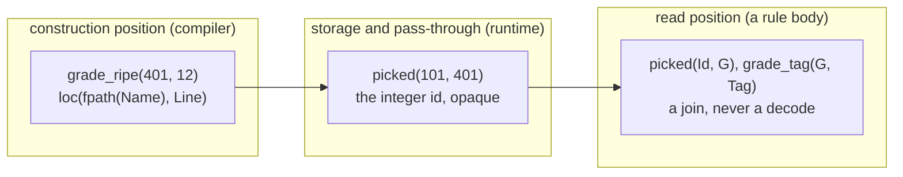
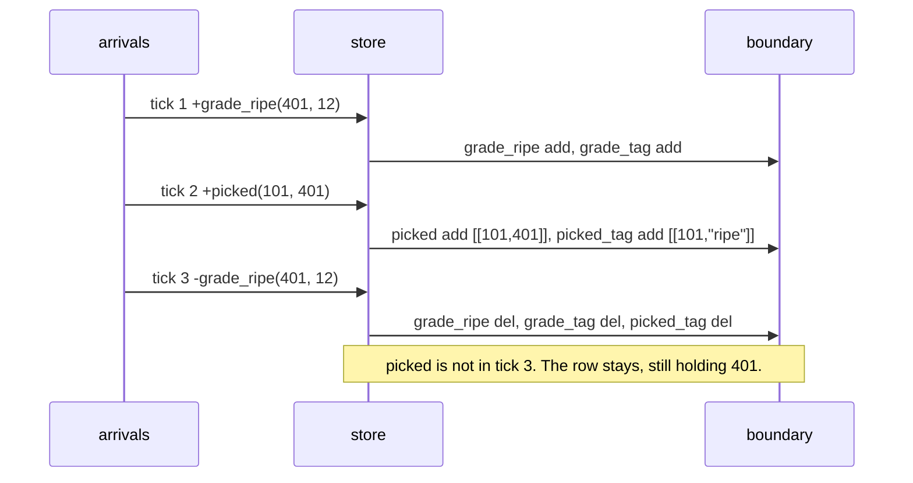

# enum-column-ref: an enum-typed column holds a reference

Branch `fix/enum-column-ref`, rebased onto `57559f61f` (origin/main, #395).
Every number below is measured on that base, before and after, in the same
worktree.

## Contents

1. [The reference rule](#1-the-reference-rule)
2. [Three receipts](#2-three-receipts)
3. [The fourth receipt the compiler already writes](#3-the-fourth-receipt-the-compiler-already-writes)
4. [What changed per door](#4-what-changed-per-door)
5. [Tick 3: the referenced row leaves, the referrer stays](#5-tick-3-the-referenced-row-leaves-the-referrer-stays)
6. [Gate table](#6-gate-table)
7. [Still red, and why](#7-still-red-and-why)
8. [What the compiler could now stop emitting](#8-what-the-compiler-could-now-stop-emitting)

## 1. The reference rule



A column whose declared type is an enum name or a rel name holds the referenced
row's integer id. The value form is the variant constructor, and it appears at
construction position only. Nothing on either door inspects the value's shape to
decide what it means: one spelling, one meaning, no coercion.

| door | before | after |
|---|---|---|
| arrival | tagged object required, variant rows minted, identity table written | integer id carried unchanged |
| boundary | id decoded back into a tagged object | integer id carried unchanged |
| boundary column type | forced to `json` | stays the compiler's declared `int` |

## 2. Three receipts

All three from `v6/prolog/compile/out/text-door/` (the faithful render).

| receipt | file | line |
|---|---|---|
| a rel name as a column type is a reference | `relation_ref_column_fed_by_ref_variable_accepted.dl6` | `rel loc(at: fpath, line: int).` constructed as `loc(fpath(PathName2), Line)`, passed as `seen(At) <- loc(At, _)` |
| `option(<rel>)` lowers to an id column | `option_rel_ref_desugars_to_companion_split_rel.dl6` | `reviewed_by: option(person)` becomes `commit__reviewed_by(CommitId, PersonId)`; arrival `+commit__reviewed_by(101, 7)` carries `person`'s id and passes today with NO plane at all |
| an enum name as a column type is a reference | `enum_name_is_a_column_type.dl6` | `rel picked(id: int, g: grade).` fed `[+grade_ripe(401, 12)]` then `[+picked(101, 401)]` |

The oracle log agrees in both directions, `v6/prolog/compile/out/enum_name_is_a_column_type.oracle.jsonl`:

```
{"tick":2,"deltas":{"picked":{"add":[[101,401]],"del":[]},"picked_tag":{"add":[[101,"ripe"]],"del":[]}}}
```

The id goes in at the arrival door and the same id comes out at the boundary.
Every one of the seven crashing fixtures has this shape, including
`tree_branch(2, 1, 3)` where a variant's own fields are typed by the enum
(`17_recursive_enum.pl:23`) and `user_profile(1, 501)` where the column is
`option(text)` (`0_option_type.pl:20`).

## 3. The fourth receipt the compiler already writes

Every emitted module already declares the enum-typed column as `int`:

| fixture | `rel_declared_column_types` |
|---|---|
| `enum_name_is_a_column_type` | `picked: ["int", "int"]` |
| `option_text_column_reads_through_tag_join` | `user_profile: ["int", "int"]` |
| `recursive_enum_tree_and_cycles_round_trip` | `tree_branch: ["int", "int", "int"]` |
| `keyed-option-relation-runtime.dl6` | `KeyedRelationOption: ["int", "text"]` |

The emitted `validate_arrivals` refuses a non-integer in an `int` column with
`field_not_int`. The reference check therefore already existed on the arrival
path; the enum plane ran BEFORE it and mangled the value first. That is the
whole disagreement, and it makes "reuse the existing reference path" concrete:
an enum ref column is an int column.

## 4. What changed per door

| file | change |
|---|---|
| `v6/tsv2/runtime/enumPlane.ts` | 161 lines to 47. `intern` names a non-integer with `enum_arrival_shape_mismatch: not_a_reference(<rel>, <enum>)` and returns the batch unchanged. `decode_deltas` and `decode_rows` return their input. The tagged-object validator, the canonical-JSON identity intern, `encode` and `decode` are deleted. |
| `v6/tsv2/serve/3_engine.ts` | `boundary_types` no longer rewrites an enum ref column to `json`; the served `rows()` read drops its now-inert decode hop. |
| `v6/sprefa-engine-rs/src/enum_plane.rs` | 757 lines to 128, same three entry points, same named error. |
| `v6/sprefa-engine-rs/src/driver.rs` | `format_deltas` passes `program.rel_column_types` straight through. This is the RUST GRADING log line, so it is the byte-clean move on that door. |
| `v6/sprefa-engine-rs/src/serve.rs` | `deltas_since` drops the `json` rewrite; `row_object` loses its enum branch and its parameter; `ServeState.enum_ref_columns` is deleted as unread. |
| `v6/tsv2/tests/enumPlane.test.ts` | rewritten to the reference rule, with a seam that throws if any statement runs. |
| `v6/tsv2/tests/keyedOptionRuntime.test.ts` | rewritten: the option instance arrives as `__opt_Person_some(1, {id, name})`, the parent as `KeyedRelationOption(1, "old")`. |
| `v6/sprefa-engine-rs/tests/type_annotation_ci.rs` | the two Rust twins of the above, rewritten the same way. |
| `v6/sprefa-engine-rs/graded.tsv` | seven rows moved `runtime-error` to `clean`. |

No emitter and no `.dl6` fixture was touched. `v6/prolog/compile/out/*.ts` is
byte-unchanged; only `out/run-results.json` moved, and only in the seven rows.

## 5. Tick 3: the referenced row leaves, the referrer stays

`enum_name_is_a_column_type` tick 3 retracts `grade_ripe(401, 12)` while
`picked(101, 401)` still points at 401.



| question | answer |
|---|---|
| what the oracle expects | `final(picked/2, [picked(101, 401)])` and `deltas(picked_tag/2, [..., [-picked_tag(101, ripe)]])`, `0_enum_variants.pl:96,99-102`. The referrer survives; the derived join over it retracts. |
| what both doors did before | threw at tick 2, so tick 3 never ran. |
| what both doors do now | byte-identical to the oracle log, on both the TypeScript replay and the Rust grade. |

Named plainly: **a dangling reference is legal and inert.** Retracting the
referenced row cascades to nothing. Every rule that JOINS through the reference
loses its rows, because the join stops matching; the referrer keeps the id.
No cascade semantics were invented, and none exist to invent: this arc changed
no rule evaluation, only the two doors' reading of the column.

## 6. Gate table

Measured in `~/projects/sprefa-worktrees/enum-column-ref`, base `57559f61f`,
both columns in the same worktree. Sweep and rust-grade were each run three
times after the change with an identical line every time.

| gate | before | after |
|---|---|---|
| `cd v6/tsv2 && bash scripts/sweep.sh` | `RUN total=335 identical=322 wrong=0 emitted_crash=7 rejection=6 no_oracle_log=0`, one `SWEEP GATE` line, exit 1 | `RUN total=335 identical=329 wrong=0 emitted_crash=0 rejection=6 no_oracle_log=0`, no `SWEEP GATE` line, exit 0 |
| `bash v6/sprefa-engine-rs/grade.sh` | `RUST-GRADE graded=434 byte-clean=322`, `runtime-error 7`, exit 0 | `RUST-GRADE graded=434 byte-clean=329`, no `runtime-error` line, exit 0 |
| `cd v6/prolog/conformance && swipl -g go -t halt go.pl` | 433 PASS, `fail nested_zero_column_child_is_one_row_per_parent`, `FAILURES 1` | identical |
| `cd v6 && just plunit` | `declared=936 results=982 passed=975 failed=7` | identical, same seven names |
| `cd v6/sprefa-engine-rs && cargo test --no-fail-fast` | 105 passed / 0 failed | 99 passed / 0 failed |
| `cd v6/tsv2 && npm test` | `tests 249 / pass 244 / fail 3` | `tests 248 / pass 243 / fail 3`, the SAME three |

Conformance and plunit read no file this branch changes (`git diff origin/main
HEAD --name-only` holds no `.pl`), so their two columns are one measurement.
The five orphaned host-executor tests the brief named are gone: #395 deleted
them before this branch rebased onto it, so cargo is 0 failed on both columns.

The seven fixtures that moved, all seven on both doors:

```
enum_name_is_a_column_type
enum_variant_field_typed_as_rel_is_a_ref
generic_expansion_end_to_end
module_path_and_option_column_coexist
option_scalar_enums_mint_per_element_type
option_text_column_reads_through_tag_join
recursive_enum_tree_and_cycles_round_trip
```

Test-count movements, both of them the enum plane's own tests:

| suite | movement |
|---|---|
| cargo | nine value-path unit tests in `enum_plane.rs` became three reference tests, so passed drops six. Zero failed on both columns. |
| npm | `enumPlane.test.ts` went four tests to three. The failing SET is identical on both columns. |

`graded.tsv` was re-recorded with `RUST_GRADE_WRITE_GRADED=1`; every run after
it exits 0 with no RATCHET and no REGRESSION line.

## 7. Still red, and why

Nothing from this arc. `emitted_crash=0` and `runtime-error 0` are both
reached, and every other leg's failing SET is byte-identical to the base's.

| leg | failing set, before AND after | reason |
|---|---|---|
| conformance | `nested_zero_column_child_is_one_row_per_parent` | fails to plan, CI-KNOWN-RED group A |
| plunit (7) | `module_path_decls:...`, `rel_zero_arity:...` (group A); `subscribe_cone:golden_flex_cone_invariants` (group C); `catalog_plane_rail:level_plane_family_corpus_counts` and three `json_merge_patch` (group D) | groups A, C, D |
| npm test (3) | `golden-flex served`, `tests/listStoredSnapshot.test.ts` (group C), and `sourceMutations` `sabotage: editing fixture in temp dir modifies only the changed row` | group C plus one load flake that also fails at `57559f61f` |

`.github/CI-KNOWN-RED.md` group B is the row this arc closes.

## 8. What the compiler could now stop emitting

`IEnumRefColumn` needs no new field. The mission asked whether one is missing
that names what the column holds; there is exactly one thing it can hold, so a
discriminator would be the sniffing the user's call rules out. What the runtime
no longer reads:

| IR field | site | state |
|---|---|---|
| `IEnumRefColumn.endpoint_index` | `emit_ts.pl:376-381`, `emit_rust.pl` twin | unread. It searched for a column literally named `id` in the same rel, which is why `picked(id, g)` got `0` and `user_profile(user_id, email)` got `null` for the same shape. |
| `IEnumTypePlan.identity` and `enum_identity_ddls` | `emit_ts.pl:381-390` | the `__enum_identity_<name>` table is still created at boot and now never written or read. |
| `ENUM_TYPES`, `ENUM_REF_COLUMNS` and the `EnumPlane` wiring | `emit_ts.pl:2579,2606`, `emit_rust.pl:604,634` | only `ENUM_REF_COLUMNS` is still read, and only to name the column in the error. |

Removing them regenerates all 433 committed `out/*.ts` and changes the served
program shape, so it wants an `ir_version` bump and its own PR. Left undone on
purpose: this branch's emitter diff is zero, which keeps it clear of the
`emit_ts.pl` format lane.
