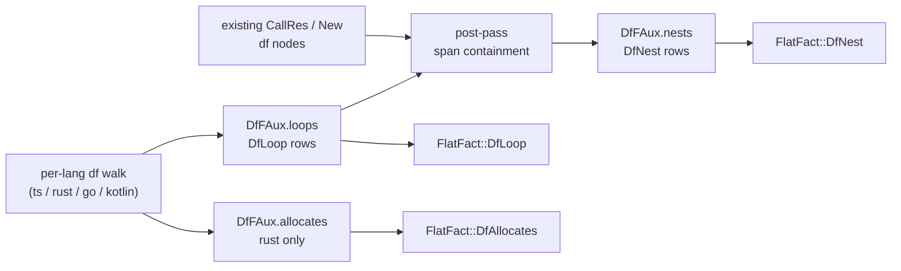

# Lane brief: df aux loop_over / allocates / nest

Card: `extract-df-aux-loops-nests` (epic `extract-port-closeout`).
Worktree: `/Users/chrishafley/projects/sprefa/.boop-worktrees/feature/extract-df-aux-loops-nests`
Branch: `feature/extract-df-aux-loops-nests`
First action, in that worktree: `git merge --ff-only 4531b4297`. Failure or a
missing tree = STOP AND REPORT, never work around it.

All paths below are relative to `v6/sprefa-extract/` unless they start with
`src/graph/` or `src/engine/`, which are the **v5** crate at the repo root and
are READ-ONLY reference.

## TOC

1. What lands
2. The three facts, with their v5 receipts
3. The five constraints that decide the design
4. Exact shape to write
5. Fixtures and grading
6. Files owned / forbidden
7. Gate
8. Style laws

---

## 1. What lands

Three new df-aux facets, the graph-shaped half of v5's dataflow family:
`loop_over`, `allocates`, `nest`. `fields`/`lits` (the label half) already
landed; this is the same `DfFAux` struct, the same four lang files, the same
`FlatFact` + `SCHEMA` + `wire.rs` spine.



## 2. The three facts, with their v5 receipts

| fact | v5 receipt | meaning |
|---|---|---|
| rel roster | `src/engine/family/mod.rs:455-491` `DATAFLOW_RELS` (15 rels) | `loop_over`, `allocates`, `nest` are three of the 15 |
| `LoopFact` | `src/graph/typegraph/mod.rs:389-398` | `{ file, start, end, var, collection, fn_sym }`; `start`/`end` are LINES; `var` and `collection` are `""` when absent |
| `NestFact` | `src/graph/typegraph/mod.rs:400-411` | `{ call_id, loop_id, depth, collection }`; `loop_id` = `"{file}:{start}"`; `depth` 1 = outermost |
| the nest post-pass | `src/graph/typegraph/mod.rs:862-905` `compute_nests` | READ THIS FUNCTION IN FULL before writing the v6 twin |
| `allocates` | `src/graph/typegraph/mod.rs:360` `allocators: HashSet<String>`, filled ONLY at `src/graph/typegraph/rust/mod.rs:1149` and `:1176`; rel decl `src/engine/decls.rs:703` `allocates(fn)` | fns whose body builds a collection |
| the allocator predicates | `src/graph/typegraph/rust/mod.rs:1050-1060` `is_allocator_call`, plus `is_allocator_method` | `Vec::new` / `HashMap::new` / `String::new` style ctor paths, and the collecting methods |
| per-lang `LoopFact` push sites | rust `src/graph/typegraph/rust/mod.rs:1366,1391,1412`; go `src/graph/typegraph/go.rs:1278`; kotlin `src/graph/typegraph/kotlin.rs:561,573`; ts `src/graph/typegraph/ts/flow.rs:399` | one per loop form |
| the v6 deferral note | `src/lang/ts.rs:1677`, `src/lang/ts.rs:2023` ("the loop FACT is deferred aux"), `src/lang/kotlin.rs:758-761`, `src/lang/kotlin.rs:774`, `src/types.rs` status row `df aux (loops/nests)` | where v6 parked it |

`allocates` is RUST-ONLY in v5. `grep -rn allocators src/graph/` returns hits in
`typegraph/mod.rs` (the field) and `typegraph/rust/mod.rs` (the only two
inserts) and nothing else. Do NOT invent go/kotlin/ts allocator detection; mark
those three `n/a (v5 emits none)` in the status table.

## 3. The five constraints that decide the design

**C1. NEVER push a new `DfNodeKind::Loop` node.** Which langs mint a `loop` df
NODE is v5-parity-pinned and already correct: rust does
(`src/lang/rust.rs:1815,1847,1879`), go does (`src/lang/go.rs:1248`), ts and
kotlin do NOT, and `src/lang/kotlin.rs:760-761` states why ("`for`/`while`/
`do-while` mint NO Loop node in v5 kotlin"). Adding one would shift every df
node index and break `tests/golden_parity.rs`, `tests/2_df_aux_cli.rs` and
`tests/4_capability_parity.rs` at once. The `DfLoop` aux row carries its OWN
span and is independent of whether a `loop` node exists.

**C2. v6 identity is a SPAN, never a line.** v5's `LoopFact` carries
`start`/`end` LINES and a `fn_sym`, and `compute_nests` filters by
`l.fn_sym == n.fn_sym || <::closure:: ancestry>` plus `n.line >= l.start &&
n.line <= l.end`. In v6 every node is a half-open byte `Span` and a loop's byte
span is strictly inside its fn's, so **byte-span containment alone subsumes the
whole fn_sym + closure-ancestry test**. Write the containment check, drop the
fn_sym machinery, and say so in one comment citing
`src/graph/typegraph/mod.rs:876-884` as the thing it replaces.

**C3. `depth` comes from sorting, not from a second traversal.** v5's own
comment (`src/graph/typegraph/mod.rs:868-871`): structured loops cannot
partially overlap, so sorting the enclosing set by start gives the nesting order
with no extra containment check. `depth = rank + 1`, 1 = outermost.

**C4. `nest` covers `CallRes` AND `New`.** `src/graph/typegraph/mod.rs:874-878`:
"`new` nodes count too: a constructor in a loop allocates per iteration". Both
kinds, no others.

**C5. No second walk, no N+1.** Loop rows are pushed by the loop arm the df walk
already runs. The nest post-pass runs ONCE per file over the finished
`nodes` + `loops` vecs (the same shape as v5's `compute_nests` and as the
existing `lit_spans` drain at `src/types.rs:632-637`).

## 4. Exact shape to write

### 4a. `src/types.rs` — three structs on `DfFAux`

`DfFAux` is at `src/types.rs:623-638`. Model the new structs on `DfField`
(`:604-609`) and `DfLit` (`:617-621`) directly above it.

```rust
/// One loop's span, loop variable and iterated collection. Port of v5
/// `LoopFact` (src/graph/typegraph/mod.rs:389-398) with lines replaced by the
/// byte span v6 uses for every identity. `var` is None for `while`/`loop`
/// (v5 spells the same absence as ""); `collection` is None when the form
/// iterates nothing nameable.
pub struct DfLoop {
    pub span: Span,
    pub var: Option<String>,
    pub collection: Option<String>,
}

/// One (call, enclosing loop, depth) row. Port of v5 `NestFact`
/// (src/graph/typegraph/mod.rs:400-411). `loop_span` replaces v5's
/// "{file}:{start}" loop_id: a span IS the identity in v6, and the file is the
/// row's own file. `depth` is 1 for the outermost enclosing loop.
pub struct DfNest {
    pub call: NodeRef,
    pub loop_span: Span,
    pub depth: u32,
    pub collection: Option<String>,
}

/// One fn whose body builds a collection. Port of v5 `allocators`
/// (src/graph/typegraph/mod.rs:360, filled only at rust/mod.rs:1149,1176).
/// RUST ONLY - v5 emits this for no other language.
pub struct DfAllocates {
    pub owner: Span,
}
```

Field types: `String` matches `DfField.name` / `DfLit.text`, which are plain
`String` in this crate. Do NOT reach for `NameId` here; check `DfField` at
`src/types.rs:604-609` and follow it.

`DfAllocates.owner` is the enclosing FN's span. The v6 rust df walk threads a
`fn_sym: &str`, not a span — plumbing the fn span through is the one piece of
real work in this facet. Read `src/lang/rust.rs` around the df entry point and
pick the smallest change that carries the fn's `Span` down beside `fn_sym`.
If that plumbing turns out to cost more than the facet is worth, STOP, land
`loops` + `nests` alone, and report the exact obstacle with a `path:line`
instead of guessing a substitute key.

Add the three vecs to `DfFAux` beside `fields` / `lits`.

### 4b. `src/types.rs` — three `FlatFact` arms

Follow `FlatFact::DfField` (`src/types.rs:1745-1753`) and `DfLit` (`:1754+`)
exactly: `#[serde(rename = "...")]`, a `family` field, `SpanOut` for every span.

```
DfLoop      rename "df_loop"
DfNest      rename "df_nest"
DfAllocates rename "df_allocates"
```

### 4c. `src/schema.rs` — three lines

Insert after `record=df_lit` (`src/schema.rs:29`), same column alignment:

```
  record=df_loop   family=df               span={start,end}   var=<string|null>  collection=<string|null>
  record=df_nest   family=df               call={start,end}   loop={start,end}   depth=<u32>  collection=<string|null>
  record=df_allocates  family=df           owner={start,end}
```

### 4d. `src/wire.rs` — three flatten loops

Append to the df flatten fn after the `lits` loop (`src/wire.rs:379-386`),
same shape: resolve `NodeRef` through `bundle.node(...)`, emit `SpanOut::new`.

### 4e. per-lang emission

| lang | loop arms to touch | note |
|---|---|---|
| ts | `src/lang/ts.rs:1960` `ForStatement`, `:1990` `ForOfStatement`, `:2000` `ForInStatement`, `:2010` `WhileStatement`, `:2014` `DoWhileStatement`, and the shared `df_for_in_of` at `:2022-2035` | v5 twin: `src/graph/typegraph/ts/flow.rs:399` |
| rust | `src/lang/rust.rs` `syn::Expr::ForLoop` (~`:1800`), `syn::Expr::While` (~`:1819`), `syn::Expr::Loop` (~`:1855`) | v5 twin: `src/graph/typegraph/rust/mod.rs:1366,1391,1412`; ALSO the allocates inserts at `:1149,:1176` |
| go | `src/lang/go.rs` around `:1248` (the existing Loop node push) | v5 twin: `src/graph/typegraph/go.rs:1278`; v5 comment at `:1219` says why the loop var is recorded |
| kotlin | `src/lang/kotlin.rs` around `:1219` (the comment that currently drops the loop fact) | v5 twin: `src/graph/typegraph/kotlin.rs:561,573`; C1 applies hardest here |

The `collection` text is the raw source slice of the iterated expression, the
same convention `DfLit` uses for `template`/`concat`
(`tests/18_df_aux_fields_lits.rs:18-20`). `var` is the loop variable's
identifier text.

### 4f. the nest post-pass

One free fn in `src/wire.rs` or beside the df aux types, called once per file
at the end of each lang's df projection (or once in the shared df projector if
one exists — check before duplicating it four times). Signature and body
comment first:

```rust
/// Port of v5 `compute_nests` (src/graph/typegraph/mod.rs:862-905). For every
/// CallRes/New node, every DfLoop whose span contains it, sorted by span start,
/// emits depth 1.. . Span containment replaces v5's fn_sym + ::closure::
/// ancestry test (:876-884): a loop's byte span is inside its fn's, so a call
/// inside the loop is inside the loop's span, closures included.
fn compute_nests(nodes: &[Node<DfF>], loops: &[DfLoop]) -> Vec<DfNest>
```

### 4g. `src/types.rs` status table — TWO edits

The table is at `src/types.rs:2188-2210`. Columns are **TS | Rust | Go |
Kotlin**, in that order.

1. Flip `df aux (loops/nests)` from `-> labels, follow-up` to per-lang cells
   reflecting what you actually landed.
2. **Fix the pre-existing defect on the row above it.** The current row reads
   `df aux (lits)  [x]  -  [x]  -`, which credits Go with lits and denies Rust.
   The truth, measured: lits are emitted at ts (`src/lang/ts.rs:1706,2158`) and
   rust (`src/lang/rust.rs:1453`) and nowhere else, and v5 emits `df_lit` for
   ts and rust only (`grep -rn df_lit src/graph/` hits `typegraph/ts/flow.rs`
   and `typegraph/rust/tests.rs`; zero hits in `typegraph/go.rs`,
   `typegraph/kotlin.rs`, `graph/dataflow/`). Correct it to
   `[x]  [x]  [-] n/a (v5 go emits none)  [-] n/a (v5 kotlin emits none)`,
   matching the `const facet` row's own n/a spelling two rows up.

## 5. Fixtures and grading

**There is no oracle for these three facets and you must not pretend there is.**
Measured census over `tests/fixtures/*/*.v5.jsonl`
(`cat tests/fixtures/*/*.v5.jsonl | cut -f1 | sort | uniq -c`): df_node 267,
df_edge 210, type_node 73, call_def 48, df_args 44, df_param_pos 42,
type_edge 41, type_sig 35, call_site 28, doc 19, const_value 14, df_lits 8,
df_fields 8. **Zero** loop_over / nest / allocates rows. The v5 crate is not in
this crate's build graph, so nothing regenerates from here.

Worse: the four golden fixtures contain **no loops at all**
(`tests/fixtures/{ts/sample.ts,rust/sample.rs,go/sample.go,kotlin/sample.kt}`,
44/35/35/40 lines, zero `for`/`while` outside comments).

So:

- **Do NOT edit the four golden fixtures.** Adding a loop to `sample.ts` shifts
  every span in `tests/fixtures/df_aux/ts.jsonl` and every v5 baseline row.
- **Add a NEW fixture dir** `tests/fixtures/df_loops/` with `sample.ts`,
  `sample.rs`, `sample.go`, `sample.kt`. Each must contain: one flat loop, one
  loop nested two deep, a call inside the inner loop, a `new`/constructor inside
  a loop, a `while` (no loop var), and for rust a `Vec::new()` in one fn and not
  in another. Keep each file under 40 lines.
- **Add `tests/23_df_aux_loops_nests.rs`** with HAND-DERIVED expectations. The
  convention and the exact wording to follow is `tests/16_python.rs:1-2`:
  "Expected values are hand-derived from `sample.py`, never copied from the
  extractor's output." You must be able to point at the fixture line for every
  expected row. A test written by pasting the extractor's output is a failed
  deliverable; say so in the test header.
- Assert at minimum: the loop row count and each loop's `var`/`collection`; that
  the inner-loop call has TWO nest rows with depths 1 and 2 and that depth 1 is
  the OUTER loop; that a call outside every loop has zero nest rows; and for
  rust that exactly the allocating fn has an `allocates` row.
- `tests/2_df_aux_cli.rs` goldens (`tests/fixtures/df_aux/*.jsonl`) will not
  change, because the golden fixtures have no loops. If they DO change, you
  broke C1 - stop and re-read constraint C1.

## 6. Files owned / forbidden

OWNED (edit freely):

```
v6/sprefa-extract/src/types.rs
v6/sprefa-extract/src/schema.rs
v6/sprefa-extract/src/wire.rs
v6/sprefa-extract/src/lang/ts.rs
v6/sprefa-extract/src/lang/rust.rs
v6/sprefa-extract/src/lang/go.rs
v6/sprefa-extract/src/lang/kotlin.rs
v6/sprefa-extract/tests/23_df_aux_loops_nests.rs        (new)
v6/sprefa-extract/tests/fixtures/df_loops/**            (new)
```

FORBIDDEN, do not open, do not edit, another driver owns them; touching one
corrupts a concurrent effort:

```
~/projects/hafley-rs                                    (the entire repo)
v6/sprefa-extract/src/project.rs
v6/sprefa-extract/src/deps.rs
v6/sprefa-extract/src/dispatch.rs
v6/sprefa-extract/src/scip*.rs, src/scip/
v6/sprefa-extract/Cargo.toml
v6/sprefa-extract/src/lang/python/**                    (parked card)
v6/sprefa-extract/src/lang/mod.rs
everything outside v6/sprefa-extract/ except READ-ONLY reads of src/graph/ and
src/engine/ for v5 receipts
```

If the work genuinely needs a forbidden file, STOP and report the exact
requirement with a `path:line`. Do not work around a blocked file or a denied
command; a permission denial ends that approach.

## 7. Gate

Run from `v6/sprefa-extract` inside the worktree. Run the new test THREE times
before calling it green; two back-to-back whole-gate runs on one tree have
given different failing sets under lane load.

```bash
cargo build --all-targets --features cli
cargo test --features cli
cargo test --features cli --test 23_df_aux_loops_nests
cargo test --features cli --test 2_df_aux_cli
cargo test --features cli --test golden_parity
cargo test --features cli --test 4_capability_parity
```

`cargo test --features cli` is 32 test binaries and is ALL GREEN at
`4531b4297`; any red is yours.

Commit split, one commit per line, each building on its own:

1. `extract: DfLoop/DfNest/DfAllocates wire types, schema block, flatten arms`
2. `extract: loop_over rows on the four lang df walks`
3. `extract: the nest post-pass (span containment, depth by rank)`
4. `extract: allocates on the rust df walk`
5. `extract: df_loops fixtures + 23_df_aux_loops_nests`

Then push the branch and open a PR against `main` with the receipts (row counts
per fixture, the three-run gate output, and the status-table diff). Do NOT merge
it yourself and do NOT push `main`.

## 8. Style laws (repo, non-negotiable)

- **Comment budget.** Comments state only constraints the code cannot show. No
  change-log narrative, no dates, no arc references, no restating the next line.
  A comment that says WHY a v5 receipt was departed from is wanted; a comment
  that says "push the loop row" is not.
- **No em dashes** anywhere, prose or code comments. Use a hyphen or restructure.
- Banned words in prose AND identifiers: `provenance`, `substrate`,
  `load-bearing`, `regime`, and `refusal`. Say source/base/critical/mode, and
  "TODO"/"not built yet" for an unbuilt construct.
- No negative parallelism (`not X, Y`; `this isn't X. it's Y`; `X. Not Y.`).
- No rhetorical closes, no one-word sentences.
- **`tracing` only. No `eprintln!` in `src/**`.** The ratchet is at zero.
- **Descriptive variable names, never single-letter.** v5's `for (i, l) in` is
  v5's problem; the v6 twin writes `for (rank, enclosing_loop) in`.
- **N+1 is forbidden**: collect the set, one push loop. No per-row write.
- **Colocated consistency**: inside a file, follow that file's existing style
  even where it diverges from the above.
- **Doubt yourself before asserting.** Verify against the code; a comment is not
  the language. If a receipt line number in this brief is wrong (line numbers
  rot), find the real one and say so in your report, do not silently guess.

---

# RESUME ADDENDUM (read this FIRST, it overrides section 7's commit list)

A previous run of this lane was killed mid-flight. The worktree is NOT clean and
you are RESUMING it, not starting it. Do not redo landed work.

## State measured at resume

`git log --oneline 4531b4297..HEAD` in the worktree:

```
8df4f0343 extract: DfLoop/DfNest/DfAllocates wire types, schema block, flatten arms
```

That commit is DONE and correct. It landed, per `git show --stat 8df4f0343`:
`src/types.rs` (+97), `src/wire.rs` (+29), `src/schema.rs` (+3). It contains
`DfLoop` at `src/types.rs:626`, `DfNest` at `:637`, `DfAllocates` at `:648`, the
`loops`/`nests`/`allocates` vecs on `DfFAux` at `:661-663`, the
`loop_collection_spans` drain vec at `:671`, and `pub fn compute_nests` at
`:679`. Leave all of it alone unless you find a real defect.

`git status --porcelain` shows two UNCOMMITTED, working files, both correct so
far:

- `src/lang/ts.rs` (+43/-2): `df_loop_row` helper, loop rows on `ForStatement` /
  `ForOf` / `ForIn` / `While` / `DoWhile`, the `loop_collection_spans` drain and
  the `compute_nests` call in `impl Project<DfF>`.
- `src/lang/go.rs` (+16/-3): the `for_statement` arm pushes a `DfLoop` with var
  and collection, plus the `compute_nests` call in `project_df`.

## What is LEFT

1. Commit the two working files.
2. `src/lang/rust.rs`: loop rows on `syn::Expr::ForLoop` / `While` / `Loop`, plus
   the `allocates` facet (v5 `is_allocator_call` / `is_allocator_method`,
   inserted only at `src/graph/typegraph/rust/mod.rs:1149,1176`), plus the
   `compute_nests` call. **Currently `grep -c "aux.loops\|aux.allocates"
   src/lang/rust.rs` returns 0.**
3. `src/lang/kotlin.rs`: loop rows. **Currently `grep -c "aux.loops"
   src/lang/kotlin.rs` returns 0.** Constraint C1 applies hardest here: mint NO
   `DfNodeKind::Loop` node.
4. `tests/fixtures/df_loops/` (4 files) and `tests/23_df_aux_loops_nests.rs`.
   Neither exists yet.
5. The gate, three runs of the new test, then commit, push, PR.

## One defect to fix before you finish

The status table at `src/types.rs:2298-2300` currently reads:

```
//   df aux (fields)                               [x]         [x]            [x]                 [x]
//   df aux (lits)                                 [x]         [x]            [-] n/a (v5 go emits none)   [-] n/a (v5 kotlin emits none)
//   df aux (loops/nests)                          [x]         [x]            [x]                 [x]
```

The `lits` row is now CORRECT; that was the section-4g fix and it is done.

The `loops/nests` row was flipped to `[x]` on all four columns while the rust
and kotlin arms are still unwritten. A status cell that is ahead of the code is
exactly the failure this repo's CLAUDE.md calls out ("comments are not the
language"). Either finish rust and kotlin so the row is true, or set those two
cells to what is actually shipped. The row must be TRUE at PR time.

## Everything else is unchanged

Same worktree, same branch, same base `4531b4297`, same OWNED / FORBIDDEN sets
in section 6, same gate in section 7, same style laws in section 8. Your first
action is NOT another `git merge --ff-only`; the tree is already at the right
base with work on top. Verify with `git log --oneline -1` and proceed.

## Comms

Callsign is one short readable word you pick for yourself; announce it once at
the top of your report. Light trucker flavor. Receipts exact and unabridged:
commit shas, PR url, per-fixture row counts for loops/nests/allocates, the
three-run gate output, and every brief line number that had rotted with its real
value. Flavor never costs a digit.
