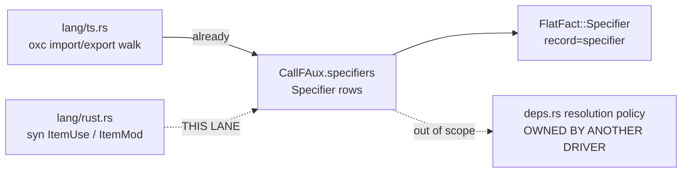

# Lane brief: rust module specifiers on the extract call plane

Card: `extract-module-plane-non-ts` (epic `extract-port-closeout`), RUST SLICE ONLY.
Branch: `feature/extract-module-plane-rust`
Base: origin/main `4531b4297`.
First action, in your worktree: `git merge --ff-only 4531b4297`. Failure or a
missing tree = STOP AND REPORT, never work around it.

Paths starting `v6/` are relative to the repo root. Paths starting
`src/graph/` or `src/engine/` are the **v5** crate at the repo root: READ-ONLY
reference for receipts, never edited.

## TOC

1. The one-sentence job
2. Where the plane stands today
3. The mapping table you implement
4. Exact shape to write
5. Two things you must NOT do
6. Fixtures and grading
7. Files owned / forbidden
8. Gate and commit split
9. Style laws

---

## 1. The one-sentence job

`v6/sprefa-extract` emits module `Specifier` rows from the TypeScript front-end
alone; make the **rust** front-end emit them too, from `use` statements and
`mod` declarations, using the existing `Specifier` type and the existing closed
`SpecifierKind` vocabulary, with no new wire vocabulary and no resolver change.



## 2. Where the plane stands today

| fact | receipt |
|---|---|
| `Specifier` type | `v6/sprefa-extract/src/types.rs:489-495` — `{ span, name: NameId, kind: SpecifierKind, module: Option<NameId> }` |
| what `module` means, stated | `v6/sprefa-extract/src/types.rs:482-488` — "the source module text as written (`./x.ts`, `rxjs`, `node:fs`), and it is what `crate::deps` resolves to a file path"; `None` is only for languages that put the module in `name` |
| `SpecifierKind`, closed 5-variant | `v6/sprefa-extract/src/types.rs:528-546` — `Named`, `Default`, `Namespace`, `SideEffect`, `Reexport`, with `as_str` |
| where rows live | `v6/sprefa-extract/src/types.rs:558-567` `CallFAux.specifiers` |
| the wire record | `v6/sprefa-extract/src/schema.rs:36` — `record=specifier  family=call  span={start,end}  name=<string>  kind=<slug>  module=<string|null>` |
| the ts emitter, your model | `v6/sprefa-extract/src/lang/ts.rs:1250-1263` `push_specifier`, called from the import walk around `:1150-1246` |
| only ts emits today | `grep -rn "specifiers.push" v6/sprefa-extract/src/lang/` hits `ts.rs:1260` and nothing else |
| the v5 rust resolver you are porting the SHAPE of | `src/graph/modgraph/rust.rs:44-148` `RustResolver::edges`, contract at `src/graph/modgraph/mod.rs:1-15` |

**Read `src/graph/modgraph/rust.rs:44-148` before writing anything.** It is
REGEX over comment-stripped text (`rust_mod_re`, `rust_use_re`,
`rust_path_mod_re`, `expand_use_leaves`). You are NOT porting the regexes.
`v6/sprefa-extract/src/lang/rust.rs` already parses with `syn`, which gives the
same information from a real AST. Take v5's SEMANTICS (what counts as a
re-export, what a glob binds, how an alias renames) and implement them on
`syn::ItemUse` / `syn::ItemMod`. Say in a comment that the v6 arm reads the
syn AST where v5 read regexes, citing `src/graph/modgraph/rust.rs:15-18` as the
regex it replaces.

## 3. The mapping table you implement

This table is the deliverable's contract. Implement exactly it. Write it into
the code as the emitter's header comment.

| rust source | kind | `name` | `module` |
|---|---|---|---|
| `use a::b;` | `Named` | `b` | `a::b` |
| `use a::b as c;` | `Named` | `c` | `a::b` |
| `use a::{b, c};` | `Named` x2 | `b`, `c` | `a::b`, `a::c` |
| `use a::b::{self};` and `use a::b::self;` | `Named` | `b` | `a::b` |
| `use a::*;` | `Namespace` | `a` | `a` |
| `pub use a::b;` (any `pub`, incl. `pub(crate)`, `pub(in ...)`) | `Reexport` | `b` | `a::b` |
| `pub use a::*;` | `Reexport` | `a` | `a` |
| `mod foo;` (declaration only, no `{ }` body) | `Named` | `foo` | `foo` |
| `#[path = "x.rs"] mod foo;` | `Named` | `foo` | `x.rs` |
| `mod foo { ... }` (inline body) | NO ROW | | |
| `extern crate a;` | NO ROW | | |

Receipts for the non-obvious rows:

- **Re-export**: v5 draws the same line and says why at
  `src/graph/modgraph/rust.rs:20-24` — "the `module_binding` `kind`
  distinguishes a Rust `pub use` from a plain `use` (both are `use` statements
  to `module_edge`, but only the `pub` one re-exports the name)". The kind is
  chosen at `:134`.
- **Glob and `self` leaves bind no single local name**: v5
  `src/graph/modgraph/rust.rs:120-126` (`leaf.collapsed` -> empty
  `module_bindings`). v6's `Namespace` is the existing spelling for "a whole
  module entered scope under one name", which is what ts uses for
  `import * as ns` (`v6/sprefa-extract/src/lang/ts.rs:1193-1201`). For the
  `self` leaf, v5's own comment at `:121-123` says a collapsed leaf's local name
  is the module's last segment, which is why the table gives `b`.
- **`mod foo;` uses `Named`, not a new variant.** `SpecifierKind` is a CLOSED
  vocabulary and this lane does not widen it. `mod foo;` genuinely brings the
  name `foo` into scope from the module `foo`, so `Named` states the truth the
  wire can carry. v5 spells it `kind: "mod"`
  (`src/graph/modgraph/rust.rs:65,92`) on a different record shape with a
  different vocabulary; that difference is expected and you note it in your
  report rather than closing it. **If you conclude `Named` is wrong, STOP and
  report the argument with receipts. Do NOT add a `SpecifierKind` variant.**
- **`#[path = "x.rs"] mod foo;` takes the attribute literal as `module`**:
  the attribute is what any resolver must resolve
  (`src/graph/modgraph/rust.rs:50-64`), so the path literal is "the source
  module text as written" per `v6/sprefa-extract/src/types.rs:483`.
- **Inline `mod foo { }` gets no row**: it names no other file, so there is no
  module edge to draw. v5's `rust_mod_re`
  (`src/graph/modgraph/rust.rs:5-13`) requires the trailing `;` for the same
  reason.

`SpecifierKind::Default` and `SpecifierKind::SideEffect` are unreachable from
rust. Do not force a use for them.

## 4. Exact shape to write

Everything lands in `v6/sprefa-extract/src/lang/rust.rs`. No other src file
changes.

1. Add `Specifier` and `SpecifierKind` to the crate imports already at
   `v6/sprefa-extract/src/lang/rust.rs:36-40` (that line already pulls
   `DfField, DfLit, DfNodeKind, DfParam, DocFact, DocTag, ProjectEdge, SigSlot,
   TypeEdgeCandidate` from the same module; add to it, do not open a second
   `use`).
2. One walker fn over the parsed file's top-level items plus the items inside
   inline `mod foo { }` bodies (a `use` inside an inline module is still a use).
   Signature and pseudo-code body first, as a comment under the signature:

```rust
/// Rust module specifiers: `use` leaves and `mod` declarations as
/// `CallFAux.specifiers` rows. v5 reads these with regexes over stripped text
/// (src/graph/modgraph/rust.rs:15-18); syn gives the same facts from the AST,
/// so alias, glob and `self` leaves need no re-parsing.
fn specifiers(items: &[syn::Item], strings: &mut Strings, sink: &mut FamilyBundle<CallF>)
// for each item:
//   ItemUse   -> visibility decides Named vs Reexport; flatten the UseTree to
//                leaves, one row per leaf, module = the joined path
//   ItemMod with semi and no content -> one Named row; #[path] attr wins the module
//   ItemMod with content -> no row for itself, recurse into its items
//   everything else -> skip
```

3. Spans: `v6/sprefa-extract/src/lang/rust.rs` already carries a syn
   line/col -> byte-offset bridge (`line_starts`, threaded through every walk;
   the module header at `:1-40` states it). Reuse it. Do NOT add a second span
   mechanism and do NOT emit line numbers. The span is the leaf's own span
   where syn gives one, else the whole `use`/`mod` item's span; say which you
   used in a comment.
4. Call the walker from the same place the rust arm's other CallF projections
   run, so it rides the ONE existing parse. A second parse of the file is a
   defect (`v6/sprefa-extract/src/lang/rust.rs` header states the one-parse
   rule).
5. Collect the whole row set and push; no per-row write into a shared sink
   across function boundaries. N+1 is banned repo-wide.

## 5. Two things you must NOT do

**5a. Do not touch `v6/sprefa-extract/src/deps.rs`.** It is the diet module
RESOLVER and it is explicitly TypeScript-only
(`v6/sprefa-extract/src/deps.rs:1-2`, extension table at `:57-70`). Another
driver is actively editing it; a concurrent edit collides. This lane emits
specifier ROWS only. Rust specifiers will simply not be resolved by `deps.rs`
yet, and that is the correct end state for this slice. If your work turns out
to genuinely require a `deps.rs` change, STOP and report the exact requirement
with a `path:line`.

**5b. Do not widen `SpecifierKind`.** See section 3.

## 6. Fixtures and grading

- `v6/sprefa-extract/tests/fixtures/rust/sample.rs` is 35 lines and is graded
  byte-for-byte against a v5 oracle by `tests/golden_parity.rs` and
  `tests/4_capability_parity.rs`. **Do not edit it.** Adding a `use` shifts
  every span in the rust baseline.
- Add a NEW fixture `v6/sprefa-extract/tests/fixtures/rust_modules/sample.rs`,
  under 45 lines, covering EVERY row of the section-3 table including the two
  NO-ROW cases.
- Add `v6/sprefa-extract/tests/24_rust_specifiers.rs`. Expectations are
  HAND-DERIVED from the fixture, never pasted from the extractor's output. The
  convention and the exact header wording to copy is
  `v6/sprefa-extract/tests/16_python.rs:1-2`. Assert the full
  `(kind, name, module, span.start)` tuple list in source order, plus one
  negative assertion per NO-ROW case.
- The existing rust goldens (`tests/fixtures/df_aux/rust.jsonl`, the v5 oracle
  rows) must not change. If they do, you edited a golden fixture or emitted a
  node; re-read section 6.

## 7. Files owned / forbidden

OWNED (edit freely):

```
v6/sprefa-extract/src/lang/rust.rs
v6/sprefa-extract/tests/24_rust_specifiers.rs                (new)
v6/sprefa-extract/tests/fixtures/rust_modules/sample.rs      (new)
```

FORBIDDEN, do not open to edit, another driver owns them; touching one corrupts
a concurrent effort:

```
~/projects/hafley-rs                                (the entire repo)
v6/sprefa-extract/src/deps.rs
v6/sprefa-extract/src/project.rs
v6/sprefa-extract/src/dispatch.rs
v6/sprefa-extract/src/scip*.rs, src/scip/
v6/sprefa-extract/Cargo.toml
v6/sprefa-extract/src/lang/mod.rs
v6/sprefa-extract/src/lang/python/**
v6/sprefa-extract/src/lang/ts.rs, go.rs, kotlin.rs   (a concurrent lane holds these)
v6/sprefa-extract/src/types.rs, src/schema.rs, src/wire.rs  (a concurrent lane holds these)
v6/sprefa-extract/tests/fixtures/rust/sample.rs
everything outside v6/sprefa-extract/
```

`src/types.rs`, `src/schema.rs` and `src/wire.rs` are FORBIDDEN precisely
because this slice needs no change in them: `Specifier`, the `SpecifierKind`
vocabulary, the `record=specifier` schema line and the flatten arm all already
exist for ts and are language-neutral. If you find yourself needing to edit one,
you have left the slice. STOP and report.

## 8. Gate and commit split

Run from `v6/sprefa-extract` inside the worktree. Run the new test THREE times
before calling it green; two back-to-back gate runs on one tree have given
different failing sets under lane load.

```bash
cargo build --all-targets --features cli
cargo test --features cli
cargo test --features cli --test 24_rust_specifiers
cargo test --features cli --test golden_parity
cargo test --features cli --test 4_capability_parity
cargo test --features cli --test 7_diet_deps_cli
```

`cargo test --features cli` is 32 test binaries and is ALL GREEN at
`4531b4297`; any red is yours.

Commits:

1. `extract: rust module specifiers from syn use/mod items`
2. `extract: rust_modules fixture + 24_rust_specifiers`

Push the branch and open a PR against `main` with receipts (the row table your
fixture produces, the three-run gate output). Do NOT merge it yourself and do
NOT push `main`.

## 9. Style laws (repo, non-negotiable)

- **Comment budget.** Comments state only constraints the code cannot show. No
  change-log narrative, no dates, no arc references, no restating the next line.
- **No em dashes** anywhere, prose or code comments.
- Banned words in prose AND identifiers: `provenance`, `substrate`,
  `load-bearing`, `regime`, and `refusal`. Use source/base/critical/mode, and
  "TODO"/"not built yet" for an unbuilt construct.
- No negative parallelism (`not X, Y`; `this isn't X. it's Y`; `X. Not Y.`).
  No rhetorical closes. No one-word sentences.
- **`tracing` only. No `eprintln!` in `src/**`.** The ratchet is at zero.
- **Descriptive variable names, never single-letter.**
- **N+1 forbidden**: collect the set, one push.
- **Colocated consistency**: inside `lang/rust.rs`, follow that file's existing
  style even where it diverges from the above.
- **Doubt yourself before asserting.** Verify against the code; a comment is not
  the language. Line numbers in this brief were checked at `4531b4297` and line
  numbers rot: if one is wrong, find the real site and SAY SO in your report
  instead of silently guessing.

## Report back

State: commit shas, PR url, the full row table your fixture produced, the
three-run gate output, every brief line number that had rotted with its real
value, and anything you could not do with a `path:line` reason.

---

# RESUME ADDENDUM (read this FIRST, it overrides section 8's commit list)

A previous run of this lane was killed mid-flight. The worktree is NOT clean and
you are RESUMING it, not starting it. Do not redo landed work.

## State measured at resume

`git log --oneline 4531b4297..HEAD` in the worktree is EMPTY. Nothing is
committed. HEAD is still `4531b4297`.

`git status --porcelain` shows the work sitting uncommitted, and it is good:

- `src/lang/rust.rs` (+180/-2), all of it inside the fence:
  - `Specifier, SpecifierKind` added to the existing `use crate::family::{...}`
  - the section-3 mapping table written as the emitter's header comment
  - `struct ModuleLeaf`
  - `fn module_specifiers(...)`, called at the end of `project_call` so it rides
    the one existing syn parse
  - `fn collect_module_leaves(...)` — recurses into inline `mod name { .. }`
  - `fn use_tree_leaves(...)` — Path / Group / Name / Rename / Glob
  - `fn push_use_leaf(...)` — the `self`-leaf rule
  - `fn mod_path_attr(...)` — `#[path = "x.rs"]`
- `tests/fixtures/rust_modules/sample.rs` (untracked, 637 bytes), covering every
  row of the section-3 table plus both NO-ROW cases (`extern crate xi;` and
  `mod tau { use upsilon::phi; }`).

Read both before touching anything. Change them only where they are wrong.

## What is LEFT

1. `tests/24_rust_specifiers.rs`. It does not exist yet. This is the whole
   remaining deliverable. Expectations HAND-DERIVED from the fixture, never
   pasted from the extractor's output; header wording per `tests/16_python.rs:1-2`.
   Assert the full `(kind, name, module, span.start)` list in source order, plus
   one negative assertion per NO-ROW case.
2. The gate in section 8, with the new test run THREE times.
3. Commit, push, PR against `main`.

## Two things to check while you are in there

- The fixture writes `use alpha::eta::self;` with a comment saying rustc rejects
  a bare `self` leaf outside a brace group. That is fine for a fixture the
  extractor only PARSES, and the comment already says why. Confirm syn actually
  accepts it; if it does not, the fixture fails to parse and every expectation
  is vacuous. Test it, do not assume it.
- `use_tree_leaves`'s `Glob` arm returns early when `prefix` is empty
  (`use *;`). Confirm that is unreachable in the fixture, or state it.

## Everything else is unchanged

Same worktree, same branch, same base `4531b4297`, same OWNED set (exactly three
files) and FORBIDDEN set in section 7, same gate in section 8, same style laws in
section 9, and both absolute prohibitions in section 5 still stand: do not touch
`deps.rs`, do not add a `SpecifierKind` variant. Your first action is NOT another
`git merge --ff-only`; the tree is already at the right base with work on top.

A concurrent lane still holds `src/lang/rust.rs` in its own worktree. Keep your
diff localized. Do not reflow, reorder or tidy anything you did not need to
change.

## Comms

Callsign is one short readable word you pick for yourself; announce it once at
the top of your report. Light trucker flavor. Receipts exact and unabridged:
commit shas, PR url, the full `(kind, name, module, span.start)` row table your
fixture produces, the three-run gate output, and every brief line number that had
rotted with its real value. Flavor never costs a digit.
