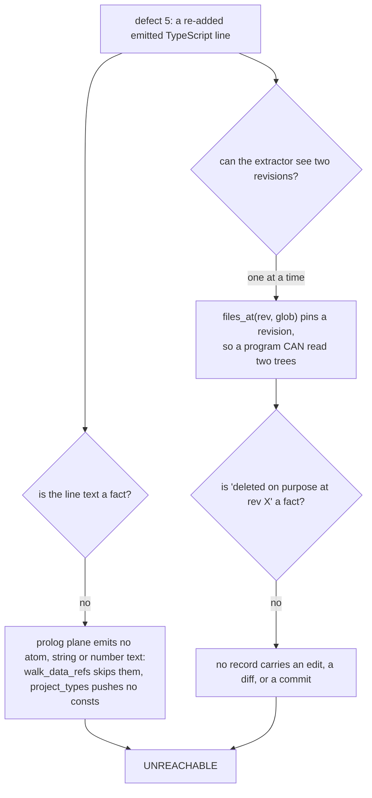
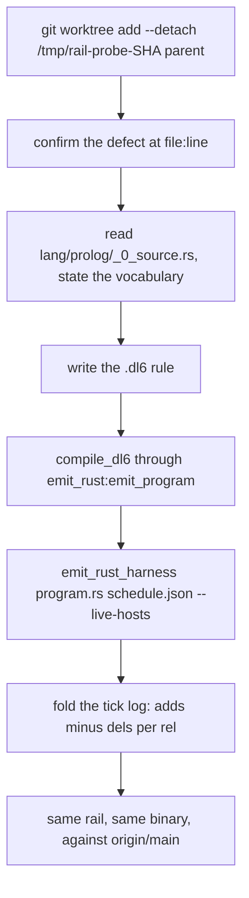

# extract-rails: can sprefa-extract plus a .dl6 rail catch the six defects we fixed today

Five of the six shapes are expressible over the facts sprefa-extract already
emits, four of those were run end to end through the rust door against the exact
revision each defect was alive at, and three earn a ship verdict. The sixth,
a line a previous commit deleted on purpose, is unreachable: the Prolog plane
carries no literal text at all, and nothing in the extractor sees git history.

## Contents

1. [Verdict](#verdict)
2. [How to run it](#how-to-run-it)
3. [The rails reconstruct the fix timeline](#the-rails-reconstruct-the-fix-timeline)
4. [The fact vocabulary the Prolog extractor emits](#the-fact-vocabulary-the-prolog-extractor-emits)
5. [One row per defect](#one-row-per-defect)
6. [Rail A, the one with zero false positives](#rail-a-the-one-with-zero-false-positives)
7. [Rail B, the negative result](#rail-b-the-negative-result)
8. [Rail C found a live defect on main](#rail-c-found-a-live-defect-on-main)
9. [What sprefa-extract would need for the shapes that failed](#what-sprefa-extract-would-need-for-the-shapes-that-failed)
10. [Three things the run measured that were not the question](#three-things-the-run-measured-that-were-not-the-question)
11. [Method and receipts](#method-and-receipts)

## Verdict

| # | defect | shape | expressible | TP at parent | FP on main | runtime | verdict |
|---|---|---|---|---|---|---|---|
| 1 | `parse_dl_dcg.pl` `mark/1` (#393) | whole-list walk per item, value rarely read | yes | 1 of 1 | 0 | 26s / 166 files | SHIP |
| 2 | `use_resolve.pl` `merge_col/3` (#393) | linear scan of an accumulator inside a fold | yes | 1 of 102 | 101 | same run | NO-SHIP |
| 3 | `parse_dl_dcg.pl:30` `dynamic` (#387) | mutable clause store under threads | yes | 1 of 5 | 4 | same run | SHIP as audit |
| 4 | `plunit_tests.pl` corpus walkers (#390) | duplicated expensive traversal | yes | 2 of 4 | 1 | same run | SHIP |
| 5 | `emit_ts.pl:2288` `state.deltas.rels` (#391) | a line a previous commit deleted on purpose | **no** | n/a | n/a | n/a | UNREACHABLE |
| 6 | `types.rs:711` `incremental_safe` (#391) | required serde field, committed fixtures lack it | yes | 8 of 15 | 7 | 5s / 33 files | SHIP as delta |

Every number in that table came out of the rails themselves, run through
`emit_rust_harness --live-hosts` on a detached worktree at the parent revision.
None is a simulation.

Two line numbers in the brief were off by the diff hunk offset: the `emit_ts.pl`
line is 2288 at `0bf43e111`, not 2264, and the `types.rs` field is at 711, not
690. Both defects are otherwise exactly as described.

## How to run it

```bash
bash v6/dl/hotpath/hotpath-rails.sh                       # this tree
bash v6/dl/hotpath/hotpath-rails.sh /path/to/other/tree   # any checkout
```

Files:

| path | what |
|---|---|
| `v6/dl/hotpath/prolog-hotpath-rails.dl6` | rails A, C, D |
| `v6/dl/hotpath/serde-default-rail.dl6` | rail E (defect 6) |
| `v6/dl/hotpath/*.adapters.json` | which hosts run linked in-process |
| `v6/dl/hotpath/hotpath-rails.sh` | compile through the rust door, fold the tick log |

Standing output on `origin/main` at `ba920f52e` is 12 rows: 0 from rail A, 4
from rail C, 1 from rail D, 7 from rail E. A rail is useful here as a DELTA
against that baseline, not as a gate that must read zero.

## The rails reconstruct the fix timeline

The same runner, the same binaries, five checkouts in commit order. Nothing in
the rails knows which revision it is reading.

| rail | `b0c319e57` #386 | `4584635a4` #389 | `0bf43e111` #390 | `b6ea091b7` #392 | `ba920f52e` main |
|---|---|---|---|---|---|
| A `mark/1` | HIT | HIT | HIT | HIT | clear |
| C `dynamic` scratch | **HIT** | clear | clear | clear | clear |
| D corpus walkers | **HIT** 4 rows | **HIT** 4 rows | 1 baseline | 1 baseline | 1 baseline |
| E `incremental_safe` | **HIT** 8 rows | **HIT** 8 rows | **HIT** 8 rows | clear | clear |

Each rail goes dark exactly at the commit that fixed its defect: C at
`e4fb45704` (#387), D at `0bf43e111` (#390), E at `bf2eb4bc0` (#391), A at
`ba920f52e` (#393). Reading down the columns is reading the PR list backwards.

## The fact vocabulary the Prolog extractor emits

`v6/sprefa-extract/src/lang/prolog/_0_source.rs` is 822 lines and projects four
planes off one tree-sitter parse. Predicate identity is `name/arity`, and `//`
for a DCG.

| record | columns a .dl6 host can read | what a Prolog file puts in it | emitted by |
|---|---|---|---|
| `node` family=`call` | `span`, `kind`='function', `name`=`pred/arity` | ONE ROW PER CLAUSE, span = the whole clause | `project_calls` |
| `node` family=`type` | `span`, `kind`='function', `name`=`pred/arity` | the same clause set, type plane | `project_types` |
| `site` family=`call` | `span`, `callee`=`pred/arity`, `callee_path` | every executed BODY goal, including builtins; `callee_path` is set only for a `Module:Goal` qualifier | `walk_goals` |
| `reference` family=`call` | `span`, `functor`=`pred/arity`, `position` | every compound term occurrence; `position` is `goal` / `head_arg` / `term_arg`. DIRECTIVES reach this record and never reach `site` | `walk_goals_refs` |
| `specifier` family=`call` | `span`, `name`, `kind`, `module` | `use_module` / `module` predicate indicators; `imported` is always null | `import_directive`, `module_declaration` |
| `node` family=`df` | `span` (zero length, keyed on the start byte), `kind`, `name` | `param`, `var_read`, `let_bind`, `call_res`, `lit`, `logic`, `binop`, `unop` | `project_df` |
| `edge` family=`df` | `kind`='direct', `from`, `to` | value flows into a call result | `project_df` |
| `node` family=`cst` | `span`, `kind` = the tree-sitter node type, `name` always null | the whole tree | `project_cst` |
| `resolved_edge` (`--resolve`) | `caller_path`, `caller_name`, `callee_path`, `callee_name`, `caller_site_start`, `caller_site_end` | caller to callee, FLAT, but ONLY for callees the supplied corpus defines | `Resolve<CallF>` |

What is NOT in it, measured rather than assumed:

| absent fact | consequence |
|---|---|
| the TEXT of any atom, string or number | `nb_setval(parse_furthest_remaining, R)` names no key a rail can read; `emit_ts.pl`'s emitted TypeScript lines are invisible; defect 5 dies here |
| the names a `dynamic/1` directive declares | the directive contributes one `dynamic/1` reference and nothing else; a rail cannot link the declaration to the predicate that gets retracted |
| argument POSITION on a df edge, and the `arg` / `param` records | prolog `project_df` pushes no `aux.args` and no `aux.params`; "the accumulator is argument 2 and it grows" cannot be said |
| a resolved edge for a BUILTIN callee | `call_name_match` needs a definition in the corpus, so `length/2`, `member/2`, `retractall/1` never produce one |
| anything about git history | the extractor takes a path and bytes; `files_at(rev, glob)` can pin ONE revision but no fact says "this line was deleted at that revision" |

Two things I expected to be blockers and measured to be false, worth writing
down because they cost half a lane:

- **The nested `span` object is readable.** A `.dl6` host declares
  `rel span(start: int, end: int).` and then `decode(SpanValue, {start: S, end: E})`.
  `v6/dl/dataflow/report_extract.dl6:120` is the shipped precedent. No flat
  span column is needed and no sed in the template is needed.
- **Caller attribution for builtins works.** Not through `--resolve`, which
  emits only `resolved_edge` and drops every builtin, but through span
  containment: a `site` inside a clause `node`'s span, with the innermost owner
  picked by `max(ClauseStart)`. That is the same `node_owner_start` shape
  `report_extract.dl6` already uses.

## One row per defect

### 1. `mark/1` ran `length/2` over the whole remaining input at every token

Confirmed alive at `b6ea091b7`, `parse_dl_dcg.pl:147-152`:

```prolog
mark(S) :-
    length(S, R),
    nb_current(parse_furthest_remaining, F),
```

The fix at `ba920f52e` did NOT remove the `length/2` call. It put a
`parse_marks_on` guard in front of it. So the naive rail ("a predicate that
calls `length/2` and has many call sites") reads `mark/1` as the TOP HIT at
both revisions and distinguishes nothing. Measured: 175 predicates call
`length/2` at the parent and 175 on main, `mark/1` first in both lists.

What discriminates is GOAL ORDER: an unguarded whole-list walk is the FIRST
body goal. `rail_a_unguarded_list_walk` is that plus a call-site count.

| threshold | rows at `b6ea091b7` | rows on main |
|---|---|---|
| >= 1 call site | 22 | 21 |
| >= 2 | 8 | 7 |
| >= 3 | 2 | 1 |
| >= 4 through >= 11 | **1, `mark/1`** | **0** |
| >= 12 | 0 | 0 |

The shipped threshold is 4. The band from 4 to 11 is eight thresholds wide and
gives the same answer at every one of them, so the number is not tuned to the
file.

### 2. `merge_col/3` scanned a growing accumulator once per column declaration

Confirmed alive at `b6ea091b7`, `use_resolve.pl:311-322`, `member/2` over
`Accum` inside the recursive clause. The fix moved the `member/2` out of
`merge_col/4` into a non-recursive `col_type_seen/6`, so the shape
"a linear scan inside a recursive clause" does discriminate.

It also fires 101 more times on main. See [Rail B](#rail-b-the-negative-result).

### 3. Four parse-scratch predicates were `dynamic` under `jobs(N)`

Confirmed alive at `b0c319e57`, `parse_dl_dcg.pl:30`. Fully expressible with no
spans at all: `reference` carries `functor` and `position` flat, `site` carries
`callee` flat.

`rail_c_shared_clause_store` = a file with a `dynamic/1` directive that both
asserts into and retracts from a clause store.

| revision | rows |
|---|---|
| `b0c319e57` | 5, including `parse_dl_dcg.pl` |
| `origin/main` | 4 |

Precision 1 of 5 against the named defect. What the other four are is
[section 7](#rail-c-found-a-live-defect-on-main).

The rail cannot be made tighter with today's facts. Tightening it means
"the predicate this file retracts is the one the `dynamic` directive declared",
and the directive's declared names are not in the vocabulary.

### 4. Four rail units each carried a copy of the corpus walk

Confirmed alive at `4584635a4`: `corpus_path/1` at :1762,
`catalog_audit_corpus_path/1` at :1788, `fixture_file_path/1` at :9625, and the
three `*_fixture_terms/2` copies at :1751, :1797, :9635.

`rail_d_duplicated_walk` fingerprints each predicate by the SET of goals its
clauses call, with self-calls normalized to `__self__` so two copies under
different names fingerprint the same, then pairs predicates in one file that
share a fingerprint, both read files, and have four or more distinct goals.

| revision | rows | what |
|---|---|---|
| `4584635a4` | 4 | `rail_fixture_terms/2` + `audit_fixture_terms/2`; `corpus_path/1` + `catalog_audit_corpus_path/1`; both paired with `type_id_rail_source/1` |
| `origin/main` | 1 | `corpus_memo_path/1` + `type_id_rail_source/1` |

Two of the four name the exact copy-pasted pairs PR #390 deleted. The standing
row on main is the same false positive that rides along at the parent:
`type_id_rail_source/1` opens and reads a file with the same goal set as a
corpus path builder and is not a duplicate of anything.

A group_concat fingerprint over a rel is a SET, not a multiset, because a rel
holds no duplicates. The multiset version (measured offline) makes no
difference to either number here.

### 5. `65607a8d5` re-added a line `b62ea5b9e` had deleted on purpose

Confirmed alive at `0bf43e111`, `emit_ts.pl:2288`. This is a GIT-HISTORY rail,
not a code rail, and sprefa-extract cannot see history.

Two independent walls, either one fatal:



The nearest thing that IS reachable: `files_at(rev, glob)` gives two trees, and
a rail could diff the FACT SETS between them (a predicate that lost a call site
and got it back). For a quoted string inside a list of emitted lines there is no
fact to diff. Section 8 prices what would change that.

### 6. A required serde field with no default, against committed fixtures

Confirmed alive at `0bf43e111`, `types.rs:711`, `pub incremental_safe: bool`
with no `#[serde(default)]`, against 9 committed `*.program.rs` snapshots of
which 8 lack the key.

This one needs facts the four families do not carry (Rust attributes are
nowhere in `type`, `call`, `df` or `cst`) and gets them from the extractor's
OTHER door, `--ast-pattern` mode, whose `capture` records carry flat
`text` / `start` / `end`. The embedded JSON comes from a `const` record, which
carries the whole literal as flat `text`.

```mermaid
flowchart LR
  S["--family type<br/>node kind=struct"] --> D["deserialize_struct"]
  A["--ast-pattern '#[$ARG]'<br/>capture ARG"] --> D
  A --> F["field_defaulted"]
  P["--ast-pattern 'struct S { pub $NAME: $TY }'<br/>selector field_declaration"] --> R["required_field"]
  D --> R
  F --> R
  C["--family type<br/>const record, text = the whole JSON"] --> K["field_present / field_absent<br/>instr(json, '\"name\"')"]
  R --> K
  K --> V["rail_e_missing_serde_default"]
```

| revision | rows | of which the defect |
|---|---|---|
| `0bf43e111` | 15 | 8, `ProgramJson` / `incremental_safe`, one per snapshot, exactly the eight PR #391 names |
| `origin/main` | 7 | 0 |

The 7 standing rows are `HostAdapterRow.adapter` (3), `TextInternPlan.lookup_sql`
(3) and `EnumVariantPlan.tag` (1). They are stable across both revisions, so
the rail's DELTA is exactly the eight defect rows.

Two things cost accuracy and are named rather than papered over:

- **ast-grep pattern mode has no optional-child form.** A `field_declaration`
  with a visibility modifier and one without are two separate patterns; the
  rail declares both.
- **The rail searches the JSON as TEXT, not as keys.** dl6 can read a `.json`
  file through the `data` family, but this JSON lives inside a Rust `const`, so
  the only handle is `instr/2` over the whole literal. A plain
  "carries two or more required fields" filter therefore matched every NESTED
  struct's field names too and read 104 rows at the parent against 96 on main.
  The shipped filter is "carries every required field BUT ONE", which is the
  actual shape of a field added without a default, and it cuts main to 7.

## Rail A, the one with zero false positives

```
rail_a_unguarded_list_walk  v6/prolog/compile/parse_dl_dcg.pl  mark/1  length/2  11
```

One row at `b6ea091b7`, `b0c319e57` and `4584635a4` (the defect was alive at all
three), zero rows at `ba920f52e`. 166 Prolog files scanned.

The brief's framing was that this shape was fixed once before in the deleted
hand-threaded parser (`ARCH.pl:910`) and came back with the DCG rewrite. The
rail is written over goal ORDER and call-site COUNT, both of which are
language-level facts, so it does not depend on the parser's spelling and would
have fired on the first commit that reintroduced the walk.

## Rail B, the negative result

"A linear scan inside a recursive clause" is the faithful reading of the
`merge_col/3` shape, and it is idiomatic Prolog:

| revision | rows | `merge_col/3` present |
|---|---|---|
| `b6ea091b7` | 102 | yes |
| `origin/main` | 101 | no |

101 false positives across `v6/prolog/*.pl`, including `lower.pl` fifteen times
and `0_type_plane.pl` six times. The rail is correct, it catches its defect, and
it is not shippable. It is not in the committed rail file; its whole text is:

```
rel linear_scan(callee: text).
linear_scan('member/2').
linear_scan('memberchk/2').
linear_scan('select/3').
linear_scan('selectchk/3').
linear_scan('nth0/3').
linear_scan('nth1/3').
linear_scan('subtract/3').
linear_scan('exclude/3').
linear_scan('include/3').

rel recursive_clause(path: text, clause_start: int, pred: text).
recursive_clause(Path, ClauseStart, Pred) <-
  clause_def(Path, ClauseStart, _, Pred),
  clause_goal(Path, ClauseStart, _, Pred).

rel rail_b_scan_in_recursion(path: text, pred: text, scan: text).
rail_b_scan_in_recursion(Path, Pred, Callee) <-
  recursive_clause(Path, ClauseStart, Pred),
  clause_goal(Path, ClauseStart, _, Callee),
  linear_scan(Callee).
```

To make it shippable you have to say what `merge_col` did that
`memberchk/2`-inside-`dedupe_terms/3` does not: the scanned list is the
ACCUMULATOR, an argument that GROWS across the recursive call. That needs
argument-position facts the Prolog df plane does not emit.

## Rail C found a live defect on main

`v6/prolog/use_resolve.pl:26,388-395` is one of the four rows still standing:

```prolog
:- dynamic(parse_count_fact/2).
...
    (   retract(parse_count_fact(Path, N))
    ...
    assertz(parse_count_fact(Path, N1)),
```

A retract-then-assert read-modify-write on a plain `dynamic` clause store, in
the module every plunit worker calls to parse. That is failure-mode 59's exact
shape, one file over from the one PR #387 fixed, and it is live at
`ba920f52e`. The other three standing rows (`dl6c.pl`,
`0_unsupported_messages.pl`, `tools/prolog_lint.pl`) are single-process entry
points and lint tooling, so their exposure is lower.

I have not filed this. It is a finding for the coordinator to price.

## What sprefa-extract would need for the shapes that failed

Ranked by what it buys, one row per change:

| # | change | file | unblocks |
|---|---|---|---|
| 1 | `aux.args` on the Prolog df plane: one `arg` record per (call span, position, argument span), the record the schema already defines for other languages | `lang/prolog/_0_source.rs` `walk_df` | rail B's real tightening. "The scanned list is argument N and the recursive call passes `[X\|argument N]`" becomes sayable, which is the difference between 102 rows and 1 |
| 2 | atom and literal TEXT at a span: a `const`-shaped record for Prolog, the way `lang/rust.rs` emits one | `lang/prolog/_0_source.rs` `project_types` | the `nb_setval` key name, and any rail over emitted-text content. Defect 5's code half |
| 3 | predicate indicators from a `dynamic`/`discontiguous`/`thread_local` directive, as `specifier`-shaped rows | `lang/prolog/_0_source.rs` `project_directive` | rail C's tightening from 5 rows to 1: link the declaration to the predicate the file retracts |
| 4 | `host_input_contract/3` keyed on the COLUMN SHAPE rather than on hardcoded host names | `v6/prolog/compile/registry.pl:336-390` | naming a host what it reads. Both shipped rails borrow registered names (`extract` reads call sites, `call_ref` reads directives, `call_node` reads Rust field captures) because an unregistered name cannot take the standard `(path, digest)` shape. This is `ARCH.pl` `cold_author_defects` D1 verbatim |
| 5 | a JSON key-set handle for a text column: `data`-family key rows over a string, or an un-refusing `json_each/2` | `compile/registry.pl:84` | rail E's `instr` text search becomes a key membership test; the 7 standing rows go to 0 |
| 6 | anything at all about history | nothing today | defect 5. `files_at(rev, glob)` pins a revision, so a fact-set diff across two revisions is already writable; a fact per EDIT is not |

Item 6 is the only one that is a design question rather than a patch. A rail for
"a line a previous commit deleted on purpose" is a git rail, and the plain
answer is that `git log -S'state.deltas.rels'` in a `sh` host is the whole
mechanism. Whether that belongs in this system is a question for Chris.

## Three things the run measured that were not the question

- **`v6/prolog/**/*.pl` is a scope bug.** Git's pathspec `**/` requires at least
  one directory, so that glob reads 124 of the 166 tracked Prolog files and
  silently drops every file directly under `v6/prolog/`, including `lower.pl`,
  `emit_ts.pl` and `use_resolve.pl`. `v6/dl/fixtures/dataflow-rail.dl6:19` uses
  that spelling. The correct one is `v6/prolog/*.pl`, because git's `*` crosses
  slashes.
- **`SoopyFilesExecutor` is dead code.** `hosts.rs:380` defines it and
  `executor_for` at `hosts.rs:44` never returns it, so a `files` host falls
  through to `ShellExecutor` and really does spawn one `git hash-object` per
  file. `v6/dl/dataflow/report-extract.sh` claims the linked path in its header.
- **Where the 26 seconds goes.** Extraction is not the cost.

  | leg | wall |
  |---|---|
  | `files` host, 166 `git hash-object` children | 5.9s |
  | extraction, 166 files, 8-way | 0.4s |
  | the engine: containment join, aggregates, 33k spans | ~19s |

  The 10-second law names a single operation. 166 files through a delta engine
  is a battery, and the per-file cost is 0.16s. The `files` leg alone is a
  defect worth fixing (item 2 above, or `git ls-files -s`).

## Method and receipts



- Probe revisions: `b6ea091b7` (defects 1, 2), `b0c319e57` (3), `4584635a4` (4),
  `0bf43e111` (5, 6). Each a detached read-only worktree, never edited, removed
  after the run.
- Baseline: `origin/main` at `ba920f52e`.
- Corpus: `v6/prolog/*.pl`, 166 files at main, 165 at `b0c319e57`.
  `v6/sprefa-engine-rs/src/*.rs`, 24 files, plus 9 `*.program.rs` snapshots.
- Every table row above is a fold of a real tick log. The offline Python
  cross-checks in the scratchpad agreed with the engine on every rail; where
  they disagreed (rail E's first filter) the engine's number is the one
  reported and the reason is written down.
- The lab is deleted per the lab protocol. Its durable content is the two rail
  files under `v6/dl/hotpath/` and the rail B text in section 7; nothing else
  in it survived.
