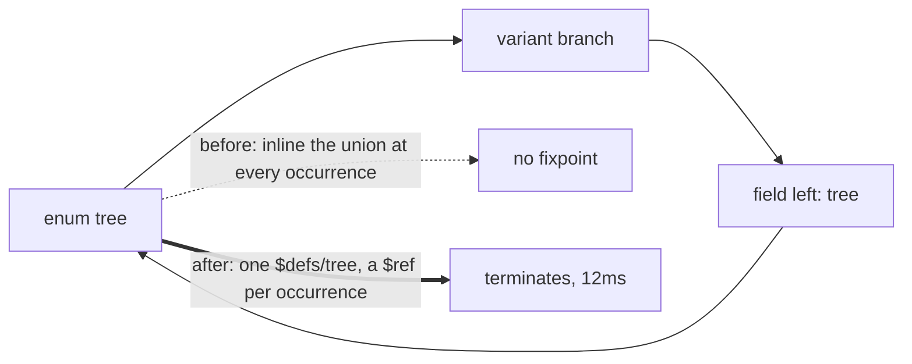

# jsonschema-rail-fix

Two cards, one branch: `fix/jsonschema-loop-and-rail`, base `3993e44aa`.

## Contents

1. [What was wrong](#what-was-wrong)
2. [BUG 1: the jsonschema loop](#bug-1-the-jsonschema-loop)
3. [BUG 2: the reverted ir_version rail](#bug-2-the-reverted-ir_version-rail)
4. [Gates](#gates)
5. [Not mine, measured pre-existing](#not-mine-measured-pre-existing)

## What was wrong

| # | card | symptom at 3993e44aa |
|---|---|---|
| 1 | `jsonschema-recursive-loop` | `4_emit_jsonschema.pl` never returns on the two recursive-enum fixtures; sweep's 10s alarm cuts them and drops both `schema.json` |
| 2 | `comment-rail-ir-version` | pre-commit rail red on an EMPTY index: `program load returned 400 ir_version_mismatch: program main was emitted at ir_version none and this runtime interprets 1` |



## BUG 1: the jsonschema loop

The cycle, from the catalog rows the emitter reads:

| row | meaning |
|---|---|
| `row(10,8,2,left,column,21,...)` | `tree_branch.left` is typed by row 21 |
| `row(21,0,0,tree,enum,0,...)` | row 21 is the `tree` enum |
| `row(23,21,2,branch,enum_variant,8,...)` | variant `branch` is rel 8, `tree_branch` |

`kind_schema/7`'s enum arm called `enum_schema/4`, which expanded every variant
field inline, which re-entered the enum. `7_emit_ts_types.pl` and
`8_emit_rust_types.pl` never looped on the same rows because they NAME the type:
`left: Tree` / `left: Tree`.

Fix, `v6/prolog/compile/4_emit_jsonschema.pl`:

| predicate | job |
|---|---|
| `recursive_enum_row/2` | is this enum reachable from itself through its variants' field types |
| `enum_successor_id/3`, `enum_type_id/3` | one hop of that graph, unwrapping list/option/json_list |
| `recursive_enum_def_pairs/3` | a `$defs` entry for each recursive enum, and only those |
| `kind_schema/7` enum arm | `$ref` when recursive, inline `oneOf` otherwise |

**The committed schema.json files were from the pre-feature era, and the
regenerated ones are correct.** At `28ec02ef8` the fixture's `left`/`right`
rendered `{"type":"integer"}`, and the same commit's `types.ts` said
`left: number`. The enum-typed-column feature landed after that and turned
`types.ts` into `left: Tree`; `schema.json` never caught up because the emitter
started looping at the same moment. The new output agrees with `types.ts` and
`types.rs` field for field:

| field | types.ts (HEAD) | types.rs (HEAD) | schema.json (this branch) |
|---|---|---|---|
| `tree_branch.id` | `number` | `i64` | `{"type":"integer"}` |
| `tree_branch.left` | `Tree` | `Tree` | `{"$ref":"#/$defs/tree"}` |
| `tree_branch.right` | `Tree` | `Tree` | `{"$ref":"#/$defs/tree"}` |
| `tree` | `\| { tag: 'leaf'; value } \| { tag: 'branch'; left; right }` | `enum Tree { Leaf{}, Branch{} }` | `{"oneOf":[{const leaf},{const branch}]}` |

Timings, `out/sweep.timings.tsv`, whole-fixture compile:

| fixture | 3993e44aa | this branch |
|---|---|---|
| `recursive_enum_acyclic_tree_round_trips` | `10334ms` (alarm) | `12ms` |
| `recursive_enum_cyclic_values_store_and_render` | `10412ms` (alarm) | `13ms` |

`SWEEP_EMIT_TIMEOUT` lines: 2 before, 0 after. Neither fixture is in the
slowest-ten list any more; the corpus's slowest compile is now
`clean_state_gate_and_exit_zero 75ms`.

Fail-first receipt:

```
% [1/1] wrapper_compositi.._ref_and_terminates .... **FAILED (5.216 sec)
    test wrapper_composition:recursive_enum_column_renders_a_named_ref_and_terminates:
    throw(time_limit_exceeded(3600.0))
```

## BUG 2: the reverted ir_version rail

Re-emitting the rail's golden would not have fixed it. `65607a8d5` deleted the
STAMP from both emitters and the check from the Rust runtime, leaving every
consumer standing.

| file | at 3993e44aa | restored |
|---|---|---|
| `v6/prolog/emit_ts.pl` | 0 `ir_version` | `ir_version(1).`, the `IGenProgramWithBoot` field, `ir_version: 1,` in the program object |
| `v6/prolog/emit_rust.pl` | 0 `ir_version` | `ir_version(1).`, `ir_version: IrVersion` in `ProgramDict` |
| `v6/sprefa-engine-rs/src/types.rs` | no field | `#[serde(default)] pub ir_version: u32` |
| `v6/sprefa-engine-rs/src/program.rs` | no `IR_VERSION` | the const, `IrVersionMismatch`, `try_from_json`, `from_json` |

The rail loads a `.dl6` SOURCE and the served door compiles it on demand
(`serve/0_compile.ts` `ProgramCompiler.compile`), so no committed golden program
needed regenerating. One snapshot did: `tests/fixtures/resident-coroutine.program.rs`,
regenerated through the recipe in its test's header.

The guard that was missing: nothing pinned the STAMP.
`v6/tsv2/tests/irVersion.test.ts` pins the CHECKER;
`dl6_build.rs both_emitters_and_the_runtime_agree_on_ir_version` pins the
NUMBER's agreement across three files. Added
`plunit_tests.pl incremental_mode:both_doors_stamp_the_ir_version_the_runtimes_interpret`,
which drives both emitters over `flagship_flow_reach_over_resolved_edges` and
asserts `  ir_version: 1,` in the TS text and `"ir_version":1` in the Rust text.

Fail-first receipt:

```
test incremental_mode:both_doors_stamp_the_ir_version_the_runtimes_interpret:
  received error: Unknown procedure: emit_ts:ir_version/1
```

and at the rail:

```
comment-budget rail: program load returned 400
{"error":"ir_version_mismatch: program main was emitted at ir_version none and this runtime interprets 1"}
```

## Gates

| gate | result |
|---|---|
| conformance `go.pl` | `461 PASS`, `FAILURES 1`, the one being `fail nested_zero_column_child_is_one_row_per_parent` (known-red group A) |
| sweep `SWEEP_JOBS=8`, one pass | `SWEEP_CACHE hit=109 recompiled=352`, `RUN total=352 identical=307 wrong=0 emitted_crash=39 rejection=6 no_oracle_log=0`, `FINAL total=352 final_identical=307 final_wrong=39 no_oracle_final=6`, wall `2.9s` |
| sweep, same numbers at base | measured at `3993e44aa` in this worktree: `RUN total=352 identical=307 wrong=0 emitted_crash=39 rejection=6` — identical |
| `schema.json` byte-changes | 2 files, both new, both the recursive-enum fixtures. Zero other `schema.json` changed |
| emitted `.ts` byte-changes | 352 files, exactly two line kinds: the `IGenProgramWithBoot` type and `+  ir_version: 1,` |
| plunit | `918` tests at base / `921` on this branch, `8 tests failed` both, THE SAME EIGHT names |
| `cargo check --all-targets` (sprefa-engine-rs) | `Finished`, clean (it did not compile at base) |
| rail, empty index | `git commit --allow-empty` rc=0 with the hook on; rail says `2262 ms, graded files 0` |
| rail, real violation | `RAIL_RC=2`, `graded files 1`, `v6/tsv2/runtime/probeViolation.ts:1-4 (4 comment lines)` |

Rail probes, verbatim:

```
$ git commit --allow-empty -m "probe: rail on an empty index"
[fix/jsonschema-loop-and-rail fe8098517] probe: rail on an empty index
PROBE_RC=0
comment-budget rail (dl6): 2262 ms, graded files 0
```

```
$ printf '// probe line one\n... four lines ...\n' > v6/tsv2/runtime/probeViolation.ts
$ git add v6/tsv2/runtime/probeViolation.ts && bash v6/tsv2/scripts/comment-budget-rail.sh
COMMENT BUDGET VIOLATION (max 2 consecutive comment lines in new code):
v6/tsv2/runtime/probeViolation.ts:1-4 (4 comment lines)
comment-budget rail (dl6): 1595 ms, graded files 1
RAIL_RC_VIOLATION=2
```

Both probe artifacts are gone: the empty commit was dropped and the probe file
deleted; `git status` is clean at `484f8fb7f`.

The two enum fixtures' RUN legs stay red (both are in the `emitted_crash=39`
list, known-red group B, the enum-plane arrival encoding). This branch fixes
their SCHEMA EMISSION, not their runtime leg, so no `.github/CI-KNOWN-RED.md`
row flips.

## Not mine, measured pre-existing

| thing | exact text | measured |
|---|---|---|
| plunit's 8th red | `test rel_template_and_is_clause:a_relation_arrow_prints_the_equivalent_explicit_declaration: failed` | red at `3993e44aa` too, not in CI-KNOWN-RED |
| sweep known-red drift | group B's row records `emitted_crash=8`; the measurement at `3993e44aa` is `emitted_crash=39`, message `Cannot read properties of undefined (reading 'rels')` | not touched: editing that row is not this branch's call |
| 8 stale Rust snapshots | `panicked at tests/fixtures/bytes_type_system.program.rs:11:40` / `Error("missing field 'incremental_safe'")`. `bounded_measure_recursion`, `bytes_type_system`, `diverging_measure_recursion`, `list_persistence`, `live_extract_calls`, `live_shell_probe`, `source-mutations`, `source-offline-golden` | `65607a8d5` made `incremental_safe` required without regenerating them. Only `resident-coroutine` (needed by the ir_version guard) regenerated here; the other eight name no source `.dl6` in their tests, so regenerating them is a guess |
