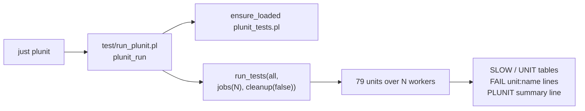

# plunit-jobs: the compiler unit battery runs parallel

- [What changed](#what-changed)
- [Timings](#timings)
- [Failing set](#failing-set)
- [The race that had to be fixed first](#the-race-that-had-to-be-fixed-first)
- [Per-test timing surface](#per-test-timing-surface)
- [Legs re-measured for safety](#legs-re-measured-for-safety)
- [Commits](#commits)
- [Left open](#left-open)

## What changed



| file | change |
|---|---|
| `v6/prolog/compile/test/run_plunit.pl` | NEW. The recipe's entry. Reads `PLUNIT_JOBS` (default `cpu_count`) and `PLUNIT_SLOWEST` (default 15), runs `run_tests/2` with `jobs(N)`, prints the slowest tests, the slowest units, one sorted `FAIL unit:name` per failure, and a `PLUNIT ...` summary. Exits 1 on any failure or timeout, as before. |
| `v6/justfile` | `plunit` recipe now loads `test/run_plunit.pl -g plunit_run`. Budget comment carries the measured walls. |
| `v6/prolog/compile/parse_dl_dcg.pl` | four parse-scratch predicates `dynamic` -> `thread_local`. Without this, parallel is wrong (below). |
| `v6/tools/green-parallel.sh` | the `plunit` leg in the 6-up pool gets `PLUNIT_JOBS=2`, so six concurrent legs cannot ask for 72 threads on a 12-core box. |

Nothing in `plunit_tests.pl` needed changing: no test blocked parallelism.

## Timings

12-core machine, other lanes live. Wall measured around `just plunit` itself.

| side | run 1 | run 2 | run 3 | median |
|---|---|---|---|---|
| before, `just plunit` on `origin/main` (sequential) | 44.17s | 36.82s | 54.29s | 44.17s |
| after, `PLUNIT_JOBS=1 just plunit` (driver, sequential) | 45.99s | 37.52s | 41.43s | 41.43s |
| after, `just plunit` (jobs=12, the new default) | 12.64s | 12.96s | 16.15s | 12.96s |

The `jobs=1` row is the control: the driver on its own costs nothing, so the
whole difference is the parallelism. Median 44.17s -> 12.96s, **3.4x**.

Ceiling: plunit schedules one UNIT per worker, so the makespan is the slowest
unit, and `catalog_plane_rail` alone is 12.6s of it. More workers buy nothing
until that unit is split.

| unit | wall in the parallel run |
|---|---|
| catalog_plane_rail | 12.604s |
| catalog_audit_rail | 14.965s (across its tests) |
| interned_storage_rail | 9.045s |
| everything else | under 5.3s each |

## Failing set

8 failures, identical on every one of the 7 runs measured after the change
(3 at jobs=12, 3 at jobs=1, 1 final confirmation), and identical to the
sequential baseline. Matches the `.github/CI-KNOWN-RED.md` allowlist.

```
FAIL catalog_plane_rail:level_plane_family_corpus_counts
FAIL json_merge_patch:json_patch_lowers_with_the_null_stand_in_guard
FAIL json_merge_patch:merge_patch_stops_on_a_nested_json_null_stand_in
FAIL json_merge_patch:merge_patch_stops_on_the_json_null_stand_in
FAIL module_path_decls:a_zero_column_childs_name_used_as_a_value_is_not_rewritten
FAIL rel_template_and_is_clause:a_relation_arrow_prints_the_equivalent_explicit_declaration
FAIL rel_zero_arity:a_root_rel_zero_still_has_no_storage
FAIL subscribe_cone:golden_flex_cone_invariants
```

The pre-change baseline prints only 5 of the 8 names (plunit's `ERROR` lines
elide the long ones); those 5 match, and the other 3 are the three named in
`.github/CI-KNOWN-RED.md:80,89`. Making the set greppable is what the new
`FAIL` lines are for.

## The race that had to be fixed first

`parse_dl_dcg.pl` kept `finding_fact/1`, `rel_column_order_fact/2`,
`host_signature_fact/3` and `source_statement_fact/3` as plain `dynamic`.
`parse_dl_source/5` retractalls all four at entry, asserts into them mid-parse,
and reads them back at exit. One clause store shared by every thread, and every
unit parses.

| receipt | jobs | failures |
|---|---|---|
| fail-pre-fix (declaration reverted to `dynamic`) | 12 | 22 |
| fail-pre-fix, second run | 12 | 25 |
| fail-pre-fix, third run | 12 | 18 |
| with `thread_local` | 12 | 8, 8, 8 |
| with `thread_local` | 1 | 8, 8, 8 |

The extra failures were parse-shaped and scattered across units that have
nothing to do with each other (`dot_member_access`, `fact_seeding`,
`json_grammar`, `module_path_decls`, `rel_zero_arity`,
`rel_template_and_is_clause`, `type_relation_ir`), a different set each run.

Filed as `docs/failure-modes.md` entry 59: entry 54's class one layer down.
54 was a shared temp PATH, this is a shared clause STORE.

Audited and clean, no fix needed:

| shape | verdict |
|---|---|
| `tmp_file/2`, `tmp_file_stream/3` (dl6c, use_module_system, mount_door, fact_seeding) | SWI mints `swipl_<base>_<pid>_<counter>`; 8 concurrent calls gave 8 distinct names. Carries pid + a process-local sequence already. |
| clock-derived fixture names (entry 54's exact shape) | none in the prolog battery. |
| `nb_setval` caches (`parse_dl_dcg`, `0_generic_expand`, `diag`, `compile_messages`) | SWI global variables are per-thread; each is set before it is read inside one call. |
| fixed path `/private/tmp/compiler-relations.types.ts` (`compiler_relations.test.pl:132`) | one test, one unit, sequential within the unit. Would collide only with a second `just plunit` on the same box. |
| `sqlite3` subprocesses (`:memory:`, and one `tmp_file` db) | no shared file, no port. |
| no test opens a port | grep clean. |

## Legs re-measured for safety

The `thread_local` change touches the parser, so the three legs that read parser
output were run with and without it and diffed:

| leg | with vs without the change |
|---|---|
| `just conformance` | byte-identical output |
| `just roundtrip` | byte-identical output |
| `just text-door` | identical modulo `COMPILE-TRACE` timing lines |
| `just prolog-lint` | 16 findings both sides, same 16 lines. No new finding from the driver. |

All four are red on `origin/main` before the change too; none moved.

## Commits

| sha | subject |
|---|---|
| ff2b59bfd | perf(tests): plunit jobs(N), per-test timing, greppable failing set |

## Left open

- `.github/CI-KNOWN-RED.md` says `7 tests failed` for the plunit leg in three
  rows; the real count is 8 and has been for a while. Not touched here.
- `catalog_plane_rail` is 12.6s of a 12.9s run. Splitting it is the next 3x.
- `use_resolve.pl:25` `parse_count_fact/2` and `0_unsupported_messages.pl:137`
  `unsupported_inventory_memo/1` are still plain `dynamic`. Keyed and idempotent
  respectively, so no test reads a wrong value today.
