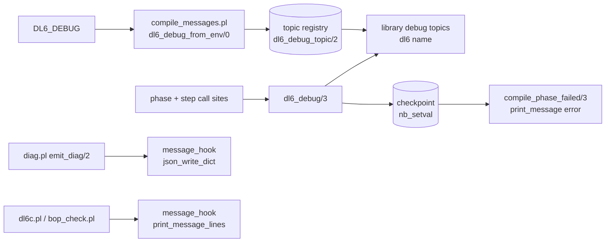
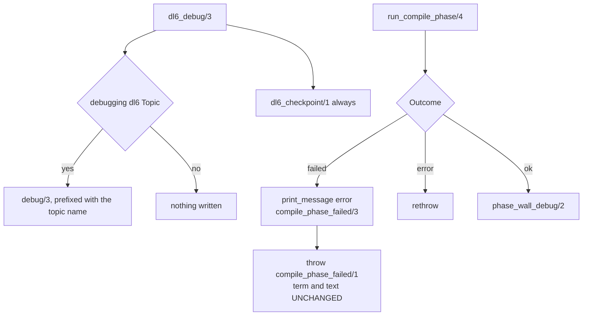

# obs(dl6): library(debug) topics per phase, print_message failure diagnosis

Branch `feature/prolog-debug-topics`, base `942cf1443`, commit `9e039bb4f`.

## Contents

1. [What landed](#what-landed)
2. [Topic registry](#topic-registry)
3. [The one door](#the-one-door)
4. [format( sites moved](#format-sites-moved)
5. [Gates](#gates)
6. [DL6_DEBUG=all, one compile](#dl6_debugall-one-compile)
7. [probe651 acceptance demo](#probe651-acceptance-demo)

## What landed



| file | change |
|---|---|
| `v6/prolog/compile_messages.pl` | new. Topic registry, DL6_DEBUG parser, every `prolog:message//1` clause, both `message_hook/3` clauses. |
| `v6/prolog/compile.pl` | `run_compile_phase/4` (carries the program name), per-phase count probes, `check_step/2` around the six plan-time checks. |
| `v6/prolog/1_expansion.pl` | `run_phase/4` splits into an instrumented head plus `run_phase_call/4`. |
| `v6/prolog/diag.pl` | `emit_diag/2` writes through `print_message/2`. |
| `v6/prolog/dl6c.pl`, `compile/scripts/bop_check.pl` | `print_rendered_error/2` writes through `print_message/2`. |
| `v6/prolog/sweep.pl` | `dl6(sweep)` per fixture and one run total. |
| `compile/scripts/compile_dl6.sh`, `v6/tsv2/scripts/sweep.sh` | `-g compile_messages:dl6_debug_from_env` before the work goal. |

## Topic registry

Registry source: `v6/prolog/compile_messages.pl:33-41` (`dl6_debug_topic/2`). `DL6_DEBUG=all`
and the unknown-topic warning both read that table, so the list is written once.

| topic | env spelling | what it logs | call sites |
|---|---|---|---|
| `dl6(parse)` | `DL6_DEBUG=parse` | source path; phase begin/done wall+inferences; decls, rules, surface findings parsed | `compile.pl:573`, `compile.pl:784` |
| `dl6(plan)` | `DL6_DEBUG=plan` | phase begin/done; decls and rules after expansion; rel plans, arrival targets, subscribed rels, intern mode | `compile.pl:270`, `compile.pl:278` |
| `dl6(expand)` | `DL6_DEBUG=expand` | one `enter` line per `1_expansion.pl` phase (name + order), then decls and rules in/out | `1_expansion.pl:114` |
| `dl6(check)` | `DL6_DEBUG=check` | the six plan-time checks by name, each named BEFORE it runs: `reserved_namespace`, `supported_subset`, `clock`, `world_shapes`, `single_arity`, `edge_head_column_types` | `compile.pl:266` |
| `dl6(lower)` | `DL6_DEBUG=lower` | phase begin/done; arrival, edge, level and delta statement counts | `compile.pl:793` |
| `dl6(boot)` | `DL6_DEBUG=boot` | phase begin/done; seed rows in, boot statements out | `compile.pl:805` |
| `dl6(emit)` | `DL6_DEBUG=emit` | phase begin/done; emitter `Module:Pred` and emitted character count | `compile.pl:814` |
| `dl6(write)` | `DL6_DEBUG=write` | phase begin/done; output path and byte count | `compile.pl:751` |
| `dl6(sweep)` | `DL6_DEBUG=sweep` | per fixture: name, file, bucket, reason. Then the run total. | `sweep.pl:111`, `sweep.pl:167`, `sweep.pl:274` |

Spelling: comma list, `all`, or a single name. Whitespace around a name is stripped.
`DL6_DEBUG=plan,expand`, `DL6_DEBUG=all`. Parsed in exactly one predicate,
`compile_messages:dl6_debug_enable/1` (`compile_messages.pl:100`). Wired into the two
drivers only: `compile/scripts/compile_dl6.sh:40` and `v6/tsv2/scripts/sweep.sh:51`.
The `DL_PERF_LOG` branch of `compile_dl6.sh` and `6_profile.pl` are untouched.

An unknown name is a warning that prints the whole known list, not a silent no-op:

```
Warning: [Thread main] DL6_DEBUG names no such topic: nosuchtopic
Warning: [Thread main]     known topics: parse,plan,expand,check,lower,boot,emit,write,sweep
```

### Cost when a topic is off

| thing | when off |
|---|---|
| output | zero bytes (measured: `cmp` of stderr, forced-error and clean compiles) |
| counts (`length/2`, `size_file/2`, `dl6_program_sizes/3`) | not computed. Each sits behind `dl6_debugging/1` (`compile_messages.pl:64`). |
| checkpoint | recorded (`nb_setval/2`, one atom-or-small-compound per phase and per expansion step). A failure diagnosis that only works under DL6_DEBUG is no diagnosis, so this one is unconditional. |

## The one door

`compile_messages.pl` holds all three surfaces; nothing else in the pipeline formats a
message or writes to `user_error` outside it.



`compile_phase_failed(Phase)` keeps its arity, its functor, and its rendered text
(`compile_messages.pl:152-153`). `.github/CI-KNOWN-RED.md:47` matches that exact term in the
text-door receipt and still does. The new detail (`compile_phase_failed/3`,
`compile_messages.pl:157-160`) is printed additively at the failing phase, where the
checkpoint is still the one the phase reached.

## format( sites moved

| site (at 942cf1443) | was | now | byte check |
|---|---|---|---|
| `v6/prolog/diag.pl:159-163` `emit_diag/2` | `json_write_dict(Stream, Record, [width(0)]), nl(Stream)` | `print_message(error, dl6_diag(Stream, Record))` at `diag.pl:162`; the same two goals run inside `user:message_hook/3` at `compile_messages.pl:125-127` | `cmp` on saved stderr, parse error and unsupported construct: IDENTICAL |
| `v6/prolog/dl6c.pl:109` `print_rendered_error/2` | `format(user_error, "~w: ~w~n", [Prefix, Text])` | `print_message(error, dl6_cli_error(Prefix, Text))` at `dl6c.pl:110`; rendered by `print_message_lines(user_error, '', Lines)` at `compile_messages.pl:132` | `cmp` on `dl6c` stderr: IDENTICAL |
| `v6/prolog/compile/scripts/bop_check.pl:124` `print_rendered_error/2` | same shape | `print_message(error, dl6_cli_error(Prefix, Text))` at `bop_check.pl:125` | same renderer, same bytes |

Kept as-is by instruction: `compile.pl:924`, the `COMPILE-TRACE` writer. Its format string is
untouched (`git diff HEAD~1 -- v6/prolog/compile.pl | grep COMPILE-TRACE` prints nothing).

Not moved, and named here rather than silently left: the arrival-shape rejections at
`compile/scripts/0_json_arrival.pl:50`, `:104`, `:117` each `format(user_error, ...)` then
`halt(1)`. They are outside the compile phase spine and outside this arc's file set.

## Gates

| gate | command | result |
|---|---|---|
| conformance | `cd v6/prolog/conformance && swipl -q -g go -t halt go.pl` | `461` PASS, `FAILURES  1`. The one red is `fail  nested_zero_column_child_is_one_row_per_parent`, the known red. Matches the stated 461 / 1. |
| plunit | `cd v6 && just plunit` | `ERROR: [Thread main] 7 tests failed`. Same seven names as base `942cf1443`, measured on a scratch worktree of that sha: `subscribe_cone:golden_flex_cone_invariants`, `catalog_plane_rail:level_plane_family_corpus_counts`, `module_path_decls:a_zero_column_childs_name_used_as_a_value_is_not_rewritten`, `rel_zero_arity:a_root_rel_zero_still_has_no_storage`, and three `json_merge_patch` rows. |
| sweep, stage 1 only | `cd v6/tsv2 && bash scripts/sweep.sh` | `TIMEOUT sweep.sh: stage 1 compile sweep exceeded 900s`, `rc=124`, `real 15m0.035s`. **The same run at base `942cf1443` in a scratch worktree wedges at the identical fixture with the identical output count.** See [stage 1 does not complete, at base either](#stage-1-does-not-complete-at-base-either). |
| `out/` byte-diff vs base | `diff -rq <base>/v6/prolog/compile/out /branch/v6/prolog/compile/out` after both stage-1 runs | **0 differing files across 1400 entries.** `git diff --diff-filter=M -- v6/prolog/compile/out/` is `0` files in BOTH trees; the only working-tree change either run makes is `1134` deletions from the sweep's own `clear_stale_compiled_outputs/1`, identical in both. |
| `manifest.json` vs base | `git diff --name-only -- v6/prolog/compile/out/manifest.json` | `0` files, in both trees. Stage 1 writes the manifest after the last fixture, so a wedged stage 1 never reaches it, at base or on this branch. |
| byte-diff, 3 emitted programs | `compile_dl6.sh` on `pokeapi_shape.dl6`, `door-handwritten.dl6`, `flagship-callgraph.dl6`, before vs after | `POKEAPI_IDENTICAL`, `door-handwritten IDENTICAL`, `flagship-callgraph IDENTICAL` (1696572, 48682, 190945 bytes) |
| byte-diff, stderr JSON on forced error | parse error (`dl_parse_error/2`) and unsupported construct (`head_column_type_conflict/6`), before vs after | `forced_error STDERR BYTE IDENTICAL`, `forced_unsup STDERR BYTE IDENTICAL`; `dl6c` path also `DL6C_STDERR_BYTE_IDENTICAL` |
| perf, topics off | `time compile_dl6.sh pokeapi_shape.dl6`, base worktree at 942cf1443 vs branch, 5 alternating runs each | base wall 0.98/0.99/1.01/1.02/1.05, branch 0.99/1.00/1.01/1.02/1.08. Median 1.01 vs 1.01. `COMPILE-TRACE total` over 3 more alternating runs: base 855/865/867, branch 846/878/882. Median +1.5%, inside 5%. Emitted output `POKEAPI_AB_IDENTICAL`. |

Conformance and plunit were each measured on this tree and on a scratch worktree of
`942cf1443` so the red sets are compared, not asserted.

Gate scope, set by the coordinator mid-arc: sweep stage 1 (the compile sweep) plus a byte-diff
of `v6/prolog/compile/out/` and `manifest.json` against the committed base. Stages 2 to 4
(oracle dump, node replay, reason diff) execute emitted programs and replay ticks; this arc
changes only what the compiler WRITES to stderr, and the stage 1 byte-diff already covers every
emitted byte, so those stages prove nothing extra here.

### stage 1 does not complete, at base either

Pre-existing, and already the top entry in the known-red file. `.github/CI-KNOWN-RED.md:13-19`,
written 2026-08-19: CI's `Generate text-door corpus` step "ran `bash v6/tsv2/scripts/sweep.sh`,
which exited 124 on `TIMEOUT sweep.sh: stage 1 compile sweep exceeded 900s`".

Measured here on both trees, same machine, sequentially:

| | base `942cf1443` (scratch worktree) | branch `1460e0589` |
|---|---|---|
| stage 1 outcome | wedged, killed at 900s | wedged, killed at 900s |
| exact receipt | `timeout -s KILL 900 swipl -q -l ../prolog/sweep.pl -g sweep -g halt` -> `Killed: 9`, `rc=137`, `real 15m0.010s` | `bash scripts/sweep.sh` -> `TIMEOUT sweep.sh: stage 1 compile sweep exceeded 900s`, `rc=124`, `real 15m0.035s` |
| `out/*.ts` written before the wedge | 135 | 135 |
| last artifact written | `recursive_enum_acyclic_tree_round_trips.ts` + `.schedule.json` | same |
| next artifact, never written | `recursive_enum_acyclic_tree_round_trips.schema.json` | same |
| `diff -rq` of the two `out/` trees | 0 differing files, 1400 entries | |

The wedge sits in step 3 of `sweep.pl:sweep_one/6`, the schema emission
(`catalog_decl_rows/6` then `option_rows/3` then `jsonschema_text/3`), on the SELF-REFERENTIAL
enum `enum_decl(tree, (leaf(value: int) ; branch(left: tree, right: tree)))`
(`v6/prolog/conformance/fixtures/17_recursive_enum.pl:10`). A `sample` of the wedged process
shows every cycle in `growLocalSpace` / `growStacks`: local-stack growth, the signature of a
non-terminating recursion, not slow work. Isolated to one fixture and run in both trees, that
step hangs in both.

Named, not fixed: outside this arc, and the arc's own byte-diff shows every artifact the sweep
DOES reach is unchanged. The fixture's `schema.json` is committed from `28ec02ef8`, so the
recursion terminated when it landed and stopped terminating later.

## DL6_DEBUG=all, one compile

```
$ DL6_DEBUG=all bash v6/prolog/compile/scripts/compile_dl6.sh \
    v6/dl/fixtures/door-handwritten.dl6 /tmp/o2.ts
% [Thread main] dl6(parse) source v6/dl/fixtures/door-handwritten.dl6
% [Thread main] dl6(parse) begin program=door-handwritten
% [Thread main] dl6(parse) done wall=9ms inferences=57896
% [Thread main] dl6(parse) parsed decls=17 rules=1 findings=0
% [Thread main] dl6(plan) begin program=door-handwritten
% [Thread main] dl6(check) reserved_namespace
% [Thread main] dl6(expand) enter option (order 5)
% [Thread main] dl6(expand) option decls 17->18 rules 1->1
% [Thread main] dl6(expand) enter enum (order 10)
% [Thread main] dl6(expand) enum decls 18->25 rules 1->3
% [Thread main] dl6(expand) enter decl_spread (order 20)
% [Thread main] dl6(expand) decl_spread decls 25->25 rules 3->3
% [Thread main] dl6(expand) enter row_spread (order 30)
% [Thread main] dl6(expand) row_spread decls 25->25 rules 3->3
% [Thread main] dl6(expand) enter match (order 40)
% [Thread main] dl6(expand) match decls 25->25 rules 3->3
% [Thread main] dl6(expand) enter seq (order 42)
% [Thread main] dl6(expand) seq decls 25->25 rules 3->3
% [Thread main] dl6(expand) enter dot (order 44)
% [Thread main] dl6(expand) dot decls 25->25 rules 3->3
% [Thread main] dl6(expand) enter coalesce (order 45)
% [Thread main] dl6(expand) coalesce decls 25->25 rules 3->3
% [Thread main] dl6(expand) enter ast (order 46)
% [Thread main] dl6(expand) ast decls 25->25 rules 3->3
% [Thread main] dl6(expand) enter negated_guard (order 47)
% [Thread main] dl6(expand) negated_guard decls 25->25 rules 3->3
% [Thread main] dl6(expand) enter relation_edge (order 50)
% [Thread main] dl6(expand) relation_edge decls 25->25 rules 3->3
% [Thread main] dl6(plan) expanded decls=25 rules=3
% [Thread main] dl6(check) supported_subset
% [Thread main] dl6(check) clock
% [Thread main] dl6(check) world_shapes
% [Thread main] dl6(check) single_arity
% [Thread main] dl6(check) edge_head_column_types
% [Thread main] dl6(plan) planned rels=5 arrival targets=3 subscribed=0 intern=dict
% [Thread main] dl6(plan) done wall=3ms inferences=29171
% [Thread main] dl6(lower) begin program=door-handwritten
% [Thread main] dl6(lower) done wall=2ms inferences=9495
% [Thread main] dl6(lower) arrival=3 edge=0 level=2 delta=5
% [Thread main] dl6(boot) begin program=door-handwritten
% [Thread main] dl6(boot) done wall=0ms inferences=416
% [Thread main] dl6(boot) seed rows=0 boot statements=5
% [Thread main] dl6(emit) begin program=door-handwritten
% [Thread main] dl6(emit) done wall=6ms inferences=56940
% [Thread main] dl6(emit) emitter=emit_ts:emit_program characters=48682
% [Thread main] dl6(write) begin program=door-handwritten
% [Thread main] dl6(write) /tmp/o2.ts bytes=48682
wrote /tmp/o2.ts
% [Thread main] dl6(write) done wall=1ms inferences=257
COMPILE-TRACE program=door-handwritten parse=9/57896 plan=3/29171 lower=2/9495 boot=0/416 emit=6/56940 write=1/257 total=21/154175
```

## probe651 acceptance demo

The plan bug is at `65607a8d5`, not at this branch's base: `/tmp/probe651.dl6` compiles clean
at `942cf1443`. Demo tree: throwaway branch `throwaway/probe651-obs`, `65607a8d5` with
`9e039bb4f` cherry-picked (two conflicts, both in the hunks this arc touches, resolved to keep
both sides).

**Before**, at `65607a8d5` with `v6/prolog` reverted to that sha:

```
ERROR: [Thread main] -g compile_dl6('/tmp/probe651.dl6', '/tmp/probe651_base.ts'): compile phase plan failed and threw no ball
```

**After**, same tree, instrumentation applied:

```
ERROR: [Thread main] dl6: phase plan failed on program probe651 (failure, not a thrown ball)
ERROR: [Thread main]     last checkpoint: check / reserved_namespace
ERROR: [Thread main]     re-run with DL6_DEBUG=all for the per-phase log
ERROR: [Thread main] -g compile_dl6('/tmp/probe651.dl6', '/tmp/probe651_new.ts'): compile phase plan failed and threw no ball
```

With `DL6_DEBUG=all` the tail reads:

```
% [Thread main] dl6(parse) source /tmp/probe651.dl6
% [Thread main] dl6(parse) begin program=probe651
% [Thread main] dl6(parse) done wall=197ms inferences=371397
% [Thread main] dl6(parse) parsed decls=122 rules=22 findings=0
% [Thread main] dl6(plan) begin program=probe651
% [Thread main] dl6(check) reserved_namespace
ERROR: [Thread main] dl6: phase plan failed on program probe651 (failure, not a thrown ball)
```

Read: parse is clean (122 decls, 22 rules, 0 findings). Plan died after
`check_reserved_namespace/1` and before the first expansion phase (`dl6(expand) enter option`
never prints). Exactly two goals sit in that gap at `65607a8d5`,
`preserve_compiler_type_rules/5` and `prepare_program_for_compiler/2`.

Bisected by hand to name it, NOT fixed here (out of scope for this arc):

```
?- expand_uses('/tmp/probe651.dl6', ..., Prog, _, B, _),
   check_reserved_namespace(Prog),
   ( preserve_compiler_type_rules(Prog, B, RP, CR, CB) -> writeln(ok) ; writeln(preserve_FAILED) ).
preserve_FAILED
```

**The bug**: `compile:preserve_compiler_type_rules/5`, `v6/prolog/compile.pl:142` at
`65607a8d5`, FAILS (does not throw) on `/tmp/probe651.dl6`. Downstream, its own recursive read
of the rule index throws `unsupported_construct: compiler refused rule 'refused_host_decl'`,
which the enclosing failure swallows. Filed as: plan phase silently fails on a program that
compiles at `942cf1443`.
