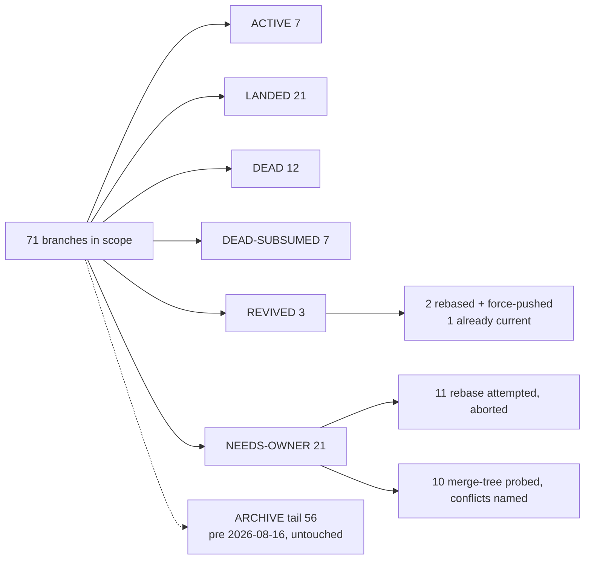
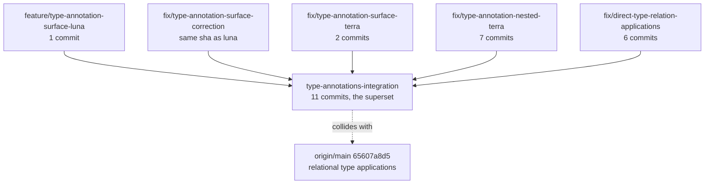

# Rebase crew: the branch board

Base of record: `origin/main` = `e5fcdf55a` (`perf(sweep): cold sweep 6.1s -> 2.6s, driver-side only (#388)`).
Every ahead/behind in this file was measured against that sha on 2026-08-20.

## Contents

1. [Verdict in one picture](#verdict-in-one-picture)
2. [THE BOARD](#the-board)
   - [ACTIVE, not touched](#active-not-touched)
   - [REVIVED, rebased and moved](#revived-rebased-and-moved)
   - [NEEDS-OWNER, rebase aborted](#needs-owner-rebase-aborted)
   - [LANDED](#landed)
   - [DEAD and DEAD-SUBSUMED](#dead-and-dead-subsumed)
   - [ARCHIVE tail, pre 2026-08-16](#archive-tail-pre-2026-08-16)
3. [Safe to delete](#safe-to-delete)
4. [Per NEEDS-OWNER branch: the collision](#per-needs-owner-branch-the-collision)
5. [Method and its limits](#method-and-its-limits)

## Verdict in one picture



Three branches carry unlanded work that a rebase could seat cleanly. Twenty-one carry unlanded
work whose conflicts are compiler or runtime logic, so the owner decides. Everything else is
already in `main` or has zero unique commits.

## THE BOARD

Column key: `a/b` = ahead/behind `origin/main` before any action. `dirty?` = file count from
`git status --porcelain` in the branch's own checked-out worktree (`-` = no worktree).

### ACTIVE, not touched

| branch | a/b | rebased-to | conflicts | dirty? | next move for owner |
|---|---|---|---|---|---|
| `main` | 0/0 | untouched | none | 34 | user's live tree, uncommitted `TASKS/` and `issues/` work |
| `lab/graph-lowering` | 1/3 | untouched | none | 0 | user's live lab |
| `fix/test-estate-green` | 1/4 | untouched | none | 22 | in-flight lane |
| `feature/plunit-junit` | 2/0 | untouched | none | 0 | in-flight lane, already on current base |
| `perf/compiler-hotpath` | 0/0 | untouched | none | 0 | in-flight lane, sitting on main |
| `perf/catalog-rail-split` | 0/0 | untouched | none | 4 | in-flight lane, sitting on main |
| `fix/tsv2-hygiene` | 0/0 | untouched | none | 22 | in-flight lane, sitting on main |

### REVIVED, rebased and moved

| branch | a/b | rebased-to | conflicts | dirty? | next move for owner |
|---|---|---|---|---|---|
| `feature/prolog-debug-topics` | 4/12 | `161ff619b` (1 commit) | none | 0 | 3 of 4 commits are PR #381; the survivor is a `TASKS/` report edit. Branch moved and force-pushed. Nothing to gate. |
| `refactor/a1-declaration-index` | 1/4 | `c2a999ffe` (1 commit) | none | 0 | report-only, `TASKS/a1-declaration-index.REPORT.md`, 369 lines. Branch moved and force-pushed. Nothing to gate. |
| `feature/canonical-type-row-plan` | 2/0 | no rebase needed | none | 0 | already `origin/main` + 2. Owner runs `just plunit` and `sweep.sh` and opens the PR. |

`--onto` was used for `feature/prolog-debug-topics`: base `0120f49e9` is the exact head PR #381
merged, so the rebase replays only the post-merge tail rather than re-applying squashed content.

### NEEDS-OWNER, rebase aborted

Rebase attempted individually, conflict was compiler `.pl` or runtime `.rs`/`.ts` logic, so the
tree was aborted and the branch left where it was. None of these branch pointers moved.

| branch | a/b | abort reason | conflicts touched | dirty? | next move for owner |
|---|---|---|---|---|---|
| `perf/oracle-grind` | 4/9 | conflict | `v6/tsv2/scripts/sweep.sh` | 0 | 3 of 4 commits are PR #384. The survivor's `.oracle.throw` markers and `oracle_dump.pl` change are NOT in main; only the sweep driver hunk collides. Graft the missing-snapshot check into main's async oracle block. |
| `type-annotations-integration` | 11/28 | conflict | `0_generic_expand.pl`, `compile/parse_dl_dcg.pl`, `print_dl.pl`, `compile/test/annotation_surface.test.pl`, `tree-sitter-dl6/{grammar.js,src/grammar.json,src/node-types.json,src/lib.rs,src/parser.c}`, `tree-sitter-dl6/fixtures/anonymous-types.dl6` | - | main landed the same arc with a different surface (`65607a8d5`). Decide what, if anything, survives. Language design, so the user is in the room. |
| `feature/compiler-type-relations-impl` | 1/45 | conflict | `0_compiler_relations.pl`, `0_generic_expand.pl`, `1_expansion.pl`, `compile/test/compiler_relations.test.pl`, `compile/test/plunit_tests.pl` | 0 | same arc as the row above; check against main's `type_application` before spending time. |
| `feature/typed-host-named-shapes` | 1/206 | conflict | `emit_rust.pl`, `emit_ts.pl` | 0 | 206 behind. Re-derive the named host type catalog on today's emitters rather than replaying. |
| `feature/typed-host-native-decode` | 2/207 | conflict | `sprefa-engine-rs/src/hosts.rs`, `sprefa-engine-rs/src/lib.rs` | 0 | 207 behind. Re-derive against today's `hosts.rs`. |
| `feature/watcher-auto-tick` | 1/294 | conflict | `sprefa-engine-rs/src/source_bind/_1_runtime.rs`, `sprefa-engine-rs/tests/source_bind/_0_runtime.rs` | 0 | 294 behind. Keep the PASS test as the spec, rewrite the change. |
| `fix/extract-rev-pin-identity` | 1/294 | conflict | `1_host_expand.pl`, `sprefa-engine-rs/src/hosts.rs`, `sprefa-engine-rs/tests/change_facts.rs` | 0 | 294 behind. Same call. |
| `fix/restart-safe-retraction` | 1/294 | conflict | `sprefa-engine-rs/src/hosts.rs`, `src/source_bind/_1_runtime.rs`, `tests/change_facts.rs`, `tests/source_bind/_0_runtime.rs` | 0 | 294 behind. Same call. |
| `feature/list-value-position-2` | 2/452 | conflict | `lower.pl` + 7 emitted `compile/out/split_*.ts` | 0 | the emitted `.ts` side is mechanical, `lower.pl` is not: main's list interning is a later shape (`table_name/2`, `list_member_ref/2`, `id(_)` endpoint clause). Treat the branch as a spec, not a patch. |
| `feature/list-persistence` | 1/210 | conflict | `lower.pl`, `compile/test/plunit_tests.pl`, `tests/fixtures/list_persistence.program.rs`, `tests/list_boundary.rs`, `tsv2/tests/listReadSurface.test.ts` | 345 | home worktree is heavily dirty. Report only; nothing was moved. Salvage or discard the 345 uncommitted files first. |
| `feature/dl6-generic-sum-flash4` | 2/202 | conflict | `compile/registry.pl`, `sprefa-engine-rs/src/hosts.rs` | 57 | home worktree dirty (57). Report only. |
| `feature/relational-interfaces` | 1/78 | merge-tree probe | `0_generic_expand.pl`, `compile/test/plunit_tests.pl` | - | probe only, no rebase attempted. |
| `feature/result-arrow-sugar` | 1/78 | merge-tree probe | `v6/dl/fixtures/golden-flex.dl6`, `compile/parse_dl_dcg.pl` | - | probe only. Parser grammar, so a user call. |
| `feature/relation-identity-ir-mechanical` | 1/151 | merge-tree probe | `compile/test/plunit_tests.pl` | - | probe only; test-file conflict alone, cheapest of the tail to revive. |
| `feature/relation-identity-ir-wrappers` | 1/205 | merge-tree probe | `compile/test/plunit_tests.pl` | - | probe only; same shape. |
| `feature/typed-host-contracts` | 1/210 | merge-tree probe | `emit_rust.pl`, `emit_ts.pl`, `engine-rs/src/types.rs`, `tests/15_source_mutation_hosts.rs`, `tsv2/runtime/types.ts` | - | probe only. |
| `feature/typed-host-shell-adapter` | 1/208 | merge-tree probe | `sprefa-engine-rs/src/hosts.rs` | - | probe only. |
| `feature/wrapper-composition` | 1/209 | merge-tree probe | `0_enum_expand.pl`, `0_option_expand.pl`, `compile/4_emit_jsonschema.pl`, `compile/7_emit_ts_types.pl`, `v6/dl/typegen/render_ts.dl6` | - | probe only. Wrapper design, so a user call. |
| `feature/list-persistence-reviewed` | 1/208 | merge-tree probe | same set as `feature/list-persistence` | - | probe only; sibling of the list-persistence attempt. |
| `feature/soopy-dl6-mutations` | 2/267 | merge-tree probe | `compile/test/plunit_tests.pl`, `engine-rs/Cargo.lock`, `src/hosts.rs`, `tests/15_source_mutation_hosts.rs` | - | probe only. |
| `test/dl6-mutation-golden` | 1/221 | merge-tree probe | `tests/15_source_mutation_hosts.rs`, `tests/fixtures/source-mutations.program.rs` | - | probe only. |

### LANDED

Content is in `origin/main`. Receipt per row. Nothing was deleted.

| branch | a/b | receipt | dirty? |
|---|---|---|---|
| `fix/plan-queries-program3` | 1/18 | PR #380 merged; `git cherry` = `-` | 0 |
| `plan/test-estate-compaction` | 1/18 | PR #379 merged; `git cherry` = `-` | 0 |
| `pr381-rebase` | 3/12 | tip `0120f49e9` is the exact head PR #381 merged | 0 |
| `perf/sweep-shard` | 6/11 | PR #382 merged, head sha == local tip `0813e82c6` | 0 |
| `chore/test-estate-compaction` | 10/5 | PR #383 merged, head sha == local tip `ae8274c7c` | 0 |
| `fix/jsonschema-loop-and-rail` | 2/6 | PR #385 merged, head sha == local tip `8d3c2c69c` | 0 |
| `feature/write-verb-interface` | 16/5 | PR #386 merged, head sha == local tip `05432882f` | 1 |
| `perf/plunit-jobs` | 2/4 | PR #387 merged, head sha == local tip `6043d21a8` | 0 |
| `fix/ci-red-legs-green` | 12/27 | PR #373 merged, head sha == local tip `2dd643b32` | 0 |
| `lab/shared-sqlite-frontier` | 2/26 | PR #374 merged, head sha == local tip | 0 |
| `lab/prolog-compiler-anatomy` | 1/24 | PR #375 merged, head sha == local tip `2f78165be` | 0 |
| `lab/shared-frontier-reval` | 1/24 | PR #376 merged; the post-merge tail commit rebases onto main to **0 commits** | - |
| `lab/q2-json-tail` | 1/20 | PR #377 merged, head sha == local tip `a0773427f` | 0 |
| `feature/dl6c-saved-state` | 1/30 | PR #371 merged, head sha == local tip `41f7ec81c` | 0 |
| `feature/dl6-build-single-binary` | 1/28 | PR #372 merged, head sha == local tip `2f1ceaf74` | 0 |
| `feature/shared-frontier-fable` | 6/18 | PR #378 closed, superseded by #386; `frontier(shared)` is in `origin/main` at `v6/prolog/compile.pl:743`, `lower.pl`, `emit_ts.pl`, `emit_rust.pl`, `compile/test/shared_frontier.test.pl` | 2 |
| `feature/anonymous-sum-runtime` | 3/40 | rebase onto main yields **0 commits** | 0 |
| `feature/anonymous-sum-values` | 1/40 | rebase onto main yields **0 commits** | 0 |
| `feature/anonymous-type-syntax-pro4` | 1/43 | rebase onto main yields **0 commits** | 0 |
| `feature/relation-identity-ir-enum-import` | 1/204 | rebase onto main yields **0 commits** | - |
| `semantic-type-identity` (detached, `/private/tmp/sprefa-semantic-type-identity`) | 3 ahead | rebase onto main yields **0 commits** | 0 |

### DEAD and DEAD-SUBSUMED

| branch | a/b | why | dirty? |
|---|---|---|---|
| `push-main` | 0/7 | zero unique commits; push scaffolding | 0 |
| `tmp-card` | 0/20 | zero unique commits | - |
| `feature/type-field-reflection` | 0/18 | zero unique commits | 6 |
| `feature/bind-runtime-reconcile` | 0/31 | zero unique commits | 0 |
| `feature/type-annotation-surface` | 0/30 | zero unique commits | 0 |
| `feature/type-annotation-phase-review` | 0/29 | zero unique commits | 1 |
| `feature/shared-frontier-lowering` | 0/19 | zero unique commits | 0 |
| `feature/typed-collect` | 0/206 | zero unique commits | 7 |
| `feature/authored-source-actions` | 0/207 | zero unique commits | 11 |
| `feature/recursive-enum` | 0/463 | zero unique commits | 2 |
| `pr381-merge` | 3/19 | the three #381 commits re-authored at other shas; #381 landed from `pr381-rebase` | - |
| `backup/ci-red-legs-green-pre-rebase` | 10/30 | pre-rebase backup of `fix/ci-red-legs-green`, which landed as #373 | - |
| `fix/type-annotation-nested-terra` | 7/28 | all 7 commits `-` against `type-annotations-integration` | 0 |
| `fix/direct-type-relation-applications` | 6/28 | 5 of 6 `-` against integration; the 6th's only unique hunk (`compiler_argument_domain(key(type), type)`) is present at `type-annotations-integration:v6/prolog/0_generic_expand.pl:749` | - |
| `fix/type-annotation-surface-terra` | 2/28 | both commits `-` against integration | 0 |
| `fix/type-annotation-surface-correction` | 1/28 | same sha `69d1bff6a` as `-luna`, `-` against integration | 6 |
| `feature/type-annotation-surface-luna` | 1/28 | `-` against integration | 0 |
| `feature/dl6-boop-concatmap-golden` | 1/202 | its only commit `27b15b2f4` is also the base commit of `feature/dl6-generic-sum-flash4` | 0 |
| `feature/canonical-type-freeze` | 2/18 | both commits `-` against `feature/canonical-type-row-plan`, which is already at `origin/main` + 2. REPORT ONLY by instruction; not moved, though it does rebase clean to `782f0c694`. | 0 |

The type-annotation family collapses to one live branch:



### ARCHIVE tail, pre 2026-08-16

56 local branches have unique commits and a last commit older than 2026-08-16, ranging from 364 to
3973 commits behind `origin/main`, oldest `feat/lsp-diags-to-claude-code` at 2026-05-20. None was
rebased and none was probed beyond the four listed in the NEEDS-OWNER table
(`feature/render-rust-dl6`, `fix/bindargs-ts-throw-twin`, `feature/emit-rust-sqlite` all conflict on
emitted goldens plus logic). Reproduce the list with:

```bash
cd ~/projects/sprefa && git for-each-ref --format='%(refname:short)' refs/heads | while read b; do
  set -- $(git rev-list --left-right --count origin/main...$b)
  [ "$2" -gt 0 ] && echo "$(git log -1 --format=%cs $b) $2/$1 $b"
done | awk '$1 < "2026-08-16"' | sort
```

That set includes 9 `worktree-agent-*` branches with 1 to 3 unique commits each. They are agent
scratch refs, not arcs.

## Safe to delete

Nothing in this table was deleted. Every row is either in `origin/main` already or has no unique
patch. Deletion is the coordinator's call.

| branch | receipt |
|---|---|
| `fix/plan-queries-program3` | PR #380 merged, `git cherry origin/main` all `-` |
| `plan/test-estate-compaction` | PR #379 merged, `git cherry origin/main` all `-` |
| `perf/sweep-shard` | PR #382 merged, head sha == tip |
| `chore/test-estate-compaction` | PR #383 merged, head sha == tip |
| `fix/jsonschema-loop-and-rail` | PR #385 merged, head sha == tip |
| `feature/write-verb-interface` | PR #386 merged, head sha == tip. Worktree has 1 uncommitted file; check it before removing the worktree. |
| `perf/plunit-jobs` | PR #387 merged, head sha == tip |
| `fix/ci-red-legs-green` | PR #373 merged, head sha == tip |
| `backup/ci-red-legs-green-pre-rebase` | backup of the above |
| `lab/shared-sqlite-frontier` | PR #374 merged |
| `lab/prolog-compiler-anatomy` | PR #375 merged |
| `lab/shared-frontier-reval` | PR #376 merged; tail rebases to 0 commits |
| `lab/q2-json-tail` | PR #377 merged |
| `feature/dl6c-saved-state` | PR #371 merged |
| `feature/dl6-build-single-binary` | PR #372 merged |
| `feature/shared-frontier-fable` | PR #378 closed; `frontier(shared)` present in `origin/main:v6/prolog/compile.pl:743` |
| `pr381-rebase` | tip == PR #381 head |
| `pr381-merge` | duplicate of #381's three commits |
| `push-main` | 0 ahead |
| `tmp-card` | 0 ahead |
| `feature/type-field-reflection` | 0 ahead. Worktree has 6 uncommitted files. |
| `feature/bind-runtime-reconcile` | 0 ahead |
| `feature/type-annotation-surface` | 0 ahead |
| `feature/type-annotation-phase-review` | 0 ahead. Worktree has 1 uncommitted file. |
| `feature/shared-frontier-lowering` | 0 ahead |
| `feature/typed-collect` | 0 ahead. Worktree has 7 uncommitted files. |
| `feature/authored-source-actions` | 0 ahead. Worktree has 11 uncommitted files. |
| `feature/recursive-enum` | 0 ahead. Worktree has 2 uncommitted files. |
| `feature/anonymous-sum-runtime` | rebase yields 0 commits |
| `feature/anonymous-sum-values` | rebase yields 0 commits |
| `feature/anonymous-type-syntax-pro4` | rebase yields 0 commits |
| `feature/relation-identity-ir-enum-import` | rebase yields 0 commits |
| `feature/dl6-boop-concatmap-golden` | its commit is also in `feature/dl6-generic-sum-flash4` |
| `fix/type-annotation-nested-terra` | 7/7 `-` against `type-annotations-integration` |
| `fix/direct-type-relation-applications` | 5/6 `-`; the 6th's unique hunk is in integration's tip |
| `fix/type-annotation-surface-terra` | 2/2 `-` against integration |
| `fix/type-annotation-surface-correction` | `-` against integration. Worktree has 6 uncommitted files. |
| `feature/type-annotation-surface-luna` | `-` against integration |
| `feature/canonical-type-freeze` | 2/2 `-` against `feature/canonical-type-row-plan` |
| `/private/tmp/sprefa-semantic-type-identity` (detached, no branch) | rebase yields 0 commits |

Worktrees whose branch is on this table and whose tree is clean can be removed with
`git worktree remove`. The eight rows carrying a dirty-file count need a look first.

## Per NEEDS-OWNER branch: the collision

| branch | conflicting files | the collision, one sentence |
|---|---|---|
| `perf/oracle-grind` | `v6/tsv2/scripts/sweep.sh` | Both sides turn the reference prolog off by default, but main's #388 rewrote stage 2 as an async `wait "$oracle_pid"` block while the branch wrote a synchronous `SWEEP_ORACLE=1` guard carrying an extra missing-snapshot check that main does not have. |
| `type-annotations-integration` | `0_generic_expand.pl`, `parse_dl_dcg.pl`, `print_dl.pl`, `annotation_surface.test.pl`, `tree-sitter-dl6/*` | main's `65607a8d5` landed relational type applications and replaced the `@(Type, [...])` annotation surface with `type_application` in the rel and constraint grammar, so the branch's parser, printer and expander clauses have no seat left. |
| `feature/compiler-type-relations-impl` | `0_compiler_relations.pl`, `0_generic_expand.pl`, `1_expansion.pl`, `compiler_relations.test.pl`, `plunit_tests.pl` | same arc as the row above: main already evaluates type-valued compiler relations, and the branch's version of `elaborate_compiler_argument` is a different design of the same predicate. |
| `feature/typed-host-named-shapes` | `emit_rust.pl`, `emit_ts.pl` | the branch adds a named host type catalog to both emitters, which main rewrote 206 commits later for storage-name type hashes. |
| `feature/typed-host-native-decode` | `hosts.rs`, `lib.rs` | the branch's typed native host demand decoding sits on a `hosts.rs` shape that the data-family and UDS-serve arcs (#363, #365) replaced. |
| `feature/watcher-auto-tick` | `source_bind/_1_runtime.rs`, `tests/source_bind/_0_runtime.rs` | watcher receipts entering `SourceBind` ticks collides with the later reconcile of the same tick loop. |
| `fix/extract-rev-pin-identity` | `1_host_expand.pl`, `hosts.rs`, `tests/change_facts.rs` | pinned demands reading Git blobs collides with the extract data-family rewrite of the same host expansion and `change_facts` fixture. |
| `fix/restart-safe-retraction` | `hosts.rs`, `source_bind/_1_runtime.rs`, `change_facts.rs`, `source_bind/_0_runtime.rs` | restart retraction reconstructing authored rows touches the same `SourceBind` runtime the watcher arc and later arcs both moved. |
| `feature/list-value-position-2` | `lower.pl`, 7 emitted `compile/out/split_*.ts` | main's list interning gained `table_name/2`, `list_member_ref/2` and an `id(_)` endpoint clause, so the branch's earlier `atomic_list_concat`-based member naming is a stale shape of the same lowering; the emitted `.ts` files follow whatever `lower.pl` ends up being. |
| `feature/list-persistence` | `lower.pl`, `plunit_tests.pl`, `list_persistence.program.rs`, `list_boundary.rs`, `listReadSurface.test.ts` | same lowering collision as the row above, plus a Rust program-snapshot fixture that main regenerated for storage-name digests in #368. |
| `feature/dl6-generic-sum-flash4` | `compile/registry.pl`, `hosts.rs` | parameterized relation enums register against a `registry.pl` and a host table that both moved 202 commits ago. |
| `feature/relational-interfaces` | `0_generic_expand.pl`, `plunit_tests.pl` | generic expansion has been rewritten by the type-application arc under the branch's feet. |
| `feature/result-arrow-sugar` | `golden-flex.dl6`, `parse_dl_dcg.pl` | surface grammar sugar competing with the current DCG; `golden-flex.dl6` is a shared fixture both sides edit. |
| `feature/relation-identity-ir-mechanical` | `plunit_tests.pl` | only the shared test file conflicts, so this is the cheapest of the tail to revive. |
| `feature/relation-identity-ir-wrappers` | `plunit_tests.pl` | same shape. |
| `feature/typed-host-contracts` | `emit_rust.pl`, `emit_ts.pl`, `engine-rs/src/types.rs`, `15_source_mutation_hosts.rs`, `tsv2/runtime/types.ts` | host contracts across both emitters and both runtimes, all five files rewritten since. |
| `feature/typed-host-shell-adapter` | `hosts.rs` | one file, the host table that later arcs rewrote. |
| `feature/wrapper-composition` | `0_enum_expand.pl`, `0_option_expand.pl`, `4_emit_jsonschema.pl`, `7_emit_ts_types.pl`, `render_ts.dl6` | wrapper composition edits the enum and option expanders that the recursive-enum and jsonschema fixes (#385) moved. |
| `feature/list-persistence-reviewed` | same as `feature/list-persistence` | sibling attempt at the same arc, same collision. |
| `feature/soopy-dl6-mutations` | `plunit_tests.pl`, `Cargo.lock`, `hosts.rs`, `15_source_mutation_hosts.rs` | source-mutation hosts against a rewritten host table. |
| `test/dl6-mutation-golden` | `15_source_mutation_hosts.rs`, `tests/fixtures/source-mutations.program.rs` | a program-snapshot golden that #368 regenerated. |

## Method and its limits

| step | command |
|---|---|
| base | `git fetch origin`, `origin/main` = `e5fcdf55a` |
| inventory | `git for-each-ref refs/heads` + `git rev-list --left-right --count origin/main...<b>` for all 443 local branches |
| landing by PR | `gh pr list --state all --limit 400`, then `gh pr view <n> --json headRefOid` compared to the local tip |
| landing by patch | `git cherry origin/main <b>`, and a throwaway rebase that yields 0 commits |
| rebase | `git worktree add --detach /private/tmp/rebase-crew-<slug> <b>` then `git rebase origin/main` (or `git rebase --onto origin/main <pr-head>` where a PR merged part of the branch) |
| conflict probe, no worktree | `git merge-tree --write-tree --name-only origin/main <b>` |
| branch move | `git -C <home-worktree> reset --hard <new-sha>` only where the home tree was clean |

Limits worth stating.

- Sanity beyond "does it rebase" was not run. Both revived branches are markdown-only, so there was
  nothing to compile. Full gates (`swipl -g go -t halt go.pl`, `sweep.sh`, `grade.sh`,
  `just plunit`) are the owner's job on every revived branch.
- `git merge-tree` probes a two-way merge of the tips, not a commit-by-commit replay. A branch
  marked CLEAN-MERGE there could still hit a mid-rebase conflict; a branch marked with conflicts
  definitely has them.
- All 14 `/private/tmp/rebase-crew-*` worktrees created during this pass were removed and
  `git worktree prune` was run. The worktree roster is unchanged from the start of the pass except
  for `~/projects/sprefa-worktrees/rebase-crew`.
- Only two branch pointers moved: `feature/prolog-debug-topics` and `refactor/a1-declaration-index`,
  both force-pushed with `--force-with-lease` because both already had an origin counterpart.
  No local-only branch was pushed.
