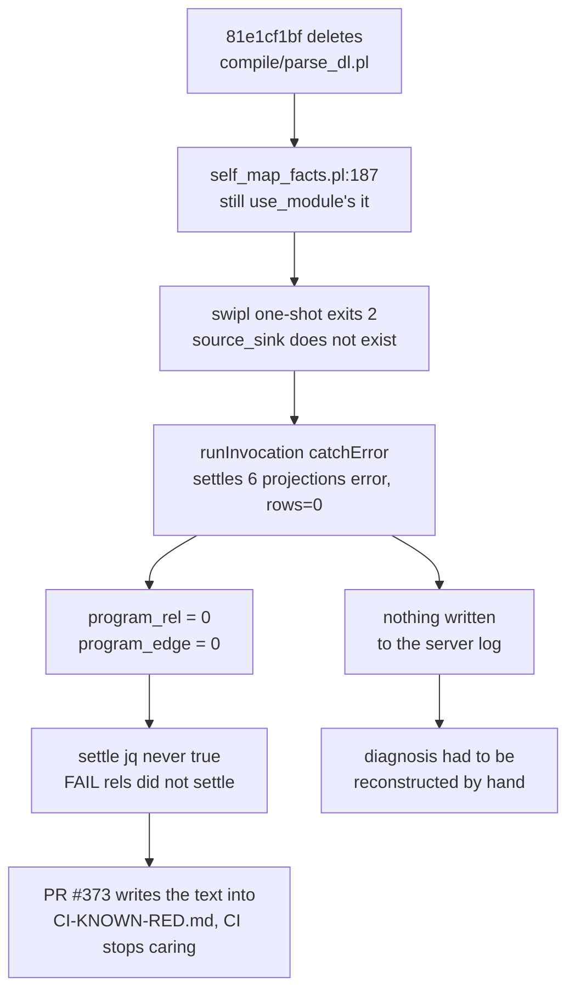

# self-map settle gate: why it failed and what fixed it

| field | value |
|---|---|
| branch | `fix/self-map-settle` |
| base | `06c9c5f63` (origin/main, 2026-08-20) |
| gate | `just self-map`, named as the release blocker at `v6/prolog/conformance/rulings.pl:532` |
| verdict | one-word path fix; NOT a timeout, NOT churn, NOT a regression from today's 16 PRs |
| broke at | `81e1cf1bf`, 2026-08-12, 693 commits and 8 days before this measurement |

## Contents

1. [Verdict](#1-verdict)
2. [The failing conjunct, polled](#2-the-failing-conjunct-polled)
3. [Churn: there is none](#3-churn-there-is-none)
4. [Bisect](#4-bisect)
5. [Root cause](#5-root-cause)
6. [The fix](#6-the-fix)
7. [ARCH-MAP.md diff](#7-arch-mapmd-diff)
8. [Gates](#8-gates)

## 1. Verdict

`v6/prolog/tools/self_map_facts.pl` loaded `v6/prolog/compile/parse_dl.pl`, a
file deleted on 2026-08-12. The `sh` host that reads the fourth source exited 2,
its six projections settled `error` with zero rows, and the two rels the settle
check requires (`program_rel`, `program_edge`) stayed empty forever. Everything
else settled at t=4s and never moved again.



Second defect, and the reason it lived 8 days: the rail DID catch this on day
one. `.github/CI-KNOWN-RED.md` recorded the failure text as an allowlisted
staleness-gate row, so CI has judged the leg as expected noise since.

## 2. The failing conjunct, polled

The settle test in `v6/tsv2/scripts/self-map.sh:165` is wider than the watch
loop's: it also requires `phase`, `construct`, `task`, `task_dep`,
`program_rel` and `program_edge` to be non-empty. Booting the server exactly as
the script does and polling `/idb/<rel>` 30 times on the unfixed tree:

| poll | t | source | phase | construct | task | task_dep | program_rel | program_edge | map_document | write_receipt | cksum |
|---|---|---|---|---|---|---|---|---|---|---|---|
| 1 | 2s | 4 | 0 | 0 | 0 | 0 | **0** | **0** | 1 | 0 | 2706110060 |
| 2 | 2s | 4 | 11 | 0 | 0 | 0 | **0** | **0** | 1 | 0 | 4214972409 |
| 3 | 3s | 4 | 11 | 0 | 258 | 144 | **0** | **0** | 1 | 0 | 211955653 |
| 4 | 4s | 4 | 11 | 60 | 258 | 144 | **0** | **0** | 1 | 1 `written` | 3551689041 |
| 5..30 | 4s..21s | 4 | 11 | 60 | 258 | 144 | **0** | **0** | 1 | 1 `written` | 3551689041 |

Two conjuncts are false and never become true:

- `(.program_rel.rows | length) > 0`
- `(.program_edge.rows | length) > 0`

Every other conjunct holds from poll 4, including
`.write_receipt.rows[0][0] == "written"`.

## 3. Churn: there is none

The whole-read cksum is `3551689041` at poll 4 and identical at poll 30, 17
seconds later. No rel re-derives. The 120s bound is not the cost and raising it
would change nothing; the rail polls 240 times and reads the same bytes 236
times in a row while two rels sit empty.

## 4. Bisect

The defect is entirely inside the fact host, so each commit is measured by
running that host on the fourth source, plus a full-rail run on each side of the
boundary.

| commit | date | PR | `compile/parse_dl.pl` | fact host `rel` / `rel_edge` rows | full rail |
|---|---|---|---|---|---|
| `4fefe5ff3` | 2026-08-11 | staleness-gate taken OFF the known-red list | present | n/a | green (its own commit message) |
| `e70417d92` | 2026-08-12 | `81e1cf1bf`'s parent | present | 117 / 187 | `SELF MAP HOLDS`, diagrams=4, lines=692 |
| **`81e1cf1bf`** | **2026-08-12** | **parser: delete the classic hand-threaded door** | **ABSENT** | **0 / 0** | **`FAIL  rels did not settle in 120s`** |
| `b62ea5b9e` | 2026-08-19 | #373, adds the known-red row | ABSENT | 0 / 0 | red (row's own text) |
| `e5fcdf55a` | 2026-08-20 | #388 sweep | ABSENT | 0 / 0 | red |
| `bf2eb4bc0` | 2026-08-20 | #391 | ABSENT | 0 / 0 | red |
| `ba920f52e` | 2026-08-20 | #393 emitters | ABSENT | 0 / 0 | red |
| `06c9c5f63` | 2026-08-20 | origin/main | ABSENT | 0 / 0 | `FAIL  rels did not settle in 120s` |

None of today's 16 PRs is implicated. #396's enum-column read and #399's
`short_hash/2` are innocent: the rail was already red on 2026-08-12, and the
regenerated section 4 comes back byte-identical to the copy committed
2026-08-11.

## 5. Root cause

`v6/prolog/tools/self_map_facts.pl:187`, before:

```prolog
    source_path('../compile/parse_dl.pl', ParsePath),
```

`81e1cf1bf` deleted that file and moved every production caller to
`compile/parse_dl_dcg.pl`, which exports the same `parse_dl_file/4`. The tool
file was missed because nothing loads it except the `sh` host declared in
`v6/dl/fixtures/self-map.dl6:96-116`: no plunit unit, no conformance fixture,
no lint step and no sweep stage reads it, so a sweep over production callers
cannot see it.

Measured directly:

```
$ swipl -q -l v6/prolog/tools/self_map_facts.pl -g main -t halt -- v6/dl/fixtures/self-map.dl6
ERROR: [Thread main] -g main: source_sink `'.../v6/prolog/tools/../compile/parse_dl.pl'' does not exist
$ echo $?
2
```

`runProcess` (`v6/tsv2/serve/1_hosts.ts:250`) does turn exit 2 into an error, and
`runInvocation`'s `catchError` (`:765`) settles every projection of that
invocation as `error` with `response_rows: 0`. All six `sm_*` projections share
one invocation per `(path, digest)`, so the whole `.dl6` source drops out while
the other three sources keep answering. Nothing reaches the server log at the
default trace level, which is why the rail's only visible symptom was a settle
timeout and an empty mermaid block in section 4.

## 6. The fix

| file | change |
|---|---|
| `v6/prolog/tools/self_map_facts.pl:188` | load `../compile/parse_dl_dcg.pl`, the only parser door |
| `v6/tsv2/scripts/self-map.sh:173-186` | an unsettled read prints per-rel counts and every `__host_witness` row that is not `done`, then dies |
| `.github/CI-KNOWN-RED.md` | staleness-gate row and its `allow:` line removed, closure note added |
| `docs/failure-modes.md` | entry 60 |
| `v6/ARCH-MAP.md` | regenerated |

Fail-pre-fix receipt for the diagnosis leg, with the one-word path reverted:

```
  last read, rows per rel:
    source=4
    phase=11
    construct=60
    task=258
    task_dep=144
    program_rel=0
    program_edge=0
    map_document=1
    write_receipt=1
  host witnesses that are not done:
    sm_phase error rows=0
    sm_rel error rows=0
    sm_rel_edge error rows=0
    sm_surface error rows=0
    sm_task error rows=0
    sm_task_dep error rows=0
FAIL  rels did not settle; server log: ...
```

The path restored, the same script prints `SELF MAP HOLDS`.

## 7. ARCH-MAP.md diff

Six lines changed against the copy committed 2026-08-11, all of them in
section 3, all of them real `ARCH.pl` movement over the 8 red days:

| line | committed | regenerated |
|---|---|---|
| task total | 254 tasks, 141 dependency edges | 258 tasks, 144 dependency edges |
| `done` | 162 | 166 |
| frontier nodes | `t_bench_cli`, `t_oracle_scale_ceiling` present | both `done` and gone; `t_dd_plan_dd_runner`, `t_emit_rust_sqlite` added |
| frontier edge | `t_bench_cli --> t_oracle_scale_ceiling` | `t_dd_plan_dd_runner --> t_emit_rust_sqlite` |
| ready set | `oracle_scale_ceiling` in, `emit_rust_sqlite` out | reversed |

Sections 1, 2 and 4 regenerate BYTE-IDENTICAL, section 4 included. The rel
graph the fix restores is exactly the one that was last written on 2026-08-11.

## 8. Gates

| gate | result | wall |
|---|---|---|
| `just self-map` run 1 | `SELF MAP HOLDS`, `diagrams=4 lines=692`, rc=0 | 7.57s |
| `just self-map` run 2 | `SELF MAP HOLDS`, `diagrams=4 lines=692`, rc=0 | 7.76s |
| `just self-map` run 3 | `SELF MAP HOLDS`, `diagrams=4 lines=692`, rc=0 | 7.72s |
| byte stability, the three runs | `cksum` `3946037027 31859` x3 | |
| `bash v6/tools/staleness-gate.sh` | `STALENESS_GATE_OK gen-modules current, binaries current, ARCH-MAP.md current`, rc=0 | 7.31s |
| `just conformance` | 434 `PASS`, 0 `FAIL`, rc=0 | |
| `just plunit` | `PLUNIT jobs=12 declared=958 results=1004 passed=1004 failed=0 timeout=0`, rc=0 | 4.74s |

Every run is under the 10-second law. The pre-fix rail spent 2m24.6s to reach
its timeout.
