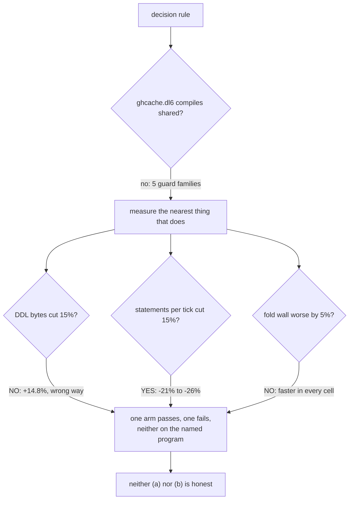

# shared-frontier round two: the numbers

The brief asked for one of two PRs: (a) the feature landed behind its flag with
a measured win on a real program, or (b) a close-out that deletes the code and
records the non-effect. Neither is what the tree needed. This is (c), and the
brief's own decision rule is why.

## TOC

1. [The brief's premise was stale](#the-briefs-premise-was-stale)
2. [The decision rule, evaluated](#the-decision-rule-evaluated)
3. [What the numbers say](#what-the-numbers-say)
4. [Why ghcache cannot be measured](#why-ghcache-cannot-be-measured)
5. [What this PR contains](#what-this-pr-contains)
6. [Gate table](#gate-table)
7. [What is left, and who owns it](#what-is-left-and-who-owns-it)

## The brief's premise was stale

The brief named `origin/feature/shared-frontier-fable` as the branch to
continue, 262 commits behind main, with steps 5 and 6 unbuilt.

Main already carries all of it. PR #386 (`b0c319e57`, "six-verb write interface,
per_rel and shared strategies, supersedes #378") landed the branch's six commits
and more. Applying the branch's `compile.pl`, `lower.pl`, `emit_rust.pl`,
`incremental.rs` and `types.rs` deltas onto `c88ebb0fd` through `git apply -3`
produces a zero-byte diff.

Step 5 is built too. `shared-frontier-gate.sh` on main is 8 fixtures, not 4, and
four of them (`sf_retract_current`, `sf_retract_stale`, `sf_negation_support`,
`sf_two_rule_support`) are the retraction battery graded against the oracle:

```
PASS sf_retract_current rust ticks identical and oracle (3 lines)
PASS sf_retract_stale rust ticks identical and oracle (3 lines)
PASS sf_negation_support rust ticks identical and oracle (4 lines)
PASS sf_two_rule_support rust ticks identical and oracle (3 lines)
```

So there was nothing to rebase and nothing of step 5 to build. What was missing
was the thing the brief actually cares about: numbers.

## The decision rule, evaluated

> land (a) only if shared cuts DDL bytes OR statements per tick by at least 15%
> on ghcache.dl6 with fold wall_ms not worse by more than 5%; otherwise (b).



One arm of the OR passes decisively and the other fails decisively, and the
program the rule names cannot run either arm. A close-out would delete a
measured -26% statements-per-tick win. A land-and-flip would ship a measured
+14.8% DDL-byte regression into a default that reaches no real program.

## What the numbers say

Full tables and run commands: `v6/labs/BENCHMARKS.md`, "shared frontier arms".

### What shared buys

| program | rels | statements per fold, per_rel | shared | delta |
| --- | ---: | ---: | ---: | ---: |
| wide_4 | 8 | 367 | 290 | -21.0% |
| wide_16 | 32 | 1,447 | 1,082 | -25.2% |
| wide_64 | 128 | 5,767 | 4,250 | -26.3% |

Deterministic: identical in all three runs of every cell across three separate
script invocations. Fold wall is faster in every cell of every run, -0.9% to
-21.2%, and is the noisy column.

### What shared costs

| metric, 202 corpus fixtures the guard admits | per_rel | shared | delta |
| --- | ---: | ---: | ---: |
| DDL bytes | 1,340,274 | 1,538,745 | +14.8% |
| ... frontier objects | 397,463 | 595,934 | +49.9% |
| ... every other statement | 942,811 | 942,811 | 0.0% |
| TEMP tables | 3,450 | 2,674 | -22.5% |
| TEMP views | 892 | 2,274 | +154.9% |

Emitted Rust bytes move +8.4% to +9.9% the same direction.

**The codegen-size motivation is inverted, and the cause is one design choice.**
`lower.pl` `shared_frontier_view_ddl/3` keeps every per-rel frontier NAME alive
as a TEMP view over the shared pair, so every compiled read keeps its text
unchanged. Three objects per rel become two, so the object count falls; a view
carrying the payload column list and the `__id` join is longer than the
`CREATE TEMP TABLE` it replaced, so the text rises. Every DDL statement that is
not a frontier object is byte-identical between the arms, which is how the
attribution is exact rather than inferred.

`plans/2026-08-19-shared-sqlite-frontier.md:196` priced pokeapi at
`tables 3,129 -> 783; indexes 2,348 -> 8; DDL bytes 1,682,616 -> 716,125`, and
the lab finding under it (`v6/labs/shared_frontier/REPORT.md:436`, F6) reads
"966,907 of 1,682,616 DDL bytes, 57.5%, replaced by 416 bytes of shared DDL".
That arm has no views. The shipped lowering replaces those 966,907 bytes with
416 bytes of shared DDL **plus two `CREATE TEMP VIEW` statements per relation**,
and the views cost more than the tables did. The table-count half of the
prediction holds; the byte half is the opposite sign.

### The shared arm is correct wherever it runs

```
SHARED-GRADE graded=440 byte-clean=200
  unsupported 238
```

Zero `diff`, zero `runtime-error`, over the whole conformance corpus against the
same oracle tick logs `grade.sh` uses. New script: `shared-frontier-grade.sh`.

## Why ghcache cannot be measured

`v6/dl/ghcache/ghcache.dl6` throws
`unsupported_construct(frontier_shared_todo(edge_rules))`. That is the first
family the guard reaches, not the only one it would. Probing every clause of
`lower.pl` `shared_frontier_todo/3` against the program rather than stopping at
the first:

```
PROBE ghcache.dl6 rels=157 rules=220
      reasons=[aggregate_head-11, edge_rules-1, host-8, non_set_rel-4, tick-1]
```

Corpus-wide the same guard stops 136 of 440 fixtures: `edge_rules` 72,
`aggregate_head` 44, `non_set_rel` 7, `recursion` 6, `host` 5, `retention` 2.

Per the standing law, a named stop is a hypothesis. All eight of these were
written in round one without a probe, and this arc did not probe them either;
that is `shared_frontier_guard_lift`'s job, and it is dispatchable. The one
constraint the code does show, and the one to answer first:
`shared_frontier_view_ddl/3` joins `__frontier."row_id"` to the durable table's
`__id`, so a frontier row with no live durable row (`departure`) and a rel whose
storage carries no `__id` (`non_set_rel`) each need a design answer, not just a
deleted clause.

## What this PR contains

| commit | what |
| --- | --- |
| `71ba84b7c` | `execute_multiple` tallied a batch as zero statements. The metric the whole arc is judged on could not see the arc. |
| `e3f0ae698` | `shared-frontier-grade.sh` (corpus-scale oracle parity, shared arm), `shared-frontier-bench.sh` (both arms, emitted bytes + statements per fold + wall), `tests/shared_frontier_wide/` |
| `68f621f6b` | `BENCHMARKS.md` section, `docs/failure-modes.md` 75, four `ARCH.pl` rows |

### The measurement defect, first

Before this branch, `SEAM_TALLY.statements` counted CALLS to the seam.
`execute_multiple` runs a `";\n"`-joined batch and recorded nothing, and every
per-rel clear, promote and merge is exactly that shape. `sf_join` read
`statements=27` on both arms. With batch legs counted, `wide_4` reads 367 vs
290. Round one's TS-door counts (60/48, 61/45) were right; the Rust door had no
instrument that could reproduce them.

### ARCH rows added

| row | status | why |
| --- | --- | --- |
| `shared_frontier_lowering` | done | records that #386 landed it, with the measurement |
| `shared_frontier_view_inflation` | unbuilt | the +49.9% frontier-object regression and its one cause |
| `shared_frontier_guard_lift` | unbuilt | the 8 families, the ghcache reason set, the two that are structural |
| `shared_frontier_default_flip` | unbuilt | plan step 6, blocked on both rows above |

## Gate table

Base measured on this same tree at `c88ebb0fd` before any change; branch
measured after the three commits. Every leg green, none allowlisted.

| gate | base | branch |
| --- | --- | --- |
| `conformance go.pl` | 440 PASS, FAILURES 0 | 440 PASS, FAILURES 0 |
| `just plunit` | declared=1012 passed=1058 failed=0 | declared=1012 passed=1058 failed=0 |
| `cargo test --no-fail-fast` | passed=158 failed=0 | passed=160 failed=0 |
| `grade.sh` | graded=440 byte-clean=335 | graded=440 byte-clean=335 |
| `shared-frontier-gate.sh` | 8 PASS 0 FAIL | 8 PASS 0 FAIL |
| `ARCH.pl` | 7 PASS 0 FAIL | 7 PASS 0 FAIL |
| `v6/dl/ghcache/gate.sh` | brief states ticks=10 | `GHCACHE_RUST_DOOR_HOLDS ticks=10` |
| `just ghcacher-rust` | brief states goldens=6 | `GHCACHER_RUST_DOOR_HOLDS goldens=6` |
| `shared-frontier-grade.sh` | n/a, new | graded=440 byte-clean=200, diff 0, runtime-error 0 |

`byte-clean=335` unmoved is the receipt that `per_rel` output did not shift:
the branch touches no compiler file. `cargo` +2 is the two new `sql.rs` units.

## What is left, and who owns it

| item | owner |
| --- | --- |
| probe all eight `shared_frontier_todo` clauses, lift what is conservative, design an answer for `departure` and `non_set_rel` | a lane, `shared_frontier_guard_lift` |
| price rewriting compiled frontier reads against the shared table with a `relation_id` predicate, deleting the views | a lane, `shared_frontier_view_inflation` |
| the default flip | blocked on both, `shared_frontier_default_flip` |
| whether the -26% statements per tick is worth the guard-lift arc at all | Chris |
