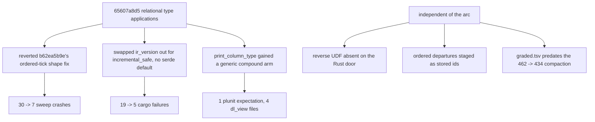

# test-estate-green

Branch `fix/test-estate-green`, base `67951ea94`. Six commits, all measured.

## Contents

1. [Scoreboard](#scoreboard)
2. [What 65607a8d5 broke](#what-65607a8d5-broke)
3. [D1 sweep: 23 ordered-path modules crashed on their first tick](#d1-sweep-23-ordered-path-modules-crashed-on-their-first-tick)
4. [D2 cargo: 14 tests died on a field nothing reads](#d2-cargo-14-tests-died-on-a-field-nothing-reads)
5. [D3 plunit: one printed-surface expectation](#d3-plunit-one-printed-surface-expectation)
6. [D4 rust-grade: no such function reverse](#d4-rust-grade-no-such-function-reverse)
7. [D5 rust-grade: departures staged as surrogate ids](#d5-rust-grade-departures-staged-as-surrogate-ids)
8. [D6 rust-grade: the ratchet never saw the corpus compaction](#d6-rust-grade-the-ratchet-never-saw-the-corpus-compaction)
9. [Still red, and why](#still-red-and-why)
10. [Forks for Chris](#forks-for-chris)
11. [Gate transcripts](#gate-transcripts)

## Scoreboard

| leg | before | after | remaining |
|---|---|---|---|
| sweep RUN | `identical=299 wrong=0 emitted_crash=30 rejection=6` | `identical=322 wrong=0 emitted_crash=7 rejection=6` | 7 enum-arrival crashes |
| sweep FINAL | `final_identical=299 final_wrong=30 no_oracle_final=6` | `final_identical=322 final_wrong=7 no_oracle_final=6` | same 7 |
| conformance `go.pl` | `433 PASS`, `FAILURES 1` | `433 PASS`, `FAILURES 1` | `nested_zero_column_child_is_one_row_per_parent` (known-red A) |
| plunit | `921 tests, 8 failed` | `921 tests, 7 failed` | all 7 in `.github/CI-KNOWN-RED.md` |
| cargo test (`--tests --no-fail-fast`) | `116 passed, 19 failed` | `130 passed, 5 failed` | 5 host-executor routing, PR #370 |
| rust-grade | `graded=434 byte-clean=320`, `runtime-error 8`, `diff 1`, REGRESSION 31 + RATCHET 8, exit 1 | `graded=434 byte-clean=322`, `runtime-error 7`, `diff 0`, no REGRESSION, no RATCHET, exit 0 | 7 runtime-error rows |
| text-door | `compiled=336 byte_identical=331 failures=5` | unchanged | 4 byte_difference + 1 plan failure |
| roundtrip | `432 / 434` | unchanged | 2 `fail(not_variant)` (known-red D) |



## What 65607a8d5 broke

Three of the six defects trace to one commit, and in each case the commit
reverted work that already existed rather than introducing something new.

| what it did | file | consequence |
|---|---|---|
| added `SUBSCRIBED_RELATIONS` to the ordered-tick `EnumPlane.decode_deltas` call and, in the same hunk, restored `state.deltas.rels` over `state.rels`, deleting the comment that explained the shape | `v6/prolog/emit_ts.pl:2264` | 23 emitted modules threw on tick 1 |
| replaced `ir_version` (which carried `#[serde(default)]`) with `incremental_safe` (which did not) | `v6/sprefa-engine-rs/src/types.rs:690` | 8 committed snapshots stopped deserializing, 14 tests red |
| added a generic compound arm to `print_column_type/2` joining arguments with `', '` | `v6/prolog/print_dl.pl:445-449` | 1 plunit expectation and 4 committed `dl_view` renders went stale |

## D1 sweep: 23 ordered-path modules crashed on their first tick

**Symptom.** `Cannot read properties of undefined (reading 'rels')`, 23 fixtures,
every one an ordered / pre / fold program.

**Root cause.** `v6/prolog/emit_ts.pl:2264`. `ordered_after_read_lines/2`
(`emit_ts.pl:1155-1166`) ends its stage with

```
'      map((post_write_carry): ITickDeltas => ({ rels: deltas.rels, carry_pending: deltas.carry_pending || post_write_carry })),',
```

so the chain is an `ITickDeltas` at that point. The enum-decode stage that
follows read `state.deltas.rels`. `b62ea5b9e` had already fixed this once and
`65607a8d5` reverted it while adding the `SUBSCRIBED_RELATIONS` argument.

**Fix.** Keep the new argument, restore the shape and the comment.

**Fail-first receipt**, `gen_emitted/counter_fold_matches_hand_computation.ts`
driven straight through `TickFold.run`:

```
THREW: TypeError: Cannot read properties of undefined (reading 'rels')
    at <anonymous> (v6/tsv2/gen_emitted/counter_fold_matches_hand_computation.ts:583:121)
    at doInnerSub (rxjs/src/internal/operators/mergeInternals.ts:71:15)
```

Before, `SWEEP_JOBS=8 bash scripts/sweep.sh`:

```
RUN total=335 identical=299 wrong=0 emitted_crash=30 rejection=6 no_oracle_log=0
FINAL total=335 final_identical=299 final_wrong=30 no_oracle_final=6
```

After, same command:

```
RUN total=335 identical=322 wrong=0 emitted_crash=7 rejection=6 no_oracle_log=0
FINAL total=335 final_identical=322 final_wrong=7 no_oracle_final=6
```

Commit `c1c6caded`. 24 regenerated `compile/out/*.ts` ride with it.

## D2 cargo: 14 tests died on a field nothing reads

**Symptom.** `panicked at tests/fixtures/<name>.program.rs:11:40:` /
`emitted program json: Error("missing field \`incremental_safe\`")`, across
`bounded_measure_recursion`, `bytes_type_system`, `diverging_measure_recursion`,
`list_persistence`, `live_extract_calls`, `live_shell_probe`, `source-mutations`,
`source-offline-golden`.

**Root cause.** `v6/sprefa-engine-rs/src/types.rs:690`. `incremental_safe` has
exactly three mentions in `src/`:

| site | what it does |
|---|---|
| `src/types.rs:690` | the `ProgramJson` field |
| `src/program.rs:44` | the `GenProgram` field |
| `src/program.rs:120` | copies one into the other |

Nothing reads it. `v6/prolog/emit_rust.pl:629` writes the constant `true` under
a comment that says so. `emit_ts.pl` does not emit it at all. It is the one
required-on-read field in a struct where every optional one carries
`#[serde(default)]`, and the field it displaced (`ir_version`) had that default.

**Fix.** `#[serde(default)]`. Two of the eight snapshots (`live_extract_calls`,
`live_shell_probe`) name a program that exists nowhere else in the tree
(`grep -rl` over the whole repo returns only the snapshot and its test), so
regenerating all eight was not available.

**Fail-first receipt**, `cargo test --tests --no-fail-fast`:

```
before: 116 passed, 19 failed   (14 of them Error("missing field `incremental_safe`"))
after:  130 passed,  5 failed
```

Commit `e9fed4d77`.

## D3 plunit: one printed-surface expectation

**Symptom.** `test rel_template_and_is_clause:a_relation_arrow_prints_the_equivalent_explicit_declaration: failed`,
`compile/test/plunit_tests.pl:7129`. Not in `.github/CI-KNOWN-RED.md`.

**Root cause.** `v6/prolog/print_dl.pl:445-449`, added by `65607a8d5`:

```prolog
print_column_type(Type, Text) :-
    compound(Type),
    Type =.. [Name | Arguments],
    maplist(print_type_argument, Arguments, ArgumentTexts),
    atomic_list_concat(ArgumentTexts, ', ', ArgumentsText),
    format(atom(Text), "~w(~w)", [Name, ArgumentsText]), !.
```

Before that arm a plain application fell through to `format("~w")` and printed
`Result(ParseError,Ast)`. The arm was added to reach annotated and named
argument forms; the spacing change to every application came with it.

The parse of the printed text is still a variant of the source program, so the
round-trip identity holds either way. Measured directly:

```
PROGRAM: prog([col_type('Parse'/2,source,text),col_type('Parse'/2,return,'Result'('ParseError','Ast'))],[])
TEXT:    'rel Parse(source: text, return: Result(ParseError, Ast)).\n'
RT:      prog([col_type('Parse'/2,source,text),col_type('Parse'/2,return,'Result'('ParseError','Ast'))],[])
VARIANT: yes
```

**Fix.** The printer's spelling is the shipped one and it agrees with every
other parenthesized list in the surface (`rel Result(L, R)`, `rel pair(T: json_encodable)`).
Updated the expectation, and regenerated the four committed `dl_view` renders
that `roundtrip.sh` rewrites on any run at `origin/main`:

```
-rel cell(id: int, slot: entry(text,int)) key(1).
+rel cell(id: int, slot: entry(text, int)) key(1).
```

The whole diff is that one space, four files, plus one `dl_view` file the
compaction added and never committed. **Reversing this call costs two
characters** at `print_dl.pl:448` plus a `roundtrip.sh` run; see
[Forks for Chris](#forks-for-chris).

**Fail-first receipt**, `just plunit`:

```
before: % [635/921] rel_template_and_..xplicit_declaration .. **FAILED (0.000 sec)
        ERROR: [Thread main] 8 tests failed
after:  ERROR: [Thread main] 7 tests failed
```

Commit `78d8a75c2`.

## D4 rust-grade: no such function reverse

**Symptom.**

```
1  boot statement failed: SqlInputError { error: Error { code: Unknown, extended_code: 1 },
   msg: "no such function: reverse", sql: "INSERT OR IGNORE INTO \"__str\" (\"content\") SELEC...
```

**Root cause.** `v6/prolog/compile/registry.pl:272` renders `reverse/1` straight
to a SQLite scalar name, in the block whose comment says "every row is
all-text-operand, so the Rendering equals the SQLite scalar name". Core SQLite
ships no `reverse()`. The TypeScript door runs on `@libsql/client`
(`v6/tsv2/package.json:25`), which does; the Rust door links `rusqlite`, and
`v6/sprefa-engine-rs/src/sql.rs` registered exactly one function, `regexp`.

**Fix.** `install_scalars/1` in `src/sql.rs` now installs `reverse` beside
`regexp`. Unicode scalar values, not bytes, matching the oracle:
`conformance/fixtures/11_string_std_builtins.pl:65-72` asserts
`reverse('中é') = 'é中'`.

**Fail-first receipt**: the fixture was in the `runtime-error` bucket before and
is byte-clean after; `runtime-error` went `8 -> 7`,
`reverse_reverses_characters` appears in the after run's `RUST-GRADE RATCHET`
list. Commit `016319915`.

## D5 rust-grade: departures staged as surrogate ids

**Symptom.** `concat_program_queue`, the one `diff` row. Ticks 1-4 byte-identical
to the oracle, ticks 5 and 7 empty where the oracle drains the queue:

```
< {"tick":5,"deltas":{"demanded":{"add":[["tab(tab_b)","session_one"]],...,"drained":{"add":[["session_one",1]],...}}
---
> {"tick":5,"deltas":{}}
```

**Root cause.** `v6/sprefa-engine-rs/src/ordered.rs:699`. The tick ended with

```rust
crate::incremental::stage_departures(seam, &program.relations, &stored_deltas)?;
```

`read_departures` (`src/ordered.rs:344`) reads that table back through
`result_rows(&result, &relation.columns, &relation.column_types)`, i.e. through
the rel's DECLARED column types. `concat_program_queue` compiles at
`intern_mode: dict` with a text intern plan, so `stored_deltas` carries
surrogate integer ids for `live_tab`'s two `text` columns. The arm's project SQL
then matched nothing and every departure-triggered carry tick came out empty.
The TypeScript door stages the decoded delta
(`emit_ts.pl:2296-2297 snapshot_departure_stage_lines`, operating on the
`ITickDeltas` the chain carries).

**Fix.** Stage `&deltas` (built from `before_decoded` / `after_decoded`) instead.

**Fail-first receipt**, `emit_rust_harness` on the fixture:

```
before: diff at ticks 5,6,7 (shown above), rust-grade "diff 1"
after:  diff <oracle> <out> -> empty, BYTE-CLEAN, rust-grade "diff 0"
```

Commit `80c30597a`.

## D6 rust-grade: the ratchet never saw the corpus compaction

**Symptom.** `RUST-GRADE REGRESSION` naming 31 fixtures, `RUST-GRADE RATCHET`
naming 8, exit 1, on a tree where the byte-clean count went UP.

**Root cause.** `v6/sprefa-engine-rs/graded.tsv` has 462 rows;
`67951ea94 chore(tests): compaction ranks 2-5, corpus 462 -> 434 (#383)` cut the
corpus to 434 without re-recording it. 36 of its rows name fixtures that no
longer exist, 24 of them recorded `clean`, and `grade.sh:111` reports every one
as a lost byte-clean row.

Measured:

```
graded.tsv rows: 462   corpus now: 434
in graded.tsv, gone from corpus: 36
```

Subtracting those, the genuine not-clean set is 7: six enum-arrival shape
mismatches and `nested_zero_column_child_is_one_row_per_parent`. Exactly the
`runtime-error 7` bucket.

**Fix.** `RUST_GRADE_WRITE_GRADED=1 bash v6/sprefa-engine-rs/grade.sh`, then a
clean re-run to confirm.

**Fail-first receipt.**

```
before: RUST-GRADE REGRESSION (31 names) / RUST-GRADE RATCHET (8 names) / graded=434 byte-clean=320, exit 1
after:  no REGRESSION line, no RATCHET line, graded=434 byte-clean=322, exit 0
```

The seven real reds stay visible in the run's own `runtime-error` bucket; the
floor (`minimum_byte_clean=230`, `grade.sh:104`) is untouched. Commit `ff8187c69`.

## Still red, and why

| red | where | why it remains |
|---|---|---|
| 7 sweep `emitted_crash`, 6 rust-grade `runtime-error`, all `enum_arrival_shape_mismatch` | `v6/tsv2/runtime/enumPlane.ts:9,15,77`; `v6/sprefa-engine-rs/src/enum_plane.rs:20,25,88` | DESIGN FORK 1 below. Two identity models for one column. |
| `nested_zero_column_child_is_one_row_per_parent` | `program_plan/3` fails without throwing | known-red group A, not this arc |
| 7 plunit failures | `subscribe_cone:golden_flex_cone_invariants`, `catalog_plane_rail:level_plane_family_corpus_counts`, `module_path_decls:...`, `rel_zero_arity:...`, 3x `json_merge_patch` | every one is a `.github/CI-KNOWN-RED.md` row (groups A, C, D) |
| 5 cargo failures | `tests/change_facts.rs:574`, `tests/dep_resolve.rs:568`, `tests/git_refs.rs:528,564`, `tests/live_hosts.rs:640` | DESIGN FORK 2 below. Broke at PR #370, four PRs before this arc. |
| 4 text-door `byte_difference` | `bounded_template_ground_instance`, `two_bounded_parameters_mint_one_instance`, `nested_bounded_template_instance`, `mixed_bounded_and_free_parameters` | FINDING 3 below. Narrowed but not fixed; known-red group D. |
| 2 roundtrip `fail(not_variant)` | `module_path_option_element_round_trips`, `mutual_recursion_matches_oracle` | known-red group D, not this arc |

## Forks for Chris

### FORK 1: an enum-typed column carries an id, or a tagged value

The corpus and the runtime plane disagree about what arrives in an enum-typed
or option-typed column.

**What the corpus says.** `conformance/fixtures/0_option_type.pl:7-24`: the enum
instance arrives as a row into its VARIANT rel carrying an explicit surrogate
id, and the owning rel's column then carries that id.

```prolog
[ [+'__opt_text_some'(501, "chris@example.com")],
  [+user_profile(1, 501)],
  [+'__opt_text_none'(502)],
  [+user_profile(2, 502)] ]
```

Same shape at `conformance/fixtures/0_enum_variants.pl:90-94`
(`+grade_ripe(401, 12)` then `+picked(101, 401)`). The oracle completes both
schedules; both fixtures are conformance PASS.

**What the runtime plane says.** `v6/tsv2/runtime/enumPlane.ts:88-95`. For a
column whose `IEnumRefColumn.endpoint_index` is `null` (the owning rel's case,
as opposed to the variant rel's own id column) the plane sets `owner = null`,
falls into the identity path at line 74, and calls `canonical_tagged_text`,
which requires an object with a `tag` key. An integer never gets there:

```ts
if (typeof value !== "string") throw new Error(`enum_arrival_shape_mismatch: not_an_object(${name})`);
```

Rust twin: `src/enum_plane.rs:20,25`. The identity path itself is
`EnumIdentityPlan` (`emit_ts.pl:383-387`, `src/types.rs EnumIdentityPlan`),
added by `65607a8d5`.

**Why this is not a mechanical fix.** Distinguishing the two spellings at
runtime is trivial (an integer is never a valid tagged value, `validate_tagged`
requires an object with `tag`), so "accept an integer as the endpoint id" is one
condition. What that condition SETTLES is the language question: whether an
enum-typed column's arrival value is the instance's identity, the instance's
value, or either. `IEnumRefColumn` carries no field that says which
(`runtime/types.ts:415-418`), so accepting both also decides the IR shape.

Cost of each arm, measured: 7 sweep fixtures and 6 rust-grade fixtures ride on
it. Nothing else in the estate is blocked by it.

### FORK 2: four in-process host executors are unreachable from either door

`81bb20ce5 tsv2: process adapters from sidecar rows (#370)` moved host executor
selection onto sidecar adapter rows and deleted the name-based routes:

```
-    if plan.execution == "shell" && DEP_CRAWL_HOSTS.contains(&plan.name.as_str()) {
-    if plan.execution == "shell" && GIT_REF_HOSTS.contains(&plan.name.as_str()) {
-    if plan.execution == "shell" && GIT_REVISION_HOSTS.contains(&plan.name.as_str()) {
-    if plan.execution == "shell" && GIT_CHANGE_HOSTS.contains(&plan.name.as_str()) {
```

What remains reachable, `src/hosts.rs:44-52`: `shell`, `soopy`,
`sprefa_extract`. The TypeScript adapter map is the same four minus one plus
one: `ShellAdapter`, `SprefaExtractAdapter`, `SoopyAdapter`, `BoopAdapter`
(`v6/tsv2/serve/1_hosts.ts:501-506`). No adapter name on either door reaches
`DepCrawlExecutor`, `GitRefExecutor`, `GitRevisionExecutor`, `ChangeFactExecutor`
or `SoopyFilesExecutor`. The compiler agrees: `grep -rn adapter` over
`v6/prolog/*.pl` and `v6/prolog/compile/*.pl` finds no site that emits an
adapter row naming any of them.

The three name lists survive as dead constants and the build says so:

```
warning: constant `DEP_CRAWL_HOSTS` is never used   --> src/hosts.rs:478:7
warning: static   `DEP_CRAWL`       is never used   --> src/hosts.rs:485:8
warning: constant `GIT_REF_HOSTS`   is never used   --> src/hosts.rs:648:7
warning: constant `GIT_CHANGE_HOSTS` is never used  --> src/hosts.rs:1037:7
warning: static   `GIT_CHANGES`     is never used   --> src/hosts.rs:1039:8
```

Five tests still pin the deleted behaviour, each with a template that exits 3 so
that reaching a response rel proves in-process routing:

| test | site | message |
|---|---|---|
| `the_three_ruled_names_reach_the_linked_arm_through_the_host_plan` | `tests/change_facts.rs:574` | `HostError { host: "git_change", message: "exited exit status: 3: git_change is linked in-process" }` |
| `the_four_ruled_names_reach_the_linked_arm_through_the_host_plan` | `tests/dep_resolve.rs:568` | `... host: "dep_crawl_repo" ...` |
| `the_five_ruled_names_reach_the_linked_arm_through_the_host_plan` | `tests/git_refs.rs:528` | `... host: "git_ref" ...` |
| `the_response_rows_carry_the_demanded_inputs` | `tests/git_refs.rs:564` | `... host: "git_ahead_behind" ...` |
| `live_runner_selects_soopy_for_the_unchanged_shell_host_plan` | `tests/live_hosts.rs:640` | `native file host, not the sabotaged template: HostError { host: "files", message: "exited exit status: 127: sh: this: command not found" }` |

The fork: give each linked executor an adapter name and emit the sidecar row, or
restore name-based routing, or delete the executors and their tests. No cargo
integration-test leg exists in `just green-all`, so nothing in CI has been
reporting this since 2026-08-18.

## Gate transcripts

Every line below is verbatim.

### conformance, `cd v6/prolog/conformance && swipl -g go -t halt go.pl`

Identical before and after.

```
PASS lines: 433
fail  nested_zero_column_child_is_one_row_per_parent
FAILURES  1
```

### sweep, `cd v6/tsv2 && SWEEP_JOBS=8 bash scripts/sweep.sh`

Before (`67951ea94`):

```
SWEEP_SILENT_FAIL nested_zero_column_child_is_one_row_per_parent
SWEEP total=433 compiled=335 unsupported=98 crash=0
SWEEP_CACHE hit=0 recompiled=433
RUN total=335 identical=299 wrong=0 emitted_crash=30 rejection=6 no_oracle_log=0
FINAL total=335 final_identical=299 final_wrong=30 no_oracle_final=6
SWEEP GATE: 30 emitted module(s) crashed on a schedule the oracle completed: enum_name_is_a_column_type, generic_expansion_end_to_end, option_text_column_reads_through_tag_join, option_scalar_enums_mint_per_element_type, enum_variant_field_typed_as_rel_is_a_ref, recursive_enum_tree_and_cycles_round_trip, module_path_and_option_column_coexist, json_typed_capture_folds_into_a_keyed_int_total, created_at_pinned_updated_at_advances, json_patch_fold_rfc7396_clauses, counter_fold_matches_hand_computation, batched_increments_both_count, seeded_one_arm_fold_matches_two_arms, seeded_pre_reads_a_body_bound_value, seeded_pre_multicolumn_fee_stats_fold, seeded_pre_text_breadcrumb_fold, increment_decrement_same_tick_nets_zero, log_driver_fold_needs_no_id_column, identical_increments_stack_as_log_deltas, lww_fold_follows_arrival_order, concat_fold_follows_arrival_order, concat_fold_reversed_arrival_reverses_result, one_attempt_guard_by_negation_lands_one_unnamed_winner, one_attempt_guard_by_negation_arrival_order_beats_arm_order, ordered_program_level_fold_reaches_three_links, concat_program_queue, take_until_keyed_replace_negated_done, state_flap_nets_to_zero_scope_churn, seq_wire_surface, seq_wire_hand
```

After, three runs, identical counts every time:

```
SWEEP_SILENT_FAIL nested_zero_column_child_is_one_row_per_parent
SWEEP total=433 compiled=335 unsupported=98 crash=0
RUN total=335 identical=322 wrong=0 emitted_crash=7 rejection=6 no_oracle_log=0
FINAL total=335 final_identical=322 final_wrong=7 no_oracle_final=6
SWEEP GATE: 7 emitted module(s) crashed on a schedule the oracle completed: enum_name_is_a_column_type, generic_expansion_end_to_end, option_text_column_reads_through_tag_join, option_scalar_enums_mint_per_element_type, enum_variant_field_typed_as_rel_is_a_ref, recursive_enum_tree_and_cycles_round_trip, module_path_and_option_column_coexist
```

### plunit, `cd v6 && just plunit`

Before:

```
% [64/921]  subscribe_cone:go..lex_cone_invariants .. **FAILED (0.003 sec)
% [261/921] catalog_plane_rai..amily_corpus_counts .. **FAILED (5.854 sec)
% [620/921] module_path_decls..ue_is_not_rewritten .. **FAILED (0.000 sec)
% [629/921] rel_zero_arity:a_..till_has_no_storage .. **FAILED (0.001 sec)
% [635/921] rel_template_and_..xplicit_declaration .. **FAILED (0.000 sec)
% [844/921] json_merge_patch:..null_stand_in_guard .. **FAILED (0.005 sec)
% [850/921] json_merge_patch:.._json_null_stand_in .. **FAILED (0.000 sec)
% [851/921] json_merge_patch:.._json_null_stand_in .. **FAILED (0.000 sec)
ERROR: [Thread main] 8 tests failed
```

After:

```
% [64/921]  subscribe_cone:go..lex_cone_invariants .. **FAILED (0.003 sec)
% [261/921] catalog_plane_rai..amily_corpus_counts .. **FAILED (5.773 sec)
% [620/921] module_path_decls..ue_is_not_rewritten .. **FAILED (0.000 sec)
% [629/921] rel_zero_arity:a_..till_has_no_storage .. **FAILED (0.001 sec)
% [844/921] json_merge_patch:..null_stand_in_guard .. **FAILED (0.005 sec)
% [850/921] json_merge_patch:.._json_null_stand_in .. **FAILED (0.000 sec)
% [851/921] json_merge_patch:.._json_null_stand_in .. **FAILED (0.000 sec)
ERROR: [Thread main] 7 tests failed
```

### cargo, `cd v6/sprefa-engine-rs && cargo test --tests --no-fail-fast`

`cargo test` without `--no-fail-fast` stops at the first failing binary and
reported `61 passed, 1 failed` at base; the flag is what makes the leg readable.

```
before: passed=116 failed=19
after:  passed=130 failed=5
```

### rust-grade, `bash v6/sprefa-engine-rs/grade.sh`

Before:

```
RUST-GRADE REGRESSION
concat_program_queue
enum_name_is_a_column_type
... 31 names ...
RUST-GRADE RATCHET
json_document_encoder_edges_round_trip
... 7 names ...
RUST-GRADE graded=434 byte-clean=320
  runtime-error 8
    4  enum_arrival_shape_mismatch: not_an_object(__opt_text)
    2  enum_arrival_shape_mismatch: not_an_object(grade)
    1  enum_arrival_shape_mismatch: not_an_object(tree)
    1  boot statement failed: SqlInputError { error: Error { code: Unknown, extended_code: 1 }, msg: "no such function: reverse", sql: "INSERT OR IGNORE INTO \"__str\" (\"content\") SELEC
  diff 1
    1  mixed(missing-rel+missing-tick) first-tick=5
  unsupported 99
```

After:

```
RUST-GRADE graded=434 byte-clean=322
  runtime-error 7
    4  enum_arrival_shape_mismatch: not_an_object(__opt_text)
    2  enum_arrival_shape_mismatch: not_an_object(grade)
    1  enum_arrival_shape_mismatch: not_an_object(tree)
  unsupported 99
```

exit 0.

### text-door, `bash v6/prolog/compile/scripts/text_door_receipt.sh`

Unchanged before and after:

```
TEXT_DOOR compiled=336 byte_identical=331 failures=5
  TEXT_DOOR_FAIL bounded_template_ground_instance byte_difference
  TEXT_DOOR_FAIL two_bounded_parameters_mint_one_instance byte_difference
  TEXT_DOOR_FAIL nested_bounded_template_instance byte_difference
  TEXT_DOOR_FAIL mixed_bounded_and_free_parameters byte_difference
  TEXT_DOOR_FAIL nested_zero_column_child_is_one_row_per_parent compile_phase_failed(plan)
```

**FINDING 3, narrowed but not fixed.** The four byte differences are ONE column
of the `__rel` catalog insert and nothing else. `diff` of the term-door and
text-door emitted modules for `two_bounded_parameters_mint_one_instance` touches
9 lines, every one a `h_schema:` value, every one on a TYPE-plane row
(`kind: interface | generic_rel | type_parameter | constraint | generic_column | concrete_type`).
Every `rel` row, including its `h_id`, is byte-identical. On those type rows the
`h_schema` slot does not carry `schema_hash/4` at all: `annotate_catalog_row/3`
(`lower.pl:1728`) overwrites it with a semantic type id, and
`semantic_type_id_text/2` (`0_type_ids.pl:51`) hashes
`named(ModuleHash, Kind, Name)` (`0_type_ids.pl:19`). So the two doors agree on
the module hash that seeds RELATION identity and disagree on the one that seeds
TYPE identity. That is where to start; it is known-red group D and outside this
arc's four defects.

### roundtrip, `bash v6/prolog/compile/scripts/roundtrip.sh`

Unchanged:

```
G1 round-trip: 432 / 434 fixtures pass
  FAIL module_path_option_element_round_trips (.../fixtures/7_module_path_element.pl): fail(not_variant)
  FAIL mutual_recursion_matches_oracle (.../fixtures/engine_core.pl): fail(not_variant)
G1: FAILURES PRESENT
```
