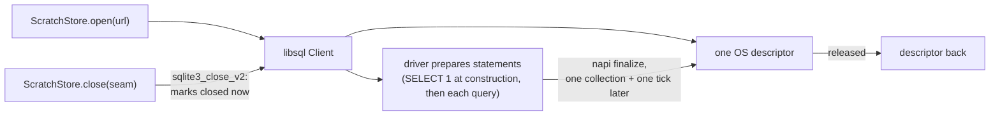

# tsv2 hygiene: three defects, three commits

Branch `fix/tsv2-hygiene`, base `e5fcdf55a`, worktree
`~/projects/sprefa-worktrees/tsv2-hygiene`. No PR posted.

## Contents

1. [Verdict per defect](#verdict-per-defect)
2. [Defect 1: ScratchStore had no close](#defect-1-scratchstore-had-no-close)
3. [Defect 2: npm test had no timeout floor](#defect-2-npm-test-had-no-timeout-floor)
4. [Defect 3: Spotlight indexes the generated trees](#defect-3-spotlight-indexes-the-generated-trees)
5. [Gates](#gates)
6. [Two things found on the way that are not this arc](#two-things-found-on-the-way-that-are-not-this-arc)

## Verdict per defect

| # | defect | commit | fixed | fail-first receipt |
|---|---|---|---|---|
| 1 | ScratchStore leaks a libsql handle per fixture | `afb2baf0c` + the soak-gating commit | yes | descriptors 85 -> 21 across 64 seams |
| 2 | `npm test` has no timeout floor | `bf58c7be8` | yes | wedge test: outer kill (rc=124) -> `timed out after 10000ms` |
| 3 | Spotlight indexes `compile/out` | `6b8190d75` | **no, the prescribed marker is inert on this OS** | probe file still indexed with the marker in place |

## Defect 1: ScratchStore had no close



`Client.close()` is not a synchronous descriptor release. It marks the
connection closed immediately and the descriptor comes back only once the
driver's statement wrappers are finalized. That is why the receipt forces a
collection and yields a tick, and why the seams stay reachable in an array for
the whole measurement: an unreachable client's handle is reclaimed by the
collector whether or not anyone closed it, so a test that drops its references
measures the collector rather than the seam.

Measured on this machine, 32 file seams held reachable, baseline 13 descriptors:

| case | while open | after collect + tick |
|---|---|---|
| closed | 51 | 13 (all 32 back) |
| not closed | 51 | 51 (none back) |

**Fail-first receipt.** Empty the body of `close` in
`v6/tsv2/runtime/scratchStore.ts` and re-run `tests/scratchStoreClose.test.ts`:

```
✖ releases_every_handle ... AssertionError: descriptors after 64 close calls:
    baseline=15 open=85 closed=85
```

With the body restored the same line reads `baseline=15 open=85 closed=21`
(the +6 is the measurement's own churn; `SLACK` is 8 and a missed close is +64).

**What landed.**

| file | change |
|---|---|
| `v6/tsv2/runtime/types.ts` | `IScratchStore.close(seam): void`, sync, idempotent |
| `v6/tsv2/runtime/scratchStore.ts` | `seam.db.close()` |
| `v6/tsv2/scripts/sweep.ts` | `finalize(() => ScratchStore.close(seam))` in `run_fixture`, so the complete and the error leg are both covered; the SIGSEGV retry rail stays as the rail for any other native death |
| `v6/tsv2/serve/4_http.ts` | `dispose_program` already released by reaching through to `seam.db.close()`; it now goes through the interface |
| `v6/tsv2/tests/scratchStoreClose.test.ts` | new, 4 tests |

The other open sites open exactly one seam per process (`run-emitted.ts`,
`golden-run.ts`, `scale-bench.ts`, the per-test seams), so they were left alone.

`holds_every_handle` is the unclosed control, kept as a live test so
`releases_every_handle` cannot pass vacuously.

### The soak wedged the battery, and now runs under leak-soak.sh

The receipt file first landed with its 335-round soak inside `npm test`, and
that wedged a sibling worker: `run: a program with no binds/hosts quiesces at
zero ticks` hit its own 30s `spawnSync` cap in 2 of 3 full-battery runs,
against 726-1033ms isolated. 335 libsql connections opened back to back
saturate the machine long enough that another worker's spawned swipl compile
never finishes.

| battery shape | runs | wedged |
|---|---|---|
| receipt file removed entirely | 2 | 0 |
| receipt file in, soak test deleted | 2 | 0 |
| receipt file in, soak test in | 3 | 2 |

The soak is the whole cost, so it took the gate `serveLeak.test.ts`'s receipt
(c) already uses: skipped unless `DL_PERF_LOG` is set, and
`scripts/leak-soak.sh` now runs this file alongside `serveLeak.test.ts`. Under
that script it prints

```
SCRATCH_SOAK rounds=335 fd_baseline=21 fd_after=21 rss_before_mb=141.9 rss_after_mb=160.8
```

## Defect 2: npm test had no timeout floor

`--test-timeout=10000` added to `v6/tsv2/package.json:16`.

**Fail-first receipt.** A test file whose body is `await new Promise(() => {})`:

| command | outcome |
|---|---|
| `node --test wedge.test.ts` | never exits; an outer `timeout 20` had to kill it, rc=124 |
| `node --test --test-timeout=10000 wedge.test.ts` | rc=1, `'test timed out after 10000ms'` |

`tests/bopRun.test.ts` is the only file over the floor and it stays over it
**per test**, `{ timeout: 30_000 }` on each of its two cases, matching the
`spawnSync` cap already there. Its cost is a spawned subprocess running the
swipl compile: 728ms isolated, 30s under `--test-concurrency=6`, which is load
contention and not the test's own work. The global floor was not raised for it.

Slowest other test in the battery is 3.3s (`openapiToDl6: strict drops a ref
target whose every column is a nullable ref`), so 10s has headroom.

## Defect 3: Spotlight indexes the generated trees

Both markers landed (`v6/prolog/compile/out/.metadata_never_index`,
`v6/tsv2/gen_emitted/.metadata_never_index`, the second re-included by a
`gen_emitted/*` + `!gen_emitted/.metadata_never_index` pair in
`v6/tsv2/.gitignore`). **They do not work.**

Darwin 23.6.0, both directories already indexed (670 and 355 `.ts` entries in
`mdfind`), marker in place for minutes before the probe:

| directory | marker | probe file indexed at 8s | at 45s |
|---|---|---|---|
| `v6/prolog/compile/out` | `.metadata_never_index` | 1 | 1 |
| `v6/tsv2/gen_emitted` | `.metadata_never_index` | 1 | - |
| `v6/tsv2/scripts` (control) | none | 1 | 1 |

`.metadata_never_index` is a volume-root mechanism; macOS does not honour it
per subdirectory. What does work, measured the same way on the same machine:

| directory | probe file indexed |
|---|---|
| `probe.noindex/` | 0 |
| `probeplain/` | 1 |

`mdutil` is volume-scoped only (`mdutil -i off -d volume`), so the two routes
that actually stop the CPU burn are a directory name ending in `.noindex` or a
Spotlight Privacy list entry (root or the GUI). Renaming `compile/out` reaches
the emitters, which belong to `fix/test-estate-green` this week, so it is a
decision rather than a diff. The markers are tracked anyway: zero cost, and
correct the day either tree becomes a volume root.

## Gates

Run in the worktree, which needed `pnpm install` in `v6/sprefa-store/js` and
`v6/tsv2` plus one full sweep to populate the gitignored `gen_emitted/`.

### `cd v6/tsv2 && npm test`

| | tests | pass | fail | skip | wall |
|---|---|---|---|---|---|
| base (`e5fcdf55a`) | 245 | 238 | 6 | 1 | 11.48s |
| after, three consecutive runs | 249 | 241 | 6 | 2 | 8.60s / 8.64s / 8.57s |

`+4` tests and `+1` skip are `scratchStoreClose.test.ts`, whose soak is gated.
Same 6 failing names on both sides:

| # | name | why |
|---|---|---|
| 1 | golden-flex served: the live host runs, and the served tick log matches the oracle replayed on the served schedule | needs `gen_emitted/golden-flex.ts` |
| 2 | `tests/listStoredSnapshot.test.ts` | same file, `ERR_MODULE_NOT_FOUND` at import |
| 3 | the ordered/pre family costs 19 + 2n statements per tick, against the incremental family's flat 33 | |
| 4 | the ordered/pre snapshot copies the whole relation every tick, arrivals or not | |
| 5 | flag off + zero-query: the level view derives, cone or no cone | needs `gen_emitted/level_view_reads_set_projection_not_occurrences.ts`, which `e5fcdf55a` does not compile |
| 6 | flag on + zero-query: nothing derives, ingestion still lands | same |

Rows 1 and 2 are not repairable in a clean tree: `scripts/golden-flex.sh` fails
on `e5fcdf55a` before it writes the module, at `bop check` with
`unsupported_construct: compiler refused rule 'column_type_unknown'`.

Two earlier post-change runs reported 8 failures, and that was not flake: it
was the soak seizing the machine, diagnosed and fixed in the soak-gating commit above. The
three runs in the table are after that fix, and every one of them reproduces
the baseline 6 exactly.

### `bash scripts/sweep.sh`

Byte-identical `RUN`, `FINAL`, and `SWEEP GATE` lines before and after:

```
RUN total=335 identical=299 wrong=0 emitted_crash=30 rejection=6 no_oracle_log=0
FINAL total=335 final_identical=299 final_wrong=30 no_oracle_final=6
SWEEP GATE: 30 emitted module(s) crashed on a schedule the oracle completed: ...
```

The brief expected `wrong=30`; on `e5fcdf55a` those 30 land in `emitted_crash`
(`enum_arrival_shape_mismatch: not_an_object(...)` and friends) with the same
30 names, and `final_wrong=30`. The sweep exits non-zero on that gate on both
sides.

### `bash scripts/leak-soak.sh`

Not run end to end: it wants port 17551 and a 900s budget. The file it now
also runs was exercised directly with `DL_PERF_LOG` set, 4 pass 0 fail,
`SCRATCH_SOAK` line above.

### typecheck

`npm run typecheck` is red on `e5fcdf55a` with 383 errors, all in
`gen_emitted/**` (`enum_types` not on `IGenProgramWithBoot`),
`scripts/shared-frontier-gate.ts`, and the missing `golden-flex.ts`. Zero of
them are in the files this branch touches.

### Fences

`git diff --name-only e5fcdf55a..HEAD` touches no `emit_*.pl`, no
`sprefa-engine-rs/**`, no `runtime/writeVerbs.ts`, no `scripts/sweep.sh`, no
`run_plunit.pl`. `origin/main` moved to `0bf43e111` (#389, #390) during the
run; this branch stays based on `e5fcdf55a`, which is where every number above
was measured.

## Two things found on the way that are not this arc

1. **`v6/prolog/compile/out/run-results.json` is stale on `origin/main`.** The
   committed copy names fixtures the corpus no longer has
   (`recursive_enum_acyclic_tree_round_trips`,
   `recursive_enum_cyclic_values_store_and_render`,
   `json_control_escapes_inside_a_document`,
   `json_non_ascii_keys_sort_by_code_point`, and more) where the fixtures on
   disk have `recursive_enum_tree_and_cycles_round_trip` and
   `json_document_encoder_edges_round_trip`. Every sweep rewrites it and
   dirties the tree. Left uncommitted here.
2. **Seven oracle snapshot pairs are untracked after a sweep**, for the same
   reason: `json_document_encoder_edges_round_trip`,
   `json_literal_keys_survive_capture`, `json_object_groups_and_orders_keys`,
   `json_patch_fold_rfc7396_clauses`, `keyed_head_fold_across_two_rules`,
   `log_occurrences_and_set_projection`,
   `recursive_enum_tree_and_cycles_round_trip`. 350 of the corpus's snapshots
   are tracked; these are not. Left untracked here.
