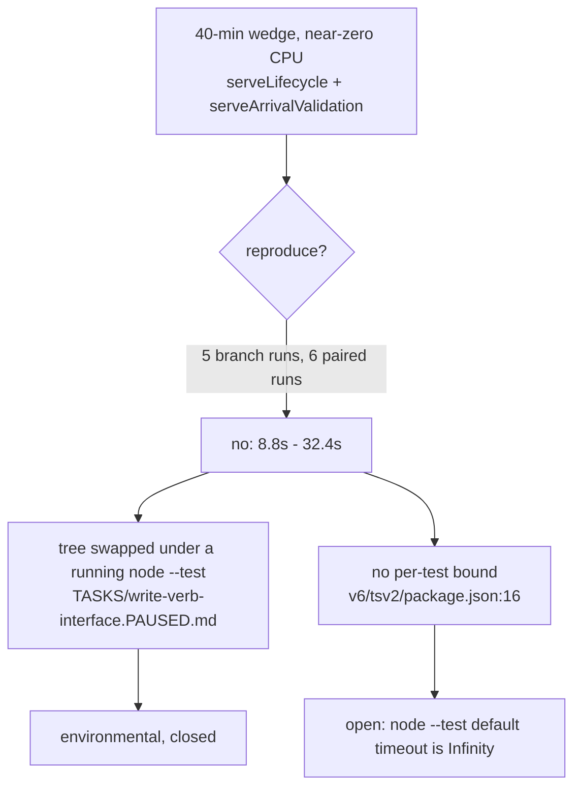

# write-verb-interface FINISH

The one unrun gate (`cd v6/tsv2 && npm test`) is run. The branch is rebased onto
origin/main `5d1a2d881` and every gate is green or red-identical to main.

## TOC

1. [The hang](#the-hang)
2. [Gate table](#gate-table)
3. [New red on main, not in the allowlist](#new-red-on-main-not-in-the-allowlist)
4. [Commits added](#commits-added)
5. [What remains](#what-remains)

## The hang

Not a branch defect. Five full-battery runs on the branch finished in 8.8s to
32.4s; the reported 40-minute wedge did not reproduce once.



### Isolated receipts, the two named files

| file | tests | wall | per-test timeout used |
| --- | --- | --- | --- |
| `v6/tsv2/tests/serveLifecycle.test.ts` | pass 4, fail 0, `duration_ms 990.869833` | `real 0m1.021s` | `--test-timeout=10000` |
| `v6/tsv2/tests/serveArrivalValidation.test.ts` | pass 10, fail 0, `duration_ms 1974.806167` | `real 0m2.010s` | `--test-timeout=10000` |

### The `await someObservable` trap: clean

`git diff origin/main...HEAD -- v6/tsv2/` has 15 added `await` lines and all 15
sit in `v6/tsv2/scripts/shared-frontier-gate.ts`, a gate script, below the
SqlRunner seam through `firstValueFrom`. The two runtime files the branch
rewrites answer zero:

```
grep -nE "\bawait\b|\.subscribe\(|\basync\b|Promise" \
  v6/tsv2/runtime/writeVerbs.ts v6/tsv2/runtime/1_incremental.ts   ->  no output
```

### What the wedge actually was

`TASKS/write-verb-interface.PAUSED.md` records it: the first `npm test` had this
worktree checked out to origin/main underneath it (the plunit baseline
measurement), the second was killed by the pause. A `node --test` worker whose
source files change identity mid-import waits at near-zero CPU, and nothing
bounds that wait.

### The standing exposure, pre-existing

`v6/tsv2/package.json:16`

```
"test": "node --test --experimental-transform-types --test-concurrency=6"
```

No `--test-timeout`, so node's default of Infinity applies and a wedged worker
never fails, it only stops the battery. Adding a bound changes what every lane
measures, so it is the coordinator's call, not this lane's.

### The one operation over 10s

`v6/tsv2/tests/bopRun.test.ts:25`, `run: a program with no binds/hosts quiesces
at zero ticks and exits 0`.

| condition | wall |
| --- | --- |
| isolated, 3 runs | 728.38ms, 727.24ms, 721.04ms |
| full battery under `--test-concurrency=6` | `30014.241666ms`, at the `spawnSync` bound |

Its only bound is its own `timeout: 30_000` at `bopRun.test.ts:32`, and the
comment above that line already records three 2026-07-30 sightings of the same
shape. It fired once on the branch and once on main across six paired runs, so
it is load-dependent and side-independent.

## Gate table

Every number verbatim. Branch = `feature/write-verb-interface` rebased onto
`5d1a2d881`; main = a `git worktree` of `5d1a2d881` at `/private/tmp/wv-baseline-main`.

| gate | branch | main | verdict |
| --- | --- | --- | --- |
| `cd v6/tsv2 && npm test` | `tests 245 / pass 240 / fail 4 / skipped 1`, `real 0m9.298s` | `tests 245 / pass 240 / fail 4 / skipped 1`, `real 0m9.022s` | identical |
| `cd v6/prolog/conformance && swipl -g go -t halt go.pl` | `461` PASS, `FAILURES  1`, `real 0m1.443s` | `461` PASS, `FAILURES  1`, `real 0m0.628s` | identical |
| `cd v6/sprefa-engine-rs && cargo test --no-fail-fast` | passed 117, failed 19, `real 1m10.752s` | passed 116, failed 19, `real 1m28.780s` | identical failing set, +1 pass |
| `cd v6 && just plunit` | `936` tests, `8 tests failed`, `real 0m52.948s` | `921` tests, `8 tests failed`, `real 0m37.554s` | same 8 names, +15 tests all green |
| `v6/tsv2/scripts/shared-frontier-gate.sh` | 8/8 PASS, `real 0m3.963s` | n/a (branch-only gate) | green |
| `v6/sprefa-engine-rs/shared-frontier-gate.sh` | 8/8 PASS, `real 0m10.586s` | n/a (branch-only gate) | green |
| `SWEEP_FORCE=1 v6/tsv2/scripts/sweep-stage1.sh 8` | `SWEEP total=461 compiled=352 unsupported=109 crash=0`, `SWEEP_CACHE hit=0 recompiled=461`, changed tracked files under `compile/out` = 0 | n/a | byte-identical |

### npm test, three paired runs

| run | branch | main |
| --- | --- | --- |
| 1 | 245 / 239 / 5, `0m9.432s` | 245 / 240 / 4, `0m9.022s` |
| 2 | 245 / 240 / 4, `0m9.298s` | 245 / 240 / 4, `0m9.055s` |
| 3 | 245 / 240 / 4, `0m11.317s` | 245 / 238 / 6, `0m32.383s` |

The four persistent failures, byte-for-byte the same names on both sides:

| test | file |
| --- | --- |
| `golden-flex served: the live host runs, and the served tick log matches the oracle replayed on the served schedule` | `v6/tsv2/tests/goldenFlexServed.test.ts:138` |
| `tests/listStoredSnapshot.test.ts` (whole file) | `v6/tsv2/tests/listStoredSnapshot.test.ts:1` |
| `the ordered/pre family costs 19 + 2n statements per tick, against the incremental family's flat 33` | `v6/tsv2/tests/orderedPre.test.ts:90` |
| `the ordered/pre snapshot copies the whole relation every tick, arrivals or not` | `v6/tsv2/tests/orderedPre.test.ts:119` |

Two more appear under load, on either side, never both runs of a pair:
`sabotage: editing fixture in temp dir modifies only the changed row`
(`tests/7_live-extract.integration.test.ts:127`) and the bopRun row above.

### conformance, the one red

`fail  nested_zero_column_child_is_one_row_per_parent`, both sides.
Allowlisted at `.github/CI-KNOWN-RED.md:38`.

### cargo, the 19

Same 19 names on both sides. `cargo test` without `--no-fail-fast` stops at the
first failing target (`15_source_mutation_hosts`) and reports nothing after it,
so the totals above need the flag. Failure text on the checked-in fixtures:
`emitted program json: Error("missing field \`incremental_safe\`")`.

Post-rebase, `consumer_integration`, `dl6_build` and `skeleton` COMPILE and pass
(1, 3 and 1 tests). The earlier report listed them as not compiling; `5d1a2d881`
restored the IR-version work that `65607a8d5` had reverted, so that section of
`TASKS/write-verb-interface.REPORT.md` is now stale and the `-n` commit flag is
no longer needed.

### plunit, the 8

`subscribe_cone:golden_flex_cone_invariants`,
`catalog_plane_rail:level_plane_family_corpus_counts`,
`module_path_decls:a_zero_column_childs_name_used_as_a_value_is_not_rewritten`,
`rel_zero_arity:a_root_rel_zero_still_has_no_storage`,
`rel_template_and_is_clause:a_relation_arrow_prints_the_equivalent_explicit_declaration`,
3x `json_merge_patch`.

## New red on main, not in the allowlist

`.github/CI-KNOWN-RED.md:78` records the tsv2 battery as
`ℹ tests 242 / pass 239 / fail 2`, naming goldenFlexServed and
listStoredSnapshot. The corpus is now 245 and the count is 4. The two extra are
the `orderedPre` pair, and they fail on origin/main `5d1a2d881` exactly as they
fail here.

Root cause, an emitter shape mismatch in the ordered/`pre` tick:

| site | what it produces or consumes |
| --- | --- |
| `v6/prolog/emit_ts.pl:1161-1166` `ordered_after_read_lines/2` | ends the chain as `map((post_write_carry): ITickDeltas => ({ rels: ..., carry_pending: ... }))` |
| `v6/prolog/emit_ts.pl:2286` | next stage reads `state.deltas.rels` |

`ITickDeltas` carries no `deltas` key, so the enum-decode stage dereferences
`undefined`. Rendered at
`v6/tsv2/gen_emitted/batched_increments_both_count.ts:507`, and
`git show origin/main:v6/prolog/compile/out/batched_increments_both_count.ts`
is byte-identical there. Every ordered/`pre` program takes this path.

Not fixed here: main is not this lane's tree, and the emitter fix belongs with
the ARCH row `pre_occurrence_loop` that already owns the ordered family.

## Commits added

| sha | one line |
| --- | --- |
| `7e8e60954` .. `565c49451` | the 13 arc commits, replayed onto `5d1a2d881` with no conflict (was `82987ad2c`) |
| `918fba5bd` | this report; the stale PAUSED doc removed and the REPORT's regression section marked closed |

The rebase alone is what closes the `-n` era: `918fba5bd` was committed with the
pre-commit rail armed and it passed.

## What remains

| item | owner |
| --- | --- |
| open the PR, title `feat(frontier): write-verb interface, retraction parity (steps 5 + contract)`, superseding #378 | coordinator |
| decide whether `v6/tsv2/package.json:16` gains a `--test-timeout` bound | coordinator, then Chris |
| file the ordered/`pre` enum-decode mismatch as a card and refresh `.github/CI-KNOWN-RED.md:78` from 242/239/2 to 245/240/4 | a main-tree lane |
| the bopRun 30s-under-load row, against the 10-second law | a main-tree lane |
