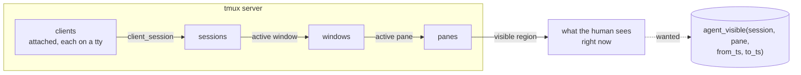
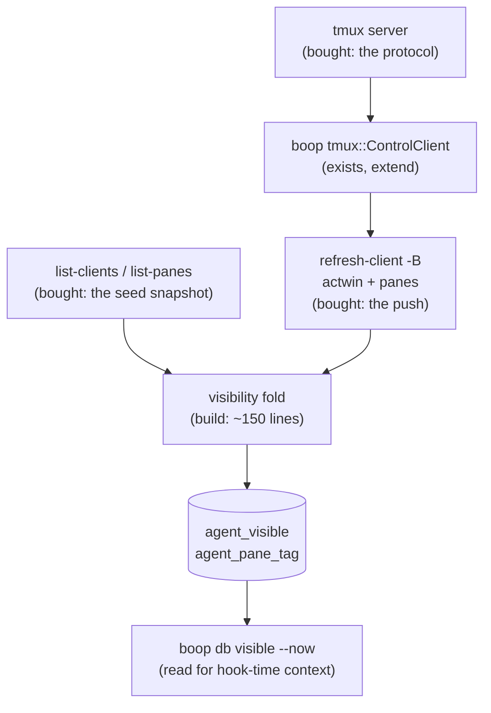
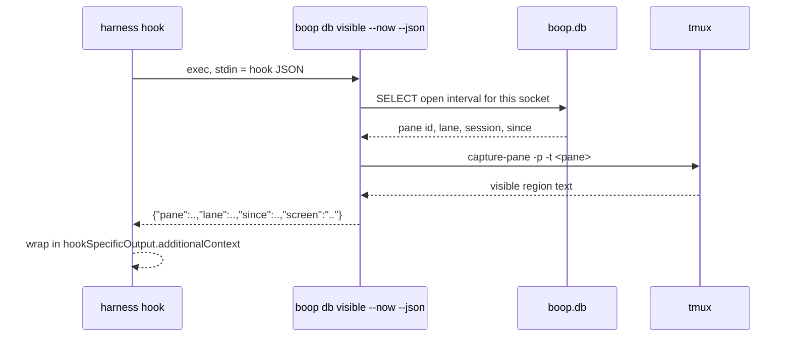

# tmux visibility as a fact stream: build-vs-buy

What is on the user's screen, when, as rows boop can join. Research answer, no
implementation. Every claim below carries a man page quote, a raw command
output block, or a `path:line`.

## Table of contents

1. [The question in one picture](#1-the-question-in-one-picture)
2. [Candidate A: control mode plus refresh-client -B subscriptions](#2-candidate-a-control-mode-plus-refresh-client--b-subscriptions)
3. [Candidate B: set-hook plus run-shell push](#3-candidate-b-set-hook-plus-run-shell-push)
4. [Candidate C: pipe-pane and capture-pane](#4-candidate-c-pipe-pane-and-capture-pane)
5. [Candidate D: list-clients polling](#5-candidate-d-list-clients-polling)
6. [Candidate E: libraries](#6-candidate-e-libraries)
7. [Candidate F: other multiplexers](#7-candidate-f-other-multiplexers)
8. [Recommendation: buy the protocol, build the fold](#8-recommendation-buy-the-protocol-build-the-fold)
9. [Proposed schema](#9-proposed-schema)
10. [Tagging human panes against agent panes](#10-tagging-human-panes-against-agent-panes)
11. [Hook-time auto-context injection](#11-hook-time-auto-context-injection)
12. [Where it lands in the beep/db split](#12-where-it-lands-in-the-beepdb-split)
13. [What is not answered](#13-what-is-not-answered)

---

## 1. The question in one picture



Three asks, kept separate because they have different answers:

| ask | shape |
|---|---|
| who is VISIBLE when | an interval table, closed by the next change |
| human pane against agent pane | a durable tag on the pane, readable in one query |
| auto-context at hook time | a read of the current interval plus the pane text |

---

## 2. Candidate A: control mode plus refresh-client -B subscriptions

`tmux -C attach` turns a client into a protocol peer. The man page, verbatim:

```
In control mode, a client sends tmux commands or command sequences
terminated by newlines on standard input.   Each command will produce one
block of output on standard output.  An output block consists of a %begin
line followed by the output (which may be empty).   The output block ends
with a %end or %error.
...
In control mode, tmux outputs notifications.  A notification will never
occur inside an output block.
```

25 notifications are documented. The ones that carry visibility, verbatim:

| notification | arguments | man page sentence |
|---|---|---|
| `%client-session-changed` | `client session-id name` | The client is now attached to the session with ID session-id, which is named name. |
| `%client-detached` | `client` | The client has detached. |
| `%session-changed` | `session-id name` | The client is now attached to the session with ID session-id, which is named name. |
| `%session-window-changed` | `session-id window-id` | The session with ID session-id changed its active window to the window with ID window-id. |
| `%window-pane-changed` | `window-id pane-id` | The active pane in the window with ID window-id changed to the pane with ID pane-id. |
| `%pane-mode-changed` | `pane-id` | The pane with ID pane-id has changed mode. |
| `%layout-change` | `window-id window-layout window-visible-layout window-flags` | The layout of a window with ID window-id changed. |
| `%subscription-changed` | `name session-id window-id window-index pane-id ... : value` | The value of the format associated with subscription name has changed to value.  See refresh-client -B. |
| `%output` | `pane-id value` | A window pane produced output.  value escapes non-printable characters and backslash as octal \xxx. |

Subscriptions turn an arbitrary format into a push channel. Verbatim from
`refresh-client`:

```
-B sets a subscription to a format for a control mode client.
The argument is split into three items by colons: name is a name
for the subscription; what is a type of item to subscribe to;
format is the format.  After a subscription is added, changes to
the format are reported with the %subscription-changed
notification, at most once a second.  If only the name is given,
the subscription is removed.  what may be empty to check the
format only for the attached session, or one of: a pane ID such
as '%0'; '%*' for all panes in the attached session; a window ID
such as '@0'; or '@*' for all windows in the attached session.
```

### Own proof, run 2026-08-09

Two throwaway sockets (`boop-test-vis3-<pid>`), never `-L lanes`. A `-C` client
attached over pipes, two subscriptions, then window and pane changes driven from
outside. Raw captured output:

```
%begin 1786293812 288 1
%end 1786293812 288 1
%subscription-changed actwin $0 - - - : v1/0/%0
%begin 1786293813 289 1
%end 1786293813 289 1
%subscription-changed panes $0 @0 0 %0 : %0 1 bash
%session-window-changed $0 @1
%subscription-changed actwin $0 - - - : v1/1/%1
%subscription-changed panes $0 @1 1 %1 : %1 1 bash
%session-window-changed $0 @0
%subscription-changed actwin $0 - - - : v1/0/%0
%window-pane-changed @0 %2
%subscription-changed actwin $0 - - - : v1/0/%2
%subscription-changed panes $0 @0 0 %0 : %0 0 bash
%subscription-changed panes $0 @0 0 %2 : %2 1 bash
```

The two subscriptions were:

```
refresh-client -B "actwin::#{session_name}/#{window_index}/#{pane_id}"
refresh-client -B "panes:%*:#{pane_id} #{pane_active} #{pane_current_command}"
```

Two findings from running it, neither in any doc read:

1. **The `-B` argument must be quoted.** Unquoted, tmux answers
   `parse error: syntax error` inside a `%error` block:
   ```
   %begin 1786293777 288 1
   parse error: syntax error
   %error 1786293777 288 1
   ```
2. **`-CC` needs a tty, `-C` does not.** `tmux -CC attach` with a fifo on stdin
   dies with `tcgetattr failed: Operation not supported on socket`; `tmux -C
   attach` over the same fifo works. `-CC` only adds "disables echo" per the man
   page, so a programmatic reader wants `-C`.

### Cost as a persistent client

One extra attached client per tmux server. It shows up in `list-clients`, it
holds a pipe pair, and it receives `%output` for every pane in the attached
session unless output is not subscribed. `%output` is the expensive stream: it
carries every byte every pane prints, octal-escaped. A visibility reader wants
the `%subscription-changed` and `%*-changed` notifications and should treat
`%output` as noise to drop at the parse boundary.

Subscriptions are throttled: "at most once a second". That is a floor on
interval resolution, and it is fine for a visibility table (a human does not
change what they are looking at faster than that in a way that matters).

---

## 3. Candidate B: set-hook plus run-shell push

Hooks fire tmux commands on events. The visibility ones, verbatim from the man
page:

| hook | man page sentence |
|---|---|
| `client-attached` | Run when a client is attached. |
| `client-detached` | Run when a client is detached. |
| `client-session-changed` | Run when a client's attached session is changed. |
| `client-focus-in` | Run when focus enters a client. |
| `client-focus-out` | Run when focus exits a client. |
| `pane-focus-in` | Run when the focus enters a pane, if the `focus-events` option is on. |
| `pane-focus-out` | Run when the focus exits a pane, if the `focus-events` option is on. |
| `after-select-window` | Run after the `select-window` command. |
| `after-select-pane` | Run after the `select-pane` command. |
| `window-pane-changed` | Run when the active pane in a window changes. |
| `session-window-changed` | Run when a session's active window changes. |

`focus-events` gates the pane pair, verbatim:

```
focus-events [on | off]
        When enabled, focus events are requested from the terminal if
        supported and passed through to applications running in tmux.
        Attached clients should be detached and attached again after
        changing this option.
```

What it gives: an event-driven push with zero persistent client, and the hook
body can expand any format, so `run-shell "boop beep visible --pane #{pane_id}
--session #{session_name} --at #{t:client_activity}"` is one line of config.

What it costs, and why it is not the primary mechanism:

- **It forks a process per event.** `run-shell` spawns a shell; a focus-heavy
  minute is a fork per focus change. The control-mode reader is one process for
  the whole server.
- **It is global server state that boop does not own.** `set-hook -g` writes
  into the user's live tmux server. Appending with `-a` avoids clobbering an
  existing hook, but boop would be editing shared config to observe.
- **`after-select-window` only fires for the `select-window` command.** A user
  pressing a prefix key binding that runs `select-window` is covered; a client
  attaching to a different session is covered by `client-session-changed`, not
  by the `after-*` family. Getting complete coverage means enumerating hooks
  correctly, where the control-mode notification set is closed and documented.

Where it wins: a hook can carry a fact the notification stream does not, and it
works with no attached control client. Recommended as the fallback rung and for
`client-focus-in` / `client-focus-out`, which have no notification twin.

---

## 4. Candidate C: pipe-pane and capture-pane

These answer "what text", not "who is looking".

`capture-pane` region semantics, verbatim from the man page:

```
-S and -E specify the starting and ending line numbers, zero is the first
line of the visible pane and negative numbers are lines in the history.
'-' to -S is the start of the history and to -E the end of the visible pane.
The default is to capture only the visible contents of the pane.
```

So the no-flag form is exactly "the visible region", which is the wanted default
for auto-context. One trap, from tmux source `cmd-capture-pane.c`: without `-M`
the capture reads the underlying grid, not the mode's screen, so a pane scrolled
back in copy-mode still captures the same absolute lines. "What the user sees"
and "the visible region of the grid" diverge exactly while copy-mode is scrolled,
and `#{pane_in_mode}` plus `#{scroll_position}` are the two variables that detect
it.

`pipe-pane -o 'cat >> log'` gives the full byte stream of a pane, the same data
`%output` carries. It is the wrong tool for visibility (it records what was
printed, not what was on screen) and the right tool for a transcript of a pane
that has no transcript file.

boop already reads transcripts, so `pipe-pane` earns nothing here.

---

## 5. Candidate D: list-clients polling

One query answers a lot:

```
tmux -L $SOCK list-clients -F 'client=#{client_name} session=#{client_session} \
  tty=#{client_tty} activity=#{client_activity} flags=#{client_flags}'
tmux -L $SOCK list-panes -a -F 'session=#{session_name} window=#{window_index} \
  pane=#{pane_id} active=#{pane_active} pid=#{pane_pid} cmd=#{pane_current_command} \
  in_mode=#{pane_in_mode}'
```

Relevant format variables, verbatim descriptions:

| variable | description |
|---|---|
| `client_session` | Name of the client's session |
| `client_activity` | Time client last had activity |
| `client_tty` | pseudo terminal of client |
| `session_attached` | Number of clients session is attached to |
| `session_activity` | Time of session last activity |
| `window_active` | 1 if window active |
| `window_activity` | Time of window last activity |
| `pane_active` | 1 if active pane |
| `pane_in_mode` | Number of modes pane is in |
| `scroll_position` | Scroll position in copy mode |
| `pane_pid` | PID of first process in pane |

What it costs: a poll misses transitions between ticks, and the interval table
then lies about `from_ts`. It also cannot answer "when did this change" at all;
it answers "what is true now". Correct role: the **snapshot that seeds the first
interval** when a reader attaches, and the reconciliation query that repairs
drift. Not the event source.

Prior art agrees on the failure mode: `timoclsn/agents-dashboard` classifies
agent state by regexing pane text on a poll, and boop's own `instant` consumer
was burned by exactly that approach (`QUERY-SURFACE.md`, the replacement map).

---

## 6. Candidate E: libraries

Build-vs-buy is decided per layer, so each candidate is judged on whether it
sells the *protocol reader*, not on general quality.

| library | language | models control mode? | verdict |
|---|---|---|---|
| `tmux_interface` 0.4.0, 149,252 downloads, last release 2026-03-10 | Rust | a `control_mode` module exists and docs.rs marks it "(unimplemented, draft)" | Already a boop dependency, already used for one-shot argv. Cannot be bought for the subscription reader because the module is a stub. |
| `par-term-tmux` 0.1.14, 438 downloads, 2026-07-30 | Rust | crates.io description says "tmux control mode integration for par-term terminal emulator" | The only Rust crate claiming control mode. 438 downloads, single-consumer (its own terminal emulator), API shaped for a GUI. Worth reading before writing a parser; not worth depending on at that adoption level for a protocol whose grammar is 25 documented lines. |
| `ztmux` 3.7.38, 366 downloads | Rust | reimplements tmux itself | Wrong layer. Not a client library. |
| `tmux` 0.25.0, last release 2022-03-11 | Rust | repo is `zellij-org/zellij`, a name collision | Not a tmux client. |
| `tmux-mcp-rs` 0.6.0, 455 downloads | Rust | MCP tool wrapper | Wrong layer, and MCP is not a subscription. |
| `libtmux` | Python | no control-mode module in `src/libtmux/`; `tmux_cmd` docstring: "Run any tmux(1) command through subprocess"; `hooks.py` wraps `set-hook`/`show-hook` as tmux-side options | Poll-and-shell model. An open issue, `tmux-python/libtmux#633` "[Agentic DX] Engine/control-mode roadmap", proposes adding a control-mode engine, so upstream agrees it does not exist yet. |
| `gotmuxcc` | Go | yes, full token set plus `func (t *Tmux) Subscribe(name string, target SubscriptionTarget, format string) error` wrapping `refresh-client -B` | The best existing model of the exact thing wanted. Wrong language for boop, right shape to copy: notification enum plus a typed `Subscribe`. |
| `node-tmux`, `stmux`, `go-tmux`, `tmuxinator`, `wemux` | mixed | none parse control mode | Session launchers and command wrappers. |

Prior art in the same shape as the recommendation: **iTerm2**. `TmuxGateway.m`
dispatches on the notification prefixes at lines 800-853, and
`TmuxGateway.m:1338-1355` builds subscriptions:

```objc
NSString *subscribe = [NSString stringWithFormat:@"refresh-client -B '%@:%@:%@'",
                       handle.identifier, target ?: @"", format];
```

gated by `supportsSubscriptions` returning `versionAtLeastDecimalNumberWithString:@"3.2"`.
`iTermTmuxOptionMonitor.m` keeps a 1-second `display-message -p` poll **only**
`if (![_gateway supportsSubscriptions])` and cancels the timer once a
subscription validates. The most-used tmux control-mode client in existence
replaced its poll with `-B` subscriptions the moment tmux offered them.

### What boop already has

`v6/boop/src/tmux.rs` is already a control-mode client. Its header states the
build-vs-buy call made at the time:

```
//! Layer 1: tmux control. The long-lived control-mode client is built here
//! because no crate on crates.io sells one (tmux_interface documents CLI-only,
//! no `-C` guard parsing).
```

Present: `ControlClient::spawn(socket)`, `ControlClient::command(argv)` with
`%begin`/`%end`/`%error` block matching by command number, `parse_event`, and a
`Notification` enum with `Output`, `SessionChanged`, `WindowAdd`, `Exit`, and an
`Unknown(String)` catch-all that keeps unrecognised `%` lines rather than
dropping them. Tests cover block framing, error blocks, and reply matching by
number.

Missing for visibility: `%window-pane-changed`, `%session-window-changed`,
`%client-session-changed`, `%client-detached`, `%subscription-changed`, a
`subscribe()` verb, and a read loop that surfaces notifications instead of only
draining them between command blocks.

---

## 7. Candidate F: other multiplexers

Checked only to see whether they change the answer. They do not.

| mux | external subscribable event? | citation |
|---|---|---|
| wezterm | No documented external push channel. `window-focus-changed` is a Lua callback registered in-process via `wezterm.on(...)`. External scripts poll `wezterm cli list --format json`. | wezterm.org/config/lua/window-events/window-focus-changed.html |
| kitty | No. `docs/remote-control.rst` has outbound commands only; zero matches for subscribe/notification. `on_focus_change` exists only as an in-process watcher script. | kovidgoyal/kitty docs, issue #2918 |
| zellij | Only inside the wasm plugin sandbox: `PaneUpdate` "Fired when pane state changes... including their title, position, size, command, focus state", consumed by `subscribe()` in a plugin, not by an external process. | zellij.dev/documentation/plugin-api-events |

tmux is the only one of the four that lets a separate OS process subscribe to
visibility changes. That is a reason to stay on tmux, not a reason to abstract
over multiplexers.

---

## 8. Recommendation: buy the protocol, build the fold



| layer | call | why |
|---|---|---|
| the protocol | **buy** tmux control mode | 25 documented notifications, a closed set, versioned by tmux itself |
| the push | **buy** `refresh-client -B` | iTerm2 dropped its poll for it; throttled to 1/s by tmux, which is the resolution a human screen needs |
| the seed | **buy** `list-clients` + `list-panes -a` | one query fills the table before the first event arrives |
| the focus pair | **buy** `set-hook -a client-focus-in/out` | no notification twin exists |
| the reader | **extend** `v6/boop/src/tmux.rs` | it is already a control-mode client with block framing and an `Unknown` catch-all; no crate sells a maintained Rust one (`tmux_interface`'s module is a documented stub, `par-term-tmux` has 438 downloads) |
| the fold | **build** | closing an interval when the next change arrives is 150 lines and nobody sells "my rows" |

The one thing worth re-examining before writing the reader: read
`par-term-tmux`'s source. It is the only Rust crate claiming the protocol, and
if its parser is complete and its API is not GUI-shaped, the notification enum
could be bought rather than extended. Its adoption (438 downloads) argues
against depending on it for a long-lived daemon, but that is a judgement to make
against the code, not against the number.

---

## 9. Proposed schema

Surrogate integer keys, natural keys interned once, no composite TEXT primary
key, booleans as INTEGER, per `.claude/skills/sql-relational-design/SKILL.md`.

```sql
CREATE TABLE IF NOT EXISTS dict_tmux_socket (id INTEGER PRIMARY KEY, value TEXT NOT NULL UNIQUE);
CREATE TABLE IF NOT EXISTS dict_pane        (id INTEGER PRIMARY KEY, value TEXT NOT NULL UNIQUE);
CREATE TABLE IF NOT EXISTS dict_client      (id INTEGER PRIMARY KEY, value TEXT NOT NULL UNIQUE);
CREATE TABLE IF NOT EXISTS dict_pane_kind   (id INTEGER PRIMARY KEY, value TEXT NOT NULL UNIQUE);

-- One row per interval during which a client had one pane on screen.
-- to_ts NULL means still current; the fold closes it when the next change lands.
CREATE TABLE IF NOT EXISTS agent_visible (
  socket_id  INTEGER NOT NULL,
  client_id  INTEGER NOT NULL,
  from_ts    INTEGER NOT NULL,
  to_ts      INTEGER,
  pane_id    INTEGER NOT NULL,
  window_id  INTEGER NOT NULL,
  tmux_session_id INTEGER NOT NULL,
  session_id INTEGER,
  PRIMARY KEY (socket_id, client_id, from_ts)
) WITHOUT ROWID;
CREATE INDEX IF NOT EXISTS idx_visible_pane ON agent_visible(pane_id, from_ts);
CREATE INDEX IF NOT EXISTS idx_visible_open ON agent_visible(to_ts) WHERE to_ts IS NULL;

-- What a pane IS, independent of who is looking at it.
CREATE TABLE IF NOT EXISTS agent_pane_tag (
  socket_id   INTEGER NOT NULL,
  pane_id     INTEGER NOT NULL,
  kind_id     INTEGER NOT NULL,
  lane_id     INTEGER,
  session_id  INTEGER,
  pane_pid    INTEGER,
  observed_ts INTEGER NOT NULL,
  PRIMARY KEY (socket_id, pane_id)
) WITHOUT ROWID;
```

`session_id` on `agent_visible` is the boop session the pane is running, when the
tag resolves one, so "what was the human watching" joins straight to
`agent_turn` and `agent_usage` on the key every other fact table uses.

Three questions the tables answer that nothing answers today:

| question | query shape |
|---|---|
| what was on screen at time T | `WHERE from_ts <= T AND (to_ts IS NULL OR to_ts > T)` |
| how long did the human watch lane X | `SUM(COALESCE(to_ts, now) - from_ts) ... JOIN agent_pane_tag ON lane` |
| which lanes ran unwatched | `agent_pane_tag LEFT JOIN agent_visible ... WHERE agent_visible.pane_id IS NULL` |

The third is the interesting one: it names the lanes that burned tokens with
nobody looking.

---

## 10. Tagging human panes against agent panes

Measured on a throwaway socket, tmux user options survive on all three scopes:

```
tmux -L $SOCK set    -t probe1     @boop-owner human
tmux -L $SOCK setw   -t probe1:0   @boop-lane  catalog9
tmux -L $SOCK set -p -t probe1:0.0 @boop-kind  agent
tmux -L $SOCK list-panes -a -F 'pane=#{pane_id} kind=#{@boop-kind} lane=#{@boop-lane}'
```

The `@`-prefixed user option is the right mechanism: it is tmux's own extension
point, it survives detach and reattach, it is queryable in a format string with
the rest of the pane facts in one call, and it is per-pane with `-p`.

The tagging ladder, most durable first:

| rung | mechanism | confidence |
|---|---|---|
| 1 | `@boop-kind` / `@boop-lane` pane options, written by the spawn path | exact, it is what boop itself wrote |
| 2 | registry join: `route.tmux` names the tmux session | exact for lanes boop spawned, blind to hand-started ones |
| 3 | `#{pane_pid}` walked through the process tree to a known harness binary | inferred; this is what `timoclsn/agents-dashboard` does |
| 4 | `~/.claude/sessions/<pid>.json`, which carries pid and exact pane | exact when the file exists, 2 present today |
| 5 | nothing matched: kind = `human` | a default, and it should be stated as one |

Rung 5 is the one to be careful with: absence of an agent tag is not proof of a
human. The row should carry the rung that decided it so a reader can tell an
observation from a default.

---

## 11. Hook-time auto-context injection

Claude Code hooks receive JSON on stdin and can return context. Verbatim shape
from the hooks documentation:

```json
{
  "session_id": "abc123",
  "transcript_path": "/home/user/.claude/projects/.../transcript.jsonl",
  "cwd": "/home/user/my-project",
  "hook_event_name": "PreToolUse"
}
```

and the injection channel:

```json
{
  "hookSpecificOutput": {
    "hookEventName": "PostToolUse",
    "additionalContext": "..."
  }
}
```

The docs also state that for `UserPromptSubmit`, `UserPromptExpansion` and
`SessionStart`, plain stdout is added as context.

So the missing piece is exactly a fast read, not a new mechanism:



Two constraints this design must state rather than discover:

1. **The read must be sub-100ms** or it taxes every tool call. Reading one open
   interval from a `WITHOUT ROWID` index plus one `capture-pane` is well inside
   that; recomputing visibility from tmux on each hook call is not.
2. **The pane text is the visible region, not the scrollback**, and it is stale
   the instant it is read. The response carries the capture timestamp so the
   consumer can see how old it is.

Existing art doing a cruder version of this: `hiroppy/tmux-agent-sidebar`
(Rust, registers as a Claude Code plugin and an OpenCode plugin, tracks prompts,
tool calls, background shell state and subagent trees across tmux panes) and
`alvinunreal/tmuxai` (Go, README: "TmuxAI captures context from all visible
panes in your current tmux window"). Both capture panes; neither models
visibility as intervals, and neither joins to a token-usage store.

---

## 12. Where it lands in the beep/db split

Following the spec's own rule (CLI noun singular, path segment plural, CLI verb
is the HTTP method):

| clap | method + path | tree | why there |
|---|---|---|---|
| `boop beep watch start` | `POST /watchers` | beep | it attaches a control client, which is a control action |
| `boop beep watch list` | `GET /watchers` | beep | which sockets are being watched |
| `boop beep watch delete <socket>` | `DELETE /watchers/{socket}` | beep | detach |
| `boop beep pane tag <pane> --kind --lane` | `PUT /panes/{pane}/tag` | beep | it writes a tmux user option |
| `boop db visible list [--at] [--since]` | `GET /visible` | db | rows out of the store |
| `boop db visible now [--json]` | `GET /visible?open=true` | db | the hook-time read |
| `boop db pane list` | `GET /panes` | db | the tag table joined to the registry |

The interval table joins on `session_id`, so `GET /usage?group_by=session`
gains a watched/unwatched split with no new join path.

---

## 13. What is not answered

- **Copy-mode scroll.** `#{scroll_position}` exists and is meaningful only while
  `#{pane_in_mode}` is non-zero. Whether the visibility row should record scroll
  offset, or treat a scrolled pane as a different visibility state entirely, is
  undecided.
- **Multiple clients on one session.** Two attached clients can look at
  different windows of the same session. The schema keys on `client_id` so it
  can represent that; whether the fold handles the `%client-session-changed`
  cross-product correctly is unproven.
- **The daemon question.** A control client only exists while something holds it.
  That is the same open question as `boop serve` in the analytics plan, and this
  design does not answer it; it inherits whatever that answers.
- **`par-term-tmux` source not read.** Named as the one Rust crate that claims
  control mode; the recommendation to extend `tmux.rs` was made against its
  crates.io metadata and download count, not against its code.
- **Cost of `%output` at scale.** Not measured. A control client attached to a
  busy session receives every byte every pane prints. The recommendation assumes
  dropping `%output` at the parse boundary is enough; that assumption is
  untested against a pane running a build.
