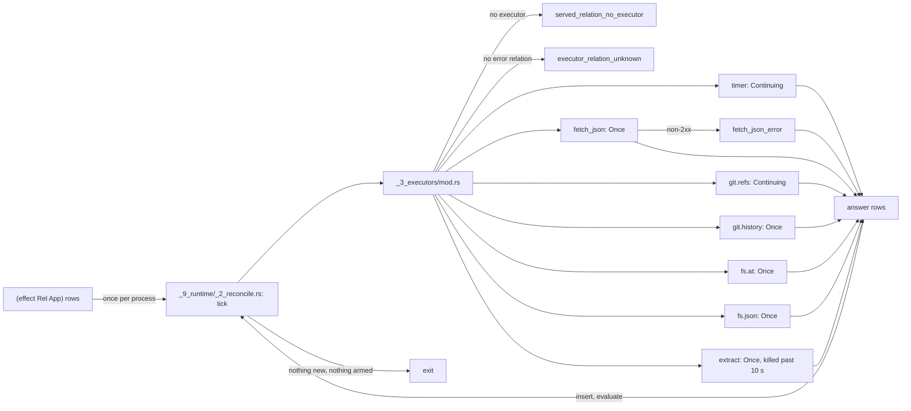

# Executors

## What



`dl8 run <compile.json> --serve <names>` runs ticks: tick 0 evaluates the program; each later tick hands new `effect` rows to the executor of their relation, inserts the answers, evaluates, and persists with `--db` (`src/_9_runtime/_2_reconcile.rs:1-2`, `README.md:71-86`).
Each served name maps to one Rust executor (`src/_9_runtime/_3_executors/mod.rs:45-106`). A name with no executor is `served_relation_no_executor`; a missing companion error relation is `executor_relation_unknown`; both exit 1 before tick 0.
Cadence `Once` answers an application once; `Continuing` arms on an application and then writes rows on its own clock (`_2_reconcile.rs:12-18`).
Each `effect` row reaches its executor once per process (`_2_reconcile.rs:44-47`). The run ends when a tick adds nothing and no executor is armed, or at `--max-ticks`.

| served name | columns | cadence | answers | error relation | source |
|---|---|---|---|---|---|
| `timer` | `period_ms int, tick int` | Continuing | one row per fire, ticks from 1; a late fire is skipped | none | `_3_executors/timer.rs` |
| `fetch_json` | `url str, body str` | Once | the 2xx JSON body | `fetch_json_error url str, status int, message str`; status 0 on transport failure | `_3_executors/fetch_json.rs` |
| `git.refs` | `root str, name str, sha str` | Continuing | every ref plus `HEAD` at arming, then each moved or added ref | `git.refs_error root str, message str` | `_3_executors/git_refs.rs` |
| `git.history` | `root str, sha str, parent str` | Once | one row per parent edge reachable from `sha`, or `HEAD` when unbound | `git.history_error root str, message str` | `_3_executors/git_history.rs` |
| `fs.at` | `root str, sha str, path str, blob str` | Once | one row per tracked file at the revision | `fs.at_error root str, sha str, message str` | `_3_executors/fs_at.rs` |
| `fs.json` | `path str, return type` | Once | the document's root node, plus one `:` edge per object member; a file over 16 MiB is an error row | `fs.json_error path str, message str` | `_3_executors/fs_json.rs` |
| `extract` | `root str, family str, kind str, payload str` | Once | one `extract --family <family> --resolve` run, one row per JSONL record; past 10 s the run is killed | `extract_error root str, family str, message str` | `_3_executors/extract.rs` |

Rows from `README.md:115-122`.

## Why

`README.md:108-113`: git runs only inside `soopy`, a path dependency, and `extract` is the `sprefa-extract` binary.
The roster is a closed `match` in Rust; any other served name is the `served_relation_no_executor` stop at construction (`_3_executors/mod.rs:100`). No written v8 decision gives the reason.

## When to use

Use it when:

- rows arrive on a clock: `timer`, `fixtures/reconcile/0_timer.dl7`
- one HTTP JSON body per url: `fetch_json`, `fixtures/reconcile/1_fetch.dl7`
- refs of a repository, live: `git.refs`, `fixtures/hosts/0_refs.dl7`
- the commit graph: `git.history`, `fixtures/hosts/1_history.dl7`
- the files at a revision: `fs.at`, `fixtures/hosts/2_fs_at.dl7`
- code facts: `extract`, `fixtures/hosts/3_extract.dl7`
- a JSON document as graph: `fs.json`, `fixtures/hosts/4_fs_json.dl7`

Do not use it when:

- a removed ref must retract its row: a removed ref writes nothing (`README.md:126`)
- a commit time is needed: `git.history` carries none (`README.md:127`)
- a field of an extract record is needed as a column: `payload` stays one text term (`README.md:128`)
- a `fs.json` scalar must come back out as a column: a value node is `intern`'s return, and `intern` keys on its constructor and its arguments (`src/_3_check/_5_kernel.rs:72`), so reading one with the arguments unbound is `underconstrained_kernel_goal(intern, [[0, 1]])`

## Example

A timer (the program is in [Running dl8](1_run.md)), then a name with no executor:

```console
$ bash book/show.sh run fixtures/reconcile/0_timer.dl7 --serve timer --max-ticks 2
(effect timer ref(application(timer, [1 none])))
(timer 1 1)
(timer 1 2)
(Fired 1)
(Fired 2)
(FiredCount 1)
(FiredCount 2)
ticks 2
exit 0
```

```console
$ bash book/show.sh run fixtures/reconcile/0_timer.dl7 --serve Fired
diagnostic served_relation_no_executor(Fired)
exit 1
```

`fetch_json` without its error relation, then with it and a url that is not one:

```console
$ bash book/show.sh run fixtures/host_effect/0_pending.dl7 --serve fetch_json
diagnostic executor_relation_unknown(fetch_json_error)
exit 1
```

```dl7
; fixture: fixtures/reconcile/1_fetch.dl7
; One url, fetched once; an answer lands as a row the reader joins like a fact.
(: fetch_json
   (* (: url str)
      (: body str)))

(: fetch_json_error
   (* (: url str)
      (: status int)
      (: message str)))

(: Watch (* (: url str)))

(Watch "__URL__")

(: Body
   (* (: url str)
      (: body str)))

(<- (Body ?Url ?Body)
    (Watch ?Url)
    (fetch_json ?Url ?Body))

(: Failed
   (* (: url str)
      (: status int)))

(<- (Failed ?Url ?Status)
    (Watch ?Url)
    (fetch_json_error ?Url ?Status ?Message))
```

```console
$ bash book/show.sh run fixtures/reconcile/1_fetch.dl7 --serve fetch_json
(effect fetch_json ref(application(fetch_json, ["__URL__" none])))
(fetch_json_error "__URL__" 0 "bad uri: __URL__ is missing scheme")
(Watch "__URL__")
(Failed "__URL__" 0)
ticks 1
exit 0
```

`git.history` and `fs.at` over a two-commit repository made on the spot:

```dl7
; fixture: fixtures/hosts/1_history.dl7
; Every parent edge reachable from HEAD.
(git: (import "@std/git"))

(: Watch (* (: root str)))

(Watch "__ROOT__")

(: Edge
   (* (: sha str)
      (: parent str)))

(<- (Edge ?Sha ?Parent)
    (Watch ?Root)
    (git.history ?Root ?Sha ?Parent))

(: Failed (* (: message str)))

(<- (Failed ?Message)
    (Watch ?Root)
    (git.history_error ?Root ?Message))
```

```console
$ d=$(mktemp -d) && export GIT_AUTHOR_NAME=dl8 GIT_AUTHOR_EMAIL=dl8@example.invalid GIT_COMMITTER_NAME=dl8 GIT_COMMITTER_EMAIL=dl8@example.invalid GIT_AUTHOR_DATE="1700000000 +0000" GIT_COMMITTER_DATE="1700000000 +0000" && git -C $d init -q -b main && echo one > $d/a.txt && git -C $d add a.txt && git -C $d commit -q -m a && echo two > $d/b.txt && git -C $d add b.txt && git -C $d commit -q -m b && sed "s|__ROOT__|$d|" fixtures/hosts/1_history.dl7 > $d/history.dl7 && sed -e "s|__ROOT__|$d|" -e "s|__SHA__|$(git -C $d rev-parse HEAD)|" fixtures/hosts/2_fs_at.dl7 > $d/fs_at.dl7 && bash book/show.sh run $d/history.dl7 --serve git.history | grep '^(Edge \|^(Failed \|^ticks\|^exit' && bash book/show.sh run $d/fs_at.dl7 --serve fs.at | grep '^(File \|^ticks\|^exit'
(Edge "e11e71ad03bcedad1d840052fac86d369363baab" "1bd4c43e7380496d43b8c78be3cb324f0a1aec7f")
ticks 1
exit 0
(File "a.txt" "5626abf0f72e58d7a153368ba57db4c673c0e171")
(File "b.txt" "f719efd430d52bcfc8566a43b2eb655688d38871")
ticks 1
exit 0
```

`extract` with no binary answers one error row per family:

```dl7
; fixture: fixtures/hosts/3_extract.dl7
; Three extract families over one root; each record is a row.
(: extract
   (* (: root str)
      (: family str)
      (: kind str)
      (: payload str)))

(: extract_error
   (* (: root str)
      (: family str)
      (: message str)))

(: Want
   (* (: root str)
      (: family str)))

(Want "__ROOT__" "type")

(Want "__ROOT__" "call")

(Want "__ROOT__" "diet_scip")

(: Fact
   (* (: family str)
      (: kind str)
      (: payload str)))

(<- (Fact ?Family ?Kind ?Payload)
    (Want ?Root ?Family)
    (extract ?Root ?Family ?Kind ?Payload))

(: Failed
   (* (: family str)
      (: message str)))

(<- (Failed ?Family ?Message)
    (Want ?Root ?Family)
    (extract_error ?Root ?Family ?Message))
```

```console
$ SPREFA_EXTRACT_BIN=/nonexistent/extract bash book/show.sh run fixtures/hosts/3_extract.dl7 --serve extract | grep '^(Failed \|^ticks\|^exit'
(Failed "call" "SPREFA_EXTRACT_BIN names /nonexistent/extract, which does not exist")
(Failed "diet_scip" "SPREFA_EXTRACT_BIN names /nonexistent/extract, which does not exist")
(Failed "type" "SPREFA_EXTRACT_BIN names /nonexistent/extract, which does not exist")
ticks 1
exit 0
```

`fs.json` reads one document as graph. JSON is not a second value world: an
object is a level of `:` edges, an array is a list, a scalar is the `intern` of
its primitive, a null is the prelude's `none` (`prelude/0_constructors.dl7:14`).
Keys keep document order as the edge index.

```json
{{#include ../../fixtures/hosts/todo.json}}
```

```dl7
; fixture: fixtures/hosts/4_fs_json.dl7
; One JSON document as `:` rows under one root node.
(fs: (import "@std/fs"))

(: Doc
   (* (: path str)))

(Doc "__DOC__")

(: Root
   (* (: path str)
      (: node any)))

(<- (Root ?Path ?Node)
    (Doc ?Path)
    (fs.json ?Path ?Node))

(: Member
   (* (: name any)
      (: target any)
      (: index int)))

(<- (Member ?Name ?Target ?Index)
    (Doc ?Path)
    (fs.json ?Path ?Root)
    (: ?Root ?Name ?Target ?Index))

(: Edge
   (* (: owner any)
      (: name any)
      (: target any)
      (: index int)))

(<- (Edge ?Owner ?Name ?Target ?Index)
    (: ?Owner ?Name ?Target ?Index))

(: Failed
   (* (: path str)
      (: message str)))

(<- (Failed ?Path ?Message)
    (fs.json_error ?Path ?Message))
```

```console
$ d=$(mktemp -d) && sed "s|__DOC__|$PWD/fixtures/hosts/todo.json|" fixtures/hosts/4_fs_json.dl7 > $d/doc.dl7 && bash book/show.sh run $d/doc.dl7 --serve fs.json | grep '^(Root \|^(Member \|^(Edge ref(edge\|^ticks\|^exit'
(Root "fixtures/hosts/todo.json" ref(application(fs.json, ["fixtures/hosts/todo.json"])))
(Member meta ref(edge(application(fs.json, ["fixtures/hosts/todo.json"]), meta)) 4)
(Member n ref(application(primitive(int), [3])) 1)
(Member owner none 3)
(Member tags [ref(application(primitive(str), ["a"])) ref(application(primitive(str), ["b"]))] 2)
(Member title ref(application(primitive(str), ["x"])) 0)
(Edge ref(edge(application(fs.json, ["fixtures/hosts/todo.json"]), meta)) v ref(application(primitive(int), [1])) 0)
ticks 1
exit 0
```

A member node is `edge(Owner, Label)`, the shape the `edge_ref` kernel builds
(`src/_6_eval/_4_kernel.rs:220-230`), so `meta.v` is reachable without reading a
row. The pure-rxjs lowering of the same relation, returning the stream rather
than subscribing to it:

```ts
const jsonEdges = (path$: Observable<string>): Observable<Edge> =>
  path$.pipe(
    mergeMap((path) =>
      readFile(path).pipe(
        map((text) => ({ root: application(FS_JSON, [path]), value: parse(text) })),
        mergeMap(({ root, value }) => from(walk(root, value))),
        catchError((failure) => of(jsonError(path, failure))),
      ),
    ),
  );
```

## What proves it

| claim | path | command |
|---|---|---|
| timer fires, count reads every fire, numbering continues past a db | `tests/_17_reconcile.rs:161-201` | `cargo test --test _17_reconcile` |
| fetch body, non-2xx, non-JSON, closed port | `tests/_17_reconcile.rs:203-267` | `cargo test --test _17_reconcile` |
| no executor, no error relation | `tests/_17_reconcile.rs:291-326` | `cargo test --test _17_reconcile` |
| refs snapshot then moved ref; history; files per revision; missing repository | `tests/_20_hosts.rs:228-343` | `cargo test --test _20_hosts` |
| object, array, scalar, present-null, absent key, nested object, unreadable file | `tests/_20_hosts.rs:394-494` | `cargo test --test _20_hosts` |
| extract rows per family over the corpus, and with no binary | `tests/_20_hosts.rs:558-617` | `cargo test --test _20_hosts` |
| the roster in code | `src/_9_runtime/_3_executors/mod.rs:65-120` | `sed -n 65,120p src/_9_runtime/_3_executors/mod.rs` |
