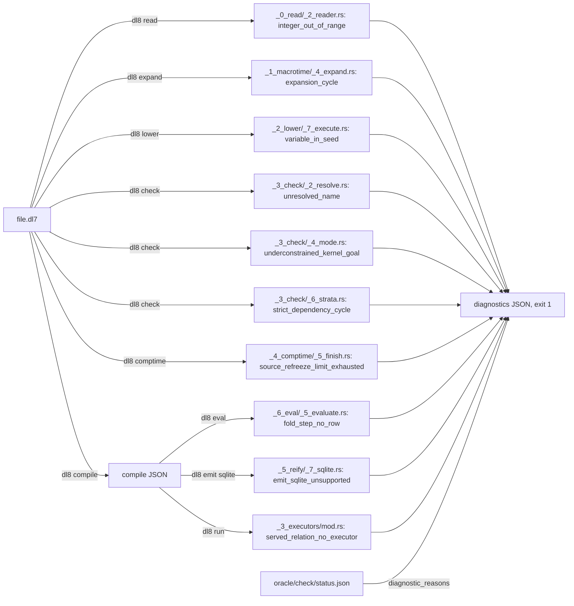

# Diagnostics

## What



Every case under `oracle/check/cases/` is a `.dl7` file the checker rejects, with one named diagnostic. `dl8 compile` prints it in `diagnostics` and exits 1 (`src/bin/dl8.rs:500-504`).
A diagnostic is `diagnostic(Phase, Location, Payload)`; the payload functor is its name. `oracle/check/status.json` classifies every checker diagnostic: covered by a case, reached by no `.dl7`, or unreachable by construction.
The v7 throw sites come from `status.json`; the v8 sites are the `u.compound` calls that build the payload.

| case | diagnostic | trigger line | v8 site | v7 site |
|---|---|---|---|---|
| `0_unresolved_name.dl7` | `unresolved_name` | `oracle/check/cases/0_unresolved_name.dl7:2` | `src/_3_check/_2_resolve.rs:126` | `1_checker.pl:585` |
| `1_unsafe_head_var.dl7` | `unsafe_head_var` | `oracle/check/cases/1_unsafe_head_var.dl7:7-8` | `src/_3_check/_4_mode.rs:364` | `1_checker.pl:1070` |
| `2_unbound_negative.dl7` | `unbound_negative_goal` | `oracle/check/cases/2_unbound_negative.dl7:8` | `src/_3_check/_4_mode.rs:256-265` | `1_checker.pl:910, :918` |
| `3_negative_cons.dl7` | `negative_constructive_kernel_goal` | `oracle/check/cases/3_negative_cons.dl7:5` | `src/_3_check/_4_mode.rs:248` | `1_checker.pl:897` |
| `4_under_cons.dl7` | `underconstrained_kernel_goal` | `oracle/check/cases/4_under_cons.dl7:5` | `src/_3_check/_4_mode.rs:204` | `1_checker.pl:861` |
| `5_under_edge_ref.dl7` | `underconstrained_kernel_goal` | `oracle/check/cases/5_under_edge_ref.dl7:5` | `src/_3_check/_4_mode.rs:214` | `1_checker.pl:873` |
| `6_under_intern.dl7` | `underconstrained_kernel_goal` | `oracle/check/cases/6_under_intern.dl7:5` | `src/_3_check/_4_mode.rs:224` | `1_checker.pl:885` |
| `7_under_int_lt.dl7` | `underconstrained_kernel_goal` | `oracle/check/cases/7_under_int_lt.dl7:5` | `src/_3_check/_4_mode.rs:193` | `1_checker.pl:849` |
| `8_int_type_mismatch.dl7` | `kernel_argument_type_mismatch` | `oracle/check/cases/8_int_type_mismatch.dl7:9` | `src/_3_check/_4_mode.rs:152-161` | `1_checker.pl:927` |
| `9_strict_cycle.dl7` | `strict_dependency_cycle` | `oracle/check/cases/9_strict_cycle.dl7:12-17` | `src/_6_eval/_2_stratify.rs:124, src/_3_check/_6_strata.rs:145` | `0_evaluator.pl:912, 1_checker.pl:434` |
| `10_aggregate_cycle.dl7` | `aggregate_dependency_cycle` | `oracle/check/cases/10_aggregate_cycle.dl7:7-11` | `src/_6_eval/_2_stratify.rs:122, src/_3_check/_6_strata.rs:146` | `0_evaluator.pl:909, 1_checker.pl:443` |

Diagnostics from other phases, each shown in the chapter named:

| diagnostic | site | chapter |
|---|---|---|
| `integer_out_of_range` | `src/_0_read/_2_reader.rs:383` | [Declarations](2_declare.md) |
| `variable_in_seed` | `src/_2_lower/_7_execute.rs:83` | [Facts and rules](3_rules.md) |
| `undeclared_relation` | `src/_2_lower/_8_express.rs:325`, `:378` | [Macros](8_macros.md) |
| `expansion_cycle`, `expansion_round_limit` | `src/_1_macrotime/_4_expand.rs:161-177` | [Macros](8_macros.md) |
| `expression_arity_mismatch` | `src/_2_lower/_8_express.rs:452` | [Modules and application](9_modules.md) |
| `source_refreeze_limit_exhausted` | `src/_4_comptime/_5_finish.rs:111` | [Modules and application](9_modules.md) |
| `aggregate_outside_rule_head`, `invalid_fold_arity`, `fold_seed_not_ground` | `src/_2_lower/_8_express.rs:687-707` | [Aggregates and fold](7_aggregate.md) |
| `malformed_aggregate_head`, `non_ground_aggregate_proof`, `aggregate_type_mismatch`, `aggregate_overflow` | `src/_6_eval/_5_evaluate.rs:420-442, :613-625` | [Aggregates and fold](7_aggregate.md) |
| `fold_step_no_row`, `fold_step_ambiguous`, `fold_step_interns`, `fold_path_disagreement` | `src/_6_eval/_5_evaluate.rs:486-592` | [Aggregates and fold](7_aggregate.md) |
| `served_relation_unknown` | `src/_6_eval/_6_json.rs:359-360` | [Effects](10_effects.md) |
| `served_relation_no_executor`, `executor_relation_unknown`, `served_relation_duplicate` | `src/_9_runtime/_3_executors/mod.rs:61-100, src/_9_runtime/_2_reconcile.rs:62-72` | [Executors](11_executors.md) |
| `emit_sqlite_unsupported` | `src/_5_reify/_7_sqlite.rs:222-264` | [The SQLite emitter](13_sqlite.md) |

## Why

The checker is the port of v7 `1_checker.pl` (`README.md:12`); each case was authored to reach one throw site, recorded in `oracle/check/status.json` `diagnostic_reasons.covered_by_authored_case`.
`status.json` `no_dl7_reaches_it` lists the checker diagnostics no source reaches because lowering rejects the input first, e.g. `non_ground_seed` behind `variable_in_seed`.

## When to use

Use it when:

- a compile exits 1: find the payload name in the two What tables, then its chapter
- a new checker diagnostic needs a case: `oracle/check/status.json` shows which are still uncovered

Do not use it when:

- the exit code is 2 or 3: that is IO or a pipeline stop, not a diagnostic, `src/bin/dl8.rs:460-470`
- the question is whether a rule evaluates as expected: [Facts and rules](3_rules.md)

## Example

`0_unresolved_name.dl7`, `unresolved_name`:

```dl7
; fixture: oracle/check/cases/0_unresolved_name.dl7
; diagnostic: unresolved_name
(: point
   (* (: x MissingType)))
```

```console
$ bash book/show.sh compile oracle/check/cases/0_unresolved_name.dl7
diagnostic diagnostic(check, reader_node(oracle/check/cases/0_unresolved_name.dl7, 5), unresolved_name(x))
exit 1
```

`1_unsafe_head_var.dl7`, `unsafe_head_var`:

```dl7
; fixture: oracle/check/cases/1_unsafe_head_var.dl7
; diagnostic: unsafe_head_var
(: point
   (* (: x int)))

(: reader
   (* (: seen int)))

(<- (reader ?Seen)
    (point ?Other))
```

```console
$ bash book/show.sh compile oracle/check/cases/1_unsafe_head_var.dl7
diagnostic diagnostic(check, none, unsafe_head_var(variable(reader_node(oracle/check/cases/1_unsafe_head_var.dl7, 18), Seen)))
exit 1
```

`2_unbound_negative.dl7`, `unbound_negative_goal`:

```dl7
; fixture: oracle/check/cases/2_unbound_negative.dl7
; diagnostic: unbound_negative_goal
(: point
   (* (: x int)))

(: reader
   (* (: seen int)))

(<- (reader 1)
    (not (point ?Missing)))
```

```console
$ bash book/show.sh compile oracle/check/cases/2_unbound_negative.dl7
diagnostic diagnostic(check, none, unbound_negative_goal([variable(reader_node(oracle/check/cases/2_unbound_negative.dl7, 18), Missing)]))
exit 1
```

`3_negative_cons.dl7`, `negative_constructive_kernel_goal`:

```dl7
; fixture: oracle/check/cases/3_negative_cons.dl7
; diagnostic: negative_constructive_kernel_goal
(: reader
   (* (: seen int)))

(<- (reader 1)
    (not (cons 1 2 ?List)))
```

```console
$ bash book/show.sh compile oracle/check/cases/3_negative_cons.dl7
diagnostic diagnostic(check, none, negative_constructive_kernel_goal(cons))
exit 1
```

`4_under_cons.dl7`, `underconstrained_kernel_goal`:

```dl7
; fixture: oracle/check/cases/4_under_cons.dl7
; diagnostic: underconstrained_kernel_goal
(: reader
   (* (: seen int)))

(<- (reader 1)
    (cons ?Head ?Tail ?List))
```

```console
$ bash book/show.sh compile oracle/check/cases/4_under_cons.dl7
diagnostic diagnostic(check, none, underconstrained_kernel_goal(cons, [[2] [0 1]]))
exit 1
```

`5_under_edge_ref.dl7`, `underconstrained_kernel_goal`:

```dl7
; fixture: oracle/check/cases/5_under_edge_ref.dl7
; diagnostic: underconstrained_kernel_goal
(: reader
   (* (: seen type)))

(<- (reader ?Target)
    (edge_ref ?Owner ?Label ?Target))
```

```console
$ bash book/show.sh compile oracle/check/cases/5_under_edge_ref.dl7
diagnostic diagnostic(check, none, underconstrained_kernel_goal(edge_ref, [[0 1]]))
exit 1
```

`6_under_intern.dl7`, `underconstrained_kernel_goal`:

```dl7
; fixture: oracle/check/cases/6_under_intern.dl7
; diagnostic: underconstrained_kernel_goal
(: reader
   (* (: seen type)))

(<- (reader ?Target)
    (intern ?Constructor ?Arguments ?Target))
```

```console
$ bash book/show.sh compile oracle/check/cases/6_under_intern.dl7
diagnostic diagnostic(check, none, underconstrained_kernel_goal(intern, [[0 1]]))
exit 1
```

`7_under_int_lt.dl7`, `underconstrained_kernel_goal`:

```dl7
; fixture: oracle/check/cases/7_under_int_lt.dl7
; diagnostic: underconstrained_kernel_goal
(: reader
   (* (: seen int)))

(<- (reader 1)
    (int.lt ?Left 3))
```

```console
$ bash book/show.sh compile oracle/check/cases/7_under_int_lt.dl7
diagnostic diagnostic(check, none, underconstrained_kernel_goal(int.lt, [[0 1]]))
exit 1
```

`8_int_type_mismatch.dl7`, `kernel_argument_type_mismatch`:

```dl7
; fixture: oracle/check/cases/8_int_type_mismatch.dl7
; diagnostic: kernel_argument_type_mismatch
(: point
   (* (: x int)))

(: reader
   (* (: seen int)))

(<- (reader ?Value)
    (point ?Value)
    (int.lt ?Value "three"))
```

```console
$ bash book/show.sh compile oracle/check/cases/8_int_type_mismatch.dl7
diagnostic diagnostic(check, none, kernel_argument_type_mismatch(int.lt, 1, int, "three"))
exit 1
```

`9_strict_cycle.dl7`, `strict_dependency_cycle`:

```dl7
; fixture: oracle/check/cases/9_strict_cycle.dl7
; diagnostic: strict_dependency_cycle
(: gamma
   (* (: value int)))

(: alpha
   (* (: value int)))

(: beta
   (* (: value int)))

(gamma 1)

(<- (alpha ?Value)
    (beta ?Value))

(<- (beta ?Value)
    (gamma ?Value)
    (not (alpha ?Value)))
```

```console
$ bash book/show.sh compile oracle/check/cases/9_strict_cycle.dl7
diagnostic diagnostic(stratify, none, strict_dependency_cycle([ref(owner(file(oracle/check/cases/9_strict_cycle.dl7), reader_node(oracle/check/cases/9_strict_cycle.dl7, 12))) ref(owner(file(oracle/check/cases/9_strict_cycle.dl7), reader_node(oracle/check/cases/9_strict_cycle.dl7, 21)))]))
exit 1
```

`10_aggregate_cycle.dl7`, `aggregate_dependency_cycle`:

```dl7
; fixture: oracle/check/cases/10_aggregate_cycle.dl7
; diagnostic: aggregate_dependency_cycle
(: alpha
   (* (: value int)))

(: beta
   (* (: value int)))

(<- (alpha (count ?Value))
    (beta ?Value))

(<- (beta ?Value)
    (alpha ?Value))
```

```console
$ bash book/show.sh compile oracle/check/cases/10_aggregate_cycle.dl7
diagnostic diagnostic(stratify, none, aggregate_dependency_cycle([ref(owner(file(oracle/check/cases/10_aggregate_cycle.dl7), reader_node(oracle/check/cases/10_aggregate_cycle.dl7, 3))) ref(owner(file(oracle/check/cases/10_aggregate_cycle.dl7), reader_node(oracle/check/cases/10_aggregate_cycle.dl7, 12)))]))
exit 1
```

## What proves it

| claim | path | command |
|---|---|---|
| every case's diagnostics equal v7's | `oracle/check/case-*_0.json` | `cargo test --test _4_check_oracle` |
| the classification of every checker diagnostic | `oracle/check/status.json` `diagnostic_reasons` | `jq .diagnostic_reasons oracle/check/status.json` |
| each case compiles to its named diagnostic through the binary | `tests/_22_book.rs` | `cargo test --test _22_book` |
