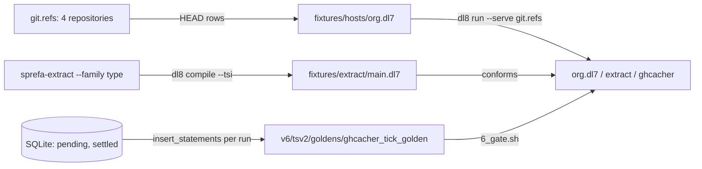

# Demos

## What



Three programs exercise several chapters at once.

| demo | what it does | chapters it uses | proved by |
|---|---|---|---|
| org watcher, `fixtures/hosts/org.dl7` | reads `HEAD` of the 4 required repositories of the hafley66 org through `git.refs` | [Declarations](2_declare.md), [Facts and rules](3_rules.md), [Effects](10_effects.md), [Executors](11_executors.md) | `tests/_20_hosts.rs:468-510` |
| extract TSI, `fixtures/extract/main.dl7` | loads `sprefa-extract` type facts over a TypeScript and Rust corpus, then proves a loaded product conforms to a declared shape | [Terms and the graph](5_terms.md), [Modules and application](9_modules.md) | `tests/_16_extract_tsi.rs:328-372` |
| ghcacher tick golden, `v6/tsv2/goldens/ghcacher_tick_golden/` | the v6 program dl8 is aimed at: a clock, an etag latch, a fetch host, a keyed cache view | every chapter; the gap table in Example lists what dl8 lacks | `v6/tsv2/goldens/ghcacher_tick_golden/6_gate.sh` (v6, dl6 syntax) |

## Why

The org watcher follows the user decision "hafley66 is an ORG, watched whole", with `instant`, `sprefa`, `hafley-rs` and `hafley-rxjs` the required set (`CLAUDE.md`, "User decisions"; `fixtures/hosts/org.dl7:1`).
The extract demo is the TSI loader's end-to-end receipt, `sprefa-extract` to `dl8 compile --tsi` (`tests/_16_extract_tsi.rs:1-6`).
Chris named the ghcacher program, written in the language and not in Rust, as the litmus test of the language (`plans/v8/2026-09-14-v8-design-review.fable.md:91`).

## When to use

Use it when:

- checking that refs, executors and rules compose in one run: the org watcher
- checking the TSI stream reaches the compiler: the extract demo
- pricing the distance to the v6 runtime: the ghcacher gap table

Do not use it when:

- a single construct is in question: its own chapter
- the machine has no `sprefa-extract` binary: the extract demo errors, `README.md:46-59` lists where it is searched

## Example

The org watcher over four repositories made on the spot:

```dl7
; fixture: fixtures/hosts/org.dl7
; The hafley66 org's required repositories, each watched for its HEAD.
(git: (import "@std/git"))

(: repo (* (: root str)))

(repo "__PROJECTS__/instant")

(repo "__PROJECTS__/sprefa")

(repo "__PROJECTS__/hafley-rs")

(repo "__PROJECTS__/hafley-rxjs")

(: head_sha
   (* (: root str)
      (: sha str)))

(<- (head_sha ?Root ?Sha)
    (repo ?Root)
    (git.refs ?Root "HEAD" ?Sha))
```

```console
$ p=$(mktemp -d) && export GIT_AUTHOR_NAME=dl8 GIT_AUTHOR_EMAIL=dl8@example.invalid GIT_COMMITTER_NAME=dl8 GIT_COMMITTER_EMAIL=dl8@example.invalid GIT_AUTHOR_DATE="1700000000 +0000" GIT_COMMITTER_DATE="1700000000 +0000" && for r in instant sprefa hafley-rs hafley-rxjs; do git -C $p init -q -b main $r && echo $r > $p/$r/README && git -C $p/$r add README && git -C $p/$r commit -q -m $r; done && sed "s|__PROJECTS__|$p|" fixtures/hosts/org.dl7 > $p/org.dl7 && bash book/show.sh run $p/org.dl7 --serve git.refs --max-ticks 1 | grep '^(head_sha \|^ticks\|^exit' | sed "s|$p|\$PROJECTS|"
(head_sha "$PROJECTS/hafley-rs" "12fe934dee0803dbd0f40876e67390f4a06abf1a")
(head_sha "$PROJECTS/hafley-rxjs" "9bbbb10c12012cf79e996039083378c5034afdbd")
(head_sha "$PROJECTS/instant" "97e8c7149a942c9726858c9ff87a563d6349947b")
(head_sha "$PROJECTS/sprefa" "2d1240252c1accbdeea92b3b8981a53fde9bf3ed")
ticks 1
exit 0
```

The extract demo. It needs the `sprefa-extract` binary, so `book/check_outputs.sh` does not rerun it; the output was pasted from this command at the base commit, cut at 110 columns:

```dl7
; fixture: fixtures/extract/main.dl7
; compile: --project fixtures/extract
; Shape copied from `oracle/compile/sources/test/fixtures/tsi_project/0_contract.dl7`:
; a loaded type carries no source name, so the probe reaches it structurally.

(tsi: (import "@std/tsi"))

(: UserShape
   (* (: id tsi.string)
      (: name tsi.string)))

(: extracted_user_conforms
   (* (: loaded type)
      (: proof type)))

(<- (extracted_user_conforms ?Loaded ?Proof)
    (product ?Loaded)
    (Conforms ?Loaded UserShape ?Proof))
```

```text
$ d=$(mktemp -d) && ../hafley-rs/crates/sprefa-extract/target/debug/extract --witness --resolve --family type fixtures/extract/corpus/ts/records.ts fixtures/extract/corpus/ts/format.ts fixtures/extract/corpus/ts/report.ts fixtures/extract/corpus/rust/shapes.rs fixtures/extract/corpus/rust/report.rs > $d/corpus.tsi.jsonl && bash book/show.sh compile fixtures/extract/main.dl7 --project fixtures/extract --tsi $d/corpus.tsi.jsonl | cut -c1-110
(extracted_user_conforms UserShape ref(application(tsi.Conforms, [UserShape UserShape])))
(extracted_user_conforms ref(tsi_node(module(tsi(extract, [blake3:d1c9ac910c41b289ca8993768ed08d77466273f2a611
exit 0
```

The second row is a TSI-loaded product, `tsi_node(module(tsi(extract, [...])), 18)`, proved to conform to `UserShape`.

The ghcacher golden against dl8, construct by construct (`v6/tsv2/goldens/ghcacher_tick_golden/0_ghcacher_clock_golden.dl6`, README ticks table):

| golden construct | line | dl8 today | evidence |
|---|---|---|---|
| `rel watch(ep: text).` and facts | 8 | built | [Declarations](2_declare.md), [Facts and rules](3_rules.md) |
| `bind interval(period, bucket)` fed by a schedule | 13 | a live `timer(period_ms, tick)` source; no schedule-fed replay | `fixtures/reconcile/0_timer.dl7` |
| `sh fetch(ep, prev, bucket) -> (status, tag, stars, full_name)` | 15-17 | `fetch_json(url, body)`: no request headers, no status on success, body as one text term | `README.md:118`, `:128` |
| `poll <- watch, current_etag, current_clock(300, Bucket)` | 27-30 | built: joins and constants | `fixtures/sqlite_emit/0_union_filter.dl7` |
| `resp <- poll, fetch(...)` | 32-34 | built for `fetch_json`: `effect` row, executor answer | `fixtures/reconcile/1_fetch.dl7` |
| `Status == 200` | 38 | `int_eq` built | `oracle/eval/5_int_compare.pl` |
| `etag_event ... log keep(all)` | 9 | not built: no log relation, no retention | no fixture; not shown |
| `current_etag` and `current_clock` `key(1)` with `<+` | 10-11, 24-25 | not built: `<+` rewrites to `<-`, no key latch | `macrotime/0_standard.dl7:101-102` |
| `cache_view key(1) <+ fresh_hit` | 22, 40 | not built: same | `macrotime/0_standard.dl7:101-102` |
| tick 3 retracts witness 1's demand and `fresh_hit` | README ticks table | not built: tables are append-only | `src/_6_eval/_3_table.rs:1-3` |
| `? cache_view(...)` | 42 | no query form; `dl8 eval` prints the whole closure | `src/bin/dl8.rs:340-341` |
| statement count per tick | `5_expected.statements.jsonl` | `insert_statements` total per run with `--db`, not per tick | `src/bin/dl8.rs:423-425` |

## What proves it

| claim | path | command |
|---|---|---|
| one `HEAD` per required repository, 40-character shas | `tests/_20_hosts.rs:468-510` | `cargo test --test _20_hosts org_program_reads_the_head_of_each_required_repository` |
| the TSI stream reaches the compiler and its corpus rows equal the committed ones | `fixtures/extract/expected_tsi_rows.json` | `cargo test --test _16_extract_tsi dl8_compile_consumes_the_extracted_stream` |
| the golden's tick log and final relations under v6 | `v6/tsv2/goldens/ghcacher_tick_golden/README.md` | `bash v6/tsv2/goldens/ghcacher_tick_golden/6_gate.sh` |
| `<+` is a plain rule in dl8 | `macrotime/0_standard.dl7:68-126` | `$DL8 compile oracle/compile/sources/test/fixtures/15_standard_plus.dl7 --trace` |
