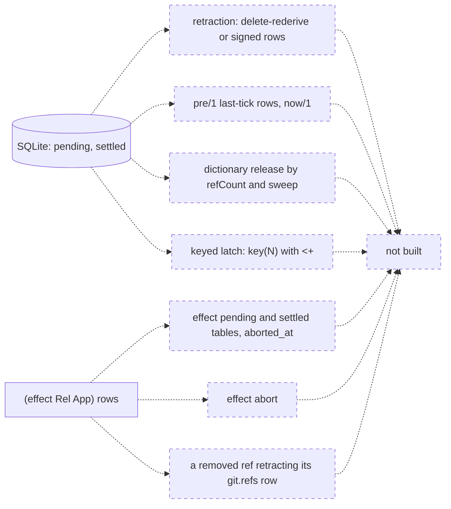

# Not built yet

| construct | where it is planned or recorded | status |
|---|---|---|
| retraction: delete-rederive or signed rows | `plans/v8/2026-09-14-v8-store.PLAN.md` section 10; `plans/v8/2026-09-14-v8-design-review.fable.md:169` | not built; tables are append-only, `src/_6_eval/_3_table.rs:1-3` |
| a removed ref retracting its `git.refs` row | `README.md:126` | not built |
| keyed latch, `key(N)` with `<+` | `v6/tsv2/goldens/ghcacher_tick_golden/0_ghcacher_clock_golden.dl6:10-11`, `:24-25`; `design-review.fable.md:125` | not built; `<+` rewrites to `<-`, `macrotime/0_standard.dl7:101-102` |
| log relations with retention, `keep(all)` | `design-review.fable.md:126` | not built |
| `pre/1` last-tick rows, `now/1` | `design-review.fable.md:127` | not built |
| `share` as prelude rules: `readers`, `idle_since`, `grace`, `keep` | `design-review.fable.md:52` | not built |
| `effect` pending and settled tables, `aborted_at` | `store.PLAN.md:906` | not built; effect rows live in `<program>.kernel` |
| effect abort | `v6/prolog/ARCH.pl:697` `effect_abort` | unbuilt |
| dictionary release by refCount and sweep | `store.PLAN.md:907` | not built |
| `fold` in the `dl8 eval` JSON transport | `tests/_15_fold.rs:6-8` | not built; `dl8 eval` keeps the fold term as a value |
| structured projection of an `extract` payload | `README.md:128` | not built |
| commit time in `git.history` | `README.md:127` | not built |
| schedule-fed replay of arrivals | `v6/tsv2/goldens/ghcacher_tick_golden/README.md:3-11` | not built in dl8 |
| statement count per tick | `v6/tsv2/goldens/ghcacher_tick_golden/5_expected.statements.jsonl` | not built; `insert_statements` is per run, `src/bin/dl8.rs:423-425` |
| deleting `Hosted` and `HostPort` from the prelude | `plans/v8/2026-09-14-v8-effect-demand.brief.md:83` | partly done: `_2_lower/_3_host.rs` and `_4_comptime/_4_host.rs` are gone; `src/_2_lower/_1_forms.rs:143` still names `Host`; the declarations remain at `prelude/1_declarations.dl7:292-305` |
| key on the whole edge, `keyed_edge` | `design-review.fable.md:47` | open question |
| Hindley-Milner inference for comptime | `plans/v8/2026-09-13-v8-tour.md` sections 6 and 10 | not built |
| clock checker | `v8-tour.md` sections 6 and 10 | not built |
| LSP diagnostics | `v8-tour.md` sections 6 and 10 | not built |
| `1b_compiler_tracer.pl` histograms and timing | `v8-tour.md` section 10 | not built; `--trace` sinks exist |
| `emit_compiled(prolog(Callable))` | `v8-tour.md` section 10 | not built, exit 3 |
| `compile_dl7_macro_program/3` verb, `project_stream_paths/3` | `v8-tour.md` section 10 | not built |
| dbsp and rust emitters, `4_tool/*` | `v8-tour.md` section 10 | not built; the sqlite emitter is built, [The SQLite emitter](13_sqlite.md) |
| dl7 TSI render takeover: `()` as empty product, dotted atoms, one type emitter | `v6/prolog/ARCH.pl:1009` `dl7_tsi_render_takeover` | unbuilt |
