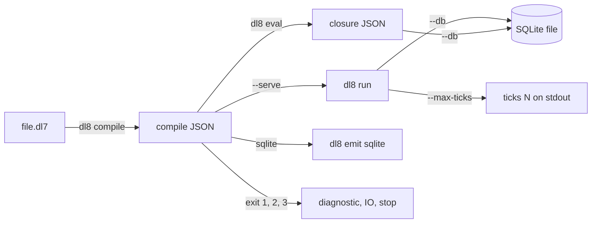

# Running dl8

## What



`dl8` is one binary with one verb per pipeline phase (`src/bin/dl8.rs:28-102`).
`compile` reads `.dl7` and prints JSON; `eval` evaluates that JSON once; `run` loops ticks with executors; `emit sqlite` lowers it to views.
Build it with `cargo build --release` at the repository root; every command in this book runs from there with `$DL8` set to that binary.
`book/show.sh <verb> <file.dl7> [flags]` compiles, runs the verb, and prints one line per row of the file's own relations, one per `effect` row, one per diagnostic, then `exit <code>`.
`book/check_outputs.sh` reruns every `console` block in this book and diffs its output against the page.
Every path is from the repository root. `v5/`, `v6/` and `v7/` hold the earlier engines.

## Why

`README.md:3-5`: the filesystem is the pipe and each `src/_<n>_name/` folder is one operator; the verbs `read` to `reify` run one folder each (`src/bin/dl8.rs:138-144`).
`dl8.rs:1` states the binary is the one subscribe: file in, JSON out, exit code.

## When to use

Use it when:

- a program has no served relations: `dl8 eval`, [Facts and rules](3_rules.md)
- a program declares a served relation with an executor: `dl8 run --serve`, [Executors](11_executors.md)
- rows must survive the process: `--db`, [The store](12_store.md)

Do not use it when:

- the program folds with `(fold ...)`: `dl8 eval` stores the fold term as the value, read `dl8 compile` rows, [Aggregates and fold](7_aggregate.md)
- a served name has no executor: `dl8 run` exits 1, [Executors](11_executors.md)

## Example

```console
$ $DL8 --help
DL7, compiled in Rust

Usage: dl8 <COMMAND>

Commands:
  read      Read one .dl7 file and print its forms, source rows and diagnostics as JSON
  expand    Expand macrotime over a case (JSON: syntax graph rows + macro program)
  lower     Lower a case (JSON) to the checked-goal program
  check     Check a lowered case (JSON)
  load      Load project facts: filesystem graph, TSI stream, source facts (JSON case)
  comptime  Run comptime rounds over a checked case (JSON)
  reify     Reify a checked program (JSON) to logical program rows
  compile   Compile one `.dl7` file (or a project) and print compiler rows, the runtime program and diagnostics as JSON
  emit      Lower a `dl8 compile` output to one target and print the artifact as JSON
  eval      Evaluate a checked-goal program (JSON) and print its closure as JSON
  run       Run a program as a process: each tick evaluates, hands the `effect` rows of served relations to their executors, and inserts the answers
  help      Print this message or the help of the given subcommand(s)

Options:
  -h, --help  Print help
```

```console
$ $DL8 compile --help
Compile one `.dl7` file (or a project) and print compiler rows, the runtime program and diagnostics as JSON

Usage: dl8 compile [OPTIONS] <FILE>...

Arguments:
  <FILE>...  Source files; more than one, or `--project`, selects the project door

Options:
      --project <PROJECT>  Project root; `compile_dl7_project/5` instead of `compile_dl7/4`
      --tsi <TSI>          A TSI JSONL stream to load before lowering
      --trace              Print every wave and round to stderr
  -h, --help               Print help
```

```console
$ $DL8 eval --help
Evaluate a checked-goal program (JSON) and print its closure as JSON

Usage: dl8 eval [OPTIONS] <PROGRAM>

Arguments:
  <PROGRAM>  

Options:
      --serve <SERVE>  Relations the outside settles; a miss on one writes an `effect` row
      --trace          Print one line per stratum and round to stderr
      --db <DB>        Persist the closure into this SQLite file, and load it back on the next run. The program's table prefix is the JSON file's stem
  -h, --help           Print help
```

```console
$ $DL8 run --help
Run a program as a process: each tick evaluates, hands the `effect` rows of served relations to their executors, and inserts the answers

Usage: dl8 run [OPTIONS] <PROGRAM>

Arguments:
  <PROGRAM>  

Options:
      --serve <SERVE>          Relations an executor settles: `timer`, `fetch_json`, `git.refs`, `git.history`, `fs.at`, `extract`
      --trace                  Print one line per stratum, round and tick to stderr
      --db <DB>                Persist every tick into this SQLite file and continue from it
      --max-ticks <MAX_TICKS>  Stop after this many ticks past tick 0; unset runs until settled
  -h, --help                   Print help
```

```console
$ $DL8 emit --help
Lower a `dl8 compile` output to one target and print the artifact as JSON

Usage: dl8 emit <TARGET> <PROGRAM>

Arguments:
  <TARGET>
          Possible values:
          - sqlite: One `sqlite_ivm` view per derived relation over the `eval --db` tables

  <PROGRAM>
          

Options:
  -h, --help
          Print help (see a summary with '-h')
```

`eval --help` says a miss writes an `effect` row; the evaluator writes one on every evaluation of a served goal (`src/bin/dl8.rs:73` against `src/_6_eval/_5_evaluate.rs:261-262`). The code wins: [Effects](10_effects.md).

The same program through three verbs:

```dl7
; fixture: fixtures/reconcile/0_timer.dl7
; A timer with its period bound is a source; every fire is one row.
(: timer
   (* (: period_ms int)
      (: tick int)))

(: Fired (* (: tick int)))

(<- (Fired ?Tick)
    (timer 1 ?Tick))

(: FiredCount (* (: fires int)))

(<- (FiredCount (count ?Tick))
    (Fired ?Tick))
```

```console
$ bash book/show.sh eval fixtures/reconcile/0_timer.dl7
exit 0
```

```console
$ bash book/show.sh eval fixtures/reconcile/0_timer.dl7 --serve timer
(effect timer ref(application(timer, [1 none])))
exit 0
```

```console
$ bash book/show.sh run fixtures/reconcile/0_timer.dl7 --serve timer --max-ticks 3
(effect timer ref(application(timer, [1 none])))
(timer 1 1)
(timer 1 2)
(timer 1 3)
(Fired 1)
(Fired 2)
(Fired 3)
(FiredCount 1)
(FiredCount 2)
(FiredCount 3)
ticks 3
exit 0
```

## What proves it

| claim | path | command |
|---|---|---|
| every verb and flag | `src/bin/dl8.rs:28-102` | `$DL8 <verb> --help` |
| `compile` exits 1 on any diagnostic, 2 on IO, 3 on a stop | `src/bin/dl8.rs:460-504` | `$DL8 compile oracle/check/cases/1_unsafe_head_var.dl7; echo $?` |
| `run` stdout carries `ticks`, and `insert_statements` with `--db` | `src/bin/dl8.rs:421-426` | `cargo test --test _17_reconcile` |
| `--max-ticks` counts ticks past tick 0 | `src/bin/dl8.rs:98-100` | `bash book/show.sh run fixtures/reconcile/0_timer.dl7 --serve timer --max-ticks 3` |
| `show.sh` output matches this page | `book/check_outputs.sh` | `bash book/check_outputs.sh book/src/1_run.md` |
