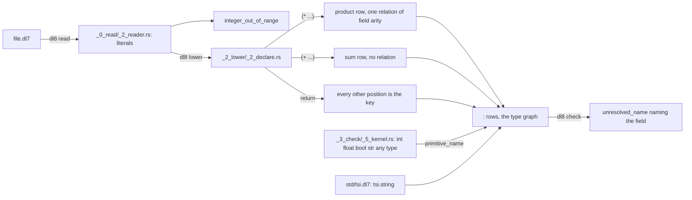

# Declarations

## What



`(: Name (* (: field type) ...))` declares a product: a node, a `product` row, one edge per field, and one relation whose arity is the field count (`src/_2_lower/_2_declare.rs:189-194`, `:268-306`).
`(: Name (+ (: variant type) ...))` declares a sum: the node, a `sum` row and the edges, and no relation (`_2_declare.rs:268` "A sum declares no relation").
A field type is a primitive, a declared name, a literal, or an application such as `(Option str)`.
The primitive names are `int float bool str any type` (`src/_3_check/_5_kernel.rs:40-42`); `tsi.string` is a product of `@std/tsi`, `(: string (* ))` (`std/tsi.dl7:6`).
Literals: 64-bit integers, decimal floats, `true`, `false`, and double-quoted text (`src/_0_read/_2_reader.rs:376-397`). A wider integer is `integer_out_of_range` (`_2_reader.rs:383`).
A product field whose name is `return` makes every other position the key (`_2_declare.rs:292-303`).

A field target is a type node or a value node.
A type node is a primitive or a declared name, and the field has that type and no default.
A value node is an application of a type to literals, and the field has that type and that literal as its default.
`(str "untitled")` is the value node `intern str ["untitled"]` (`src/_2_lower/_8_express.rs`, `lower_construction`).
`(: count 3)` names no type, so the literal's own primitive is the constructor (`src/_2_lower/_5_derived.rs`, `literal_construction`).
Applying a node that declares a relation is a goal; applying a node that declares none is construction (`_8_express.rs`, `expression_callable`).

The field's type and its default are prelude rules over that one value node, not a pass in the compiler (`prelude/3_derived_rules.dl7`, `column_value`, `column_type`, `default`).
`column_type` also holds for a field whose target is a type node, so one relation answers the type of every field of every product and every kernel relation.

## Why

`plans/v8/2026-09-13-v8-tour.md` section 5: `(: owner name target index)` is the one row every declaration lowers to, so a declaration is data a rule can read ([Terms and the graph](5_terms.md)).
No written decision names why a sum carries no relation; the source line is `_2_declare.rs:268`.
A default is a value node rather than a fourth item of `:`, and its type is a comptime rule rather than a Rust pass, because a Rust pass runs before comptime and would be blind to every derived type (`AGENTS.md`, the two rows dated 2026-09-17 on defaults and on column typing).

## When to use

Use it when:

- a relation holds rows: a product, `fixtures/store/0_round_trip.dl7`
- a column holds values of mixed kinds: `any`, `fixtures/term_lt/0_mixed_kinds.dl7`
- a column holds a type or a node: `type`, `oracle/compile/sources/test/fixtures/2_partial.dl7`
- a value is one of several shapes: a sum, `oracle/compile/sources/test/fixtures/16_interned_storage.dl7:42-47`

Do not use it when:

- a sum should hold rows: it declares no relation, use a product per variant
- a field names a type nobody declared: `unresolved_name`, [Diagnostics](14_diagnostics.md)

## Example

Every scalar kind in one product:

```dl7
; fixture: fixtures/store/0_round_trip.dl7
(: Reading (* (: name str) (: value float) (: ok bool) (: count int)))

(Reading "a" 1.5 true 3)

(Reading "b" -0.25 false 4)

(: Copied (* (: name str) (: value float)))

(<- (Copied ?Name ?Value)
    (Reading ?Name ?Value ?Ok ?Count))
```

```console
$ bash book/show.sh eval fixtures/store/0_round_trip.dl7
(Reading "a" 1.5 true 3)
(Reading "b" -0.25 false 4)
(Copied "a" 1.5)
(Copied "b" -0.25)
exit 0
```

A sum, and a product whose field is that sum:

```dl7
; fixture: oracle/compile/sources/test/fixtures/16_interned_storage.dl7:40-47
; Sum fixture verifies that reachable variants use the same ordered field and
; dependency protocol as products.
(: SpanChoice
   (+ (: first Span)
      (: second Span)))

(: ChoiceRoot
   (* (: choice SpanChoice)))
```

```console
$ $DL8 compile oracle/compile/sources/test/fixtures/16_interned_storage.dl7 | jq -c '[.compiler_rows[] | select(.args[0].args[0].f == "kernel") | .args[0].args[0].args[0].a] | group_by(.) | map([.[0], length])'
[[":",571],["module",2],["nil",1],["node",139],["product",134],["sum",1]]
```

A typed default, and one inferred from its literal:

```dl7
; fixture: plans/v8/probes/2026-09-17-defaults.dl7
; A typed default: the column target is a value node, not a type node.
(User: (* (: name str)
          (: title (str "untitled"))
          (: n 3)
          (: return type)))
```

Its rx lowering. `nil`, `cons` and `intern` are the kernel goals
`lower_construction` writes, and the stream is returned rather than subscribed:

```ts
const title$ = nil().pipe(
  mergeMap((tail) => cons("untitled", tail)),
  mergeMap((argumentList) => intern(str, argumentList)),
  map((value) => colon(User, "title", value, 1)),
);

const count$ = nil().pipe(
  mergeMap((tail) => cons(3, tail)),
  mergeMap((argumentList) => intern(int, argumentList)),
  map((value) => colon(User, "n", value, 2)),
);
```

The field's type and default read back out of that one value node:

```console
$ $DL8 compile plans/v8/probes/2026-09-17-defaults.dl7 | jq -r '.diagnostics | length'
0
```

| field | target | `column_type` | `default` |
|---|---|---|---|
| `name` | `str` | `str` | none |
| `title` | `(str "untitled")` | `str` | `"untitled"` |
| `n` | `3` | `int` | `3` |
| `return` | `type` | `type` | none |

A field type nobody declared:

```dl7
; fixture: oracle/compile/sources/test/fixtures/lexical_binding/2_missing_name.dl7
; diagnostic: unresolved_name
(: Holder
   (* (: field Missing)))
```

```console
$ bash book/show.sh compile oracle/compile/sources/test/fixtures/lexical_binding/2_missing_name.dl7
diagnostic diagnostic(check, reader_node(oracle/compile/sources/test/fixtures/lexical_binding/2_missing_name.dl7, 5), unresolved_name(field))
exit 1
```

## What proves it

| claim | path | command |
|---|---|---|
| a float, a bool and str round-trip through a product | `fixtures/store/0_round_trip.expected.json` | `cargo test --test _13_store reopening_the_db_leaves_the_closure_identical` |
| float and bool literals | `fixtures/literals/0_float.expected.json`, `1_bool.expected.json` | `cargo test --test _10_literals` |
| a sum declares no relation | `src/_2_lower/_2_declare.rs:268-277` | `sed -n 268,277p src/_2_lower/_2_declare.rs` |
| six primitive names | `src/_3_check/_5_kernel.rs:40-42` | `grep -n primitive_name src/_3_check/_5_kernel.rs` |
| an undeclared field type is `unresolved_name` naming the field | `oracle/check/cases/0_unresolved_name.dl7`, `oracle/check/status.json` | `cargo test --test _4_check_oracle` |
| a typed default and a bare literal both compile clean | `plans/v8/probes/2026-09-17-defaults.dl7` | `$DL8 compile plans/v8/probes/2026-09-17-defaults.dl7 \| jq '.diagnostics'` |
| the field type and the default are prelude rules | `prelude/3_derived_rules.dl7`, `prelude/1_declarations.dl7` | `grep -n 'column_value\|column_type\|default' prelude/3_derived_rules.dl7` |
| a value-node option reads through `default` | `prelude/2_constructor_rules.dl7`, `HistoryV1` | `cargo test --test _8_compile_oracle` |
