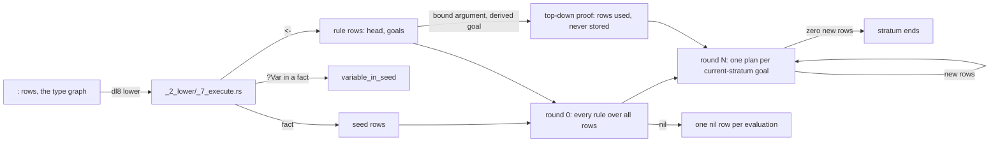

# Facts and rules

## What



A fact is a form naming a declared relation with no variable in it: `(Edge "a" "b")`. It lowers to a seed row; a variable is `variable_in_seed` (`src/_2_lower/_7_execute.rs:83`).
A rule is `(<- Head Goal ...)`: the head is one relation form, the body is goals, and `?Name` is one variable across its top form, and each `?_` is its own variable (`src/_0_read/_2_reader.rs:355-367`).
A head may carry constants: `(Tagged ?Node "heavy")` (`fixtures/sqlite_emit/0_union_filter.dl7:40`).
Evaluation is stratified and semi-naive (`src/_6_eval/_5_evaluate.rs:727-838`): round 0 fires every rule over all rows; each later round fires one plan per current-stratum goal, that goal reading the last round's new rows and earlier goals the older rows; the stratum ends at a round with zero new rows.
A goal on a derived relation with some argument bound is also proved top-down, and those rows are used, never stored (`_5_evaluate.rs:250-257`, `:278-282`).
Several rules with one head are a union; a rule that reads its own head is recursion.

## Why

Parity with v7 `evaluate/4` is the stated contract of `_6_eval` (`README.md:15`), and the prolog oracles under `oracle/eval/` are its receipts.
The top-down demand exists because v7's tabled `proves/2` answers goals bottom-up cannot, a head that needs its arguments bound (`_5_evaluate.rs:278-282`).

## When to use

Use it when:

- rows are known up front: facts, `fixtures/sqlite_emit/1_transitive.dl7:3-11`
- a relation is a join of others: a rule, `fixtures/sqlite_emit/0_union_filter.dl7:29-36`
- reachability: two rules, anchor and step, `fixtures/sqlite_emit/1_transitive.dl7:15-20`

Do not use it when:

- a head variable appears in no body goal: `unsafe_head_var`, [Diagnostics](14_diagnostics.md)
- a row must disappear later: nothing retracts, [Not built yet](16_not_built.md)
- a rule needs the absence of a row: [Negation and strata](4_negation.md)

## Example

```dl7
; fixture: fixtures/sqlite_emit/1_transitive.dl7
(: Edge (* (: from str) (: to str)))

(Edge "a" "b")

(Edge "b" "c")

(Edge "c" "d")

(Edge "d" "b")

(Edge "x" "y")

(: Reach (* (: from str) (: to str)))

(<- (Reach ?From ?To)
    (Edge ?From ?To))

(<- (Reach ?From ?To)
    (Reach ?From ?Middle)
    (Edge ?Middle ?To))
```

```console
$ bash book/show.sh eval fixtures/sqlite_emit/1_transitive.dl7
(Edge "a" "b")
(Edge "b" "c")
(Edge "c" "d")
(Edge "d" "b")
(Edge "x" "y")
(Reach "a" "b")
(Reach "a" "c")
(Reach "a" "d")
(Reach "b" "b")
(Reach "b" "c")
(Reach "b" "d")
(Reach "c" "b")
(Reach "c" "c")
(Reach "c" "d")
(Reach "d" "b")
(Reach "d" "c")
(Reach "d" "d")
(Reach "x" "y")
exit 0
```

A repeated variable and a constant in one goal:

```dl7
; fixture: oracle/compile/sources/test/fixtures/12_native_runtime.dl7
(: Input
   (* (: value int)
      (: same int)
      (: tag int)))

(: Output
   (* (: value int)))

(Input 7 7 7)

(<- (Output ?Value)
    (Input ?Value ?Value 7))
```

```console
$ bash book/show.sh eval oracle/compile/sources/test/fixtures/12_native_runtime.dl7
(Input 7 7 7)
(Output 7)
exit 0
```

The fixpoint as a step trace, over the prolog oracle for a four-edge cycle:

```prolog
% fixture: oracle/eval/0_transitive.pl
program(
    [ rule(call(ref(path), [var(from), var(to)]),
           [checked_goal(positive, call(ref(edge), [var(from), var(to)]))]),
      rule(call(ref(path), [var(from), var(to)]),
           [ checked_goal(positive, call(ref(path), [var(from), var(via)])),
             checked_goal(positive, call(ref(edge), [var(via), var(to)])) ])
    ],
    [ call(ref(edge), [const(a), const(b)]),
      call(ref(edge), [const(b), const(c)]),
      call(ref(edge), [const(c), const(d)]),
      call(ref(edge), [const(d), const(a)]) ]).
```

```console
$ $DL8 eval oracle/eval/0_transitive.json --trace 2>&1 >/dev/null | sed 's/^[^ ]* //'
DEBUG dl8::trace: event=Stratum { level: 0, rules: 2, seeds: 4 }
DEBUG dl8::trace: event=Aggregate { level: 0, rules: 0, rows: 0 }
DEBUG dl8::trace: event=Round { level: 0, round: 0, new: 4 }
DEBUG dl8::trace: event=Round { level: 0, round: 1, new: 4 }
DEBUG dl8::trace: event=Round { level: 0, round: 2, new: 4 }
DEBUG dl8::trace: event=Round { level: 0, round: 3, new: 4 }
DEBUG dl8::trace: event=Round { level: 0, round: 4, new: 0 }
DEBUG dl8::trace: event=Closure { rows: 21 }
```

Round 0 derives the 4 length-1 paths, rounds 1 to 3 add lengths 2 to 4, round 4 adds nothing: steady state. The closure is 4 `edge`, 16 `path` and the 1 `nil` row every evaluation inserts (`_5_evaluate.rs:708`).

## What proves it

| claim | path | command |
|---|---|---|
| semi-naive closure equals v7 over every eval oracle | `oracle/eval/*.pl`, `oracle/eval/*.json` | `cargo test --test _0_eval_oracle` |
| demanded rows are used, never stored | `oracle/eval/14_demand_recursion.pl:1-3` | `$DL8 eval oracle/eval/14_demand_recursion.json` |
| repeated variables and arity | `oracle/eval/12_repeated_vars_and_arity.pl` | `cargo test --test _0_eval_oracle` |
| unions and head constants | `fixtures/sqlite_emit/0_union_filter.dl7` | `bash book/show.sh eval fixtures/sqlite_emit/0_union_filter.dl7` |
| every evaluation inserts one `nil` row | `src/_6_eval/_5_evaluate.rs:704-708` | `$DL8 eval oracle/eval/10_empty.json` |
