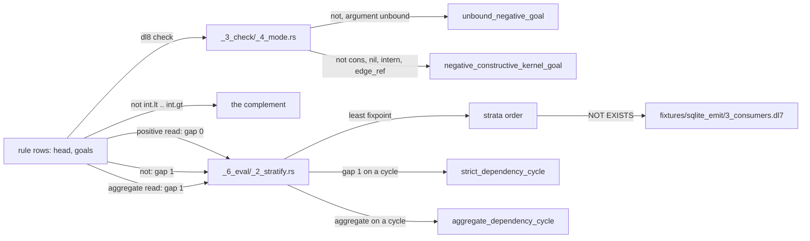

# Negation and strata

## What



`(not Goal)` in a body holds when no row matches the goal with its variables as bound at that point (`src/_2_lower/_7_execute.rs:150-154`, `src/_6_eval/_5_evaluate.rs:190-209`).
A negative goal with any argument still unbound never holds in the evaluator (`_5_evaluate.rs:190-197`); the checker rejects such a rule first with `unbound_negative_goal`.
Negating a constructive kernel goal (`nil`, `cons`, `intern`, `edge_ref`, `src/_3_check/_4_mode.rs:243-249`) is `negative_constructive_kernel_goal`; a negated `int.lt`..`int.gt`, `int.add` or `any.lt` is the complement (`src/_6_eval/_4_kernel.rs:320-339`).
Strata: a positive read has gap 0, a negative read gap 1, and every read of an aggregate rule gap 1; levels relax to the least fixpoint (`src/_6_eval/_2_stratify.rs:1-3`).
A gap-1 edge on a dependency cycle is `strict_dependency_cycle`, or `aggregate_dependency_cycle` when an aggregate closes it.

## Why

Stratification is the port of v7 `stratify_rules/3` (`_2_stratify.rs:1`), kept for parity with v7 `evaluate/4` (`README.md:15`).
The checker's two variable sets, `available` for positive goals and `produced` for negative ones, are recorded as fork C3 in `plans/v8/2026-09-13-v8-tour.md` section 9 with v7 behavior kept.

## When to use

Use it when:

- a row is kept for the absence of another: `fixtures/term_lt/1_top.dl7:18-20`
- nodes a closure never reached: `fixtures/sqlite_emit/3_consumers.dl7:28-32`

Do not use it when:

- the negated goal's variables are bound by nothing before it: `unbound_negative_goal`, [Diagnostics](14_diagnostics.md)
- the negated relation depends on the rule's own head: `strict_dependency_cycle`, `oracle/check/cases/9_strict_cycle.dl7`
- the goal is `nil`, `cons`, `intern` or `edge_ref`: `negative_constructive_kernel_goal`, `oracle/check/cases/3_negative_cons.dl7`

## Example

```dl7
; fixture: fixtures/term_lt/1_top.dl7
(: Score (* (: player str) (: points int)))

(Score "ann" 4)

(Score "bob" 10)

(Score "cy" 7)

(: Beaten (* (: player str)))

(<- (Beaten ?Player)
    (Score ?Player ?Points)
    (Score ?Other ?More)
    (any.lt ?Points ?More))

(: Top (* (: player str)))

(<- (Top ?Player)
    (Score ?Player ?Points)
    (not (Beaten ?Player)))
```

```console
$ bash book/show.sh eval fixtures/term_lt/1_top.dl7
(Score "ann" 4)
(Score "bob" 10)
(Score "cy" 7)
(Beaten "ann")
(Beaten "cy")
(Top "bob")
exit 0
```

Order inside a body, at the evaluator, with no checker in front. `lonely` negates before `source` binds `value`; `free` negates after:

```prolog
% fixture: oracle/eval/11_nonground_negation.pl
program(
    [ rule(call(ref(lonely), [var(value)]),
           [ checked_goal(negative, call(ref(taken), [var(value)])),
             checked_goal(positive, call(ref(source), [var(value)])) ]),
      rule(call(ref(free), [var(value)]),
           [ checked_goal(positive, call(ref(source), [var(value)])),
             checked_goal(negative, call(ref(taken), [var(value)])) ])
    ],
    [ call(ref(source), [const(one)]),
      call(ref(source), [const(two)]),
      call(ref(taken), [const(two)]) ]).
```

```console
$ bash book/show.sh eval oracle/eval/11_nonground_negation.json
(free one)
(source one)
(source two)
(taken two)
exit 0
```

```console
$ $DL8 eval oracle/eval/11_nonground_negation.json --trace 2>&1 >/dev/null | sed 's/^[^ ]* //'
DEBUG dl8::trace: event=Stratum { level: 0, rules: 0, seeds: 3 }
DEBUG dl8::trace: event=Aggregate { level: 0, rules: 0, rows: 0 }
DEBUG dl8::trace: event=Round { level: 0, round: 0, new: 0 }
DEBUG dl8::trace: event=Stratum { level: 1, rules: 2, seeds: 0 }
DEBUG dl8::trace: event=Aggregate { level: 1, rules: 0, rows: 0 }
DEBUG dl8::trace: event=Round { level: 1, round: 0, new: 1 }
DEBUG dl8::trace: event=Round { level: 1, round: 1, new: 0 }
DEBUG dl8::trace: event=Closure { rows: 5 }
```

Step trace: level 0 inserts the 3 seeds and derives nothing; level 1 holds both rules because each reads `taken` negatively, round 0 derives `free one`, round 1 derives nothing: steady state.

A cycle through negation:

```dl7
; fixture: oracle/check/cases/9_strict_cycle.dl7
; diagnostic: strict_dependency_cycle
(: gamma
   (* (: value int)))

(: alpha
   (* (: value int)))

(: beta
   (* (: value int)))

(gamma 1)

(<- (alpha ?Value)
    (beta ?Value))

(<- (beta ?Value)
    (gamma ?Value)
    (not (alpha ?Value)))
```

```console
$ bash book/show.sh compile oracle/check/cases/9_strict_cycle.dl7
diagnostic diagnostic(stratify, none, strict_dependency_cycle([ref(owner(file(oracle/check/cases/9_strict_cycle.dl7), reader_node(oracle/check/cases/9_strict_cycle.dl7, 12))) ref(owner(file(oracle/check/cases/9_strict_cycle.dl7), reader_node(oracle/check/cases/9_strict_cycle.dl7, 21)))]))
exit 1
```

## What proves it

| claim | path | command |
|---|---|---|
| an unbound negative goal never holds at eval | `oracle/eval/11_nonground_negation.json` | `cargo test --test _0_eval_oracle` |
| the checker rejects it first | `oracle/check/cases/2_unbound_negative.dl7`, `oracle/check/status.json` | `cargo test --test _4_check_oracle` |
| negated `cons` is rejected | `oracle/check/cases/3_negative_cons.dl7` | `bash book/show.sh compile oracle/check/cases/3_negative_cons.dl7` |
| negated integer comparison is the complement | `oracle/eval/5_int_compare.pl:6-9` | `bash book/show.sh eval oracle/eval/5_int_compare.json` |
| a negative cycle stops evaluation | `oracle/eval/2_strict_cycle.pl` | `bash book/show.sh eval oracle/eval/2_strict_cycle.json` |
| `NOT EXISTS` lowering of a negative goal | `fixtures/sqlite_emit/3_consumers.dl7` | `bash book/show.sh emit fixtures/sqlite_emit/3_consumers.dl7 sqlite` |
