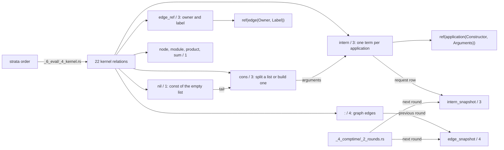

# Terms and the graph

## What



Kernel relations are built into the evaluator, one partial function over bound arguments each, never a stored table except that `intern` records every request as a row (`src/_6_eval/_4_kernel.rs:1-4`).
`(: Owner name Target Index)` in a body reads one graph edge and in a head derives one; every declaration lowers to these rows (`plans/v8/2026-09-13-v8-tour.md` section 5, `oracle/compile/sources/test/fixtures/14_syntax_macros.dl7:116-125`).
`edge_snapshot` and `intern_snapshot` hold the previous compiler round's `:` edges and `intern` requests as read-only rows (`src/_4_comptime/_2_rounds.rs:279-293`); at runtime the effect branch also writes `intern_snapshot` rows ([Effects](10_effects.md)).
An application term is `ref(application(Constructor, [Arguments]))`; equal arguments give the same term (`_4_kernel.rs:231-245`).

| relation | arity | keys (`_3_check/_5_kernel.rs:67-79`) | the checker needs bound (`_3_check/_4_mode.rs:188-231`) | evaluates to |
|---|---|---|---|---|
| `nil` | 1 | `[0]` | nothing | `const([])` (`_4_kernel.rs:152-157`) |
| `cons` | 3 | `[0,1]`, `[2]` | the list, or head and tail | split when the list is bound, else build (`:140-158`) |
| `edge_ref` | 3 | `[0,1]` | owner and label | `ref(edge(Owner, Label))` (`:160-170`) |
| `intern` | 3 | `[0,1]` | constructor and arguments | `ref(application(Constructor, Arguments))`, row recorded (`:172-186`) |
| `intern_snapshot` | 3 | `[0,1]` | nothing | stored rows only |
| `:` | 4 | `[0,1]`, `[0,3]` | nothing | graph edges |
| `edge_snapshot` | 4 | `[0,1]`, `[0,3]` | nothing | stored rows only |
| `node`, `module`, `product`, `sum` | 1 | none | nothing | graph classifier rows |

## Why

`intern` gives one identity per argument list, which is how the prelude builds `Partial`, `Option` and `Key` values (`prelude/2_constructor_rules.dl7:1-30`).
The snapshot pair is the port of v7 `2_compiler.pl:1505-1517`: the last round's edges and intern requests re-enter the next round as read-only rows (`_2_rounds.rs:279-293`). No written decision gives a further reason.

## When to use

Use it when:

- a rule builds a list: `nil` then `cons`, `oracle/eval/4_cons_lists.pl`
- a rule mints one identity per argument list: `intern`, `oracle/eval/16_intern_row_reuse.pl`
- a rule reads a declared field: `edge_snapshot`, `oracle/compile/sources/test/fixtures/2_partial.dl7:35-42`
- a rule reads the arguments of an application it did not build: `intern_snapshot` then `cons`, `fixtures/host_effect/3_loading.dl7:23-26`

Do not use it when:

- the list, or head and tail, are unbound at a `cons`: `underconstrained_kernel_goal`, `oracle/check/cases/4_under_cons.dl7`
- owner or label is unbound at `edge_ref`: `oracle/check/cases/5_under_edge_ref.dl7`
- constructor or arguments are unbound at `intern`: `oracle/check/cases/6_under_intern.dl7`
- the goal is negated: [Negation and strata](4_negation.md)

## Example

Lists by construction and by split:

```prolog
% fixture: oracle/eval/4_cons_lists.pl
program(
    [ rule(call(ref(item), [var(head)]),
           [ checked_goal(positive, call(ref(suffix), [var(list)])),
             checked_goal(positive, call(ref(kernel(cons)), [var(head), var(tail), var(list)])) ]),
      rule(call(ref(suffix), [var(list)]),
           [checked_goal(positive, call(ref(source), [var(list)]))]),
      rule(call(ref(suffix), [var(tail)]),
           [ checked_goal(positive, call(ref(suffix), [var(list)])),
             checked_goal(positive, call(ref(kernel(cons)), [var(head), var(tail), var(list)])) ]),
      rule(call(ref(singleton), [var(list)]),
           [ checked_goal(positive, call(ref(item), [var(head)])),
             checked_goal(positive, call(ref(kernel(nil)), [var(empty)])),
             checked_goal(positive, call(ref(kernel(cons)), [var(head), var(empty), var(list)])) ]),
      rule(call(ref(pair), [var(list)]),
           [ checked_goal(positive, call(ref(item), [var(first)])),
             checked_goal(positive, call(ref(singleton), [var(rest)])),
             checked_goal(positive, call(ref(kernel(cons)), [var(first), var(rest), var(list)])) ]),
      rule(call(ref(empty_witness), []),
           [checked_goal(positive, call(ref(kernel(cons)), [var(head), var(tail), const([])]))]),
      rule(call(ref(improper_witness), []),
           [checked_goal(positive, call(ref(kernel(cons)), [var(head), var(tail), const([one | improper])]))])
    ],
    [ call(ref(source), [const([const(one), const(two), const(three)])]) ]).
```

```console
$ bash book/show.sh eval oracle/eval/4_cons_lists.json
(item one)
(item three)
(item two)
(pair [one one])
(pair [one three])
(pair [one two])
(pair [three one])
(pair [three three])
(pair [three two])
(pair [two one])
(pair [two three])
(pair [two two])
(singleton [one])
(singleton [three])
(singleton [two])
(source [one two three])
(suffix [])
(suffix [one two three])
(suffix [three])
(suffix [two three])
exit 0
```

`empty_witness` and `improper_witness` have no row: `cons` has no split of `[]` or of an improper list.

Edges and interned applications:

```console
$ bash book/show.sh eval oracle/eval/9_edge_ref.json
(edge_of ref(node(1)) "name" ref(edge(node(1), "name")))
(edge_of ref(node(1)) type ref(edge(node(1), type)))
(field not_a_ref x)
(field ref(node(1)) "name")
(field ref(node(1)) type)
(tagged ref(application(pair, [node(1) edge(node(1), "name")])))
(tagged ref(application(pair, [node(1) edge(node(1), type)])))
exit 0
```

Reading a declared product's fields, then building a list of their names, in dl7:

```dl7
; fixture: oracle/compile/sources/test/fixtures/2_partial.dl7:32-42
(: selected_request
   (* (: result type)))

(<- (selected_request ?Result)
    (Partial User ?Partial)
    (edge_snapshot ?Partial ?FirstName ?FirstType 0)
    (edge_snapshot ?Partial ?SecondName ?SecondType 1)
    (nil ?Empty)
    (cons ?SecondName ?Empty ?Tail)
    (cons ?FirstName ?Tail ?Names)
    (Pick ?Partial ?Names ?Result))
```

```console
$ bash book/show.sh compile oracle/compile/sources/test/fixtures/2_partial.dl7
(User 7 "Ada")
(history_request ref(application(HistoryV1, [User HistoryOptions])))
(selected_request ref(application(Pick, [application(Partial, [User]) [id name]])))
(excluded_request ref(application(Exclude, [application(Pick, [application(Partial, [User]) [id name]]) [id]])))
exit 0
```

## What proves it

| claim | path | command |
|---|---|---|
| `cons` splits and builds, never splits `[]` | `oracle/eval/4_cons_lists.json` | `cargo test --test _0_eval_oracle` |
| `edge_ref` and `intern` terms | `oracle/eval/9_edge_ref.json` | `bash book/show.sh eval oracle/eval/9_edge_ref.json` |
| an `intern` row from a lower stratum matches with the constructor unbound | `oracle/eval/16_intern_row_reuse.pl:1-2` | `bash book/show.sh eval oracle/eval/16_intern_row_reuse.json` |
| kernel names, arities and keys | `src/_3_check/_5_kernel.rs:16-79` | `sed -n 16,79p src/_3_check/_5_kernel.rs` |
| each underconstrained kernel goal and its diagnostic | `oracle/check/cases/4_under_cons.dl7` to `7_under_int_lt.dl7` | `cargo test --test _4_check_oracle` |
| snapshot rows are the last round's edges and requests | `src/_4_comptime/_2_rounds.rs:279-293` | `cargo test --test _6_comptime_oracle` |
