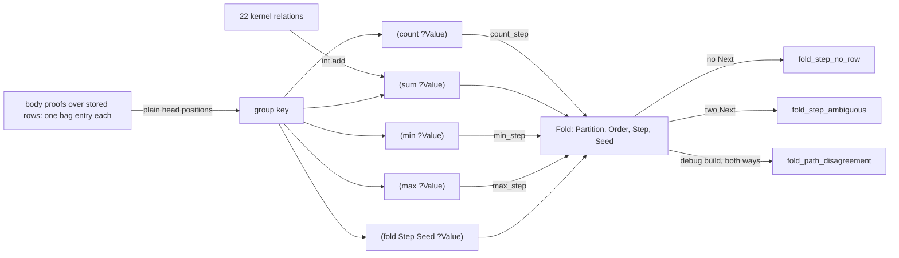

# Aggregates and fold

## What



A rule head may hold one aggregate position: `(count ?Value)`, `(sum ?Value)`, `(min ?Value)`, `(max ?Value)`, or `(fold Step Seed ?Value)` (`src/_2_lower/_8_express.rs:680-743`). Outside a head it is `aggregate_outside_rule_head`; two in one head is `malformed_aggregate_head` (`src/_6_eval/_5_evaluate.rs:434-442`).
Every body proof over stored rows is one bag entry; the plain head positions are the group key; a group with no proof has no row (`_5_evaluate.rs:430-466`).
An aggregate body matches stored rows only: no kernel functions, no demanded rules, no effects (`_5_evaluate.rs:147-149`).
`count` and `sum` give an integer; `sum` of a non-integer is `aggregate_type_mismatch`, overflow is `aggregate_overflow`; `min` and `max` return the winning value in term order (`_5_evaluate.rs:595-647`).
A fold is `Fold { step, seed, order }` (`src/_6_eval/_1_program.rs:74-81`): values sorted by term order, then `(Step Accumulator Value ?Next)` per value, exactly one `Next` each, else `fold_step_no_row`, `fold_step_ambiguous` or `fold_step_interns` (`_5_evaluate.rs:497-593`). The seed must be concrete (`fold_seed_not_ground`, `_8_express.rs:705-707`).
The four builtins are folds over `count_step`, `int.add`, `min_step`, `max_step`; a debug build folds both ways and reports `fold_path_disagreement` (`_1_program.rs:41-56`, `_5_evaluate.rs:468-495`).

The partition is the plain head positions; the code has no `Partition` field, where `plans/v8/2026-09-14-v8-design-review.astra.md:53` names `Fold(Partition,Order,Step,Seed)`. The code wins.

## Why

Aggregates read completed lower strata, the port of v7 `completed_body_holds/2` and `derive_aggregate_rows/4` (`_5_evaluate.rs:393-394`, `:430-432`).
`Order` exists so a step that is not commutative still folds to one answer (`_1_program.rs:58-60`).

## When to use

Use it when:

- a total or extreme per group: `fixtures/aggregates/2_grouped.dl7`, `1_min_max.dl7`
- an accumulator that is not a builtin: `fold` with a declared step, `fixtures/fold/1_program_step.dl7`
- the order of values changes the answer: `fixtures/fold/2_order_matters.dl7`

Do not use it when:

- the rows come from `dl8 eval`: its JSON has no `fold` key and the head keeps the fold term (`tests/_15_fold.rs:6-8`); read `dl8 compile` rows
- an aggregate reads its own head through any path: `aggregate_dependency_cycle`, `oracle/check/cases/10_aggregate_cycle.dl7`
- the count must drop when a row leaves: nothing retracts, the timer run in [Running dl8](1_run.md) shows `FiredCount` 1, 2 and 3 side by side

## Example

```dl7
; fixture: fixtures/aggregates/2_grouped.dl7
(: Score (* (: player str) (: points int)))

(Score "ann" 3)

(Score "ann" 4)

(Score "bob" 10)

(: PlayerTotal (* (: player str) (: sum int)))

(<- (PlayerTotal ?Player (sum ?Points))
    (Score ?Player ?Points))
```

```console
$ bash book/show.sh eval fixtures/aggregates/2_grouped.dl7
(Score "ann" 3)
(Score "ann" 4)
(Score "bob" 10)
(PlayerTotal "ann" 7)
(PlayerTotal "bob" 10)
exit 0
```

A fold whose step doubles the accumulator before adding:

```dl7
; fixture: fixtures/fold/2_order_matters.dl7
(: Input (* (: value int)))

(Input 1)

(Input 2)

(Input 4)

; Not commutative: the accumulator doubles before every value lands, so only
; the standard term order over the values gives 12.
(: Weighted
   (* (: accumulator int)
      (: value int)
      (: next int)))

(<- (Weighted ?Accumulator ?Value ?Next)
    (int.add ?Accumulator ?Accumulator ?Twice)
    (int.add ?Twice ?Value ?Next))

(: Total (* (: total int)))

(<- (Total (fold Weighted 0 ?Value))
    (Input ?Value))
```

```console
$ bash book/show.sh compile fixtures/fold/2_order_matters.dl7
(Input 1)
(Input 2)
(Input 4)
(Total 12)
exit 0
```

Step trace of `fold_generic` (`_5_evaluate.rs:498-529`), seed 0, values sorted `[1 2 4]`:

```text
step 0  accumulator=0                    -> (Weighted 0 1 ?Next)
step 1  accumulator=0+0+1   = 1          -> (Weighted 1 2 ?Next)
step 2  accumulator=1+1+2   = 4          -> (Weighted 4 4 ?Next)
step 3  accumulator=4+4+4   = 12         -> values exhausted, row (Total 12)
```

The same program through `dl8 eval`, which keeps the fold term:

```console
$ bash book/show.sh eval fixtures/fold/2_order_matters.dl7
(Input 1)
(Input 2)
(Input 4)
(Total fold(Weighted, 0, var(variable(reader_node(fixtures/fold/2_order_matters.dl7, 67), Value))))
exit 0
```

A step with no row for the second value:

```console
$ bash book/show.sh compile fixtures/fold/3_step_no_row.dl7
diagnostic diagnostic(evaluate, none, fold_step_no_row(ref(owner(file(fixtures/fold/3_step_no_row.dl7), reader_node(fixtures/fold/3_step_no_row.dl7, 18))), 7, 35))
exit 1
```

Aggregate bodies see stored rows only: `cons_count` has no row, `nil_count` counts the one stored `nil` row:

```console
$ bash book/show.sh eval oracle/eval/15_aggregate_tables_only.json
(item 1)
(item 2)
(item 3)
(item_count 3)
(nil_count 1)
(pair_count 1 2)
(pair_count 2 2)
(pair_count 3 2)
exit 0
```

## What proves it

| claim | path | command |
|---|---|---|
| `sum`, `min`, `max` and grouping | `fixtures/aggregates/*.expected.json` | `cargo test --test _11_aggregates` |
| fold with a kernel step, a program step, order, and a missing row | `fixtures/fold/*.expected.json` | `cargo test --test _15_fold` |
| aggregate bodies read stored rows only | `oracle/eval/15_aggregate_tables_only.pl:1-2` | `cargo test --test _0_eval_oracle` |
| two aggregates in one head | `oracle/eval/6_malformed_aggregate.pl` | `bash book/show.sh eval oracle/eval/6_malformed_aggregate.json` |
| count over a lower stratum, then a filter | `oracle/eval/3_count.pl` | `bash book/show.sh eval oracle/eval/3_count.json` |
| `dl8 eval` has no fold transport | `tests/_15_fold.rs:6-8`, `src/_6_eval/_6_json.rs:4-5` | `bash book/show.sh eval fixtures/fold/2_order_matters.dl7` |
