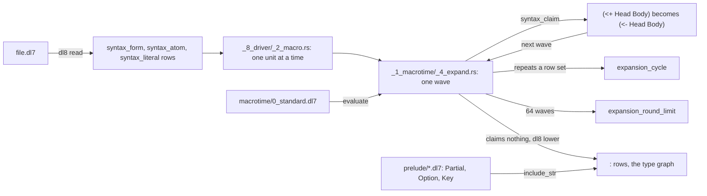

# Macros

## What



Macrotime runs between reading and lowering. The macro program is `macrotime/0_standard.dl7`, compiled into the binary with the prelude and trimmed to its claim and output rule cone (`src/_8_driver/_0_read.rs:17-18`, `src/_8_driver/_2_macro.rs:15-34`).
Each wave evaluates the macro program over the unit's syntax rows, then rewrites every claimed node. It ends when a wave claims nothing, repeats a row set (`expansion_cycle`), or reaches 64 waves (`expansion_round_limit`) (`src/_1_macrotime/_4_expand.rs:1-4`, `:16`, `:117-178`).
A macro sees the `syntax_frontier`, `syntax_form`, `syntax_atom`, `syntax_literal`, `syntax_variable` and `syntax_source` rows of one unit, the `(: Node item Child Index)` edges, and the kernel (`macrotime/0_standard.dl7:19-51`, `:73`). It claims a node with `syntax_claim` and names its output with `(: Form expansion Output Index)`; a claim with no expansion edge deletes the node (`oracle/compile/sources/test/fixtures/14_syntax_macros.dl7:70-71`).
Units expand one at a time (`_2_macro.rs:36-55`), so a macro sees no other file.
The standard program defines one macro, `<+`: any form whose item 0 is the atom `<+` becomes the same form with item 0 `<-` (`0_standard.dl7:68-126`). `(<+ Head Body ...)` means `(<- Head Body ...)` today.
The prelude is the six `prelude/*.dl7` files, compiled into the binary (`_0_read.rs:8-15`); it declares `Partial`, `Option`, `Key`, `Pick`, `Exclude`, `Conforms` and the TSI primitives.

## Why

`README.md:18-20`: `prelude/` and `macrotime/` are byte copies of `v7/prelude` and `v7/macrotime` at `f5018ad23`, so nothing under `v7/` is read at runtime.
`_4_expand.rs:19-20`: the wave sink is the seam a later yieldable macrotime would suspend on.

## When to use

Use it when:

- a rule is spelled with `<+`: it lowers as `<-`, `oracle/compile/sources/test/fixtures/15_standard_plus.dl7`
- reading a macro program to learn the protocol: `oracle/compile/sources/test/fixtures/14_syntax_macros.dl7`

Do not use it when:

- a latch that keeps the latest row per key is wanted: `<+` has no key semantics in dl8, [Demos](15_demos.md) ghcacher gap
- `<+` sits inside a body: it rewrites there too and the goal becomes an undeclared `<-`, `oracle/macrotime/expansion_cases.dl7:20-21`
- a program wants its own macro: a user file cannot add rules to the macro program, `_2_macro.rs:18-34`

## Example

```dl7
; fixture: oracle/compile/sources/test/fixtures/15_standard_plus.dl7
(: Action
   (* (: value int)))

(: Event
   (* (: value int)))

(<+ (Action ?Value)
    (Event ?Value))
```

```console
$ $DL8 compile oracle/compile/sources/test/fixtures/15_standard_plus.dl7 --trace 2>&1 >/dev/null | grep Wave | sed 's/^.*event=//'
Wave(Evaluated { wave: 0, seeds: 104, closure: 120 })
Wave(Rewritten { wave: 0, claimed: 1, edges: 1, rows: 104 })
Wave(Evaluated { wave: 1, seeds: 104, closure: 105 })
Wave(Settled { wave: 1, rows: 104 })
```

Step trace: wave 0 evaluates the macro program over 104 syntax seeds, claims the one `<+` form and rewrites it; wave 1 claims nothing: steady state.

The rule that claims, and the rule that swaps the operator:

```dl7
; fixture: macrotime/0_standard.dl7:68-102
; function plus(invocation: FormNode): readonly [
;   FormNode<[AtomNode<"<-">, ...Tail<typeof invocation.items>]>,
; ]
(<- (syntax_claim ?Form "<+")
    (syntax_form ?Form)
    (: ?Form item ?Head 0)
    (syntax_atom ?Head "<+"))

(<- (plus_form ?Form ?Output)
    (syntax_claim ?Form "<+")
    (nil ?Empty)
    (cons 0 ?Empty ?TemplateArguments)
    (cons 0 ?TemplateArguments ?OutputArguments)
    (cons ?Form ?OutputArguments ?Arguments)
    (intern GeneratedSyntax ?Arguments ?Output))

(<- (plus_operator ?Form ?Output)
    (syntax_claim ?Form "<+")
    (nil ?Empty)
    (cons 1 ?Empty ?TemplateArguments)
    (cons 0 ?TemplateArguments ?OutputArguments)
    (cons ?Form ?OutputArguments ?Arguments)
    (intern GeneratedSyntax ?Arguments ?Output))

(<- (node ?Output)
    (plus_form ?Form ?Output))

(<- (node ?Output)
    (plus_operator ?Form ?Output))

(<- (syntax_form ?Output)
    (plus_form ?Form ?Output))

(<- (syntax_atom ?Output "<-")
    (plus_operator ?Form ?Output))
```

`<+` inside a body:

```dl7
; fixture: oracle/macrotime/expansion_cases.dl7
; diagnostic: undeclared_relation
; Extra macrotime oracle input. The v7 fixtures reach the standard `<+`
; rewrite once at most, so this file drives several claims in one wave and a
; claim nested under a form so the rewriter emits child overrides.

(: Action
   (* (: value int)))

(: Event
   (* (: value int)))

(: Other
   (* (: value int)))

(<+ (Action ?Value)
    (Event ?Value))

(<+ (Other ?Value)
    (Action ?Value))

(<- (Event ?Value)
    (<+ (Other ?Value)))
```

```console
$ bash book/show.sh compile oracle/macrotime/expansion_cases.dl7
diagnostic diagnostic(lower, application(owner(macrotime, reader_node(macrotime, 118)), [reader_node(oracle/macrotime/expansion_cases.dl7, 48) 0 0]), undeclared_relation(<-))
exit 1
```

## What proves it

| claim | path | command |
|---|---|---|
| wave expansion equals v7 over every macrotime case | `oracle/macrotime/*.json` | `cargo test --test _2_macrotime_oracle` |
| the standard `<+` rewrite | `macrotime/0_standard.dl7:68-126` | `$DL8 compile oracle/compile/sources/test/fixtures/15_standard_plus.dl7 --trace` |
| the protocol program with `drop`, `splice2` and `emit_atom` claims compiles as an ordinary program, equal to v7 | `oracle/compile/sources/test/fixtures/14_syntax_macros.dl7`, `oracle/compile/cases/test-fixtures-14_syntax_macros.json` | `cargo test --test _8_compile_oracle` |
| the compile door expands with the standard program only | `src/lib.rs:303-317` | `sed -n 303,317p src/lib.rs` |
| wave limit 64, cycle and limit diagnostics | `src/_1_macrotime/_4_expand.rs:16`, `:161-177` | `grep -n WAVE_LIMIT src/_1_macrotime/_4_expand.rs` |
| prelude and macrotime compiled in | `src/_8_driver/_0_read.rs:8-18` | `grep -n include_str src/_8_driver/_0_read.rs` |
