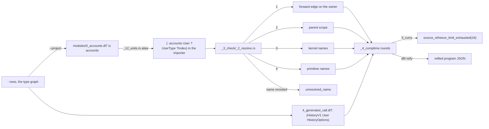

# Modules and application

## What



Modules: `dl8 compile a.dl7 b.dl7 --project <root>` loads one unit per file (`src/bin/dl8.rs:448-458`, `src/_8_driver/_4_project.rs:28-57`). A module's name is its directory parts plus its file stem, each losing a leading `<digits>_` prefix: `modules/0_accounts.dl7` is `accounts` (`src/_4_comptime/_0_load/_2_project.rs:162-190`).
Every top-level edge of an exporter is aliased into each importer that does not already bind the name (`src/_2_lower/_12_units.rs:310-342`); a unit reads another module's declaration as an edge, `(: accounts User ?UserType ?Index)`.
Name resolution walks a forward edge on the owner (which commits), then the parent scope, then kernel names, then primitive names; a name revisited on one walk resolves to nothing (`src/_3_check/_2_resolve.rs:44-89`). A cycle of names is `unresolved_name`.
Application: `(: UserHistory (HistoryV1 User HistoryOptions))` binds a name to a call; the name is then a relation, written positionally or by field name, `(UserHistory (name: "Ada") (id: 7))` (`oracle/compile/sources/test/fixtures/4_generated_call.dl7`).
A label is an atom, `(: field T)`, or a call, `(: (Key "name" Options) T)`; `(label : T)` and `(label: T)` are the infix spellings (`src/_0_read/_4_expand.rs:163-185`, `binding_symmetry/10_infix_colon_spelling.dl7`).

## Why

The module loader is the port of v7 `load_dl7_project/4` (`_4_project.rs:1`), the alias rule of v7 `:398` (`_12_units.rs:310`).
`resolve_name` keeps v7's four alternatives in order, forward edge committing (`_2_resolve.rs:44-46`).
The curry fixture's comments state the intent: a bind returns a callable relation with its first argument captured (`oracle/compile/sources/test/fixtures/5_curry.dl7:12-13`).

## When to use

Use it when:

- a declaration lives in another file: `--project`, `oracle/compile/sources/test/fixtures/modules/`
- a relation is a specialization of a generic one: a bind to a call, `4_generated_call.dl7:15`
- a field names a type from an enclosing product: nearest scope, `lexical_binding/7_nearest_shadow.dl7`

Do not use it when:

- the files are compiled one at a time: the module name does not resolve, `modules/1_consumer.dl7` alone gives `unresolved_name(accounts)`
- a curried bind needs a second compiler refreeze: `5_curry.dl7` stops at `source_refreeze_limit_exhausted(16)`, the same in v7 (`plans/v8/2026-09-13-v8-tour.md` section 9, V1)
- two names point at each other: `unresolved_name`, `lexical_binding/4_two_cycle.dl7`

## Example

Two files, one project:

```dl7
; fixture: oracle/compile/sources/test/fixtures/modules/0_accounts.dl7
(: User
   (* (: id int)
      (: name text)))
```

```dl7
; fixture: oracle/compile/sources/test/fixtures/modules/1_consumer.dl7
; compile: --project oracle/compile/sources/test/fixtures/modules oracle/compile/sources/test/fixtures/modules/0_accounts.dl7
(: found_user
   (* (: result type)))

(<- (found_user ?UserType)
    (: accounts User ?UserType ?Index))
```

```console
$ bash book/show.sh compile oracle/compile/sources/test/fixtures/modules/0_accounts.dl7 oracle/compile/sources/test/fixtures/modules/1_consumer.dl7 --project oracle/compile/sources/test/fixtures/modules
(found_user User)
exit 0
```

```console
$ bash book/show.sh compile oracle/compile/sources/test/fixtures/modules/1_consumer.dl7
diagnostic diagnostic(check, none, unresolved_name(accounts))
exit 1
```

A bind to a call, written by field name and positionally:

```dl7
; fixture: oracle/compile/sources/test/fixtures/4_generated_call.dl7
(: User
   (* (: id int)
      (: name text)))

(User 7 "Ada")

(: UserContract
   (* (: id int)
      (: name text)))

(: HistoryOptions
   (* (: mode "copy")
      (: contract UserContract)))

(: UserHistory (HistoryV1 User HistoryOptions))

(UserHistory (name: "Ada") (id: 7))

(: copied
   (* (: id int)
      (: name text)))

(<- (copied ?id ?name)
    (UserHistory ?id ?name))

(: SourceCopy
   (* (: id int)
      (: name text)))

(SourceCopy 8 "Grace")

(<- (UserHistory ?id ?name)
    (SourceCopy ?id ?name))

(: names
   (* (: name text)))

(<- (names ?name)
    (UserHistory ?name))
```

```console
$ bash book/show.sh eval oracle/compile/sources/test/fixtures/4_generated_call.dl7
(User 7 "Ada")
(copied 7 "Ada")
(copied 8 "Grace")
(SourceCopy 8 "Grace")
(names "Ada")
(names "Grace")
exit 0
```

A cycle of names:

```dl7
; fixture: oracle/compile/sources/test/fixtures/lexical_binding/4_two_cycle.dl7
; diagnostic: unresolved_name
(: Holder
   (* (: A B)
      (: B A)
      (: field A)))
```

```console
$ bash book/show.sh compile oracle/compile/sources/test/fixtures/lexical_binding/4_two_cycle.dl7
diagnostic diagnostic(check, reader_node(oracle/compile/sources/test/fixtures/lexical_binding/4_two_cycle.dl7, 5), unresolved_name(A))
diagnostic diagnostic(check, reader_node(oracle/compile/sources/test/fixtures/lexical_binding/4_two_cycle.dl7, 9), unresolved_name(B))
diagnostic diagnostic(check, reader_node(oracle/compile/sources/test/fixtures/lexical_binding/4_two_cycle.dl7, 13), unresolved_name(field))
exit 1
```

## Paths

A dotted atom is a path. `http.fetch.get` names the `get` declaration of the
module `http, fetch`, and stands for the walk probe 23 writes by hand:

```dl7
; fixture: book/src/probes/24_dot_path.dl7:3-8
; compile: --project book/src/probes book/src/probes/http/0_fetch.dl7
; The dotted atom http.fetch.get is the path form, and one : goal per segment
; replaces the hand-written walk of probe 23.
(: found
   (* (: result type)))

(<- (found http.fetch.get))
```

```console
$ bash book/show.sh compile book/src/probes/24_dot_path.dl7 --project book/src/probes book/src/probes/http/0_fetch.dl7
(found get)
exit 0
```

The reader gives a dotted token the form `(. seg seg ...)`, one atom per
segment, at the token's own position. Macros read it as an ordinary form whose
head is `.`.

In argument position the form lowers to one `:` goal per segment after the
first, and the value of the form is the target the last goal binds. In the head
of a call, and as a type, the segments travel whole to the checker, which
resolves each segment in the owner the segment before it named; that walk is
`resolve_name` itself, so a module contributes nothing of its own to it.

A segment that names nothing is `unresolved_name` carrying that segment, never
the whole path. A leading dot, a trailing dot, or two dots in a row leaves a
segment with no name, and the reader stops with `invalid_path`. A number keeps
its dot: the reader reads a float literal before it reads a path.

A wire relation's name carries its namespace, `openapi.route`. Source reaches
it as a path, so the loader gives each namespace an owner of one edge per
member.

| claim | path | command |
|---|---|---|
| a dotted token reads as `(. seg ...)` | `src/_0_read/_1_tokens.rs:43`, `src/_0_read/_2_reader.rs:415` | `cargo test --test _1_read_oracle` |
| a path in argument position is one `:` goal per segment | `src/_2_lower/_8_express.rs:139` | `bash book/show.sh compile book/src/probes/24_dot_path.dl7 --project book/src/probes book/src/probes/http/0_fetch.dl7` |
| a path in the head of a call is the callable `path(Owner, Segments)` | `src/_2_lower/_7_execute.rs:234` | `cargo test --test _8_compile_oracle` |
| a path as a type resolves with no rule goal | `src/_2_lower/_2_declare.rs:198`, `oracle/compile/sources/test/fixtures/modules/3_dotted_consumer.dl7:16` | `cargo test --test _8_compile_oracle` |
| the checker walk is `resolve_name` per segment | `src/_3_check/_2_resolve.rs:50` | `cargo test --test _8_compile_oracle` |
| an unresolved path names the segment that stopped the walk | `book/src/probes/19_dotted_name.dl7`, `src/_3_check/_2_resolve.rs:278` | `bash book/show.sh compile book/src/probes/19_dotted_name.dl7` |
| a dot with no segment beside it is `invalid_path` | `book/src/probes/25_invalid_path_double_dot.dl7`, `book/src/probes/26_invalid_path_leading_dot.dl7` | `cargo test --test _22_book` |
| a float keeps its dot | `fixtures/literals/0_float.dl7` | `cargo test --test _10_literals` |
| a wire namespace is an owner of its members | `src/_4_comptime/_0_load/_3_wire.rs:137`, `fixtures/openapi/todo.dl7:13` | `cargo test --test _21_openapi` |

## What proves it

| claim | path | command |
|---|---|---|
| project compile of both module consumers equals v7 | `oracle/compile/cases.txt:1-2` | `cargo test --test _8_compile_oracle` |
| module name segments drop the numeric prefix | `src/_4_comptime/_0_load/_2_project.rs:162-190` | `sed -n 162,190p src/_4_comptime/_0_load/_2_project.rs` |
| missing name and both cycles equal v7 | `oracle/compile/status.json` stems `lexical_binding-2`, `-3`, `-4` | `cargo test --test _8_compile_oracle` |
| a deferrable label error beside a real arity error keeps the real one | `binding_symmetry/11_mixed_deferrable_and_real_error.dl7:1-2` | `bash book/show.sh compile oracle/compile/sources/test/fixtures/binding_symmetry/11_mixed_deferrable_and_real_error.dl7` |
| `5_curry` stops at `source_refreeze_limit_exhausted(16)` in v7 and dl8 | `oracle/compile/status.json` stem `test-fixtures-5_curry` | `bash book/show.sh compile oracle/compile/sources/test/fixtures/5_curry.dl7` |
| every uncommitted compile case still runs through dl8 | `oracle/compile/verify.sh` | `bash oracle/compile/verify.sh` |
