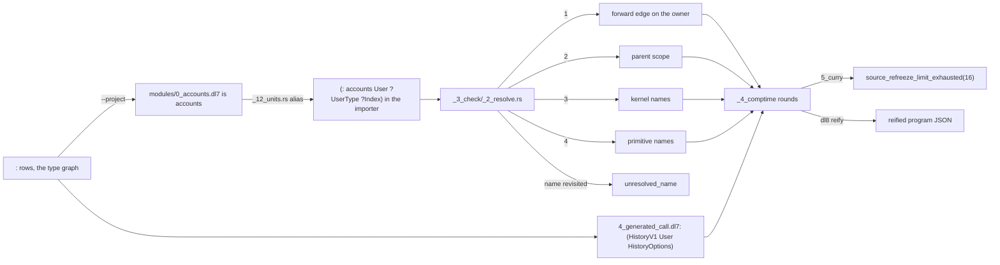

# Modules and application

## What



Modules: `dl8 compile a.dl7 b.dl7 --project <root>` loads one unit per file (`src/bin/dl8.rs:448-458`, `src/_8_driver/_4_project.rs:28-57`). A module's name is its directory parts plus its file stem, each losing a leading `<digits>_` prefix: `modules/0_accounts.dl7` is `accounts` (`src/_4_comptime/_0_load/_2_project.rs:162-190`).
Every top-level edge of an exporter is aliased into each importer that does not already bind the name (`src/_2_lower/_12_units.rs:310-342`); a unit reads another module's declaration as an edge, `(: accounts User ?UserType ?Index)`.
Name resolution walks a forward edge on the owner (which commits), then the parent scope, then kernel names, then primitive names; a name revisited on one walk resolves to nothing (`src/_3_check/_2_resolve.rs:44-89`). A cycle of names is `unresolved_name`.
Application: `(: UserHistory (HistoryV1 User HistoryOptions))` binds a name to a call; the name is then a relation, written positionally or by field name, `(UserHistory (name: "Ada") (id: 7))` (`oracle/compile/sources/test/fixtures/4_generated_call.dl7`).
A label is an atom, `(: field T)`, or a call, `(: (Key "name" Options) T)`; `(label : T)` and `(label: T)` are the infix spellings (`src/_0_read/_4_expand.rs:163-185`, `binding_symmetry/10_infix_colon_spelling.dl7`).

## Why

The module loader is the port of v7 `load_dl7_project/4` (`_4_project.rs:1`), the alias rule of v7 `:398` (`_12_units.rs:310`).
`resolve_name` keeps v7's four alternatives in order, forward edge committing (`_2_resolve.rs:44-46`).
The curry fixture's comments state the intent: a bind returns a callable relation with its first argument captured (`oracle/compile/sources/test/fixtures/5_curry.dl7:12-13`).

## When to use

Use it when:

- a declaration lives in another file: `--project`, `oracle/compile/sources/test/fixtures/modules/`
- a relation is a specialization of a generic one: a bind to a call, `4_generated_call.dl7:15`
- a field names a type from an enclosing product: nearest scope, `lexical_binding/7_nearest_shadow.dl7`

Do not use it when:

- the files are compiled one at a time: the module name does not resolve, `modules/1_consumer.dl7` alone gives `unresolved_name(accounts)`
- a curried bind needs a second compiler refreeze: `5_curry.dl7` stops at `source_refreeze_limit_exhausted(16)`, the same in v7 (`plans/v8/2026-09-13-v8-tour.md` section 9, V1)
- two names point at each other: `unresolved_name`, `lexical_binding/4_two_cycle.dl7`

## Example

Two files, one project:

```dl7
; fixture: oracle/compile/sources/test/fixtures/modules/0_accounts.dl7
(: User
   (* (: id int)
      (: name text)))
```

```dl7
; fixture: oracle/compile/sources/test/fixtures/modules/1_consumer.dl7
; compile: --project oracle/compile/sources/test/fixtures/modules oracle/compile/sources/test/fixtures/modules/0_accounts.dl7
(: found_user
   (* (: result type)))

(<- (found_user ?UserType)
    (: accounts User ?UserType ?Index))
```

```console
$ bash book/show.sh compile oracle/compile/sources/test/fixtures/modules/0_accounts.dl7 oracle/compile/sources/test/fixtures/modules/1_consumer.dl7 --project oracle/compile/sources/test/fixtures/modules
(found_user User)
exit 0
```

```console
$ bash book/show.sh compile oracle/compile/sources/test/fixtures/modules/1_consumer.dl7
diagnostic diagnostic(check, none, unresolved_name(accounts))
exit 1
```

A bind to a call, written by field name and positionally:

```dl7
; fixture: oracle/compile/sources/test/fixtures/4_generated_call.dl7
(: User
   (* (: id int)
      (: name text)))

(User 7 "Ada")

(: UserContract
   (* (: id int)
      (: name text)))

(: HistoryOptions
   (* (: mode "copy")
      (: contract UserContract)))

(: UserHistory (HistoryV1 User HistoryOptions))

(UserHistory (name: "Ada") (id: 7))

(: copied
   (* (: id int)
      (: name text)))

(<- (copied ?id ?name)
    (UserHistory ?id ?name))

(: SourceCopy
   (* (: id int)
      (: name text)))

(SourceCopy 8 "Grace")

(<- (UserHistory ?id ?name)
    (SourceCopy ?id ?name))

(: names
   (* (: name text)))

(<- (names ?name)
    (UserHistory ?name))
```

```console
$ bash book/show.sh eval oracle/compile/sources/test/fixtures/4_generated_call.dl7
(User 7 "Ada")
(copied 7 "Ada")
(copied 8 "Grace")
(SourceCopy 8 "Grace")
(names "Ada")
(names "Grace")
exit 0
```

A cycle of names:

```dl7
; fixture: oracle/compile/sources/test/fixtures/lexical_binding/4_two_cycle.dl7
; diagnostic: unresolved_name
(: Holder
   (* (: A B)
      (: B A)
      (: field A)))
```

```console
$ bash book/show.sh compile oracle/compile/sources/test/fixtures/lexical_binding/4_two_cycle.dl7
diagnostic diagnostic(check, reader_node(oracle/compile/sources/test/fixtures/lexical_binding/4_two_cycle.dl7, 5), unresolved_name(A))
diagnostic diagnostic(check, reader_node(oracle/compile/sources/test/fixtures/lexical_binding/4_two_cycle.dl7, 9), unresolved_name(B))
diagnostic diagnostic(check, reader_node(oracle/compile/sources/test/fixtures/lexical_binding/4_two_cycle.dl7, 13), unresolved_name(field))
exit 1
```

### Paths

A dotted atom is a path. The reader reads it as one form headed by `.`, one atom per segment:

{{#include ../probes/24_dot_path.dl7}}

```console
$ bash book/show.sh compile book/src/probes/24_dot_path.dl7 --project book/src/probes book/src/probes/api/0_todos.dl7
(found list)
(fetched "https://example.com/todos" "[]")
(list "https://example.com/todos" "[]")
exit 0
```

`api.todos.list` is the form `(. api todos list)`. The lowerer writes one `:` goal per segment after the first, with a fresh variable per segment, and the value of the last segment is the value of the form: `(: api todos ?Segment _)`, then `(: ?Segment list ?Value _)`. A module is a path segment like any other, because the walk reads `:` edges off whatever owner a segment binds. Probe 23 spells the same walk by hand.

In the head of a call the walk runs in the checker instead: `(api.todos.list ?Url ?Body)` is a call of `list`, resolved one segment per level, and the goal carries no `:` join. A declaration target reads the same way, `(: holder (* (: user api.todos.list)))`.

A dot at either end, and two dots in a row, name no segment: `book/src/probes/25_dot_path_malformed.dl7` stops at `invalid_path`.

A consumer of another module's name:

```dl7
; fixture: oracle/compile/sources/test/fixtures/modules/3_dotted_consumer.dl7
; compile: --project oracle/compile/sources/test/fixtures/modules oracle/compile/sources/test/fixtures/modules/0_accounts.dl7
(: found_user
   (* (: result type)))

(<- (found_user ?UserType)
    (accounts.User ?UserType ?Index))

(: holder
   (* (: user accounts.User)))
```

```console
$ bash book/show.sh compile oracle/compile/sources/test/fixtures/modules/0_accounts.dl7 oracle/compile/sources/test/fixtures/modules/3_dotted_consumer.dl7 --project oracle/compile/sources/test/fixtures/modules
exit 0
```

| claim | path | command |
|---|---|---|
| a dotted token reads as one form, one atom per segment | `src/_0_read/_1_tokens.rs:43-55`, `src/_0_read/_2_reader.rs:372-394` | `cargo test --test _1_read_oracle` |
| a leading, trailing or doubled dot is `invalid_path` | `src/_0_read/_2_reader.rs:401-406` | `bash book/show.sh compile book/src/probes/25_dot_path_malformed.dl7` |
| the walk is one `:` goal per segment, a fresh variable each | `src/_2_lower/_8_express.rs:79-105` | `cargo test --test _22_book probes_compile_as_their_page_says` |
| a path head resolves the callable in the checker | `src/_2_lower/_7_execute.rs:233-275`, `src/_3_check/_2_resolve.rs:48-73` | `cargo test --test _22_book probes_compile_as_their_page_says` |
| the module consumer and the type-position path compile | `oracle/compile/sources/test/fixtures/modules/3_dotted_consumer.dl7` | `bash book/show.sh compile oracle/compile/sources/test/fixtures/modules/0_accounts.dl7 oracle/compile/sources/test/fixtures/modules/3_dotted_consumer.dl7 --project oracle/compile/sources/test/fixtures/modules` |
| a float literal stays a literal beside the dotted tokens | `fixtures/literals/0_float.dl7` | `cargo test --test _10_literals` |

## What proves it

| claim | path | command |
|---|---|---|
| project compile of both module consumers equals v7 | `oracle/compile/cases.txt:1-2` | `cargo test --test _8_compile_oracle` |
| module name segments drop the numeric prefix | `src/_4_comptime/_0_load/_2_project.rs:162-190` | `sed -n 162,190p src/_4_comptime/_0_load/_2_project.rs` |
| missing name and both cycles equal v7 | `oracle/compile/status.json` stems `lexical_binding-2`, `-3`, `-4` | `cargo test --test _8_compile_oracle` |
| a deferrable label error beside a real arity error keeps the real one | `binding_symmetry/11_mixed_deferrable_and_real_error.dl7:1-2` | `bash book/show.sh compile oracle/compile/sources/test/fixtures/binding_symmetry/11_mixed_deferrable_and_real_error.dl7` |
| `5_curry` stops at `source_refreeze_limit_exhausted(16)` in v7 and dl8 | `oracle/compile/status.json` stem `test-fixtures-5_curry` | `bash book/show.sh compile oracle/compile/sources/test/fixtures/5_curry.dl7` |
| every uncommitted compile case still runs through dl8 | `oracle/compile/verify.sh` | `bash oracle/compile/verify.sh` |
