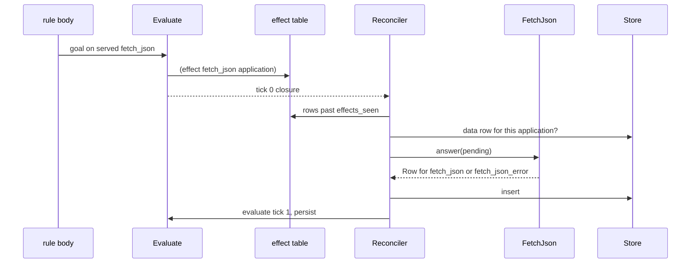

# The seam

[Example](#example) · [One Once request](#one-once-request) · [The trait](#the-trait) · [Rule](#rule) · [Receipts](#receipts)

## Example

`fixtures/reconcile/1_fetch.dl7` reads `fetch_json` for one url (the program is shown in [Executors](../11_executors.md)). Tick 0 evaluates the program and stops before any executor runs:

```console
$ bash book/show.sh run fixtures/reconcile/1_fetch.dl7 --serve fetch_json --max-ticks 0
(effect fetch_json ref(application(fetch_json, ["__URL__" none])))
(Watch "__URL__")
ticks 0
exit 0
```

One more tick hands the `effect` row to the executor, inserts its answer, and evaluates again:

```console
$ bash book/show.sh run fixtures/reconcile/1_fetch.dl7 --serve fetch_json --max-ticks 1
(effect fetch_json ref(application(fetch_json, ["__URL__" none])))
(fetch_json_error "__URL__" 0 "bad uri: __URL__ is missing scheme")
(Watch "__URL__")
(Failed "__URL__" 0)
ticks 1
exit 0
```

```
step 0  tick 0  goal (fetch_json "__URL__" ?Body) on a served relation  -> effect row, application ["__URL__" none]
step 1  tick 0  no fetch_json row matches                                -> Body empty, Failed empty
step 2  tick 1  Reconciler::answer: one pending application              -> FetchJson::answer
step 3  tick 1  ureq GET fails before a response                         -> (fetch_json_error "__URL__" 0 "bad uri: ...")
step 4  tick 1  evaluate                                                 -> (Failed "__URL__" 0)
step 5  after 1  no new effect rows, no executor armed                    -> stop
```

Steady state: the run ends at step 5.

## One Once request



| message | line |
|---|---|
| a served goal that heads no rule writes `effect` on every evaluation | `src/_6_eval/_5_evaluate.rs:244-249`, `:261-276` |
| `--serve` names fill `Program.served` from the flat name table | `src/_6_eval/_6_json.rs:346-369` |
| the reconciler reads effect rows past `effects_seen` | `src/_9_runtime/_2_reconcile.rs:131-147` |
| a Once application whose data row exists is skipped | `_2_reconcile.rs:140-143`, `:232-255` |
| answers insert, then one evaluation and one persist per tick | `_2_reconcile.rs:98-121`, `:179-193` |

## The trait

```console
$ sed -n 12,32p src/_9_runtime/_2_reconcile.rs
#[derive(Copy, Clone, PartialEq, Eq, Debug)]
pub enum Cadence {
    /// One answer per application, never asked again.
    Once,
    /// Armed by an application, then rows arrive on the executor's own clock.
    Continuing,
}

/// One executor answers the `effect` rows of one served relation.
pub trait IExecutor {
    fn relation(&self) -> &str;
    fn cadence(&self) -> Cadence;
    /// Applications this executor has not seen; returns rows to insert, possibly
    /// for another relation (`fetch_json_error`). `rows` is the closure so far.
    fn answer(&mut self, u: &mut Universe, rows: &Store, pending: &[TermId]) -> Vec<Row>;
    /// Rows that arrived on the executor's own clock. Blocks up to `timeout`
    /// when nothing has arrived; `Duration::ZERO` never blocks.
    fn poll(&mut self, u: &mut Universe, timeout: Duration) -> Vec<Row>;
    /// A Continuing executor with at least one live clock.
    fn armed(&self) -> bool;
}
```

## Rule

- An executor is one Rust value implementing `IExecutor`; `relation()` names the served relation it answers.
- `Cadence::Once` answers each application once per process; `Cadence::Continuing` arms on an application and later rows come from `poll` (`_2_reconcile.rs:12-18`, `:157-167`).
- `answer` may return rows for a second relation; every error relation is declared by the program and looked up by name (`src/_9_runtime/_3_executors/mod.rs:44-45`).
- The binding from served name to executor is one `match` on the name string in `executors_for` (`mod.rs:61-100`). An unknown name is `served_relation_no_executor` (`mod.rs:100`); a missing declaration is `served_relation_unknown`; a missing error relation is `executor_relation_unknown` (`mod.rs:75-76`).
- Nothing compares the declared columns with the executor's columns: a user `timer` with one text column is served and never answered ([Namespacing](../modules/4_namespacing.md), `probes/9_user_timer_rule.dl7`).
- The run ends when a tick inserts nothing and no executor is armed, or at `--max-ticks` (`_2_reconcile.rs:87-123`).

## Receipts

| claim | path | command |
|---|---|---|
| tick 0 then one answer tick | `fixtures/reconcile/1_fetch.dl7` | this page's console blocks |
| fetch body, non-2xx, non-JSON, closed port | `tests/_17_reconcile.rs:203-267` | `cargo test --test _17_reconcile` |
| no executor, no error relation | `tests/_17_reconcile.rs:291-326` | `cargo test --test _17_reconcile` |
| the effect row and its application | [Effects](../10_effects.md) | `bash book/show.sh eval fixtures/host_effect/1_settled.dl7 --serve fetch_json` |
