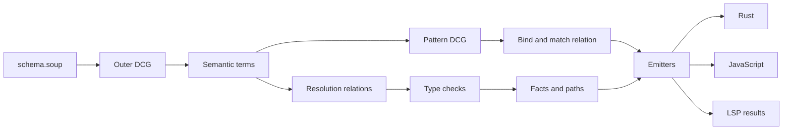
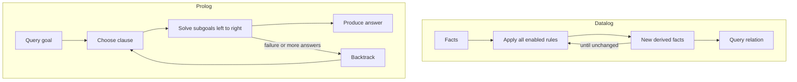
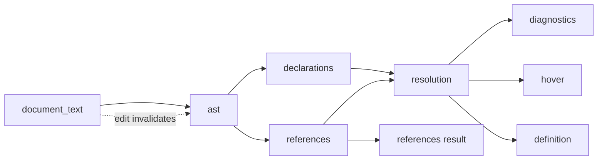
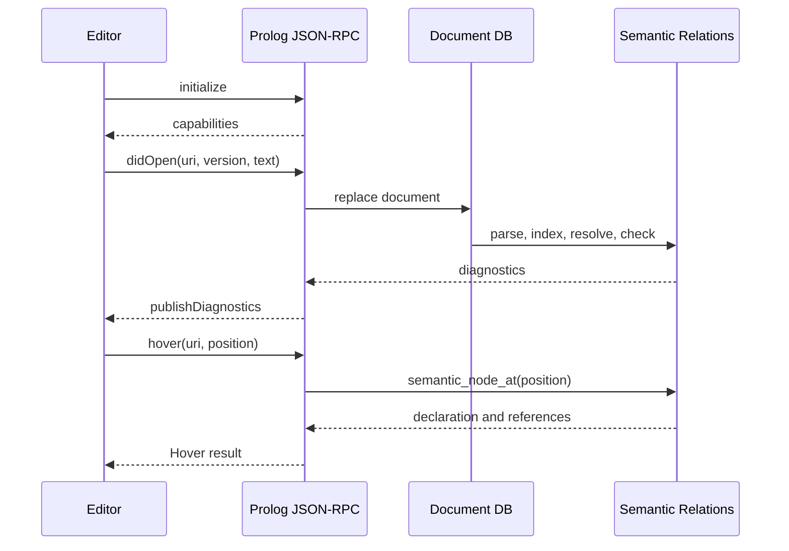
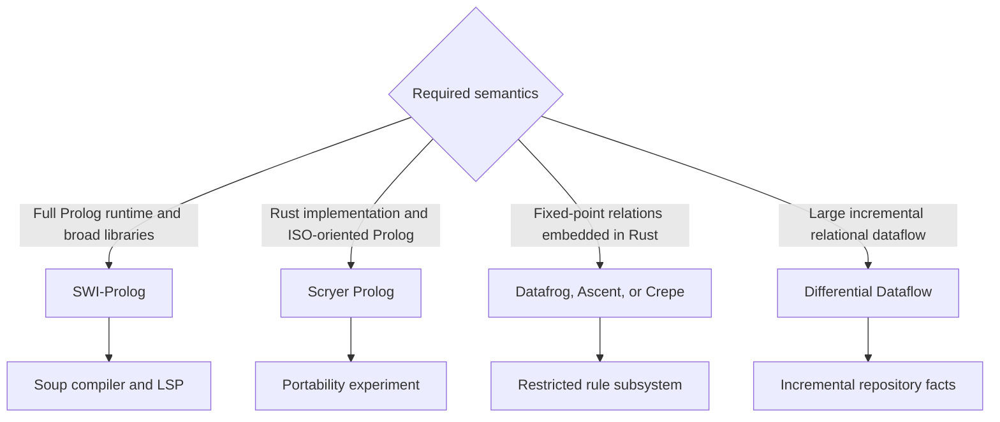
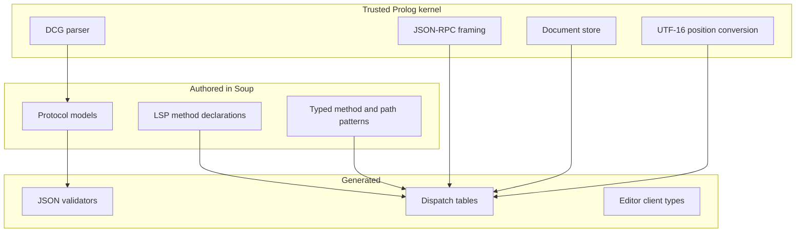

# 7. Diagram Appendix

## Compiler pipeline

```mermaid
flowchart LR
    S[schema.soup] --> P[Outer DCG]
    P --> A[Semantic terms]
    A --> R[Resolution relations]
    R --> C[Type checks]
    A --> T[Pattern DCG]
    T --> V[Bind and match relation]
    C --> F[Facts and paths]
    V --> E[Emitters]
    F --> E
    E --> RS[Rust]
    E --> JS[JavaScript]
    E --> LS[LSP results]
```

## Datalog and Prolog evaluation

```mermaid
flowchart TB
    subgraph Datalog
        DF[Facts] --> DR[Apply all enabled rules]
        DR --> DD[New derived facts]
        DD -->|until unchanged| DR
        DD --> DQ[Query relation]
    end

    subgraph Prolog
        Q[Query goal] --> CL[Choose clause]
        CL --> SG[Solve subgoals left to right]
        SG --> AN[Produce answer]
        SG -->|failure or more answers| BT[Backtrack]
        BT --> CL
    end
```

## Tabled semantic dependency graph

```mermaid
flowchart LR
    D[document_text] --> A[ast]
    A --> DECL[declarations]
    A --> REF[references]
    DECL --> RES[resolution]
    REF --> RES
    RES --> DIAG[diagnostics]
    RES --> HOVER[hover]
    RES --> DEF[definition]
    REF --> REFS[references result]

    D -. edit invalidates .-> A
```

## LSP request sequence

```mermaid
sequenceDiagram
    participant Editor
    participant Transport as Prolog JSON-RPC
    participant Docs as Document DB
    participant Sem as Semantic Relations

    Editor->>Transport: initialize
    Transport-->>Editor: capabilities
    Editor->>Transport: didOpen(uri, version, text)
    Transport->>Docs: replace document
    Docs->>Sem: parse, index, resolve, check
    Sem-->>Transport: diagnostics
    Transport-->>Editor: publishDiagnostics
    Editor->>Transport: hover(uri, position)
    Transport->>Sem: semantic_node_at(position)
    Sem-->>Transport: declaration and references
    Transport-->>Editor: Hover result
```

## SWI and Rust choices

```mermaid
flowchart TD
    Need{Required semantics}
    Need -->|Full Prolog runtime and broad libraries| SWI[SWI-Prolog]
    Need -->|Rust implementation and ISO-oriented Prolog| Scryer[Scryer Prolog]
    Need -->|Fixed-point relations embedded in Rust| DL[Datafrog, Ascent, or Crepe]
    Need -->|Large incremental relational dataflow| DD[Differential Dataflow]

    SWI --> Soup[Soup compiler and LSP]
    Scryer --> Port[Portability experiment]
    DL --> Rules[Restricted rule subsystem]
    DD --> Scale[Incremental repository facts]
```

## Bootstrap boundary

```mermaid
flowchart TB
    subgraph Authored in Soup
        Models[Protocol models]
        Methods[LSP method declarations]
        Patterns[Typed method and path patterns]
    end

    subgraph Generated
        JSON[JSON validators]
        Dispatch[Dispatch tables]
        Client[Editor client types]
    end

    subgraph Trusted Prolog kernel
        Framing[JSON-RPC framing]
        Parser[DCG parser]
        Store[Document store]
        Pos[UTF-16 position conversion]
    end

    Models --> JSON
    Methods --> Dispatch
    Patterns --> Dispatch
    Parser --> Models
    Framing --> Dispatch
    Store --> Dispatch
    Pos --> Dispatch
```
