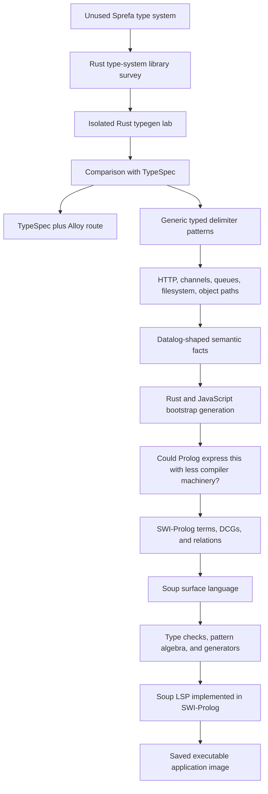
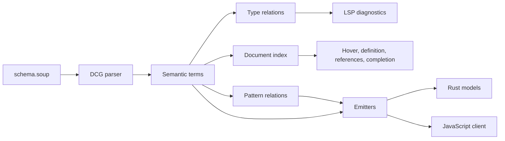

# 9. How This Started and Where It Landed

## Original question

The starting problem was whether Sprefa's unused type system could support a small TypeSpec-shaped language for mutually generated contracts.

Target outputs included:

- Rust and TypeScript types
- OpenAPI contracts
- HTTP clients and servers
- WebSocket messages
- Browser extension tab and service-worker message pairs
- Electron bridges
- Channels, queues, filesystem paths, and object paths
- Higher-order type generation
- Datalog-shaped semantic queries
- A single native executable

## Session path



## Rust prototype

[`labs/bootstrap-typegen-lab`](../../labs/bootstrap-typegen-lab/README.md) demonstrates:

- Records, aliases, optionals, arrays, and maps
- String-literal unions
- Typed delimiter patterns
- Bind, match, destructure, and compose
- Slot and structural-path enumeration
- Relational semantic facts
- Rust model and server generation
- JavaScript fetch-client generation
- An explicit bootstrap boundary

The Rust prototype established that the type and template semantics could live in a small native compiler without carrying the rest of Sprefa.

## TypeSpec and Alloy branch

[`docs/bootstrap-typegen-lab-vs-typespec.md`](../../docs/bootstrap-typegen-lab-vs-typespec.md) compares the Rust prototype with TypeSpec.

TypeSpec already supplies semantic models, templates, constraints, decorators, protocol libraries, diagnostics, editor tooling, OpenAPI, JSON Schema, Protobuf, and emitter APIs. Alloy supplies structured target-language declarations, references, imports, and components.

The prototype-specific experiment is the generic typed-pattern algebra:

```text
{id: UserId}
:id
```

Those slots participate in binding, matching, destructuring, composition, and enumeration without assigning HTTP-specific meaning to delimiters.

## Prolog branch

The next question was whether a full Prolog runtime would reduce the machinery needed for parsing, recursive semantic terms, name and type relations, bidirectional patterns, path enumeration, diagnostics, and editor queries.

SWI-Prolog supplied DCGs, unification, backtracking, tabling, dynamic relations, JSON, stdio, source tooling, testing, profiling, and saved applications.

## Soup prototype

[`labs/swi-typespec-lab`](../../labs/swi-typespec-lab/README.md) now authors this source:

```typespec
type UserId = String;
type EventKind = "created" | "deleted";

type User {
  id: UserId;
  profile: Profile?;
  tags: String[];
  metadata: Map<String, String>;
}

pattern UserPath = `/users/{id: UserId}`;

consumer http {
  get UserPath -> User;
}
```

The outer DCG lowers it into semantic Prolog terms:

```prolog
type_decl(user, model([
    field(id, user_id),
    field(profile, optional(profile)),
    field(tags, array(string)),
    field(metadata, map(string, string))
])).
```

The semantic database drives type checks, path queries, pattern operations, Rust generation, JavaScript generation, and LSP methods.

## Implemented language loop



The LSP supports:

```text
initialize
didOpen, didChange, didClose
hover, definition, references
completion, documentSymbol
publishDiagnostics
shutdown, exit
```

## Verification snapshot

- 11 Prolog tests pass.
- Generated Rust compiles independently.
- Generated JavaScript passes syntax checking.
- The stdio transcript passes against interpreted SWI-Prolog.
- The same transcript passes against the saved application image.
- Undefined-type diagnostics are published after `didChange`.
- UTF-16 conversion is tested with an emoji-prefixed document.

## Packaging boundary

The saved application is a 290 KiB arm64 Mach-O executable on the tested macOS system. It dynamically loads:

```text
@rpath/libswipl.10.dylib
```

A static SWI runtime build is required for distribution without that shared-library dependency.

## Two resulting routes

### TypeSpec and Alloy

```text
TypeSpec
  semantic models
  templates and decorators
  protocol libraries
  diagnostics and packages

Alloy
  structured Rust and TypeScript generation
  declarations, references, and imports

Custom library
  typed delimiter-pattern semantics
  channels and message metadata
  application-specific emitters
```

### Soup and SWI-Prolog

```text
schema.soup
  -> DCG parser
  -> semantic Prolog terms
  -> type and path relations
  -> typed pattern relations
  -> Rust and JavaScript generation
  -> Prolog-hosted LSP
```

## Repository boundary

Both implementations remain isolated:

```text
labs/bootstrap-typegen-lab
labs/swi-typespec-lab
```

Sprefa's shipping type system and engine have not been migrated to either experiment.

## Current position

1. A small native Rust compiler can implement the intended JSON-shaped types and typed patterns.
2. TypeSpec plus Alloy supplies a large modeling and generation ecosystem.
3. SWI-Prolog can implement the complete small-language loop from surface grammar through editor service.
4. Generic typed delimiter patterns remain the shared experiment across both prototypes.
5. Datalog knowledge provides the bridge into Prolog relations; recursive terms, goal-directed search, and DCGs extend that model.
